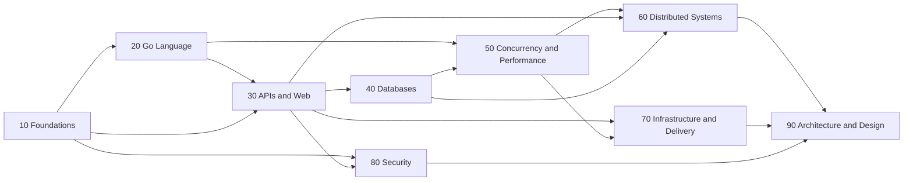
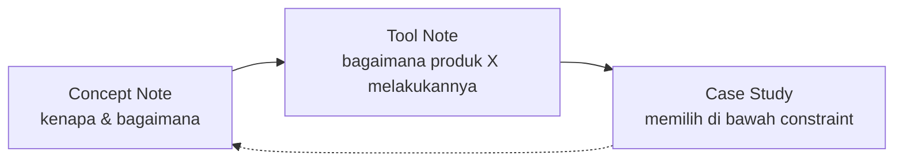

Ini adalah peta induk vault ini — satu halaman yang menunjukkan bagaimana sembilan domain (`10` sampai `90`), tools, case studies, dan projects saling terhubung. Untuk daftar path lengkap setiap note, lihat [[Vault Manifest]]. Untuk urutan baca konkret hari demi hari, buka `Level 1 - Junior Path.md` dan seterusnya.

## Bagaimana Membaca Peta Ini

Sembilan domain berjalan dari dekat mesin ke dekat organisasi. Ini bukan urutan wajib untuk dibaca satu-satu dari atas ke bawah — level (junior/intermediate/senior) yang menentukan urutan baca sebenarnya, lintas domain. Peta ini menunjukkan *bentuk* vault, sementara `01 Maps/Level N - ...md` menunjukkan *urutan* baca.

Panah di atas berarti "biasanya butuh pemahaman dari" — misalnya `60 Distributed Systems` mengasumsikan kamu sudah nyaman dengan concurrency (`50`) dan pola integrasi (`30`), bukan berarti kamu harus menghabiskan seluruh folder `50` sebelum membuka satu note pun di `60`.

## Domain, Satu Baris Tiap Folder

| Folder | Fokus | Overview |
|---|---|---|
| `10 Foundations` | Bagaimana mesin dan jaringan sebenarnya berperilaku, di bawah HTTP. | [[10 Foundations/_Overview\|Foundations Overview]] |
| `20 Go Language` | Bahasa itu sendiri: tipe, struct, interface, error, testing, dan idiom lanjutan. | [[20 Go Language/_Overview\|Go Language Overview]] |
| `30 APIs and Web` | HTTP, REST, gRPC, GraphQL, realtime, dan — bobot terberat vault ini — integrasi dengan sistem pihak lain. | [[30 APIs and Web/_Overview\|APIs and Web Overview]] |
| `40 Databases` | Modelling, SQL sebagai craft, indexing, transaction, storage engine, sampai search. | [[40 Databases/_Overview\|Databases Overview]] |
| `50 Concurrency and Performance` | Goroutine, runtime Go, profiling, latency, dan caching. | [[50 Concurrency and Performance/_Overview\|Concurrency and Performance Overview]] |
| `60 Distributed Systems` | Banyak mesin, partial failure, consensus, dan metodologi system design. | [[60 Distributed Systems/_Overview\|Distributed Systems Overview]] |
| `70 Infrastructure and Delivery` | Container, orchestration, CI/CD, IaC, dan observability. | [[70 Infrastructure and Delivery/_Overview\|Infrastructure and Delivery Overview]] |
| `80 Security` | Auth, crypto dalam praktik, sampai threat modelling tingkat senior. | [[80 Security/_Overview\|Security Overview]] |
| `90 Architecture and Design` | Layering, boundary, pengambilan keputusan, dan kepemimpinan teknis. | [[90 Architecture and Design/_Overview\|Architecture and Design Overview]] |
| `92 Tools` | Produk konkret yang mengimplementasikan konsep di atas — perishable, dipisah sengaja. | [[92 Tools/_Overview\|Tools Overview]] |
| `94 Case Studies` | Keputusan nyata di bawah constraint nyata, dari 25+ skenario. | [[94 Case Studies/_Overview\|Case Studies Overview]] |
| `95 Projects` | Satu proyek capstone per level, semua dalam Go. | — |
| `99 Glossary` | Satu istilah per note, untuk lookup cepat dan backlink. | — |

## Tiga Level, Sekilas

- **Junior** — fondasi yang harus jadi otomatis: OS/networking dasar, Go core, API design, SQL sebagai craft, database dasar, security dasar, hygiene, ops dasar. Lihat [[Level 1 - Junior Path]].
- **Intermediate** — skala dan kegagalan: Go concurrency & runtime, database mendalam, caching, messaging, observability, resilience, arsitektur, delivery. Lihat [[Level 2 - Intermediate Path]].
- **Senior** — distributed systems, trade-off, kepemimpinan teknis: consensus, saga, event-driven architecture, scalability, reliability engineering, migrasi skala besar, kepemimpinan teknis. Lihat [[Level 3 - Senior Path]].

## Siklus Concept → Tool → Case Study

Ini bukan tiga folder yang berdiri sendiri — ini satu siklus belajar (lihat [[How To Read This Vault]] untuk penjelasan penuh):

Setiap tool note menautkan concept yang diimplementasikannya (`implements:` di frontmatter), dan setiap case study menautkan minimal tiga concept note yang dipakai untuk menganalisis situasinya.

## Connected Notes

- [[Vault Manifest]] — daftar path lengkap setiap note yang direncanakan di balik peta ringkas ini.
- [[Read Me First]] — konteks tujuan vault yang membuat pemetaan domain ini masuk akal.
- [[How To Read This Vault]] — cara memakai peta ini bersama tiga cara membaca (linear, graph-driven, problem-driven).
- [[Level 1 - Junior Path]] — titik masuk baca yang sebenarnya, bukan peta ini.

## Catatan Saya

*Tulis di sini kalau ada domain yang menurutmu perlu dipecah lagi setelah kamu benar-benar menjalani isinya.*
