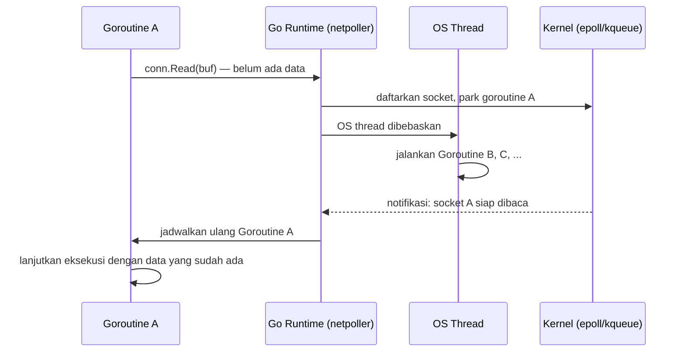

## TL;DR

**Blocking I/O** berarti thread yang memanggil operasi baca/tulis berhenti total sampai operasi itu selesai — ia tidak bisa mengerjakan apa pun yang lain di antaranya. **Non-blocking I/O** berarti pemanggilan langsung kembali (dengan status "belum siap" kalau memang belum siap), dan pemanggil butuh cara lain untuk tahu kapan operasi itu benar-benar selesai — biasanya lewat mekanisme notifikasi seperti `epoll` (Linux) atau `kqueue` (BSD/macOS). Goroutine di Go terlihat seperti kode blocking yang sederhana untuk ditulis, tapi di baliknya, runtime Go memakai socket non-blocking dan netpoller sehingga satu goroutine yang "menunggu" I/O tidak menyandera satu OS thread — inilah salah satu alasan kenapa satu binary Go bisa melayani puluhan ribu koneksi bersamaan dengan resource yang jauh lebih sedikit dari model satu-thread-per-koneksi.

## The Problem

Bayangkan salah satu aplikasi legal-services perlu memanggil endpoint milik instansi partner yang terkenal lambat — kadang butuh 8 sampai 10 detik untuk merespons di jam sibuk mereka. Kalau aplikasi ini dibangun dengan model klasik satu-thread (atau satu-process, seperti PHP-FPM) per request, setiap request yang menunggu partner itu akan menyandera satu worker penuh selama partner belum merespons. Kalau jumlah worker yang dikonfigurasi terbatas — katakanlah 50 worker — maka 50 request yang kebetulan memanggil partner lambat itu bersamaan sudah cukup untuk **menghabiskan seluruh worker pool**, membuat seluruh aplikasi berhenti melayani request lain yang bahkan tidak menyentuh partner itu sama sekali.

Ini bukan soal CPU yang penuh — CPU-nya nyaris menganggur, karena semua worker itu hanya "menunggu" jaringan. Masalahnya murni soal model blocking: setiap worker yang menunggu I/O tidak bisa dipakai untuk mengerjakan apa pun yang lain sampai penantiannya selesai. Memahami distingsi blocking vs non-blocking I/O adalah kunci untuk mengerti kenapa Go — dengan model goroutine dan netpoller-nya — bisa menghadapi situasi yang sama tanpa kehabisan kapasitas, dan kenapa model itu bukan sihir, hanya trade-off arsitektur yang berbeda.

## Intuition

Bayangkan blocking I/O seperti **menelepon dan menunggu di telepon** sampai orang di seberang selesai bicara — kamu tidak bisa mengerjakan apa pun yang lain selama itu, telingamu (thread-mu) tersandera penuh. Non-blocking I/O lebih seperti **mengirim pesan lalu lanjut mengerjakan hal lain**, dan baru diberi tahu ketika ada balasan.

Analogi ini bocor di satu titik penting: "mengirim pesan lalu lanjut mengerjakan hal lain" secara implisit mengasumsikan ada seseorang yang memberi tahumu ketika balasan datang. Non-blocking I/O murni di level syscall sebenarnya tidak seperti itu — kalau kamu memanggil `read()` pada socket non-blocking dan datanya belum ada, syscall itu langsung kembali dengan kode error (`EAGAIN`/`EWOULDBLOCK`), bukan menunggu, bukan juga memberitahumu nanti. Supaya benar-benar berguna, non-blocking I/O harus dipasangkan dengan mekanisme notifikasi seperti `epoll`/`kqueue` yang secara aktif memberi tahu "socket ini sudah siap dibaca sekarang" — barulah analogi "diberi tahu saat ada balasan" itu jadi akurat.

## How It Works

Di level syscall, membaca dari socket punya dua mode:

- **Blocking**: memanggil `read()` pada socket yang belum ada datanya membuat thread pemanggil berhenti (di-park oleh kernel) sampai data tersedia atau terjadi error/timeout.
- **Non-blocking**: socket diatur dengan flag `O_NONBLOCK`; memanggil `read()` pada socket ini langsung kembali seketika — kalau data ada, dikembalikan; kalau belum, dikembalikan error `EAGAIN` dan pemanggil harus mencoba lagi nanti (atau menunggu notifikasi dari `epoll`/`kqueue` bahwa socket ini sudah siap).

Aplikasi bergaya lama (termasuk PHP-FPM secara default) memakai model blocking: satu thread/process menangani satu koneksi, dan thread itu benar-benar berhenti total selama menunggu I/O. Ini sederhana untuk dinalar (kode berjalan berurutan, langkah demi langkah) tapi mahal untuk diskalakan — jumlah koneksi konkuren dibatasi oleh jumlah thread/process yang sanggup dijalankan OS sekaligus.

Go memilih pendekatan berbeda: kode yang kamu tulis **terlihat** sepenuhnya blocking dan sinkron (`conn.Read(buf)` seperti memanggil function biasa yang menunggu sampai selesai), tapi di balik layar, runtime Go memakai socket non-blocking dan komponen bernama **netpoller** yang mengintegrasikan `epoll`/`kqueue`. Ketika sebuah goroutine memanggil operasi jaringan yang belum siap, goroutine itu di-park oleh runtime (bukan oleh OS) dan OS thread di baliknya dibebaskan untuk menjalankan goroutine lain. Begitu netpoller memberi tahu data sudah siap, goroutine yang tadi di-park dijadwalkan ulang untuk melanjutkan.



Diagram ini menunjukkan bahwa satu OS thread tidak pernah benar-benar "menunggu" I/O jaringan dalam model Go — yang menunggu hanyalah goroutine, dan runtime membebaskan OS thread untuk kerja lain selama penantian itu.

## In Go

Kode Go yang menunggu response HTTP dari partner lambat terlihat sepenuhnya sinkron, tapi tidak menyandera OS thread selama menunggu:

```go
func fetchFromSlowPartner(ctx context.Context, url string) ([]byte, error) {
    // context dengan deadline mencegah goroutine menunggu tanpa batas
    // waktu — lihat Context for Cancellation and Deadlines.
    req, err := http.NewRequestWithContext(ctx, http.MethodGet, url, nil)
    if err != nil {
        return nil, fmt.Errorf("build request: %w", err)
    }

    // Baris ini TERLIHAT blocking, tapi goroutine yang menunggu di sini
    // tidak menyandera OS thread — netpoller yang menanganinya.
    resp, err := http.DefaultClient.Do(req)
    if err != nil {
        return nil, fmt.Errorf("call slow partner: %w", err)
    }
    defer resp.Body.Close()

    body, err := io.ReadAll(resp.Body)
    if err != nil {
        return nil, fmt.Errorf("read response body: %w", err)
    }
    return body, nil
}
```

Kalau function ini dipanggil dari ribuan goroutine bersamaan (misalnya satu goroutine per request masuk), server Go tidak butuh ribuan OS thread untuk menampungnya — netpoller memastikan OS thread yang tersedia dipakai bergantian oleh goroutine mana pun yang sedang tidak menunggu I/O. Yang tetap wajib ada adalah `context` dengan deadline: tanpa itu, goroutine yang menunggu partner yang tidak pernah merespons akan menumpuk selamanya — model non-blocking mengatasi masalah "thread tersandera", bukan masalah "menunggu tanpa batas waktu" (dibahas di [[../30 APIs and Web/Timeout Budgets|Timeout Budgets]]).

## In His Stack

**PHP-FPM (Yii1/Yii2)** secara default memakai model blocking klasik: satu worker process menangani satu request dari awal sampai akhir, termasuk saat menunggu query database lambat atau partner API yang lambat. Ini kenapa `pm.max_children` di konfigurasi FPM adalah angka yang sangat penting — ia secara langsung membatasi berapa banyak request yang bisa "menunggu" bersamaan sebelum request baru harus antre.

**Nginx** di depan PHP-FPM (atau di depan service Go) memakai model event-driven non-blocking di level dirinya sendiri untuk menangani koneksi masuk dari client — ini kenapa Nginx bisa menahan puluhan ribu koneksi idle dengan resource yang kecil, meski di belakangnya PHP-FPM tetap blocking per-worker.

**Kafka consumer** memakai pola *polling* (`consumer.poll(timeout)`) yang secara teknis blocking dengan batas waktu — goroutine/thread yang memanggilnya menunggu sampai ada pesan baru atau timeout tercapai, pola yang mirip dengan `read()` blocking tapi dengan batas waktu eksplisit.

## Trade-offs and When Not To Use It

Model **blocking per-thread/per-process** (seperti PHP-FPM klasik) jauh lebih sederhana untuk dinalar — kode berjalan berurutan, tidak butuh mekanisme netpoller atau event loop apa pun. Trade-off-nya: kapasitas konkurensi dibatasi ketat oleh jumlah worker yang sanggup dijalankan, dan worker yang sedang menunggu I/O adalah kapasitas yang terbuang percuma.

Model **non-blocking berbasis event** (yang mendasari netpoller Go, juga Node.js dan Nginx) memberi konkurensi I/O yang jauh lebih tinggi dengan resource yang sama, tapi historisnya butuh kode bergaya callback yang lebih sulit dibaca (di Node.js) — Go mengambil jalan tengah: konkurensi non-blocking di level runtime, tapi kode yang ditulis programmer tetap terlihat sinkron dan sekuensial.

Non-blocking I/O **tidak membantu** untuk beban kerja yang benar-benar CPU-bound (bukan menunggu I/O, tapi benar-benar menghitung) — di kasus itu, jumlah goroutine yang bisa berjalan paralel tetap dibatasi jumlah core CPU (`GOMAXPROCS`), dan ini masalah penjadwalan yang berbeda, dibahas di [[../50 Concurrency and Performance/Goroutine Scheduler (GMP)|Goroutine Scheduler (GMP)]].

## Common Mistakes

> [!warning] Jebakan
> Mengira semua panggilan di Go otomatis "gratis" dari model blocking berkat goroutine. Panggilan syscall tertentu (misalnya operasi file tanpa dukungan non-blocking penuh di beberapa OS, atau pemanggilan lewat cgo ke library C) tetap bisa menyandera satu OS thread sungguhan — runtime Go akan membuat OS thread tambahan untuk mengkompensasi, tapi ini tetap punya biaya, bukan tanpa batas.

> [!warning] Jebakan
> Memanggil endpoint eksternal tanpa `context` yang punya deadline, dengan asumsi "goroutine kan murah, biar saja menunggu". Goroutine yang menunggu partner yang tidak pernah merespons akan menumpuk terus — non-blocking I/O mengatasi masalah "thread tersandera", bukan masalah "menunggu tanpa batas waktu".

> [!warning] Jebakan
> Menyamakan "non-blocking" dengan "otomatis konkuren". Sebuah socket non-blocking tanpa mekanisme notifikasi (`epoll`/`kqueue`) yang menggerakkannya hanya berarti kamu harus polling sendiri berulang-ulang — itu justru bisa lebih boros CPU daripada blocking sederhana kalau dilakukan naif.

## Exercises

1. Jelaskan apa yang terjadi ketika sebuah thread memanggil `read()` blocking pada socket yang belum ada datanya, dibanding memanggil `read()` non-blocking pada socket yang sama.
2. Kenapa kode Go yang terlihat sinkron (`conn.Read(buf)`) tidak menyandera satu OS thread penuh saat menunggu data jaringan?
3. Sebutkan satu contoh operasi I/O di Go yang tetap bisa menyandera OS thread sungguhan meski ditulis dalam goroutine.
4. Desain terbuka: sebuah aplikasi PHP-FPM lama di salah satu 13 aplikasi legal-services sering "macet total" setiap kali satu partner instansi mengalami gangguan — padahal fitur lain di aplikasi itu tidak menyentuh partner tersebut sama sekali. Tanpa menulis ulang seluruh aplikasi ke Go, rancang mitigasi apa yang bisa diterapkan di level infrastruktur maupun kode PHP untuk mencegah satu partner lambat menghabiskan seluruh worker pool.

> [!success]- Kunci jawaban
> Beberapa lapis mitigasi yang bisa digabung: (1) beri timeout eksplisit dan agresif pada setiap panggilan ke partner itu di level kode PHP (kebanyakan HTTP client PHP punya opsi timeout yang sering dilupakan diset), supaya worker yang menunggu tidak tersandera lebih lama dari yang diperlukan; (2) pisahkan pool worker FPM khusus untuk endpoint yang memanggil partner ini (lewat pool FPM terpisah atau routing di Nginx), supaya kehabisan worker di sana tidak ikut menghabiskan worker untuk fitur lain — ini pola [[../30 APIs and Web/Bulkheads|Bulkheads]]; (3) tambahkan circuit breaker di level aplikasi supaya begitu partner terdeteksi gagal berulang kali, panggilan berikutnya gagal cepat tanpa menunggu timeout penuh, lihat [[../30 APIs and Web/Circuit Breakers|Circuit Breakers]]. Menulis ulang ke Go memang menyelesaikan akar masalah model blocking, tapi butuh waktu — mitigasi di atas adalah langkah yang bisa diterapkan lebih dulu.

## Self-Check

- Apa perbedaan mendasar antara blocking dan non-blocking I/O di level syscall?
- Kenapa non-blocking I/O murni butuh mekanisme seperti `epoll`/`kqueue` supaya berguna?
- Kenapa kode Go yang ditulis seperti blocking tetap bisa melayani puluhan ribu koneksi konkuren?
- Sebutkan satu skenario di mana model blocking klasik (PHP-FPM) bisa membuat seluruh aplikasi macet karena satu dependency lambat.

## Connected Notes

- [[Processes vs Threads]] — prasyarat: model blocking klasik menyandera satu thread/process penuh, sehingga jumlah thread/process yang tersedia langsung membatasi kapasitas.
- [[Syscalls and File Descriptors]] — `read()`/`write()` yang dibahas di note ini adalah syscall yang beroperasi tepat di atas file descriptor.
- [[How An OS Handles Network Connections]] — kelanjutan langsung: bagaimana model blocking/non-blocking ini diterapkan spesifik pada koneksi TCP.
- [[../50 Concurrency and Performance/Goroutine Scheduler (GMP)|Goroutine Scheduler (GMP)]] — detail penuh bagaimana netpoller yang disebut di note ini terintegrasi dengan scheduler goroutine.
- [[../30 APIs and Web/Timeout Budgets|Timeout Budgets]] — solusi untuk masalah "menunggu tanpa batas" yang tidak diselesaikan oleh non-blocking I/O saja.

## Further Reading

- Dokumentasi resmi Go, source comment pada package `runtime/netpoll` (tersedia di source Go resmi) untuk detail implementasi netpoller.

## Catatan Saya

*Tulis di sini partner API paling lambat yang pernah kamu hadapi, dan bagaimana sistem yang ada saat ini menangani (atau gagal menangani) keterlambatan itu.*
