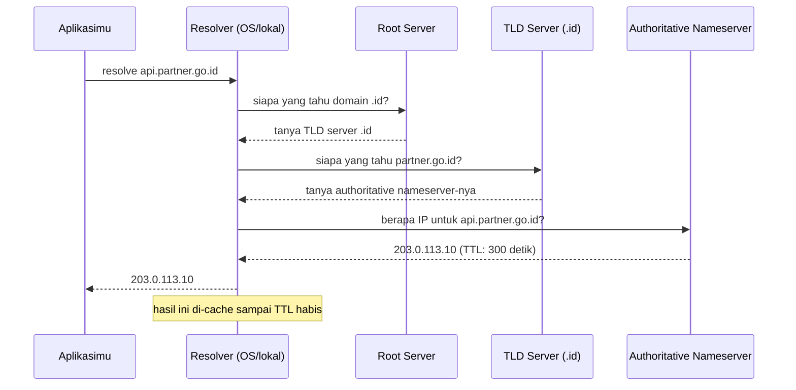

## TL;DR

DNS mengubah nama domain yang bisa dibaca manusia (`api.partner.go.id`) menjadi alamat IP yang bisa dipakai jaringan, lewat proses pencarian berjenjang: resolver bertanya ke root server, root mengarahkan ke server TLD (misalnya `.id`), TLD mengarahkan ke authoritative nameserver domain itu, dan barulah IP sebenarnya didapat. Hasil pencarian ini bisa dicache di beberapa lapisan — recursive resolver di hulu, kadang di level aplikasi, dan secara tidak langsung di koneksi TCP yang sudah terbuka (yang tetap memakai IP lama sampai koneksi itu ditutup, apa pun perubahan DNS setelahnya) — meski cache di mesin aplikasi itu sendiri sering kali tidak ada sama sekali, terutama di server Linux. Memahami lapisan cache ini penting karena ia menjelaskan kenapa perubahan DNS di sisi partner tidak selalu langsung terasa di sisimu — kadang butuh restart atau penutupan koneksi lama sebelum perubahan itu benar-benar berlaku.

## The Problem

Bayangkan sebuah partner instansi pemerintah melakukan failover infrastruktur — server API mereka berpindah ke data center baru dengan IP baru, dan mereka sudah memperbarui DNS record mereka sesuai prosedur. Tapi service-mu yang mengintegrasikan API itu tetap gagal terhubung selama beberapa jam setelah failover, padahal `dig` atau `nslookup` yang kamu jalankan manual sudah menunjukkan IP baru dengan benar.

Penyebabnya sering ada di lapisan yang tidak terlihat: kalau service-mu memakai `http.Client` dengan connection pooling (lihat [[TCP Handshake and Connection Lifecycle]]) yang sudah membuka koneksi TCP jangka panjang ke IP lama partner, koneksi itu **tetap memakai IP lama** yang sudah di-resolve sebelumnya — DNS hanya dilihat lagi saat koneksi baru benar-benar dibuka, bukan pada koneksi yang sudah `ESTABLISHED`. Selama koneksi lama itu masih dianggap sehat oleh connection pool, service-mu tidak akan pernah menyentuh DNS lagi untuk memperbarui alamatnya — sampai koneksi itu ditutup (misalnya karena idle timeout) dan dibuka ulang.

## Intuition

Bayangkan DNS seperti **bertanya alamat lewat rantai informasi berjenjang**: kamu tidak langsung tahu alamat rumah seseorang, jadi kamu bertanya ke kantor kelurahan pusat (root server) "siapa yang mengurus wilayah `.id`?", diarahkan ke kantor wilayah itu (TLD server), lalu diarahkan lagi ke kantor yang benar-benar tahu detail alamat domain spesifik itu (authoritative nameserver), yang akhirnya memberimu alamat sesungguhnya (IP). Karena bertanya berjenjang seperti ini lambat kalau dilakukan setiap kali, kamu mencatat alamat itu di buku catatanmu sendiri untuk sementara (cache, dengan masa berlaku TTL) supaya tidak perlu bertanya ulang setiap saat.

Analogi ini bocor di jumlah "buku catatan" yang sebenarnya ada, dan di mana buku catatan itu betul-betul berada. Bukan cuma satu cache — ada cache di recursive resolver hulu (bukan selalu di mesin aplikasi itu sendiri, terutama di server Linux), kadang cache tambahan di level aplikasi atau container runtime, dan yang sering terlupakan: koneksi TCP yang sudah terbuka pada dasarnya "mengunci" alamat yang di-resolve saat koneksi itu dibuat, terlepas dari TTL DNS yang sebenarnya sudah kedaluwarsa. Buku catatan sungguhan tidak berlapis-lapis seperti ini.

## How It Works

Proses resolusi penuh (disederhanakan, mengasumsikan tidak ada yang di-cache sama sekali):



Di laptop desktop, resolver lokal biasanya memang melakukan cache. **Di server Linux, sering kali tidak ada cache lokal sama sekali** — glibc tidak melakukan cache DNS, dan resolver murni-Go yang dipakai `net.Resolver` juga tidak. Yang melakukan cache biasanya adalah recursive resolver di hulu (DNS milik cloud provider, atau CoreDNS di dalam cluster Kubernetes). Konsekuensi praktisnya: saat mendiagnosis "kenapa perubahan DNS partner belum terasa", tempat yang perlu diperiksa adalah resolver hulu dan **connection pool aplikasimu sendiri** — bukan cache di mesin aplikasi yang mungkin memang tidak pernah ada.

**TTL** (time-to-live) yang disertakan authoritative nameserver menentukan berapa lama hasil ini boleh dianggap valid sebelum ditanyakan ulang di lapisan mana pun yang melakukan cache — TTL pendek berarti perubahan IP terasa lebih cepat tapi lebih sering membebani nameserver dengan query; TTL panjang sebaliknya.

Yang perlu diingat: begitu aplikasimu **membuka koneksi TCP** ke IP hasil resolusi ini, koneksi itu tidak lagi peduli pada DNS sama sekali sampai koneksi itu ditutup — DNS hanya relevan di momen koneksi *baru* dibuka, bukan sepanjang hidup koneksi yang sudah ada.

## In Go

```go
// Resolusi DNS eksplisit — berguna untuk debugging atau saat kamu
// perlu tahu IP mana yang sebenarnya akan dipakai.
func resolveHost(ctx context.Context, host string) ([]net.IPAddr, error) {
    var r net.Resolver
    addrs, err := r.LookupIPAddr(ctx, host)
    if err != nil {
        return nil, fmt.Errorf("resolve %s: %w", host, err)
    }
    return addrs, nil
}
```

Untuk `http.Client` biasa, resolusi DNS terjadi otomatis di dalam `http.Transport` setiap kali koneksi **baru** dibuka — tapi kalau `Transport` sedang memakai ulang koneksi idle yang masih hidup (lihat [[TCP Handshake and Connection Lifecycle]]), DNS sama sekali tidak disentuh lagi untuk request itu. Kalau kamu butuh service-mu bereaksi lebih cepat terhadap perubahan IP partner (misalnya karena mereka melakukan failover), pertimbangkan membatasi umur koneksi idle secara eksplisit:

```go
var partnerClient = &http.Client{
    Timeout: 5 * time.Second,
    Transport: &http.Transport{
        MaxIdleConnsPerHost: 20,
        IdleConnTimeout:     30 * time.Second, // paksa koneksi ditutup lebih sering,
                                                // supaya resolusi DNS lebih sering diulang
    },
}
```

Trade-off dari `IdleConnTimeout` yang pendek: koneksi lebih sering dibuka ulang (mengulang biaya handshake TCP dan resolusi DNS), tapi service-mu bereaksi lebih cepat kalau partner mengubah IP mereka. Ini keputusan yang harus disengaja, bukan default yang dibiarkan begitu saja.

## In His Stack

**Kubernetes** menjalankan DNS internalnya sendiri (biasanya CoreDNS, lihat [[../70 Infrastructure and Delivery/Service Discovery|Service Discovery]]) untuk resolusi nama service di dalam cluster — ini kenapa memanggil service lain lewat nama (`payment-service.namespace.svc.cluster.local`) alih-alih IP pod langsung itu penting: IP pod berubah setiap kali pod di-restart, sementara nama service-nya tetap.

**Partner integrasi pemerintah/enterprise** sering melakukan failover atau migrasi data center tanpa pemberitahuan detail teknis — kalau service-mu (atau tim ops-mu) tidak memahami lapisan cache DNS dan koneksi yang dijelaskan di note ini, insiden "partner bilang mereka sudah pulih, tapi sistem kami masih gagal connect" bisa berlangsung jauh lebih lama dari yang seharusnya, padahal solusinya sesederhana me-restart service supaya connection pool dan resolusi DNS-nya diperbarui.

## Trade-offs and When Not To Use It

Ini bukan topik yang punya "kapan tidak dipakai" — DNS adalah lapisan wajib untuk komunikasi berbasis nama domain. Yang perlu dipertimbangkan secara sadar adalah **TTL** (berapa lama record boleh di-cache) dan **umur koneksi idle** di sisi klien: keduanya sama-sama trade-off antara "reaksi cepat terhadap perubahan infrastruktur" versus "overhead dari resolusi dan pembukaan koneksi yang lebih sering".

## Common Mistakes

> [!warning] Jebakan
> Hardcode IP alih-alih memakai nama domain untuk memanggil partner, dengan alasan "lebih cepat karena tidak perlu resolusi DNS". Ini terlihat baik sampai partner mengubah infrastruktur mereka tanpa pemberitahuan — integrasimu gagal total tanpa cara mudah untuk tahu kenapa, karena kamu sengaja melewati mekanisme yang seharusnya menangani perubahan itu secara transparan.

> [!warning] Jebakan
> Berasumsi perubahan DNS langsung berlaku di seluruh sistemmu begitu partner mengumumkan sudah selesai failover. Koneksi TCP yang sudah terbuka tetap memakai IP lama sampai ditutup — kamu mungkin perlu me-restart service atau menunggu `IdleConnTimeout` sebelum perubahan itu benar-benar terasa.

> [!warning] Jebakan
> Tidak memasukkan kemungkinan kegagalan resolusi DNS (nameserver lambat merespons, atau gagal total) ke dalam perhitungan timeout budget (lihat [[../30 APIs and Web/Timeout Budgets|Timeout Budgets]]). Resolusi DNS yang lambat bisa jadi penyebab tersembunyi request pertama ke sebuah host selalu terasa lebih lambat dari request berikutnya.

## Exercises

1. Urutkan langkah-langkah resolusi DNS penuh dari resolver sampai authoritative nameserver.
2. Kenapa koneksi TCP yang sudah `ESTABLISHED` tidak terpengaruh oleh perubahan DNS record sampai koneksi itu ditutup?
3. Apa trade-off antara TTL DNS yang pendek dan yang panjang?
4. Desain terbuka: sebuah partner mengumumkan mereka akan melakukan migrasi data center pada akhir pekan, dengan IP baru dan DNS record yang sudah diperbarui sebelumnya. Rancang langkah-langkah di sisi sistemmu (konfigurasi `http.Client`, monitoring, dan rencana operasional) untuk memastikan integrasimu berpindah ke IP baru secepat mungkin setelah migrasi selesai, tanpa insiden berkepanjangan.

> [!success]- Kunci jawaban
> Sebelum migrasi: pastikan `IdleConnTimeout` di `http.Client` yang memanggil partner ini cukup pendek (atau restart service dijadwalkan tepat setelah jendela migrasi mereka) supaya koneksi lama ke IP sebelumnya tidak bertahan lama setelah migrasi selesai. Siapkan monitoring yang secara eksplisit mencatat IP tujuan yang sedang dipakai (bukan hanya "request ke partner gagal/berhasil") supaya saat insiden terjadi, tim bisa langsung melihat apakah trafik masih mengarah ke IP lama. Setelah migrasi selesai, verifikasi manual lewat `dig`/`nslookup` bahwa DNS record sudah mengarah ke IP baru sebelum menyalahkan sisi partner kalau integrasi masih gagal — dan siapkan langkah restart terkendali sebagai mitigasi cepat kalau connection pooling ternyata masih memakai IP lama lebih lama dari yang diharapkan.

## Self-Check

- Urutkan pihak-pihak yang ditanya dalam resolusi DNS penuh, dari resolver sampai authoritative nameserver.
- Apa itu TTL dalam konteks DNS, dan apa trade-off memilih TTL pendek vs panjang?
- Kenapa perubahan DNS record tidak langsung memengaruhi koneksi TCP yang sudah terbuka?
- Sebutkan satu risiko dari hardcoding IP partner alih-alih memakai nama domainnya.

## Connected Notes

- [[TCP vs UDP]] — DNS secara tradisional memakai UDP untuk query biasa, salah satu contoh konkret yang disebut di note itu.
- [[TCP Handshake and Connection Lifecycle]] — penjelasan kenapa koneksi yang sudah terbuka "mengunci" hasil resolusi DNS sampai ditutup.
- [[The TLS Handshake]] — langkah berikutnya setelah IP didapat dari DNS, sebelum data aplikasi bisa mengalir lewat HTTPS.
- [[../70 Infrastructure and Delivery/Service Discovery|Service Discovery]] — DNS internal (CoreDNS) sebagai salah satu implementasi mekanisme service discovery di Kubernetes.
- [[../30 APIs and Web/Handling an Unreliable Counterparty|Handling an Unreliable Counterparty]] — insiden failover partner seperti di note ini adalah salah satu bentuk konkret dari "counterparty yang tidak sepenuhnya bisa diandalkan".

## Further Reading

- RFC 1035 (*Domain Names - Implementation and Specification*) sebagai spesifikasi dasar DNS, meski format record modern banyak ditambah RFC-RFC lanjutan.

## Catatan Saya

*Tulis di sini kalau kamu pernah mengalami insiden integrasi yang ternyata akar masalahnya adalah DNS atau cache koneksi, bukan kode aplikasi.*
