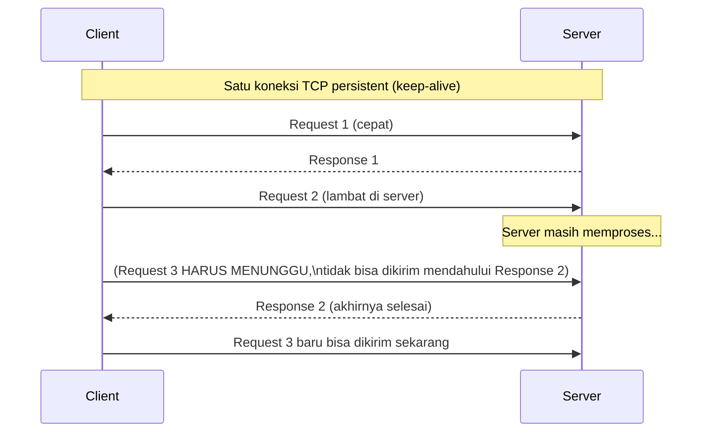

## TL;DR

HTTP/1.1 adalah protokol request-response berbasis teks yang menjadi fondasi hampir semua API yang kamu bangun: setiap request punya method, path, header, dan body opsional; setiap response punya status code, header, dan body. Fitur intinya yang sering dilupakan dampaknya: koneksi TCP bersifat **persistent** secara default (keep-alive), tapi tetap **sekuensial** — satu koneksi hanya bisa menangani satu request-response pada satu waktu, request berikutnya di koneksi yang sama harus menunggu response sebelumnya selesai dulu. Memahami ini menjelaskan langsung kenapa satu endpoint yang lambat bisa membuat request lain yang sebenarnya cepat ikut tertunda kalau keduanya kebetulan berbagi koneksi yang sama.

## The Problem

Bayangkan sebuah aplikasi client yang mengintegrasikan API-mu dan sengaja memakai ulang satu koneksi HTTP/1.1 persistent untuk beberapa panggilan API berurutan ke servicemu — sebuah keputusan yang terlihat efisien karena menghindari overhead membuka koneksi baru berkali-kali. Suatu hari, tim yang menjalankan aplikasi client itu melaporkan bahwa panggilan-panggilan mereka ke API-mu terasa jauh lebih lambat dari biasanya, meski dashboard monitoringmu menunjukkan sebagian besar endpoint merespons cepat seperti biasa.

Yang terjadi: salah satu endpoint yang mereka panggil di urutan tertentu ternyata lambat (misalnya karena query database berat). Karena HTTP/1.1 pada satu koneksi persistent bersifat sekuensial — request kedua di koneksi yang sama **tidak bisa mulai diproses** sampai response request pertama selesai dikirim — semua panggilan yang mereka kirim setelah panggilan lambat itu ikut tertahan menunggu di belakangnya, meski endpoint yang mereka panggil sebenarnya cepat. Ini disebut **head-of-line blocking** di level koneksi, dan gejalanya (di sisi client) terlihat identik dengan "server sedang overload", padahal server sepenuhnya sehat — masalahnya murni soal bagaimana satu koneksi HTTP/1.1 dipakai.

## Intuition

Bayangkan HTTP/1.1 di satu koneksi persistent seperti **antre di satu loket teller**, bukan seperti mengirim banyak surat sekaligus. Kamu boleh mengantre berkali-kali di loket yang sama tanpa harus keluar dan masuk ulang setiap kali (itu manfaat keep-alive — kamu tidak perlu antre ulang dari nol setiap transaksi), tapi selama satu orang di depanmu masih dilayani, semua yang mengantre di belakangnya — termasuk urusan yang sebenarnya cepat — harus menunggu, walau ada loket lain yang kosong di sebelahnya.

Analogi ini bocor di satu hal: di dunia nyata, kamu bisa dengan mudah pindah ke loket lain yang kosong. Di HTTP/1.1, "pindah loket" berarti membuka koneksi TCP baru sepenuhnya (dengan biaya handshake baru, lihat [[TCP Handshake and Connection Lifecycle]]) — inilah kenapa client HTTP/1.1 yang serius soal performa membuka **beberapa koneksi paralel** ke server yang sama, bukan mengandalkan satu koneksi untuk semua panggilan.

## How It Works

Satu request HTTP/1.1 dan response-nya:

```
GET /dokumen/12345 HTTP/1.1
Host: api.partner.go.id
Accept: application/json
Connection: keep-alive

HTTP/1.1 200 OK
Content-Type: application/json
Content-Length: 42
Connection: keep-alive

{"id": "12345", "status": "terverifikasi"}
```

Beberapa bagian yang wajib dipahami:

- **Method** (`GET`, `POST`, `PUT`, `PATCH`, `DELETE`, dst.) menyatakan maksud request. Sebagian method didefinisikan **safe** (tidak mengubah state di server — `GET`, `HEAD`) dan/atau **idempotent** (memanggilnya berkali-kali punya efek yang sama seperti memanggil sekali — `GET`, `PUT`, `DELETE` idempotent; `POST` umumnya tidak). Detail penuh soal idempotency ada di [[../30 APIs and Web/Idempotency|Idempotency]].
- **Header `Host`** wajib ada di HTTP/1.1 (tidak seperti HTTP/1.0) — ini yang memungkinkan satu server fisik/IP melayani banyak domain berbeda (virtual hosting), dan yang dipakai reverse proxy untuk merutekan request ke backend yang benar.
- **Status code** dikelompokkan per seratus: `2xx` sukses, `3xx` redirect, `4xx` kesalahan di sisi klien, `5xx` kesalahan di sisi server. Detail lengkap ada di [[../30 APIs and Web/Choosing Status Codes|Choosing Status Codes]].
- **`Connection: keep-alive`** (default di HTTP/1.1) memberitahu bahwa koneksi TCP ini boleh dipakai untuk request berikutnya, alih-alih ditutup segera setelah satu response selesai.



Diagram ini menunjukkan persis head-of-line blocking yang dijelaskan di "The Problem": Request 3 tidak bisa "menyalip" Request 2 yang masih diproses server, meski secara teori Request 3 sendiri cepat untuk diproses.

## In Go

```go
func documentHandler(w http.ResponseWriter, r *http.Request) {
    id := r.PathValue("id")

    doc, err := lookupDocument(r.Context(), id)
    if errors.Is(err, ErrNotFound) {
        // Status code yang tepat, BUKAN 200 dengan pesan error di body —
        // ini yang membuat client dan tooling generik (monitoring,
        // proxy) bisa membedakan sukses dari gagal tanpa parsing body.
        http.Error(w, "dokumen tidak ditemukan", http.StatusNotFound)
        return
    }
    if err != nil {
        http.Error(w, "kesalahan internal", http.StatusInternalServerError)
        return
    }

    w.Header().Set("Content-Type", "application/json")
    w.WriteHeader(http.StatusOK)
    if err := json.NewEncoder(w).Encode(doc); err != nil {
        // Response header sudah terkirim di titik ini — yang bisa
        // dilakukan hanya mencatat error, bukan mengubah status code lagi.
        log.Printf("encode response for document %s: %v", id, err)
    }
}
```

Untuk mengendalikan berapa banyak koneksi paralel yang dibuka klien Go ke satu host (mitigasi langsung untuk masalah head-of-line blocking di "The Problem"), atur `MaxConnsPerHost` di `http.Transport`:

```go
client := &http.Client{
    Transport: &http.Transport{
        MaxConnsPerHost:     10, // sampai 10 koneksi paralel ke host yang sama
        MaxIdleConnsPerHost: 10,
    },
}
```

Dengan lebih dari satu koneksi tersedia, satu request lambat hanya memblokir request lain yang kebetulan berbagi koneksi yang sama dengannya — bukan seluruh trafik ke host itu.

## In His Stack

**Yii1/Yii2** yang mengembalikan `200 OK` untuk semua response — termasuk saat terjadi error, dengan detail error hanya dituliskan di body JSON — adalah pola yang melanggar semantik HTTP/1.1 yang dijelaskan di note ini. Ini membuat monitoring generik (yang biasanya menghitung tingkat error dari status code, bukan dari isi body), API gateway, dan client HTTP standar kehilangan cara mudah membedakan sukses dari gagal tanpa membongkar body setiap response — dibahas lebih jauh di [[../30 APIs and Web/Consistent Error Responses|Consistent Error Responses]].

**Nginx** di depan PHP-FPM atau service Go biasanya mengelola keep-alive ke client secara terpisah dari keep-alive ke backend — dua "segmen" koneksi persistent yang masing-masing punya konfigurasinya sendiri (`keepalive_timeout` untuk sisi client, `keepalive` di `upstream` block untuk sisi backend).

## Trade-offs and When Not To Use It

HTTP/1.1 dengan keep-alive adalah default yang wajar untuk hampir semua komunikasi API. Trade-off yang perlu disadari adalah soal **jumlah koneksi paralel**: terlalu sedikit koneksi ke host yang sama membuat head-of-line blocking terasa (seperti di "The Problem"), tapi terlalu banyak koneksi paralel juga membebani server (setiap koneksi memakai resource, lihat [[Syscalls and File Descriptors]]) dan bisa memicu masalah [[TCP Handshake and Connection Lifecycle|ephemeral port]] kalau dibuka-tutup berlebihan. Untuk kasus di mana head-of-line blocking benar-benar jadi masalah performa yang signifikan, [[Introduction to HTTP2|HTTP/2]] menyelesaikannya di level protokol lewat multiplexing sungguhan di satu koneksi.

## Common Mistakes

> [!warning] Jebakan
> Mengembalikan `200 OK` untuk semua response, termasuk error, dengan detail kegagalan hanya di body. Ini memaksa setiap client dan tooling untuk mem-parsing body demi tahu apakah request-nya sebenarnya berhasil — melanggar seluruh tujuan status code sebagai sinyal yang bisa dibaca mesin tanpa perlu memahami skema body.

> [!warning] Jebakan
> Mengasumsikan koneksi keep-alive HTTP/1.1 memberi concurrency sungguhan pada satu koneksi. Satu koneksi HTTP/1.1 tetap sekuensial — request berikutnya menunggu response sebelumnya selesai, bukan diproses paralel di koneksi yang sama.

> [!warning] Jebakan
> Lupa bahwa response header (termasuk status code) hanya bisa dikirim **sekali** dan tidak bisa diubah setelah `WriteHeader` dipanggil atau body mulai ditulis. Error yang terjadi setelah body mulai dikirim (misalnya kegagalan encoding di tengah streaming JSON besar) tidak bisa lagi diubah jadi status code error — hanya bisa dicatat di log.

## Exercises

1. Jelaskan apa yang dimaksud "sekuensial" pada satu koneksi HTTP/1.1 dengan keep-alive.
2. Kenapa mengembalikan `200 OK` untuk response error adalah anti-pattern, meski body-nya berisi informasi error yang jelas?
3. Apa fungsi header `Host` di HTTP/1.1, dan kenapa ia wajib ada (berbeda dari HTTP/1.0)?
4. Desain terbuka: sebuah tim integrasi partner melaporkan bahwa panggilan mereka ke API-mu "kadang terasa sangat lambat, kadang normal", dan pola ini muncul lebih sering saat mereka memakai satu koneksi HTTP persistent untuk banyak panggilan berurutan. Rancang penjelasan teknis untuk tim itu (yang mungkin tidak familiar dengan detail HTTP/1.1) dan rekomendasi konkret di sisi mereka maupun sisimu untuk mengatasi ini.

> [!success]- Kunci jawaban
> Penjelasan untuk tim partner: satu koneksi HTTP/1.1 hanya bisa menangani satu permintaan pada satu waktu — kalau salah satu dari deretan panggilan mereka kebetulan lambat (misalnya menyentuh endpoint yang berat), semua panggilan setelahnya di koneksi yang sama harus menunggu, meski endpoint yang mereka panggil setelahnya sebenarnya cepat. Rekomendasi di sisi mereka: buka beberapa koneksi paralel (misalnya lewat connection pool client HTTP mereka, analog dengan `MaxConnsPerHost` di Go) alih-alih satu koneksi tunggal untuk semua panggilan sekuensial, terutama kalau urutan panggilan tidak saling bergantung. Rekomendasi di sisimu: identifikasi endpoint mana yang secara konsisten lambat dan optimalkan dulu (biasanya soal query database, lihat [[../40 Databases/Reading EXPLAIN|Reading EXPLAIN]]), karena masalah ini akan tetap terasa oleh siapa pun yang kebetulan berbagi koneksi dengan panggilan lambat itu, apa pun jumlah koneksi paralel yang mereka buka.

## Self-Check

- Apa yang dimaksud "persistent" pada koneksi HTTP/1.1 keep-alive, dan apa yang tidak berubah dari sifat "sekuensial"-nya?
- Kenapa mengembalikan `200 OK` untuk semua response (termasuk error) adalah masalah?
- Apa itu head-of-line blocking di konteks HTTP/1.1?
- Sebutkan satu cara mitigasi head-of-line blocking tanpa berpindah ke HTTP/2.

## Connected Notes

- [[TCP Handshake and Connection Lifecycle]] — koneksi persistent HTTP/1.1 dibangun tepat di atas siklus hidup koneksi TCP yang dibahas di note itu.
- [[The TLS Handshake]] — HTTPS adalah HTTP/1.1 (atau versi lain) yang berjalan di atas lapisan TLS.
- [[Introduction to HTTP2]] — solusi protokol untuk head-of-line blocking yang dijelaskan di note ini, lewat multiplexing sungguhan.
- [[../30 APIs and Web/Choosing Status Codes|Choosing Status Codes]] — pembahasan penuh kenapa status code yang tepat (bukan selalu `200`) penting.
- [[../30 APIs and Web/Consistent Error Responses|Consistent Error Responses]] — format response error yang konsisten, melengkapi status code yang benar.

## Further Reading

- RFC 9110 (*HTTP Semantics*) dan RFC 9112 (*HTTP/1.1*) sebagai spesifikasi resmi terbaru yang menggantikan RFC 7230–7235.

## Catatan Saya

*Tulis di sini kalau kamu pernah menemukan API (buatan sendiri atau partner) yang mengembalikan 200 untuk semua response, dan bagaimana itu menyulitkan integrasi.*
