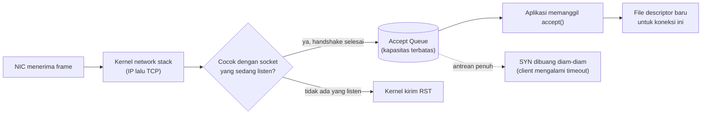

## TL;DR

Dari sebuah packet yang tiba di network card sampai byte yang bisa dibaca aplikasimu lewat `conn.Read()`, ada beberapa lapisan yang dilewati: NIC menerima frame, kernel memprosesnya naik lewat network stack (IP lalu TCP), mencocokkannya ke socket yang sedang `listen` di port tertentu, menyelesaikan handshake, lalu menaruh koneksi yang sudah "matang" itu ke sebuah antrean (**accept queue**) yang dipegang socket tersebut. Aplikasimu baru menyentuh koneksi itu ketika ia memanggil `accept()` — mengambil satu koneksi dari antrean dan mendapat file descriptor baru untuknya. Kalau antrean ini terlalu kecil untuk menampung lonjakan koneksi, koneksi baru bisa dibuang diam-diam **sebelum aplikasimu sempat tahu ada yang mencoba terhubung** — gejala yang sering disalahartikan sebagai bug aplikasi atau server yang lambat, padahal murni soal konfigurasi di lapisan OS.

## The Problem

Bayangkan sebuah service Go di belakang Nginx tiba-tiba terasa lambat lalu timeout untuk sebagian request, setiap kali ada lonjakan traffic mendadak — misalnya saat sebuah portal pemerintah membuka pendaftaran dan ribuan orang mengakses bersamaan dalam hitungan detik. CPU service itu tidak penuh, memori juga wajar, goroutine tidak menumpuk berlebihan — semua metrik aplikasi terlihat baik-baik saja. Tim mencari query lambat atau handler berat, tapi tidak menemukan apa pun, karena sebagian request itu tidak pernah sampai ke handler Go manapun.

Ini adalah gejala klasik dari **accept queue** (sering disebut juga *listen backlog*) yang kepenuhan. Kernel OS punya batas berapa banyak koneksi yang sudah selesai proses handshake-nya tapi belum diambil aplikasi lewat `accept()` yang boleh ditampung sekaligus. Kalau lonjakan koneksi datang lebih cepat dari kecepatan aplikasi memanggil `accept()`, antrean ini penuh, dan koneksi berikutnya dibuang diam-diam di level kernel — jauh sebelum baris kode Go manapun sempat dieksekusi. Tanpa memahami lapisan ini, engineer akan menghabiskan waktu memeriksa kode aplikasi untuk bug yang sebenarnya tidak ada di sana, padahal gejalanya justru mengarah ke "server lambat", bukan "server menolak".

## Intuition

Bayangkan sebuah **ruang penerimaan surat di gedung kantor**. Surat masuk (packet) diterima di loket depan (NIC), lalu disortir petugas berdasarkan alamat departemen tujuannya (IP dan port — ini kerja kernel network stack). Surat yang sudah lengkap alamatnya ditaruh di **nampan masuk** milik departemen itu (accept queue), menunggu staf departemen (aplikasimu, lewat `accept()`) mengambilnya satu per satu sesuai kecepatan mereka bekerja.

Analogi ini bocor di satu titik penting: kalau nampan surat sungguhan penuh, surat baru biasanya tetap ditumpuk di lantai — tidak dikembalikan ke pengirim. Accept queue di kernel Linux (dengan setelan default) juga tidak mengembalikan apa pun ke pengirim: begitu penuh, **surat baru dibuang tanpa pemberitahuan, dan pengirim hanya tahu bahwa balasannya tak kunjung datang**.

## How It Works

Perjalanan sebuah koneksi TCP masuk, dari kabel sampai kode aplikasi:

1. **NIC (network interface card)** menerima frame fisik dari jaringan dan memicu interrupt ke kernel.
2. **Kernel network stack** memproses frame itu naik lewat lapisan-lapisan protokol (lihat [[The TCP-IP Model]]) — mengurai header IP untuk tahu tujuan, lalu header TCP untuk tahu port tujuan.
3. Kernel mencocokkan port tujuan itu dengan **socket yang sedang `listen`** di port tersebut.
4. Untuk koneksi TCP baru, kernel menyelesaikan proses handshake (lihat [[TCP Handshake and Connection Lifecycle]]) secara otomatis — ini terjadi **sebelum** aplikasi tahu apa-apa.
5. Koneksi yang sudah selesai handshake-nya ditaruh di **accept queue** milik socket yang `listen` itu. Sebenarnya ada **dua** antrean, bukan satu: *SYN queue* menampung koneksi yang handshake-nya belum selesai, dan *accept queue* menampung yang sudah selesai tapi belum diambil `accept()` — keduanya punya batas sendiri dan bisa penuh sendiri-sendiri.
6. Aplikasi memanggil syscall `accept()`, yang mengambil satu koneksi dari depan antrean dan mengembalikan **file descriptor baru** khusus untuk koneksi itu (lihat [[Syscalls and File Descriptors]]).
7. Setelah itu, aplikasi membaca dan menulis pada file descriptor itu seperti biasa, mengikuti model blocking/non-blocking yang sudah dibahas di [[Blocking vs Non-Blocking IO]].



Diagram ini menunjukkan titik krusial yang sering dilewatkan: kotak "Accept Queue" adalah tempat koneksi bisa gagal **tanpa** aplikasi pernah tahu — baik karena tidak ada socket yang listen di port itu, maupun karena antreannya sendiri sudah penuh.

## Under The Hood

Apa yang persis terjadi saat accept queue penuh bergantung pada setelan kernel. Di Linux, perilaku default (`net.ipv4.tcp_abort_on_overflow = 0`) adalah **membuang paket SYN itu diam-diam**, bukan mengirim `RST`. Akibatnya client tidak melihat penolakan yang jelas — ia hanya "menunggu", mengirim ulang SYN-nya beberapa kali sesuai aturan retransmisi TCP, lalu akhirnya timeout. Gejala di sisi client karena itu terlihat seperti **server yang lambat**, bukan server yang menolak. Ini jebakan diagnosis yang serius: tim mencari query lambat atau handler berat, padahal request-nya belum pernah sampai ke aplikasi sama sekali. Metrik yang menjawab pertanyaan ini adalah penghitung overflow di `netstat -s` (baris yang menyebut *listen queue* atau *SYNs to LISTEN sockets dropped*), bukan metrik aplikasi mana pun.

Ukuran accept queue ditentukan oleh dua angka yang harus sama-sama cukup besar: parameter `backlog` yang diberikan aplikasi saat memanggil `listen()` (di Go, ini diatur secara internal oleh `net.Listen`, biasanya lewat konfigurasi OS default), dan batas maksimum yang diizinkan kernel secara sistem-wide (di Linux, dikontrol lewat parameter kernel `net.core.somaxconn`). Nilai efektif yang benar-benar dipakai adalah nilai **terkecil** di antara keduanya — menaikkan satu tanpa menaikkan yang lain tidak akan membantu.

> [!question] Perlu diverifikasi
> Klaim: nilai default `net.core.somaxconn` dan bagaimana persis `net.Listen` di Go menentukan backlog effective-nya pada versi kernel/OS tertentu.
> Kenapa ragu: nilai default berbeda antar versi kernel Linux dan distribusi, dan perilaku `net.Listen` terhadap parameter ini juga bisa berubah antar versi Go.
> Cara verifikasi: periksa `sysctl net.core.somaxconn` di server production yang relevan, dan baca changelog `net` package di rilis Go yang sedang dipakai.

## In Go

Contoh raw TCP listener untuk melihat langsung titik `Accept()` dalam kode (server HTTP produksi biasanya tidak menulis ini manual — `net/http` melakukannya secara internal — tapi memahami raw-nya membantu mendiagnosis masalah backlog):

```go
func runRawListener(ctx context.Context, addr string) error {
    lc := net.ListenConfig{}
    ln, err := lc.Listen(ctx, "tcp", addr)
    if err != nil {
        return fmt.Errorf("listen on %s: %w", addr, err)
    }
    defer ln.Close()

    for {
        conn, err := ln.Accept()
        if err != nil {
            // Kalau context dibatalkan, ini adalah shutdown normal, bukan error.
            select {
            case <-ctx.Done():
                return nil
            default:
                return fmt.Errorf("accept connection: %w", err)
            }
        }

        go handleConnection(conn) // satu goroutine per koneksi yang diterima
    }
}

func handleConnection(conn net.Conn) {
    defer conn.Close()
    // ... baca/tulis pada conn seperti biasa
}
```

Bagian yang penting untuk dipahami: loop `for { ln.Accept() }` inilah yang menentukan seberapa cepat aplikasi mengosongkan accept queue. Kalau `handleConnection` lambat dan dipanggil secara blocking (bukan `go handleConnection(conn)`), loop ini akan tertunda memanggil `Accept()` lagi — mempercepat penumpukan antrean saat traffic tinggi. Menjalankannya di goroutine terpisah (seperti contoh di atas) memastikan loop `Accept()` bisa segera mengambil koneksi berikutnya dari antrean.

## In His Stack

**Nginx** sebagai reverse proxy di depan aplikasimu adalah pihak yang benar-benar menerima jutaan koneksi client langsung — ia punya konfigurasi `listen ... backlog=N` sendiri yang menentukan seberapa besar accept queue di levelnya, terpisah dari accept queue milik service Go/PHP-FPM di belakangnya.

**Kubernetes Service** menambah satu lapisan lagi lewat `kube-proxy` (memakai iptables atau IPVS) yang meneruskan koneksi ke salah satu pod — di titik ini juga ada batasan koneksi konkuren yang bisa terpengaruh kalau tidak dikonfigurasi dengan baik, meski mekanismenya berbeda dari accept queue kernel murni.

**MariaDB** juga punya socket yang listen dan accept queue-nya sendiri di sisi server — ini kenapa `back_log` adalah salah satu parameter konfigurasi MariaDB yang relevan saat jumlah koneksi klien yang mencoba connect bersamaan sangat tinggi, meski di praktiknya connection pooling di sisi aplikasi (lihat [[../40 Databases/Connection Pooling|Connection Pooling]]) biasanya sudah mencegah lonjakan koneksi seperti itu terjadi.

## Trade-offs and When Not To Use It

Tidak ada trade-off dalam arti "kapan tidak memakai mekanisme ini" — accept queue adalah bagian tak terhindarkan dari TCP di OS mana pun. Yang perlu dipertimbangkan adalah ukurannya: backlog yang terlalu kecil membuat koneksi ditolak saat lonjakan traffic wajar sekalipun, sementara backlog yang sangat besar hanya menunda masalah kalau akar penyebabnya adalah aplikasi yang benar-benar terlalu lambat memanggil `accept()` — di kasus itu, menaikkan backlog hanya membuat client menunggu lebih lama sebelum akhirnya tetap gagal atau timeout.

## Common Mistakes

> [!warning] Jebakan
> Menyimpulkan "aplikasi baik-baik saja" hanya dari metrik CPU dan memori, padahal masalah terjadi di accept queue kernel — lapisan yang tidak pernah tersentuh kode aplikasi sama sekali dan tidak muncul di metrik aplikasi biasa.

> [!warning] Jebakan
> Menyamakan "connection refused" di level accept queue dengan error dari dalam handler aplikasi. Keduanya terlihat identik dari sisi client, tapi yang pertama berarti request tidak pernah sampai ke kode aplikasimu sama sekali — perbaikannya ada di konfigurasi OS/listener, bukan di kode handler.

> [!warning] Jebakan
> Mengira menaikkan jumlah worker/goroutine aplikasi otomatis memperbesar accept queue. Ukuran backlog adalah parameter terpisah di level socket listener dan kernel — menambah worker membantu kecepatan memproses koneksi yang *sudah* di-accept, bukan kapasitas antrean sebelum di-accept.

## Exercises

1. Urutkan lapisan yang dilewati sebuah packet TCP masuk dari NIC sampai byte-nya bisa dibaca aplikasi.
2. Apa itu accept queue, dan apa yang terjadi kalau ia penuh saat koneksi baru datang?
3. Kenapa memanggil `handleConnection(conn)` secara blocking (tanpa `go`) di dalam loop `Accept()` bisa memperparah masalah backlog saat traffic tinggi?
4. Desain terbuka: sebuah service pendaftaran online milik pemerintah mengalami lonjakan traffic tepat di menit pembukaan pendaftaran, dan sebagian besar user menerima error koneksi dalam beberapa detik pertama meski server tidak terlihat overload di CPU/memori setelahnya. Rancang strategi lengkap (dari level OS/listener sampai level aplikasi dan arsitektur) untuk menghadapi lonjakan seperti ini di pembukaan pendaftaran berikutnya.

> [!success]- Kunci jawaban
> Beberapa lapis mitigasi: (1) naikkan backlog di level Nginx dan (kalau relevan) `net.core.somaxconn` di kernel, berdasarkan estimasi lonjakan konkuren yang realistis, bukan angka default; (2) pastikan loop `Accept()` di aplikasi (atau konfigurasi worker di Nginx/PHP-FPM) tidak blocking dan segera menyerahkan koneksi baru ke goroutine/worker terpisah; (3) pertimbangkan **load shedding** yang sengaja (lihat [[../30 APIs and Web/Load Shedding|Load Shedding]]) — menolak sebagian request dengan respons yang jelas ("server sibuk, coba lagi") jauh lebih baik daripada koneksi yang dibuang diam-diam tanpa penjelasan; (4) untuk lonjakan yang benar-benar bisa diprediksi (jam pembukaan pendaftaran), pertimbangkan **waiting room** di level aplikasi yang menahan user di antrean virtual sebelum mereka benar-benar membuka koneksi ke backend, memindahkan masalah dari "koneksi TCP yang ditolak kernel" menjadi "antrean yang terlihat dan terkendali di level aplikasi".

## Self-Check

- Apa itu accept queue, dan di lapisan mana ia berada — kernel atau aplikasi?
- Kenapa koneksi bisa gagal sebelum kode handler aplikasi sempat dieksekusi sama sekali?
- Dua angka apa yang bersama-sama menentukan ukuran efektif accept queue?
- Kenapa metrik CPU dan memori yang normal tidak cukup untuk menyingkirkan kemungkinan masalah di accept queue?

## Connected Notes

- [[Syscalls and File Descriptors]] — `accept()` yang dibahas di note ini adalah syscall yang menghasilkan file descriptor baru per koneksi.
- [[Blocking vs Non-Blocking IO]] — setelah koneksi diterima lewat `accept()`, model blocking/non-blocking yang sama berlaku untuk membaca dan menulis di atasnya.
- [[The TCP-IP Model]] — kerangka lengkap lapisan protokol yang disebut sekilas di note ini (NIC sampai TCP).
- [[TCP Handshake and Connection Lifecycle]] — detail penuh proses handshake yang disebut terjadi "otomatis oleh kernel" di note ini.
- [[../30 APIs and Web/Load Balancing and Reverse Proxies|Load Balancing and Reverse Proxies]] — Nginx dan load balancer lain menambah lapisan accept queue mereka sendiri di depan aplikasimu.

## Further Reading

- Man page `listen(2)` dan `accept(2)` di Linux (`man 2 listen`) untuk detail parameter backlog yang akurat sesuai kernel yang terpasang.

## Catatan Saya

*Tulis di sini kalau kamu pernah mengalami lonjakan traffic yang menyebabkan koneksi ditolak, dan apakah akar masalahnya ternyata di accept queue atau di tempat lain.*
