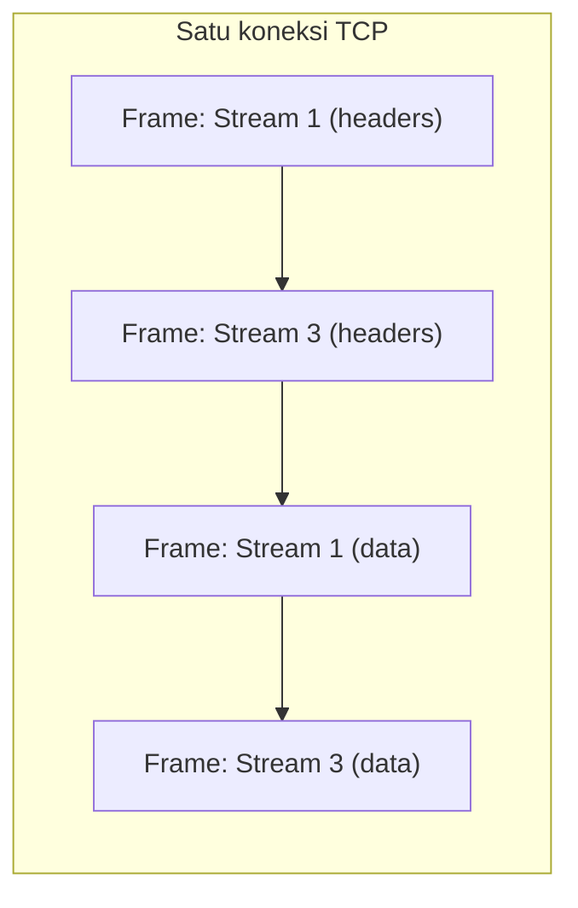

## TL;DR

HTTP/2 mengganti format teks HTTP/1.1 dengan format biner yang dibagi jadi *frame*, dan mengizinkan banyak *stream* (masing-masing merepresentasikan satu request-response) berjalan **bersamaan, saling menyisip, di atas satu koneksi TCP yang sama** — inilah yang disebut multiplexing, dan ia menyelesaikan head-of-line blocking di level HTTP yang dibahas di [[HTTP 1.1 In Depth]]. Tapi multiplexing ini tidak menghapus head-of-line blocking sepenuhnya: karena semua stream tetap berbagi **satu koneksi TCP**, satu packet yang hilang di jaringan tetap menahan **semua** stream yang sedang berjalan sampai packet itu dikirim ulang — head-of-line blocking berpindah dari level HTTP ke level TCP, bukan hilang seluruhnya.

## The Problem

Bayangkan sebuah tim memutuskan bermigrasi service internal mereka ke gRPC (yang mewajibkan HTTP/2 sebagai transportnya, lihat [[../30 APIs and Web/gRPC and Protobuf|gRPC and Protobuf]]), sebagian dengan alasan "supaya tidak ada lagi head-of-line blocking seperti masalah yang pernah terjadi di HTTP/1.1". Setelah migrasi, performa memang membaik signifikan untuk kasus banyak request kecil paralel. Tapi suatu hari, saat terjadi sedikit packet loss di jaringan (misalnya karena kongesti di link tertentu), **seluruh** request yang sedang berjalan di koneksi itu ikut melambat bersamaan — persis gejala head-of-line blocking yang tadinya dikira sudah "diselesaikan" oleh migrasi ke HTTP/2.

Ini bukan kegagalan migrasi — ini adalah batas nyata dari apa yang sebenarnya diselesaikan HTTP/2. Multiplexing HTTP/2 menghapus head-of-line blocking yang terjadi **karena desain protokol HTTP/1.1 itu sendiri** (satu request harus selesai sebelum request berikutnya di koneksi yang sama bisa mulai). Ia tidak dan tidak bisa menghapus head-of-line blocking yang terjadi **di level TCP** — kalau satu segmen TCP hilang, TCP menahan **semua** data setelahnya (termasuk semua stream HTTP/2 yang sedang dimultipleks) sampai segmen yang hilang itu berhasil dikirim ulang dan urutannya lengkap kembali, karena TCP menjamin pengiriman berurutan tanpa peduli bahwa data itu sebenarnya berasal dari beberapa stream logis yang independen.

## Intuition

Bayangkan HTTP/1.1 seperti **satu jalur antre di depan satu loket** — satu urusan harus selesai sebelum urusan berikutnya dilayani. HTTP/2 lebih seperti **satu petugas yang melayani beberapa nomor antrean sekaligus secara bergantian cepat**, menyisipkan sedikit demi sedikit pekerjaan dari beberapa urusan berbeda dalam waktu yang tumpang tindih — semua terasa berjalan "bersamaan" meski sebenarnya masih satu petugas (satu koneksi TCP) yang mengerjakannya.

Analogi ini bocor tepat di titik yang paling penting untuk dipahami: kalau si petugas itu sendiri harus berhenti sejenak (koneksi TCP mengalami packet loss dan menunggu retransmisi), **semua** urusan yang sedang ia tangani ikut berhenti bersamaan — bukan hanya satu urusan yang kebetulan bermasalah. Independensi stream di HTTP/2 hanya nyata secara logis di level aplikasi; secara fisik, mereka semua tetap menumpang satu "petugas" TCP yang sama.

## How It Works

HTTP/2 memecah komunikasi jadi **frame** biner kecil, masing-masing berlabel `stream ID` yang menunjukkan request-response mana yang ia bagian darinya. Frame dari stream yang berbeda bisa saling menyisip di koneksi TCP yang sama:



Diagram ini menunjukkan bahwa Stream 1 dan Stream 3 berjalan bersamaan secara logis — frame keduanya saling menyisip di satu koneksi yang sama, tanpa Stream 3 harus menunggu Stream 1 selesai total lebih dulu (beda dengan HTTP/1.1). HTTP/2 juga memakai kompresi header (HPACK) untuk mengurangi overhead header yang berulang di setiap request — di HTTP/1.1, header seperti `Host`, `User-Agent`, dan cookie dikirim penuh setiap kali; HPACK memungkinkan header yang sama dikirim lebih ringkas pada request berikutnya di koneksi yang sama.

## In Go

`net/http` di Go mendukung HTTP/2 secara otomatis untuk koneksi HTTPS — negosiasi versi protokol terjadi lewat mekanisme ALPN saat TLS handshake (lihat [[The TLS Handshake]]), tanpa perlu konfigurasi eksplisit tambahan untuk kasus umum.

```go
// http.Client default Go akan otomatis memakai HTTP/2 kalau server
// tujuannya mendukungnya dan koneksinya lewat HTTPS — tidak ada kode
// tambahan yang perlu ditulis untuk ini.
resp, err := http.Get("https://api.partner.go.id/dokumen/12345")
if err != nil {
    return fmt.Errorf("get: %w", err)
}
defer resp.Body.Close()

// Untuk memastikan/memaksa HTTP/2 secara eksplisit (berguna saat
// debugging atau saat memakai transport kustom), package
// golang.org/x/net/http2 menyediakan konfigurasi tambahan.
```

> [!question] Perlu diverifikasi
> Klaim: detail dukungan HTTP/2 bawaan di `net/http` (termasuk untuk h2c/cleartext) bisa berbeda antar versi Go.
> Kenapa ragu: perilaku default package `net/http` terhadap HTTP/2 pernah mengalami perubahan antar rilis Go, dan dukungan h2c secara khusus tidak selalu built-in tanpa package tambahan.
> Cara verifikasi: baca release notes Go untuk versi yang sedang dipakai, dan dokumentasi resmi `golang.org/x/net/http2`.

## In His Stack

**gRPC** (relevan langsung dengan ekosistem Kafka/Go di tempat kerjamu) mewajibkan HTTP/2 sebagai transportnya — ini kenapa gRPC bisa melakukan streaming dua arah secara efisien di satu koneksi, memanfaatkan multiplexing yang dijelaskan di note ini. Kalau ada reverse proxy atau load balancer di antara client dan server gRPC yang **tidak** mendukung HTTP/2 sepenuhnya (atau secara diam-diam men-downgrade ke HTTP/1.1), panggilan gRPC bisa gagal dengan cara yang membingungkan — ini alasan konfigurasi Nginx atau ingress Kubernetes untuk trafik gRPC perlu secara eksplisit mengaktifkan dukungan HTTP/2 ke backend, bukan diasumsikan otomatis bekerja.

## Trade-offs and When Not To Use It

HTTP/2 hampir selalu lebih baik dibanding HTTP/1.1 untuk kasus banyak request kecil ke host yang sama (halaman web dengan banyak asset, atau API dengan banyak panggilan paralel) — multiplexing menghilangkan kebutuhan membuka banyak koneksi TCP paralel seperti mitigasi head-of-line blocking di HTTP/1.1. Trade-off-nya: format biner HTTP/2 lebih sulit didiagnosis manual dibanding HTTP/1.1 yang bisa dibaca langsung lewat `telnet` atau `curl -v` mentah — butuh tooling yang memang mendukung parsing HTTP/2 untuk debugging di level wire.

Untuk kasus di mana head-of-line blocking di level TCP juga harus dihindari (jaringan dengan packet loss signifikan, misalnya koneksi seluler yang tidak stabil), protokol yang lebih baru seperti HTTP/3 (dibangun di atas QUIC, berjalan di atas UDP alih-alih TCP) menyelesaikan masalah itu dengan membuat setiap stream benar-benar independen di level transport — di luar cakupan mendalam vault ini untuk saat ini, tapi baik untuk diketahui keberadaannya.

## Common Mistakes

> [!warning] Jebakan
> Mengira migrasi ke HTTP/2 (atau gRPC) menghapus **semua** bentuk head-of-line blocking. Ia hanya menghapus head-of-line blocking yang terjadi karena desain HTTP/1.1 sendiri — head-of-line blocking di level TCP (satu packet hilang menahan semua stream) tetap ada, karena semua stream tetap berbagi satu koneksi TCP yang sama.

> [!warning] Jebakan
> Berasumsi HTTP/2 otomatis bekerja penuh lintas semua infrastruktur perantara (load balancer, reverse proxy, API gateway) tanpa konfigurasi eksplisit. Banyak infrastruktur lama atau default belum mengaktifkan dukungan HTTP/2 ke backend, dan diam-diam men-downgrade ke HTTP/1.1 — ini terutama menyulitkan diagnosis masalah gRPC yang butuh HTTP/2 sepenuhnya.

> [!warning] Jebakan
> Mencoba men-debug trafik HTTP/2 dengan tool yang hanya paham HTTP/1.1 mentah (misalnya `telnet` biasa) dan bingung kenapa tidak terbaca. Format biner HTTP/2 butuh tool yang memang mendukungnya (misalnya `curl --http2`, atau proxy debugging khusus).

## Exercises

1. Jelaskan perbedaan mendasar antara multiplexing di HTTP/2 dan model sekuensial di HTTP/1.1 keep-alive.
2. Kenapa HTTP/2 tidak sepenuhnya menghapus head-of-line blocking, meski menyelesaikannya di level HTTP?
3. Kenapa gRPC mewajibkan HTTP/2, bukan HTTP/1.1?
4. Desain terbuka: timmu sedang mempertimbangkan migrasi salah satu integrasi API internal (bukan dengan partner eksternal, jadi kamu punya kendali penuh atas kedua sisi) dari REST atas HTTP/1.1 ke gRPC atas HTTP/2, dengan harapan performa membaik signifikan. Rancang langkah verifikasi sebelum migrasi (termasuk memeriksa seluruh rantai infrastruktur perantara) dan ekspektasi yang realistis soal apa yang akan membaik dan apa yang tidak berubah.

> [!success]- Kunci jawaban
> Sebelum migrasi, verifikasi seluruh rantai infrastruktur di antara kedua service (load balancer, reverse proxy, service mesh sidecar kalau ada) benar-benar mendukung HTTP/2 end-to-end, bukan hanya di titik akhir — satu titik yang men-downgrade ke HTTP/1.1 di tengah jalan akan menghilangkan sebagian besar manfaat migrasi tanpa terlihat jelas dari luar. Ekspektasi yang realistis: performa akan membaik signifikan untuk pola banyak request kecil paralel ke host yang sama (multiplexing menghapus kebutuhan banyak koneksi TCP paralel dan overhead header berulang lewat HPACK), tapi migrasi ini **tidak** akan memperbaiki masalah yang sebenarnya disebabkan jaringan yang tidak stabil (packet loss) — itu tetap butuh mitigasi di level TCP/infrastruktur atau pertimbangan protokol yang benar-benar transport-independent seperti HTTP/3 di masa depan.

## Self-Check

- Apa yang dimaksud multiplexing di HTTP/2, dan apa yang membedakannya dari HTTP/1.1 keep-alive?
- Kenapa head-of-line blocking di level TCP tetap ada meski HTTP/2 sudah menyelesaikannya di level HTTP?
- Kenapa gRPC membutuhkan HTTP/2 sebagai transportnya?
- Sebutkan satu risiko infrastruktur yang perlu diperiksa sebelum migrasi ke HTTP/2 penuh.

## Connected Notes

- [[HTTP 1.1 In Depth]] — prasyarat langsung: masalah head-of-line blocking yang diselesaikan sebagian oleh HTTP/2 dijelaskan penuh di note itu.
- [[The TLS Handshake]] — negosiasi versi HTTP/2 di Go terjadi lewat ALPN saat TLS handshake.
- [[TCP Handshake and Connection Lifecycle]] — batas nyata multiplexing HTTP/2: semua stream tetap berbagi satu koneksi TCP yang sama.
- [[../30 APIs and Web/gRPC and Protobuf|gRPC and Protobuf]] — protokol yang secara langsung memanfaatkan (dan mewajibkan) HTTP/2.
- [[../30 APIs and Web/Load Balancing and Reverse Proxies|Load Balancing and Reverse Proxies]] — infrastruktur perantara yang perlu dikonfigurasi eksplisit agar mendukung HTTP/2 ke backend.

## Further Reading

- RFC 9113 (*HTTP/2*) sebagai spesifikasi resmi terbaru yang menggantikan RFC 7540.

## Catatan Saya

*Tulis di sini kalau timmu pernah mempertimbangkan atau melakukan migrasi ke HTTP/2/gRPC, dan apa yang benar-benar berubah (atau tidak berubah) setelahnya.*
