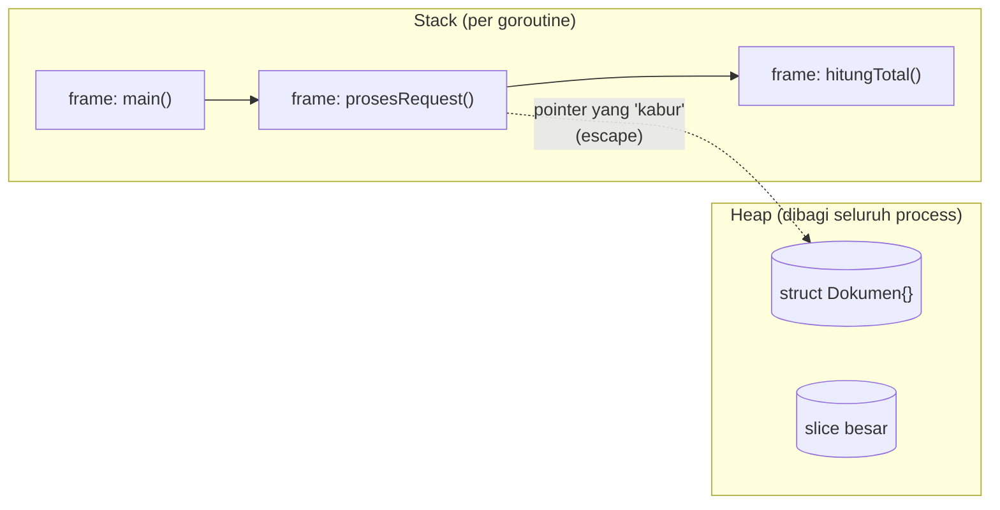

## TL;DR

Setiap goroutine punya **stack** sendiri — area memori kecil, cepat, dan otomatis tumbuh-menyusut mengikuti pemanggilan function, dibersihkan begitu function itu selesai. **Heap** adalah area memori bersama dalam satu process yang hidupnya tidak terikat pada satu pemanggilan function — dan karena itu butuh mekanisme pelacakan (di Go: garbage collector) untuk tahu kapan sebuah data boleh dibuang. Compiler Go memutuskan sendiri, lewat *escape analysis*, apakah sebuah value cukup hidup di stack atau harus "kabur" (escape) ke heap — keputusan ini yang paling menentukan seberapa berat sebuah hot path membebani garbage collector.

## The Problem

Bayangkan sebuah endpoint yang dipanggil oleh banyak portal pemerintah untuk memvalidasi status dokumen legal — dipanggil ribuan kali per menit di jam sibuk. Fungsinya sederhana: terima ID, cari record, kembalikan struct kecil berisi status. Secara fungsional benar dan lolos semua test. Tapi begitu live, latency p99-nya melonjak tajam justru saat traffic naik, padahal secara kasat mata CPU tidak terlihat penuh — server lebih sering berhenti sejenak (GC pause) daripada benar-benar sibuk memproses.

Penyebabnya sering kali sesepele ini: function tersebut mengembalikan **pointer** ke struct yang dibuat di dalamnya, padahal struct itu kecil dan bisa saja cukup hidup di stack. Karena pointer-nya "kabur" keluar dari function (dikembalikan ke pemanggil), compiler Go terpaksa menaruh struct itu di heap — dan itu berarti setiap satu panggilan endpoint menambah satu objek baru yang harus dilacak dan suatu saat dibersihkan oleh garbage collector. Kalikan dengan ribuan request per menit, dan garbage collector jadi sibuk sekali, mencuri waktu CPU dari melayani request yang sebenarnya.

## Intuition

Bayangkan stack seperti **tumpukan nampan di kantin** — nampan ditambahkan ke atas tumpukan saat kamu mengambilnya, dan dikembalikan (dilepas) begitu kamu selesai makan, selalu dari atas (LIFO — last in, first out). Cepat, sederhana, tidak butuh orang lain untuk membereskannya.

Heap lebih mirip **gudang bersama** — siapa saja boleh menaruh barang di sana untuk disimpan lebih lama dari sekadar "selama makan siang", tapi karena banyak orang menaruh barang di gudang yang sama, dibutuhkan seseorang (garbage collector) yang berkeliling secara berkala memeriksa barang mana yang sudah tidak dipakai siapa pun dan boleh dibuang.

Analogi ini bocor di satu tempat penting: di gudang sungguhan, biasanya ada orang yang secara eksplisit "mengambil kembali" barangnya. Di Go, tidak ada `free()` manual — garbage collector-lah yang secara otomatis menentukan kapan sebuah objek di heap sudah tidak "dipakai siapa pun" (tidak ada pointer yang menunjuk ke sana lagi) dan aman dibersihkan. Ini yang membuat Go jauh lebih aman dari use-after-free dibanding bahasa seperti C, tapi juga berarti kamu tidak punya kendali eksplisit kapan pembersihan itu terjadi.

## How It Works

Setiap goroutine mendapat stack sendiri, dimulai kecil (dalam orde kilobyte) dan tumbuh otomatis kalau function calls-nya bertumpuk dalam (misalnya rekursi dalam). Setiap kali sebuah function dipanggil, sebuah *stack frame* baru ditambahkan berisi local variable dan alamat kembali; begitu function itu `return`, frame-nya langsung dilepas — tidak butuh garbage collector sama sekali, karena umur data itu benar-benar terikat pada umur pemanggilan function-nya.

Heap tidak punya struktur LIFO seperti itu. Sebuah value di heap bisa hidup jauh lebih lama dari function yang membuatnya — misalnya karena pointer ke value itu dikembalikan ke pemanggil, disimpan di struct lain, atau dikirim lewat channel ke goroutine lain. Karena umurnya tidak terikat pada satu pemanggilan function, satu-satunya cara aman membersihkannya adalah dengan melacak: masih adakah yang menunjuk ke value ini? Ini kerja yang dilakukan garbage collector Go (dibahas penuh di [[../50 Concurrency and Performance/Garbage Collection in Go|Garbage Collection in Go]]).



Diagram ini menunjukkan bahwa stack frame ditumpuk dan dilepas mengikuti pemanggilan function, sementara heap adalah area terpisah yang hanya disentuh saat sebuah value benar-benar perlu "kabur" dari batas function-nya.

## Under The Hood

Compiler Go melakukan **escape analysis** saat kompilasi: ia melacak apakah sebuah value bisa dibuktikan tidak pernah dipakai di luar function tempat ia dibuat. Kalau bisa dibuktikan (misalnya value itu hanya dipakai lokal dan tidak pernah pointer-nya dikembalikan, disimpan di variable yang hidup lebih lama, atau ditangkap closure yang lolos dari function), value itu dialokasikan di stack. Kalau tidak bisa dibuktikan — misalnya pointer-nya dikembalikan, disimpan dalam interface, atau ukurannya tidak diketahui di compile time (seperti slice yang tumbuh dinamis) — value itu "kabur" ke heap. Mekanisme lengkap dan cara membaca output analisisnya ada di [[../50 Concurrency and Performance/Escape Analysis|Escape Analysis]].

## In Go

Contoh yang secara eksplisit memaksa alokasi ke heap, dan versi yang cukup hidup di stack:

```go
package main

import "fmt"

type Dokumen struct {
    ID     string
    Status string
}

// Versi ini memaksa Dokumen "kabur" ke heap: pointer-nya
// dikembalikan ke pemanggil, jadi umurnya tidak lagi terikat
// pada pemanggilan buatDokumenHeap().
func buatDokumenHeap(id string) *Dokumen {
    d := Dokumen{ID: id, Status: "draft"}
    return &d // <- pointer ini "kabur" dari function ini
}

// Versi ini bisa dianalisis compiler sebagai cukup hidup di
// stack: value dikembalikan (bukan pointer-nya), dan pemanggil
// menerima salinannya sendiri.
func buatDokumenStack(id string) Dokumen {
    d := Dokumen{ID: id, Status: "draft"}
    return d // value disalin ke pemanggil, bukan pointer-nya
}

func main() {
    a := buatDokumenHeap("A-001")
    b := buatDokumenStack("B-002")
    fmt.Println(a.Status, b.Status)
}
```

Untuk melihat keputusan compiler secara langsung, jalankan:

```sh
go build -gcflags="-m" ./...
```

Compiler akan mencetak baris seperti `./main.go:12:9: &d escapes to heap` untuk `buatDokumenHeap`, dan tidak mencetak baris escape untuk `d` di `buatDokumenStack`. Ini bukan aturan yang harus dihafal satu-satu — ini alat untuk diperiksa saat kamu sudah tahu, lewat [[../50 Concurrency and Performance/pprof Profiling|pprof Profiling]], bahwa sebuah hot path memang menghabiskan waktu di alokasi.

## In His Stack

**PHP (Zend Engine)** tidak mengekspos konsep stack vs heap ke programmer sama sekali — hampir semua value (kecuali beberapa optimisasi internal) dikelola lewat reference counting dan garbage collector Zend, tanpa cara bagi programmer untuk "memaksa" sesuatu tetap di stack. Ini salah satu alasan menulis Go terasa berbeda: di Go, keputusan alokasi ini bisa diperiksa dan kadang bisa dipengaruhi lewat cara kode ditulis (misalnya menghindari pointer yang tidak perlu, atau pre-allocating slice dengan `make([]T, 0, n)`), sementara di PHP keputusan itu sepenuhnya di tangan runtime.

## Trade-offs and When Not To Use It

Mengoptimalkan supaya sebuah value "tetap di stack" hanya masuk akal setelah kamu **membuktikan lewat profiling** (lihat [[../50 Concurrency and Performance/pprof Profiling|pprof Profiling]] dan [[../50 Concurrency and Performance/Benchmarking in Go|Benchmarking in Go]]) bahwa alokasi di function itu benar-benar signifikan terhadap performa keseluruhan. Untuk sebagian besar kode CRUD biasa, GC Go sudah cukup efisien sehingga mengejar setiap alokasi adalah waktu yang lebih baik dipakai untuk hal lain — ini optimisasi untuk hot path yang benar-benar sering dipanggil, bukan aturan umum untuk semua kode.

Menghindari heap sepenuhnya juga bukan tujuan yang realistis atau bahkan diinginkan: banyak struktur data (slice yang tumbuh dinamis, map, apa pun yang disimpan lewat interface) secara alami butuh heap. Tujuannya adalah mengenali *kapan* alokasi itu tidak perlu, bukan meniadakannya sama sekali.

## Common Mistakes

> [!warning] Jebakan
> Berasumsi bahwa setiap local variable otomatis hidup di stack. Sebuah `struct` lokal yang pointer-nya dikembalikan, disimpan dalam slice/map yang hidup lebih lama, atau dikirim lewat channel, akan "kabur" ke heap — meski ditulis persis seperti variable lokal biasa.

> [!warning] Jebakan
> Mengoptimalkan alokasi tanpa mengukur dulu lewat `pprof` atau `go build -gcflags="-m"`. Mengubah kode supaya "terlihat lebih hemat memori" tanpa data profiling sering kali hanya membuat kode lebih sulit dibaca tanpa dampak nyata pada performa.

> [!warning] Jebakan
> Panik setiap kali melihat baris "escapes to heap" di output compiler. Escape ke heap bukan bug — ia adalah keputusan yang benar untuk banyak kasus (misalnya value yang memang perlu hidup lebih lama). Yang perlu diperiksa hanya hot path yang benar-benar sering dieksekusi.

## Exercises

1. Kenapa stack frame tidak butuh garbage collector untuk dibersihkan, sementara heap butuh?
2. Tulis dua versi function yang mengembalikan struct — satu lewat pointer, satu lewat value — dan jelaskan versi mana yang lebih mungkin membuat value-nya "kabur" ke heap.
3. Jalankan `go build -gcflags="-m"` pada kode kecil buatanmu sendiri dan identifikasi baris mana yang menyebabkan sebuah value escape ke heap.
4. Desain terbuka: sebuah endpoint validasi dokumen di salah satu aplikasi legal-services memiliki p99 latency yang naik tajam justru saat traffic naik, dengan CPU usage yang terlihat wajar. Rancang langkah investigasi lengkap — alat apa yang kamu pakai untuk memastikan ini memang soal alokasi/GC (bukan soal lain seperti lock contention atau query database lambat), dan setelah terbukti, perubahan kode seperti apa yang masuk akal dilakukan tanpa mengorbankan keterbacaan kode secara keseluruhan.

> [!success]- Kunci jawaban
> Langkah investigasi: pertama, ambil profil CPU dan heap lewat `pprof` (lihat [[../50 Concurrency and Performance/pprof Profiling|pprof Profiling]]) saat traffic tinggi untuk melihat apakah waktu benar-benar dihabiskan di alokasi/GC (`runtime.mallocgc`, `runtime.gcBgMarkWorker` muncul tinggi di profil) atau di tempat lain seperti query database — jangan menyimpulkan dari gejala saja. Kalau terbukti memang alokasi, cek lewat `go build -gcflags="-m"` bagian mana dari hot path yang escape ke heap, prioritaskan yang paling sering dieksekusi (misalnya struct kecil yang dibuat per-request tapi sebenarnya bisa dipakai sebagai value, bukan pointer, atau slice yang bisa di-preallocate dengan kapasitas yang diketahui). Ubah hanya bagian itu, ukur ulang dengan benchmark sebelum dan sesudah, dan jangan menyebar perubahan "menghindari pointer" ke seluruh codebase tanpa bukti — itu mengorbankan keterbacaan untuk manfaat yang mungkin tidak ada.

## Self-Check

- Apa yang membedakan umur sebuah value di stack dari umur value di heap?
- Apa itu escape analysis, dan siapa yang melakukannya — programmer atau compiler?
- Sebutkan satu contoh kode yang memaksa sebuah value escape ke heap.
- Kenapa mengoptimalkan alokasi tanpa profiling terlebih dulu adalah langkah yang keliru?

## Connected Notes

- [[Processes vs Threads]] — prasyarat: heap dan stack di note ini ada di dalam batas satu process, dan setiap thread/goroutine punya stack sendiri di dalamnya.
- [[../50 Concurrency and Performance/Escape Analysis|Escape Analysis]] — pembahasan penuh mekanisme yang disebut sekilas di sini, termasuk aturan-aturan yang memicu escape.
- [[../50 Concurrency and Performance/Garbage Collection in Go|Garbage Collection in Go]] — bagaimana heap yang dijelaskan di note ini akhirnya dibersihkan runtime Go.
- [[../50 Concurrency and Performance/Reducing Allocations|Reducing Allocations]] — teknik konkret menindaklanjuti apa yang ditemukan lewat escape analysis dan profiling.
- [[../50 Concurrency and Performance/sync.Pool|sync.Pool]] — salah satu alat mengurangi tekanan pada heap untuk objek yang sering dibuat dan dibuang.

## Further Reading

- Dokumentasi resmi Go, artikel *"A Guide to the Go Garbage Collector"* di blog resmi Go (go.dev/blog) untuk konteks kenapa alokasi heap berkaitan langsung dengan beban GC.

## Catatan Saya

*Tulis di sini hasil `go build -gcflags="-m"` pada function nyata di kode Go-mu sendiri, dan apa yang mengejutkan dari hasilnya.*
