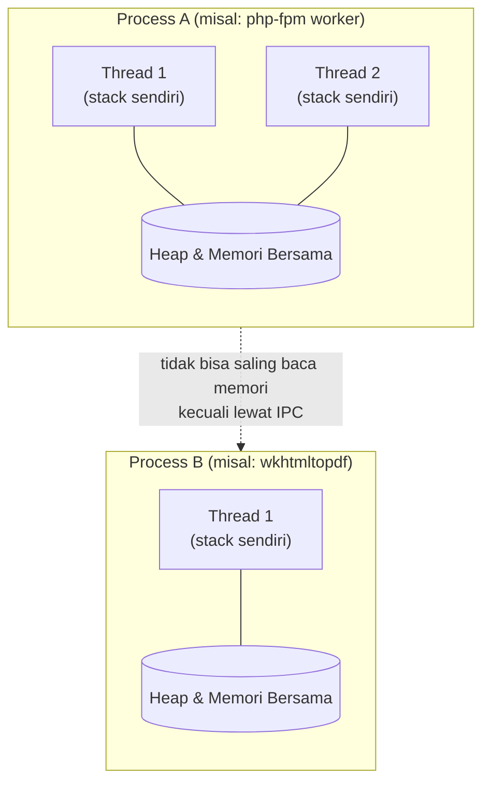

## TL;DR

Sebuah **process** adalah **wadah**: ia memiliki ruang memori sendiri, file descriptor table sendiri, dan batas isolasi yang dijaga sistem operasi, tapi ia sendiri tidak mengeksekusi apa pun. Yang mengeksekusi adalah **thread**, unit yang dijadwalkan CPU dan punya program counter sendiri — itulah sebabnya setiap process wajib berisi minimal satu thread. Semua thread dalam satu process berbagi wadah yang sama (heap, file descriptor), meski masing-masing punya stack sendiri.

**Goroutine** berada di kategori yang sama dengan thread, yaitu unit eksekusi, bukan wadah seperti process. Bedanya hanya pada siapa yang menjadwalkannya: thread dijadwalkan kernel, goroutine dijadwalkan runtime Go di atas sekumpulan kecil OS thread. Kesalahan kategori ini akar dari dua kesalahan desain yang umum: mengira goroutine memberi isolasi seperti process, atau mengira process semurah goroutine untuk dibuat. Isolasi adalah properti wadah, jadi goroutine yang bukan wadah tidak mewarisinya. Process baru juga jauh lebih mahal untuk dibuat daripada menambah satu unit eksekusi ke wadah yang sudah ada.

## The Problem

Bayangkan salah satu dari 13 aplikasi legal-services yang kamu koordinasikan perlu mengubah dokumen hasil upload jadi PDF berstempel, dengan memanggil binary eksternal seperti `wkhtmltopdf` lewat `os/exec` untuk setiap dokumen yang masuk. Saat volume rendah, ini bekerja baik. Begitu volume naik — katakanlah 200 dokumen per menit saat musim pelaporan — server tiba-tiba kehabisan memori dan menjadi sangat lambat, padahal CPU tidak terlihat penuh.

Yang terjadi: setiap pemanggilan `os/exec.Command` membuat **process** baru di level OS — lengkap dengan ruang alamat memori sendiri, file descriptor table sendiri, dan overhead setup yang tidak kecil. Ini sangat berbeda dari membuat goroutine baru di Go, yang biayanya jauh lebih kecil karena tidak melibatkan pembuatan process OS sama sekali. Engineer yang tidak membedakan keduanya secara sadar akan salah memodelkan biaya: mengira "menjalankan 1000 pekerjaan paralel" itu satu jenis biaya yang sama, padahal 1000 goroutine dan 1000 process adalah dua dunia yang berbeda jauh.

Di sisi lain, ada juga kesalahan sebaliknya: mengira karena goroutine "murah", goroutine juga aman dari saling merusak. Sebuah panic yang tidak di-recover di satu goroutine bisa mematikan **seluruh process** Go-mu — termasuk semua goroutine lain yang sedang melayani user lain saat itu. Process memberi isolasi; thread dan goroutine di dalam process yang sama tidak.

## Intuition

Bayangkan sebuah process seperti **gedung kantor dengan lemari arsipnya sendiri yang terkunci**. Setiap gedung punya alamat sendiri, lemari arsip sendiri (memori), dan kalau satu gedung terbakar, gedung sebelah tidak ikut terbakar. Thread di dalam satu process seperti **karyawan-karyawan di dalam satu gedung yang sama** — mereka berbagi lemari arsip yang sama (bisa saling baca dan tulis dokumen yang sama), tapi masing-masing punya meja kerja sendiri (stack) dan daftar tugas sendiri (program counter).

Analogi ini bocor di dua tempat. Pertama, membuat gedung baru (process baru) di dunia nyata butuh waktu bertahun-tahun; di OS modern, `fork()` memakai *copy-on-write* sehingga membuat process baru jauh lebih cepat dari intuisi "menyalin seluruh gedung", meski tetap jauh lebih mahal dari membuat thread. Kedua, goroutine di Go tidak persis sama dengan "karyawan" dalam analogi ini — ribuan goroutine dijadwalkan secara kooperatif oleh runtime Go di atas segelintir OS thread saja (lihat [[../50 Concurrency and Performance/Goroutine Scheduler (GMP)|Goroutine Scheduler (GMP)]]), jadi goroutine lebih mirip "daftar tugas yang sangat ringan" yang dibagi-bagi ke karyawan yang jumlahnya jauh lebih sedikit dari jumlah tugasnya.

## How It Works

Sistem operasi mengelola dua hal yang sering disamakan padahal kategorinya berbeda:

- **Process — wadah, bukan pelaksana.** Ia memiliki virtual address space sendiri (lihat [[Memory Layout - Stack vs Heap]]) dan file descriptor table sendiri (lihat [[Syscalls and File Descriptors]]). Ia tidak dijadwalkan CPU dan tidak mengeksekusi instruksi apa pun; karena itulah ia harus berisi minimal satu thread. Process lain tidak bisa membaca memorinya secara langsung — komunikasi butuh mekanisme eksplisit seperti pipe, socket, atau shared memory.
- **Thread — pelaksana.** Inilah yang dijadwalkan CPU dan benar-benar menjalankan kode. Semua thread dalam satu process memakai wadah yang sama (heap, kode program, file descriptor), tapi masing-masing punya stack dan program counter sendiri.

Bedanya bisa diringkas jadi satu kalimat: **process menentukan apa yang bisa disentuh, thread menentukan apa yang sedang dikerjakan.**



Diagram ini menunjukkan bahwa thread dalam satu process (T1, T2 di Process A) berbagi satu heap yang sama, sementara dua process berbeda (A dan B) sepenuhnya terisolasi kecuali mereka sengaja membuka kanal komunikasi.

Go menambah satu level di atas ini: **goroutine**. Goroutine bukan thread OS — ia adalah struct ringan yang dikelola runtime Go, dijadwalkan ke atas OS thread lewat model GMP (Goroutine, Machine/OS thread, Processor). Satu process Go bisa punya jutaan goroutine berjalan di atas hanya beberapa OS thread. Detail penjadwalannya dibahas penuh di [[../50 Concurrency and Performance/Goroutine Scheduler (GMP)|Goroutine Scheduler (GMP)]] — di sini cukup dipahami bahwa goroutine mewarisi model "berbagi memori" dari thread, bukan model "terisolasi" dari process.

## In Go

Versi naif: memproses banyak dokumen dengan men-spawn satu OS process per dokumen lewat `os/exec`.

```go
// Naif: satu OS process baru untuk setiap dokumen.
// Setiap pemanggilan ini membuat address space baru di level OS —
// mahal kalau jumlah dokumennya ratusan per menit.
func convertNaif(ctx context.Context, paths []string) error {
    for _, path := range paths {
        cmd := exec.CommandContext(ctx, "wkhtmltopdf", path, path+".pdf")
        if err := cmd.Run(); err != nil {
            return fmt.Errorf("convert %s: %w", path, err)
        }
    }
    return nil
}
```

Versi production: kalau pekerjaannya sebenarnya bisa dilakukan in-process (bukan memanggil binary eksternal), pindahkan ke goroutine dengan batas concurrency yang jelas, bukan satu process OS per unit kerja.

```go
// Production: kerja dibagi ke goroutine dalam SATU process Go,
// bukan satu process OS per dokumen. errgroup membatasi jumlah
// goroutine aktif sekaligus dan mengumpulkan error pertama yang terjadi.
func convertConcurrent(ctx context.Context, paths []string, maxWorkers int) error {
    g, ctx := errgroup.WithContext(ctx)
    sem := make(chan struct{}, maxWorkers)

    for _, path := range paths {
        path := path // hindari capture variable loop yang salah
        sem <- struct{}{}
        g.Go(func() error {
            defer func() { <-sem }()
            if err := convertOneDocument(ctx, path); err != nil {
                return fmt.Errorf("convert %s: %w", path, err)
            }
            return nil
        })
    }
    return g.Wait()
}
```

Yang berubah: `convertConcurrent` tidak membuat satu OS process baru per dokumen — semua goroutine berjalan di dalam satu process Go yang sama, berbagi heap yang sama, dijadwalkan runtime Go di atas OS thread yang jumlahnya jauh lebih sedikit dari jumlah goroutine. Biayanya jauh lebih murah, tapi sebagai gantinya kamu kehilangan isolasi: kalau `convertOneDocument` memicu panic yang tidak ditangkap, ia bisa mematikan seluruh process — beda dengan versi `os/exec` di mana satu `wkhtmltopdf` yang crash tidak akan mematikan binary Go-mu sendiri. `errgroup` dibahas lebih dalam di [[../50 Concurrency and Performance/errgroup|errgroup]].

## In His Stack

**PHP-FPM (Yii1/Yii2)** memakai model process-per-worker: setiap worker adalah OS process terpisah dengan memori sendiri, dikelola oleh FPM master process. Ini kenapa satu request PHP yang crash tidak mematikan request lain yang sedang diproses worker lain — isolasinya datang gratis dari model process, bukan dari disiplin kode. Trade-off-nya: setiap worker butuh memori sendiri, jadi jumlah request konkuren yang bisa dilayani terbatas oleh RAM dibagi ukuran memori per worker.

**MariaDB (InnoDB)** secara tradisional memakai model satu thread per koneksi di sisi server — ini salah satu alasan `max_connections` dan connection pooling (lihat [[../40 Databases/Connection Pooling|Connection Pooling]]) penting: setiap koneksi baru yang dibuka aplikasi berarti thread baru yang harus dikelola MariaDB.

**Kubernetes** pada dasarnya menjalankan container, dan container adalah process (atau sekumpulan process) yang diisolasi dari process lain di host yang sama lewat namespace dan cgroup Linux — bukan mekanisme isolasi baru, hanya pembungkus di atas primitif process yang sudah dijelaskan di atas.

## Trade-offs and When Not To Use It

Pakai **process terpisah** ketika kamu butuh isolasi kegagalan yang sungguhan — memanggil binary pihak ketiga yang tidak kamu percaya stabil (converter dokumen, tool image processing), atau menjalankan kode yang secara sengaja perlu sandbox terpisah dari proses utama. Biayanya: overhead pembuatan process, dan komunikasi antar process butuh mekanisme eksplisit (pipe, socket) yang lebih rumit dari sekadar berbagi variabel.

Pakai **goroutine (thread ringan dalam satu process)** ketika kerjanya memang bagian dari logika aplikasimu sendiri dan kamu butuh concurrency murah dalam jumlah besar. Biayanya: tidak ada isolasi kegagalan otomatis — satu goroutine yang panic tanpa `recover` mematikan seluruh binary, dan data yang dibagi antar goroutine butuh sinkronisasi eksplisit (lihat [[../50 Concurrency and Performance/The Sync Package|The Sync Package]]) atau race condition akan muncul diam-diam.

Jangan menyamakan keduanya saat menghitung kapasitas: "server bisa menangani 10.000 goroutine bersamaan" tidak berarti "server bisa menangani 10.000 process bersamaan" — jaraknya bisa dua sampai tiga orde besaran, tergantung beban kerja masing-masing unit.

## Common Mistakes

> [!warning] Jebakan
> Mengira goroutine memberi isolasi kegagalan seperti process. Satu goroutine yang panic tanpa `recover` akan mematikan seluruh process Go-mu, termasuk semua goroutine lain yang sedang melayani user lain saat itu juga.

> [!warning] Jebakan
> Men-spawn satu OS process (lewat `os/exec`, atau lebih buruk, membuka koneksi database baru di setiap request tanpa pool) untuk setiap unit kerja kecil, padahal pekerjaan itu bisa dilakukan in-process dengan goroutine yang jauh lebih murah.

> [!warning] Jebakan
> Berasumsi dua goroutine yang berbagi variabel otomatis aman karena "Go menangani concurrency". Go memberi *alat* untuk menangani concurrency dengan aman (channel, mutex) — ia tidak menjamin keamanan itu terjadi otomatis tanpa kamu memakai alat itu dengan benar.

## Exercises

1. Sebutkan dua hal yang dibagi bersama oleh thread-thread dalam satu process, dan dua hal yang tidak.
2. Kenapa `os/exec.Command` di Go jauh lebih mahal dibanding `go func() {...}()`?
3. Sebuah goroutine di service Go-mu memanggil `panic("unexpected nil")` tanpa `recover`. Apa yang terjadi pada goroutine lain yang sedang berjalan di process yang sama saat itu?
4. Desain terbuka: salah satu dari 13 aplikasi legal-services memanggil `libreoffice --headless` lewat `os/exec` untuk mengonversi dokumen, dan ini menjadi bottleneck saat volume naik. Rancang ulang arsitekturnya — pertimbangkan: apakah proses konversi bisa dipindah ke library in-process, apakah tetap harus jadi process terpisah demi isolasi kegagalan, dan bagaimana membatasi jumlah process/goroutine konkuren supaya server tidak kehabisan memori atau file descriptor.

> [!success]- Kunci jawaban
> Kalau `libreoffice` memang harus tetap jalan sebagai binary eksternal (karena tidak ada library Go yang setara), pertahankan sebagai process terpisah — tapi batasi jumlah process konkuren lewat semaphore (channel buffered) seperti pola `errgroup` + `sem` di atas, jangan biarkan jumlah process tumbuh tak terbatas mengikuti jumlah request masuk. Kalau ada alternatif in-process (misalnya library Go untuk generate PDF langsung dari template, tanpa binary eksternal), pindahkan ke goroutine dengan worker pool — jauh lebih murah, tapi pastikan setiap goroutine punya `recover` di titik masuknya supaya satu dokumen yang gagal tidak mematikan seluruh service yang sedang melayani permintaan lain.

## Self-Check

- Apa yang dibagi bersama oleh thread dalam satu process, dan apa yang tidak?
- Kenapa membuat process baru jauh lebih mahal daripada membuat goroutine baru?
- Apa akibatnya kalau satu goroutine panic tanpa `recover`?
- Sebutkan satu alasan valid untuk tetap memilih process terpisah alih-alih goroutine.

## Connected Notes

- [[Memory Layout - Stack vs Heap]] — kelanjutan langsung: bagaimana persisnya memori yang "dibagi" antar thread itu terstruktur di dalam satu process.
- [[Blocking vs Non-Blocking IO]] — thread yang blocking pada I/O adalah alasan utama kenapa model concurrency berbasis thread murni sulit diskalakan, dan kenapa Go memilih goroutine.
- [[../50 Concurrency and Performance/Goroutine Scheduler (GMP)|Goroutine Scheduler (GMP)]] — detail penuh bagaimana runtime Go menjadwalkan goroutine di atas OS thread yang disebut sekilas di note ini.
- [[../50 Concurrency and Performance/Goroutine Leaks|Goroutine Leaks]] — konsekuensi lain dari goroutine yang murah dibuat: mereka juga mudah lupa dihentikan.
- [[../92 Tools/Docker|Docker]] — container adalah aplikasi praktis dari isolasi process yang dijelaskan di note ini, lewat namespace dan cgroup Linux.

## Further Reading

- Dokumentasi resmi package `runtime` di Go (`pkg.go.dev/runtime`) untuk detail bagaimana goroutine dan OS thread berinteraksi.
- Buku *Operating Systems: Three Easy Pieces* (Remzi H. Arpaci-Dusseau & Andrea C. Arpaci-Dusseau), bab tentang Processes — tersedia gratis daring, penjelasan paling jernih tentang topik ini yang penulis ketahui.

## Catatan Saya

*Tulis di sini contoh nyata di kantor tempat kamu (atau tim lain) pernah salah menghitung biaya antara menjalankan sesuatu sebagai process terpisah vs sebagai goroutine.*
