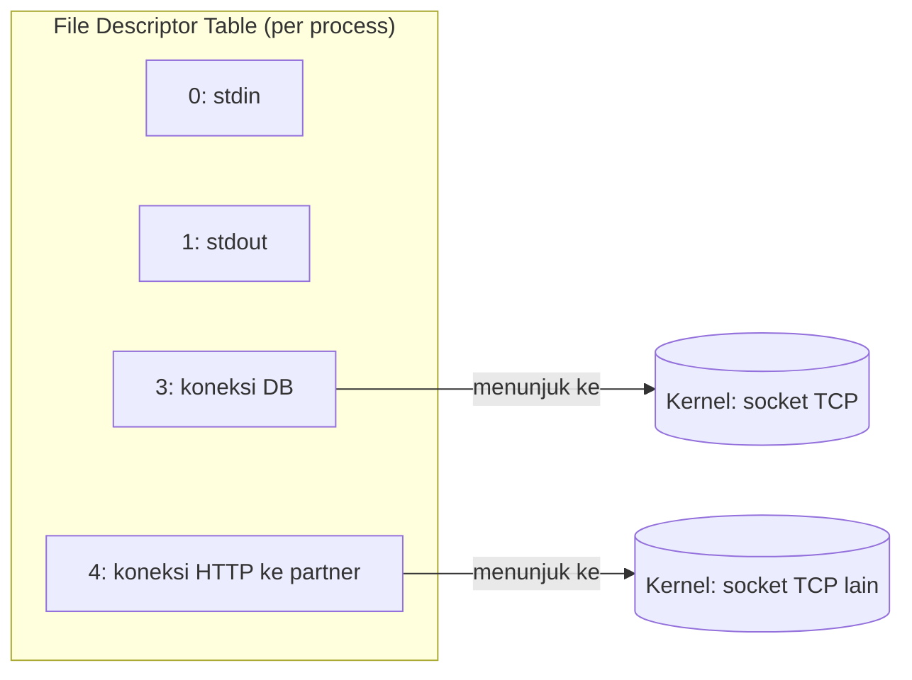

## TL;DR

Sebuah **syscall** (system call) adalah satu-satunya cara program di user-space meminta kernel melakukan sesuatu yang butuh hak akses lebih tinggi — membuka file, membaca dari socket, membuat process baru. Sebuah **file descriptor** adalah angka kecil yang dipegang process-mu, menunjuk ke satu resource yang sedang dibuka kernel atas namamu — bisa berupa file, socket TCP, pipe, atau device apa pun. Setiap koneksi database yang kamu buka, setiap request HTTP yang kamu terima, setiap file yang kamu baca, semuanya diam-diam adalah satu file descriptor yang harus ditutup lagi — dan lupa menutupnya adalah salah satu penyebab paling umum server yang "tiba-tiba berhenti menerima koneksi baru" tanpa error yang jelas di kode.

## The Problem

Bayangkan sebuah service Go yang memanggil API partner lewat `http.Get`, memproses response-nya, tapi lupa memanggil `resp.Body.Close()` di salah satu jalur error yang jarang terjadi. Di testing, ini tidak pernah kelihatan — jalur error itu jarang terpicu, dan bahkan kalau terpicu, satu atau dua file descriptor yang bocor tidak terasa apa-apa. Tapi di production, dengan traffic yang berjalan berhari-hari, jalur error itu terpicu ribuan kali — dan satu per satu, file descriptor yang tidak pernah ditutup menumpuk.

Suatu hari, service ini tiba-tiba mulai gagal menerima koneksi baru sama sekali, dengan error yang sama sekali tidak menyebut kata "memory" atau "koneksi": `too many open files`. Tidak ada yang berubah di kode hari itu — masalahnya sudah menumpuk pelan-pelan selama berhari-hari, sampai jumlah file descriptor yang bocor melampaui batas yang diizinkan OS untuk satu process (`ulimit -n`). Tanpa memahami bahwa koneksi jaringan, file, dan bahkan pipe semuanya "memakan" slot file descriptor yang sama dan terbatas, bug seperti ini nyaris mustahil didiagnosis dari gejalanya saja.

## Intuition

Bayangkan file descriptor seperti **nomor tiket di tempat penitipan jaket**. Kamu tidak memegang jaketmu sendiri — kamu memegang secarik kertas bernomor, dan petugas (kernel) yang sebenarnya menyimpan jaketnya. Setiap kali kamu ingin melakukan sesuatu pada jaketmu (mengambil, menitip ulang), kamu tidak melakukannya sendiri — kamu meminta petugas melakukannya lewat nomor tiketmu. Permintaan ke petugas itulah **syscall**.

Analogi ini bocor di satu titik yang justru paling penting untuk dipahami: kalau kamu kehilangan tiket penitipan jaket sungguhan, yang rugi hanya kamu, dan hanya satu jaket. Kalau sebuah program lupa "mengembalikan tiket" (lupa memanggil `Close()`), tiket itu tidak hilang begitu saja — ia tetap dipegang kernel sebagai slot yang terpakai, menumpuk terus setiap kali bug yang sama terulang, sampai suatu titik **seluruh process** kehabisan slot dan tidak bisa membuka apa pun lagi — file baru, koneksi baru, bahkan pipe internal sekalipun.

## How It Works

Setiap process punya **file descriptor table** — daftar angka kecil (dimulai dari 0: `stdin`, 1: `stdout`, 2: `stderr`, lalu seterusnya untuk setiap file/socket yang dibuka) yang masing-masing menunjuk ke entri di tabel file kernel, yang pada gilirannya menunjuk ke resource sesungguhnya (inode file, socket TCP, pipe). Program tidak pernah menyentuh resource itu langsung — semua operasi (`read`, `write`, `close`) dilakukan lewat syscall yang menyebut nomor file descriptor-nya.



Diagram ini menunjukkan bahwa file descriptor hanyalah nomor referensi — resource sesungguhnya (socket, file) hidup di kernel, dan process hanya memegang "tiket" untuk merujuknya. Setiap OS punya batas jumlah file descriptor yang boleh dipegang satu process sekaligus (dikonfigurasi lewat `ulimit -n` di Linux) dan batas total di seluruh sistem — begitu batas itu tercapai, syscall untuk membuka resource baru (`open`, `socket`, `accept`) akan gagal, apa pun jenis resource yang diminta.

## In Go

Setiap `os.File`, `net.Conn`, dan `http.Response.Body` di Go membungkus satu file descriptor. `sql.Rows` menahan satu koneksi dari pool selama belum ditutup, dan koneksi itulah yang memegang file descriptor — efek praktisnya sama: `rows` yang lupa ditutup menahan resource. Semuanya wajib ditutup secara eksplisit — garbage collector Go **tidak menjanjikan** penutupan tepat waktu, karena GC berjalan berdasarkan tekanan memori, bukan berdasarkan jumlah file descriptor yang terpakai.

```go
// Naif: response body tidak selalu ditutup — kalau io.ReadAll gagal,
// resp.Body.Close() tidak pernah terpanggil, dan file descriptor bocor.
func fetchNaif(url string) ([]byte, error) {
    resp, err := http.Get(url)
    if err != nil {
        return nil, fmt.Errorf("get %s: %w", url, err)
    }
    body, err := io.ReadAll(resp.Body)
    if err != nil {
        return nil, fmt.Errorf("read body: %w", err) // bocor: resp.Body tidak ditutup
    }
    resp.Body.Close()
    return body, nil
}

// Production: defer memastikan Close() terpanggil di SEMUA jalur keluar,
// termasuk jalur error yang jarang terjadi.
func fetchAman(ctx context.Context, url string) ([]byte, error) {
    req, err := http.NewRequestWithContext(ctx, http.MethodGet, url, nil)
    if err != nil {
        return nil, fmt.Errorf("build request: %w", err)
    }

    resp, err := http.DefaultClient.Do(req)
    if err != nil {
        return nil, fmt.Errorf("do request %s: %w", url, err)
    }
    defer resp.Body.Close() // dijamin terpanggil apa pun yang terjadi setelah ini

    body, err := io.ReadAll(resp.Body)
    if err != nil {
        return nil, fmt.Errorf("read body: %w", err)
    }
    return body, nil
}
```

Perubahan intinya: `defer resp.Body.Close()` diletakkan **segera setelah** memastikan `resp` tidak nil, sebelum baris apa pun yang mungkin gagal — sehingga file descriptor di baliknya selalu dilepas kembali ke kernel, apa pun yang terjadi setelahnya. Pola yang sama berlaku untuk `sql.Rows` dari `database/sql` — lihat [[../40 Databases/database-sql and sqlx|database-sql and sqlx]].

## In His Stack

**PHP (Yii1/Yii2)** juga memakai file descriptor untuk setiap koneksi database, file yang dibuka `fopen()`, dan cURL handle — tapi karena model process-per-request PHP-FPM (lihat [[Processes vs Threads]]), file descriptor yang bocor di satu request biasanya "dibersihkan otomatis" begitu worker process itu selesai dan PHP membersihkan resource-nya di akhir request. Ini kenapa bug seperti ini jarang terlihat di PHP tradisional tapi jauh lebih berbahaya di service Go yang long-running — satu process Go yang sama melayani jutaan request sepanjang hidupnya, jadi kebocoran kecil yang "dimaafkan" di PHP menumpuk tanpa henti di Go.

**MariaDB** di sisi server juga memakai satu file descriptor per koneksi klien yang terbuka — ini salah satu alasan `max_connections` di MariaDB dan connection pooling di sisi aplikasi (lihat [[../40 Databases/Connection Pooling|Connection Pooling]]) sama-sama penting: keduanya pada akhirnya membatasi jumlah file descriptor yang dipegang, baik di sisi klien maupun sisi server database.

## Trade-offs and When Not To Use It

Ini bukan topik yang punya "kapan tidak dipakai" seperti pola desain — syscall dan file descriptor adalah lapisan wajib yang tidak bisa dihindari. Yang bisa dipertimbangkan adalah **konfigurasi batasnya**: default `ulimit -n` di banyak distribusi Linux (umumnya di kisaran ribuan rendah) sering kali terlalu kecil untuk service dengan concurrency tinggi yang menahan banyak koneksi long-lived (WebSocket, koneksi database yang di-pool besar, tracing eksporter) — nilai spesifiknya bervariasi antar distribusi dan konfigurasi container, jadi selalu periksa langsung di environment production, jangan asumsikan dari default lokal.

> [!question] Perlu diverifikasi
> Klaim: nilai default `ulimit -n` pada distribusi Linux modern.
> Kenapa ragu: nilai ini berbeda-beda antar distro, versi kernel, dan konfigurasi container runtime, dan berubah dari waktu ke waktu.
> Cara verifikasi: jalankan `ulimit -n` langsung di environment production/staging yang relevan, jangan mengandalkan angka dari memori atau dari mesin lokal.

## Common Mistakes

> [!warning] Jebakan
> Lupa memanggil `Close()` di jalur error yang jarang terjadi. Pola paling aman adalah selalu memakai `defer resp.Body.Close()` (atau `rows.Close()`, `file.Close()`) **segera setelah** resource berhasil dibuka, bukan di akhir function setelah semua pemrosesan.

> [!warning] Jebakan
> Berasumsi garbage collector Go akan menutup file descriptor yang lupa ditutup, karena "kan ada GC". `os.File` dan `net.Conn` memang punya finalizer sebagai jaring pengaman terakhir, tapi finalizer berjalan berdasarkan tekanan memori dan waktunya tidak bisa diprediksi — pada saat itu terpicu, file descriptor mungkin sudah bocor cukup lama untuk menyebabkan masalah. `http.Response.Body` **tidak** punya jaring pengaman semacam itu sama sekali — justru kasus paling umum di note ini adalah yang paling tidak terlindungi kalau lupa ditutup.

> [!warning] Jebakan
> Menaikkan `ulimit -n` sebagai solusi pertama begitu melihat error `too many open files`, tanpa memeriksa dulu apakah ada kebocoran resource yang sebenarnya. Menaikkan limit menunda gejala, bukan menghilangkan bug — kebocoran yang sama akan kembali muncul di volume yang lebih tinggi.

## Exercises

1. Jelaskan hubungan antara file descriptor, file descriptor table, dan syscall dengan kata-katamu sendiri.
2. Kenapa kode Go yang lupa memanggil `Close()` pada `http.Response.Body` tidak langsung terlihat sebagai bug di testing?
3. Kenapa `defer resp.Body.Close()` sebaiknya diletakkan segera setelah request berhasil, bukan di akhir function?
4. Desain terbuka: sebuah service Go yang menangani upload dokumen dari 13 aplikasi legal-services mulai gagal menerima koneksi baru setiap beberapa hari sekali dengan error `too many open files`, lalu pulih sendiri setelah di-restart. Rancang proses investigasi lengkap untuk menemukan sumber kebocoran tanpa harus menebak-nebak, dan langkah mitigasi sementara sebelum akar masalahnya benar-benar diperbaiki.

> [!success]- Kunci jawaban
> Investigasi: di Linux, jalankan `lsof -p <pid>` secara berkala pada process yang dicurigai untuk melihat daftar file descriptor yang terbuka dan jenisnya (file, socket, pipe) — kalau jumlahnya terus bertambah seiring waktu tanpa pernah turun meski traffic stabil, itu tanda kebocoran nyata. Bandingkan dengan jumlah request yang diproses untuk menemukan pola (apakah kebocoran sebanding dengan jumlah request ke endpoint tertentu). Setelah endpoint yang dicurigai ditemukan, periksa setiap jalur kode di endpoint itu yang membuka `os.File`, `net.Conn`, `http.Response.Body`, atau `sql.Rows` — pastikan `defer ....Close()` ada di semua jalur, termasuk jalur error. Mitigasi sementara sebelum root cause diperbaiki: restart terjadwal (bukan solusi permanen, tapi mengurangi dampak) dan menaikkan `ulimit -n` untuk memberi waktu lebih sebelum limit tercapai — keduanya hanya menunda, bukan memperbaiki.

## Self-Check

- Apa itu file descriptor, dan resource apa saja yang bisa direpresentasikan olehnya?
- Kenapa syscall dibutuhkan untuk mengoperasikan file descriptor?
- Kenapa garbage collector Go bukan jaring pengaman yang bisa diandalkan untuk menutup file descriptor yang bocor?
- Alat apa yang bisa dipakai di Linux untuk melihat file descriptor yang sedang terbuka pada sebuah process?

## Connected Notes

- [[Processes vs Threads]] — file descriptor table adalah bagian dari state yang dipegang setiap process, dibahas di note ini sebagai kelanjutannya.
- [[Blocking vs Non-Blocking IO]] — syscall `read()`/`write()` pada file descriptor adalah tempat persis di mana perbedaan blocking vs non-blocking terjadi.
- [[How An OS Handles Network Connections]] — koneksi jaringan yang dibahas di note itu juga direpresentasikan sebagai file descriptor di sisi kernel.
- [[../40 Databases/Connection Pooling|Connection Pooling]] — alasan utama connection pooling penting: setiap koneksi database yang tidak dikembalikan ke pool adalah file descriptor yang tertahan.
- [[../70 Infrastructure and Delivery/Linux for Backend Engineers|Linux for Backend Engineers]] — perintah seperti `lsof` dan `ulimit` yang disebut di note ini dibahas lebih lengkap di sana.

## Further Reading

- Man page `open(2)`, `close(2)`, dan `ulimit(3)` di sistem Linux mana pun (`man 2 open`) — sumber kebenaran paling akurat karena spesifik ke versi kernel yang terpasang.

## Catatan Saya

*Tulis di sini kalau kamu pernah menemukan error "too many open files" di production, dan bagaimana akhirnya ditemukan sumbernya.*
