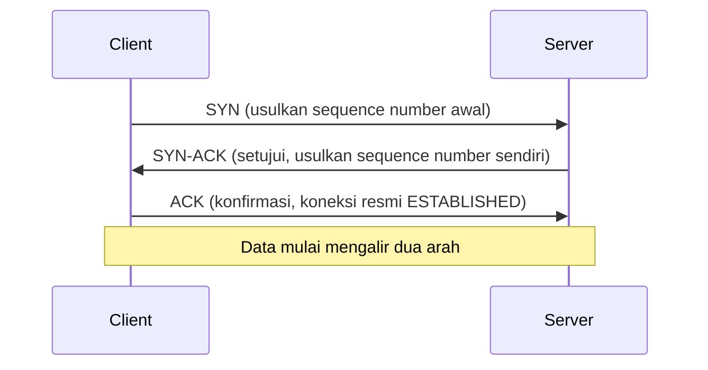
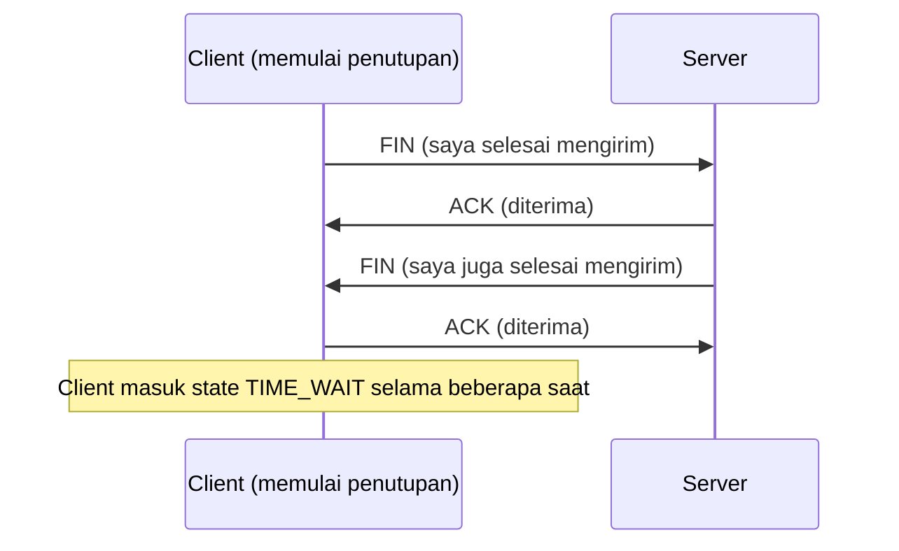

## TL;DR

Sebelum satu byte data pun dikirim, TCP mengharuskan kedua sisi menyepakati koneksi lewat **three-way handshake**: SYN dari client, SYN-ACK dari server, ACK dari client — tiga pesan untuk menyinkronkan nomor urut (sequence number) yang akan dipakai menjaga data tetap berurutan dan lengkap. Menutup koneksi juga bukan proses sekali langkah — masing-masing sisi harus mengirim dan mengonfirmasi `FIN` sendiri-sendiri, dan sisi yang **memulai** penutupan akan menahan socketnya dalam state `TIME_WAIT` selama beberapa saat sebagai jaring pengaman. Detail siklus hidup ini bukan trivia jaringan — ia menjelaskan langsung kenapa membuka koneksi baru untuk setiap request itu mahal, dan kenapa connection pooling ada.

## The Problem

Bayangkan sebuah service Go yang memanggil API partner ratusan kali per menit, tapi setiap pemanggilan membuat `http.Client{}` baru alih-alih memakai satu client yang dipakai ulang. Secara fungsional, kode ini bekerja — setiap request berhasil, response diterima dengan benar. Tapi setelah berjalan beberapa jam, service ini mulai gagal membuka koneksi baru sama sekali, dengan error yang membingungkan seperti "cannot assign requested address".

Yang terjadi: setiap `http.Client{}` baru berarti koneksi TCP baru yang dibuka dari sebuah *ephemeral port* di sisi client, dipakai sekali, lalu ditutup. Karena service inilah yang memulai penutupan koneksi (biasanya begitu, karena request-response selesai lebih dulu di sisi client), setiap koneksi yang ditutup meninggalkan socket dalam state `TIME_WAIT` selama beberapa waktu sebelum ephemeral port itu benar-benar bisa dipakai ulang. Dengan ratusan koneksi baru per menit dan tidak ada satu pun yang dipakai ulang, jumlah port yang "tertahan" di `TIME_WAIT` menumpuk lebih cepat dari kecepatan mereka dilepas kembali — sampai kehabisan ephemeral port yang tersedia untuk membuka koneksi baru sama sekali.

## Intuition

Bayangkan handshake TCP seperti **memulai panggilan telepon dengan sopan**: "Halo, bisa dengar saya?" (SYN) — "Ya, saya dengar, kamu dengar saya?" (SYN-ACK) — "Ya, saya dengar juga, ayo mulai bicara" (ACK). Baru setelah tiga langkah ini, percakapan sesungguhnya (data) dimulai. Menutup panggilan juga butuh kesepakatan dua arah: masing-masing pihak perlu bilang "saya sudah selesai bicara" (`FIN`) dan dikonfirmasi (`ACK`) — bukan sekadar salah satu pihak tiba-tiba memutus telepon.

Analogi ini bocor di bagian `TIME_WAIT`. Manusia yang menutup telepon tidak lantas "menahan telinganya" beberapa saat untuk berjaga-jaga siapa tahu ada gema susulan dari panggilan yang baru saja selesai. TCP melakukan persis itu: sisi yang memulai penutupan menahan socketnya dalam `TIME_WAIT` untuk memastikan packet yang terlambat atau terduplikasi dari koneksi lama tidak disalahartikan sebagai bagian dari koneksi baru yang mungkin memakai pasangan alamat/port yang sama persis.

## How It Works

**Membuka koneksi (three-way handshake):**



**Menutup koneksi:**



Sisi yang mengirim `FIN` pertama kali (dalam kebanyakan kasus request-response singkat, biasanya client, karena client tahu lebih dulu bahwa ia tidak akan mengirim data lagi) adalah sisi yang menahan socketnya di `TIME_WAIT`. Selama periode ini, pasangan alamat IP dan port itu tidak bisa dipakai untuk koneksi baru — ini yang menjadi masalah kalau koneksi baru dibuka dan ditutup dalam volume tinggi tanpa pernah dipakai ulang.

> [!question] Perlu diverifikasi
> Klaim: durasi standar `TIME_WAIT` sering disebut "2×MSL (Maximum Segment Lifetime)".
> Kenapa ragu: nilai MSL dan durasi efektif `TIME_WAIT` bisa dikonfigurasi berbeda antar OS dan bahkan antar versi kernel yang sama, jadi menyebut angka pasti berisiko salah untuk environment tertentu.
> Cara verifikasi: periksa parameter kernel terkait (di Linux, sekitar `net.ipv4.tcp_fin_timeout` dan dokumentasi TCP kernel yang sedang dipakai) langsung di server production yang relevan.

## In Go

`net/http` di Go sudah menyediakan connection pooling secara default lewat `http.Transport` — tapi hanya kalau kamu memakai ulang **client atau transport yang sama**, bukan membuat baru setiap kali.

```go
// Naif: http.Client baru dibuat setiap kali function ini dipanggil.
// Setiap panggilan membuka koneksi TCP baru dan menutupnya lagi —
// tidak ada connection reuse, TIME_WAIT menumpuk di sisi client.
func callPartnerNaif(ctx context.Context, url string) ([]byte, error) {
    client := &http.Client{Timeout: 5 * time.Second}
    req, err := http.NewRequestWithContext(ctx, http.MethodGet, url, nil)
    if err != nil {
        return nil, fmt.Errorf("build request: %w", err)
    }
    resp, err := client.Do(req)
    if err != nil {
        return nil, fmt.Errorf("call partner: %w", err)
    }
    defer resp.Body.Close()
    return io.ReadAll(resp.Body)
}

// Production: satu http.Client dipakai ulang lintas semua pemanggilan,
// dibuat sekali di level package/service, bukan per request.
var partnerClient = &http.Client{
    Timeout: 5 * time.Second,
    Transport: &http.Transport{
        MaxIdleConns:        100,
        MaxIdleConnsPerHost: 20, // koneksi idle ke host yang sama dipakai ulang
        IdleConnTimeout:     90 * time.Second,
    },
}

func callPartner(ctx context.Context, url string) ([]byte, error) {
    req, err := http.NewRequestWithContext(ctx, http.MethodGet, url, nil)
    if err != nil {
        return nil, fmt.Errorf("build request: %w", err)
    }
    resp, err := partnerClient.Do(req)
    if err != nil {
        return nil, fmt.Errorf("call partner: %w", err)
    }
    defer resp.Body.Close()
    return io.ReadAll(resp.Body)
}
```

Yang berubah: `partnerClient` dibuat satu kali dan dipakai ulang lintas semua pemanggilan `callPartner`. `http.Transport` di dalamnya secara otomatis mempertahankan koneksi TCP yang sudah dibuka (lewat HTTP keep-alive) dan memakainya ulang untuk request berikutnya ke host yang sama, alih-alih membuka-menutup koneksi baru setiap kali — inilah yang mencegah penumpukan `TIME_WAIT` dan kehabisan ephemeral port.

## In His Stack

**PHP-FPM (Yii1/Yii2)** secara struktural sulit memakai pola connection reuse yang sama untuk koneksi keluar (misalnya lewat cURL): setiap request PHP diproses oleh worker process yang umumnya berumur pendek per request, jadi koneksi keluar yang dibuka dalam satu request biasanya tidak bisa dipakai ulang oleh request PHP berikutnya kecuali memakai mekanisme tambahan seperti persistent connection cURL yang butuh konfigurasi eksplisit. Ini kontras dengan Go, di mana satu process yang sama hidup lama dan bisa mempertahankan connection pool sepanjang hidupnya.

**MariaDB** juga sepenuhnya berjalan di atas TCP (atau Unix socket lokal) dengan siklus hidup yang sama — inilah kenapa [[../40 Databases/Connection Pooling|Connection Pooling]] di sisi aplikasi begitu penting: membuka koneksi database baru untuk setiap query mengulang seluruh biaya handshake TCP (dan otentikasi MariaDB di atasnya) yang seharusnya cukup dilakukan sekali per koneksi yang dipakai berulang.

## Trade-offs and When Not To Use It

Connection reuse hampir selalu benar untuk service long-running yang memanggil host yang sama berulang kali — tidak ada alasan kuat untuk tidak memakainya. Yang perlu dipertimbangkan adalah **berapa lama** koneksi idle dipertahankan (`IdleConnTimeout`) dan **berapa banyak** koneksi idle yang disimpan (`MaxIdleConnsPerHost`): mempertahankan terlalu banyak koneksi idle ke host yang jarang dipanggil lagi memboroskan resource di kedua sisi (baik client maupun server yang harus tetap menjaga socket itu tetap hidup), sementara mempertahankan terlalu sedikit membuat manfaat pooling nyaris hilang karena koneksi terus-menerus dibuka ulang.

## Common Mistakes

> [!warning] Jebakan
> Membuat `http.Client{}` atau `http.Transport{}` baru di dalam function yang dipanggil berulang kali (misalnya di dalam handler HTTP atau di dalam loop), alih-alih membuatnya sekali di level package dan memakainya ulang. Ini meniadakan seluruh manfaat connection pooling yang sebenarnya sudah disediakan `net/http` secara default.

> [!warning] Jebakan
> Mengabaikan `resp.Body.Close()` (lihat [[Syscalls and File Descriptors]]) — kalau body tidak dibaca sampai habis dan ditutup, koneksi di baliknya tidak bisa dipakai ulang oleh `http.Transport` untuk request berikutnya, meski secara sintaks kode terlihat sudah "selesai".

> [!warning] Jebakan
> Panik melihat state `TIME_WAIT` di server production tanpa mengukur dulu apakah jumlahnya benar-benar berlebihan untuk volume traffic yang ada. `TIME_WAIT` dalam jumlah wajar adalah perilaku normal TCP, bukan tanda ada yang salah — masalah baru muncul saat jumlahnya melampaui kapasitas ephemeral port yang tersedia.

## Exercises

1. Sebutkan ketiga langkah dalam three-way handshake TCP dan apa yang disepakati di masing-masing langkah.
2. Kenapa sisi yang menutup koneksi lebih dulu adalah sisi yang menanggung state `TIME_WAIT`?
3. Kenapa membuat `http.Client{}` baru di setiap pemanggilan function menghilangkan manfaat connection pooling yang sudah disediakan Go secara default?
4. Desain terbuka: sebuah service Go yang menjadi jembatan integrasi ke lebih dari lima partner instansi pemerintah mulai mengalami error intermiten "cannot assign requested address" saat memanggil salah satu partner, tapi hanya di jam-jam sibuk. Rancang investigasi lengkap untuk memastikan ini benar soal ephemeral port/TIME_WAIT (bukan masalah lain seperti rate limit dari partner), dan rancang perbaikan arsitekturalnya.

> [!success]- Kunci jawaban
> Investigasi: di server yang mengalami masalah, jalankan `ss -s` atau `netstat -ant | grep TIME_WAIT | wc -l` saat jam sibuk untuk melihat apakah jumlah socket di `TIME_WAIT` memang tinggi dan mendekati batas range ephemeral port yang dikonfigurasi OS. Cross-check dengan kode: apakah pemanggilan ke partner itu memakai `http.Client` yang dipakai ulang, atau dibuat baru setiap request (bug yang dijelaskan di note ini). Kalau terbukti connection pooling tidak dipakai dengan benar, perbaikannya adalah memastikan satu `http.Client`/`http.Transport` per partner dipakai ulang lintas seluruh service (bukan dibuat ulang di setiap goroutine atau request), dengan `MaxIdleConnsPerHost` yang disesuaikan volume panggilan ke partner tersebut. Kalau connection pooling sudah benar dan masalah tetap muncul di volume sangat tinggi, pertimbangkan memperluas range ephemeral port di kernel (`net.ipv4.ip_local_port_range`) sebagai mitigasi tambahan, bukan solusi utama.

## Self-Check

- Sebutkan tiga langkah three-way handshake TCP secara berurutan.
- Kenapa menutup koneksi TCP butuh lebih dari satu pesan dari masing-masing sisi?
- Apa itu `TIME_WAIT`, dan kenapa ia ada?
- Kenapa memakai ulang `http.Client` yang sama penting untuk mencegah kehabisan ephemeral port?

## Connected Notes

- [[The TCP-IP Model]] — prasyarat: handshake dan siklus hidup di note ini terjadi tepat di lapisan Transport pada model itu.
- [[How An OS Handles Network Connections]] — accept queue yang dibahas di note itu adalah tempat koneksi ini "mendarat" di sisi server setelah handshake selesai.
- [[TCP vs UDP]] — kontras langsung: UDP tidak punya handshake maupun konsep koneksi sama sekali.
- [[../40 Databases/Connection Pooling|Connection Pooling]] — penerapan langsung dari pemahaman siklus hidup TCP ini untuk koneksi database.
- [[../30 APIs and Web/Load Balancing and Reverse Proxies|Load Balancing and Reverse Proxies]] — load balancer sering menjadi pihak yang mengelola dan memakai ulang koneksi TCP jangka panjang ke backend atas nama banyak client.

## Further Reading

- RFC 9293 (*Transmission Control Protocol (TCP)*), spesifikasi resmi terbaru yang menggantikan RFC 793, untuk detail state machine TCP secara lengkap.

## Catatan Saya

*Tulis di sini kalau kamu pernah menemukan (atau mencurigai) masalah ephemeral port/TIME_WAIT di service yang kamu tangani, dan bagaimana akhirnya dikonfirmasi atau disingkirkan sebagai penyebab.*
