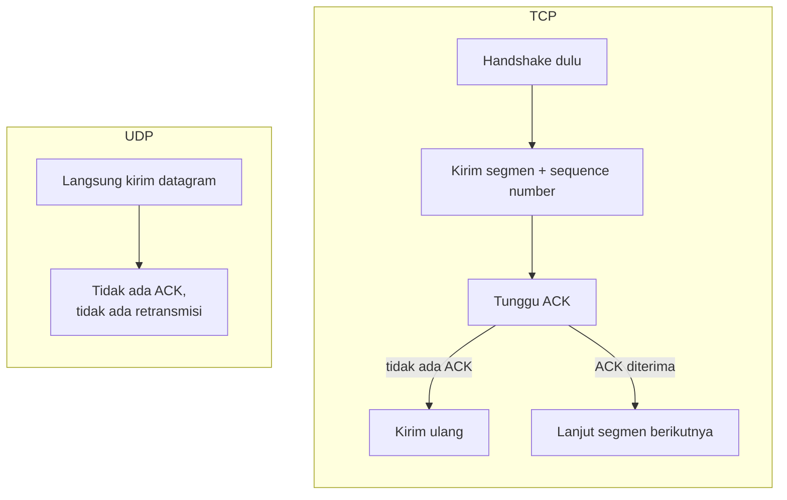

## TL;DR

**TCP** menjamin data sampai lengkap, berurutan, dan tanpa duplikasi — dengan harga berupa handshake di awal (lihat [[TCP Handshake and Connection Lifecycle]]), acknowledgment untuk setiap segmen, dan retransmisi otomatis kalau ada yang hilang. **UDP** tidak menjamin apa pun dari itu — ia hanya melempar datagram ke jaringan dan berharap sampai, tanpa koneksi, tanpa acknowledgment, tanpa retransmisi. Trade-off-nya bukan "TCP selalu lebih aman jadi selalu dipakai" — UDP dipilih justru ketika overhead jaminan itu lebih mahal daripada manfaatnya, misalnya saat data yang sedikit hilang masih bisa diterima sistem, atau saat data terbaru selalu lebih berharga daripada data lama yang terlambat.

## The Problem

Bayangkan sebuah tim membangun sistem pemantauan status perangkat lapangan yang mengirim update lokasi petugas pengantar dokumen legal secara berkala, dan memilih UDP untuk pengiriman update ini karena "lebih cepat dan overhead-nya kecil". Di testing dengan jaringan lokal yang stabil, semua update sampai sempurna. Di lapangan sungguhan — dengan koneksi seluler yang naik turun — sebagian update lokasi hilang begitu saja, dan yang lebih membingungkan, sebagian update tiba **tidak berurutan**, membuat dashboard sempat menampilkan petugas seolah "mundur" ke lokasi sebelumnya sebelum akhirnya menampilkan lokasi yang benar.

Masalah ini bukan bug di kode aplikasi — ini adalah properti dasar UDP yang tidak dipahami saat memilihnya. UDP tidak menjamin urutan maupun kedatangan sama sekali; setiap datagram diperlakukan independen oleh jaringan, dan bisa saja ada yang mengambil rute berbeda dan tiba lebih dulu atau lebih lambat, atau tidak tiba sama sekali. Kalau update lokasi itu ternyata dipakai juga untuk keperluan audit siapa mengantar dokumen ke mana dan kapan, kehilangan sebagian update secara diam-diam adalah masalah yang jauh lebih serius daripada sekadar "dashboard sedikit tidak akurat".

## Intuition

Bayangkan TCP seperti **mengirim paket lewat pos tercatat dengan tanda terima** — pengirim tahu persis kapan paket diterima, dan kalau paket hilang di jalan, sistem pos akan mengirim ulang secara otomatis sampai benar-benar sampai, serta memastikan urutan pengiriman terjaga. UDP lebih seperti **melempar kartu pos ke kotak surat** — cepat, murah, tanpa perlu antre di loket, tapi tidak ada yang menjamin kartu itu sampai, dan kalau kamu mengirim beberapa kartu pos berurutan, tidak ada jaminan mereka tiba dalam urutan yang sama.

Analogi ini bocor di satu hal: biaya "paket tercatat" di TCP bukan berasal dari birokrasi administratif, tapi dari mekanisme nyata — handshake, acknowledgment per segmen, dan kemungkinan retransmisi — yang semuanya menambah round-trip dan sedikit overhead di setiap koneksi. Untuk data yang benar-benar butuh sampai dengan andal, biaya itu jauh lebih murah daripada membangun ulang mekanisme serupa sendiri di atas UDP.

## How It Works

**TCP** adalah protokol connection-oriented: sebelum data mengalir, kedua sisi menyepakati koneksi lewat handshake, lalu setiap segmen data diberi sequence number dan menunggu acknowledgment dari penerima. Kalau acknowledgment tidak diterima dalam waktu tertentu, pengirim menganggap segmen itu hilang dan mengirim ulang. TCP juga menjaga urutan — kalau segmen tiba tidak berurutan, TCP menahannya di buffer sampai segmen yang hilang di antaranya tiba, baru menyerahkan data ke aplikasi dalam urutan yang benar.

**UDP** tidak punya konsep koneksi sama sekali. Setiap datagram dikirim independen, dengan header yang jauh lebih kecil (hanya berisi port sumber, port tujuan, panjang, dan checksum), tanpa sequence number yang dijaga protokolnya, tanpa acknowledgment, tanpa retransmisi. Kalau aplikasi butuh tahu datagram mana yang hilang atau urutan aslinya, aplikasi itu sendiri yang harus membangun mekanismenya.



Diagram ini menunjukkan asimetri intinya: TCP membangun banyak mekanisme keandalan di sekitar setiap pengiriman data, sementara UDP sepenuhnya melepas tanggung jawab itu — bukan karena UDP "rusak", tapi karena ia dirancang untuk kasus di mana overhead mekanisme itu tidak sepadan dengan manfaatnya.

## In Go

```go
// TCP: request-response yang butuh jaminan sampai dan berurutan.
func sendViaTCP(ctx context.Context, addr string, payload []byte) error {
    var d net.Dialer
    conn, err := d.DialContext(ctx, "tcp", addr)
    if err != nil {
        return fmt.Errorf("dial tcp %s: %w", addr, err)
    }
    defer conn.Close()

    if _, err := conn.Write(payload); err != nil {
        return fmt.Errorf("write tcp payload: %w", err)
    }
    return nil
}

// UDP: kirim datagram sekali, tanpa jaminan sampai. Cocok untuk data
// yang boleh hilang sesekali (misalnya sampel metrik), TIDAK cocok
// untuk data yang harus lengkap (misalnya status legal dokumen).
func sendViaUDP(ctx context.Context, addr string, payload []byte) error {
    var d net.Dialer
    conn, err := d.DialContext(ctx, "udp", addr)
    if err != nil {
        return fmt.Errorf("dial udp %s: %w", addr, err)
    }
    defer conn.Close()

    if _, err := conn.Write(payload); err != nil {
        return fmt.Errorf("write udp payload: %w", err)
    }
    // Catatan: err == nil di sini HANYA berarti datagram berhasil
    // diserahkan ke stack jaringan lokal — bukan bukti bahwa penerima
    // benar-benar menerimanya.
    return nil
}
```

Perhatikan komentar terakhir di `sendViaUDP` — ini kesalahpahaman paling umum soal UDP di Go: `conn.Write` yang tidak mengembalikan error bukan konfirmasi pengiriman berhasil sampai tujuan, hanya konfirmasi datagram berhasil diserahkan ke kernel untuk dikirim.

## In His Stack

**DNS** (dibahas penuh di [[DNS Resolution]]) secara tradisional memakai UDP untuk query biasa — query dan response-nya kecil, dan kalau hilang, klien cukup mencoba lagi; overhead handshake TCP tidak sepadan untuk pertukaran sekecil itu. **Kafka**, **gRPC**, dan hampir semua API HTTP yang kamu bangun memakai TCP karena data yang dipertukarkan (pesan, request API, hasil query) harus sampai lengkap dan berurutan.

**Agent monitoring bergaya StatsD** secara historis mengirim metrik lewat UDP — filosofinya: kalau satu sampel metrik hilang dari jutaan sampel yang dikirim, agregat statistiknya (rata-rata, persentil) tidak banyak terpengaruh, jadi overhead TCP tidak sepadan untuk volume setinggi itu. Ini keputusan yang masuk akal untuk metrik, tapi **tidak masuk akal** untuk data yang setiap unitnya penting secara individual — seperti status pengantaran dokumen legal di contoh kasus di atas.

## Trade-offs and When Not To Use It

Pakai **TCP** ketika setiap pesan penting secara individual dan hilangnya satu pesan adalah masalah nyata — request API, transaksi, status yang dipakai untuk audit atau kepatuhan. Biayanya: sedikit overhead handshake dan acknowledgment, yang untuk sebagian besar aplikasi backend sama sekali tidak signifikan dibanding manfaat keandalannya.

Pakai **UDP** ketika data yang terlambat sama tidak bergunanya dengan data yang hilang (misalnya video call — frame yang terlambat tidak berguna, lebih baik dilewati daripada menunggu retransmisi), atau ketika volume data sangat tinggi dan kehilangan sebagian kecil bisa ditoleransi secara statistik. Jangan memilih UDP hanya karena "terdengar lebih cepat" tanpa memeriksa apakah aplikasimu benar-benar bisa menoleransi pesan yang hilang atau datang tidak berurutan — kalau tidak bisa, kamu akan berakhir membangun ulang sebagian mekanisme TCP sendiri, dengan kemungkinan lebih banyak bug daripada memakai TCP dari awal.

## Common Mistakes

> [!warning] Jebakan
> Memilih UDP semata-mata demi "performa" tanpa memeriksa apakah datanya benar-benar boleh hilang atau tiba tidak berurutan. Untuk data yang dipakai keperluan audit atau kepatuhan, kehilangan diam-diam jauh lebih mahal daripada overhead TCP yang coba dihindari.

> [!warning] Jebakan
> Berasumsi datagram UDP akan tiba dalam urutan yang sama seperti saat dikirim. Jaringan tidak menjamin ini sama sekali — kalau urutan penting, aplikasi harus menambahkan sequence number sendiri dan menanganinya secara eksplisit.

> [!warning] Jebakan
> Membangun mekanisme retransmisi dan pengurutan sendiri di atas UDP tanpa menyadari bahwa itu pada dasarnya menciptakan ulang sebagian dari apa yang sudah dikerjakan TCP dengan matang — sering kali dengan lebih banyak bug dan lebih sedikit pengujian dibanding implementasi TCP di kernel yang sudah dipakai puluhan tahun.

## Exercises

1. Jelaskan dua jaminan yang diberikan TCP tapi tidak diberikan UDP.
2. Kenapa `conn.Write` yang berhasil di UDP tidak membuktikan data benar-benar sampai ke penerima?
3. Sebutkan satu skenario nyata di mana kehilangan sebagian data lewat UDP bisa diterima, dan satu skenario di mana itu tidak bisa diterima.
4. Desain terbuka: sebuah sistem baru perlu menerima update lokasi GPS dari ratusan petugas pengantar dokumen legal setiap beberapa detik, sekaligus perlu menyimpan riwayat lengkap lokasi untuk keperluan audit pengantaran. Rancang pilihan protokol dan arsitektur pengirimannya — apakah UDP, TCP, atau kombinasi keduanya, dan bagaimana menyeimbangkan kebutuhan "update real-time yang murah" dengan "riwayat lengkap yang tidak boleh bolong" untuk keperluan audit.

> [!success]- Kunci jawaban
> Pendekatan yang masuk akal adalah kombinasi, bukan memilih salah satu untuk semua kebutuhan: untuk **update posisi real-time di dashboard** (yang secara alami akan langsung digantikan update berikutnya beberapa detik kemudian), UDP bisa diterima karena kehilangan satu update tidak signifikan — dashboard akan segera menampilkan update berikutnya. Tapi untuk **riwayat lengkap yang dipakai audit**, jangan bergantung pada aliran UDP yang sama — device di lapangan sebaiknya mengirim checkpoint lokasi secara periodik lewat API HTTP (di atas TCP) dengan acknowledgment eksplisit dari server, atau menyimpan lokal dan mengirim batch saat koneksi tersedia (pola [[../30 APIs and Web/Batch vs Realtime Integration|Batch vs Realtime Integration]]), sehingga riwayat audit tidak bergantung pada jaminan pengiriman UDP yang memang tidak pernah dijanjikan.

## Self-Check

- Sebutkan tiga jaminan yang diberikan TCP tapi tidak diberikan UDP.
- Kenapa DNS secara tradisional memakai UDP untuk query biasa?
- Apa risiko membangun retransmisi sendiri di atas UDP?
- Sebutkan satu jenis data yang cocok dikirim lewat UDP dan satu yang tidak.

## Connected Notes

- [[TCP Handshake and Connection Lifecycle]] — prasyarat: mekanisme handshake dan acknowledgment yang membuat TCP andal, dikontraskan di note ini dengan ketiadaannya di UDP.
- [[DNS Resolution]] — contoh konkret protokol Application layer yang secara tradisional memakai UDP.
- [[The TCP-IP Model]] — TCP dan UDP adalah dua pilihan di lapisan Transport pada model yang sama.
- [[../30 APIs and Web/Batch vs Realtime Integration|Batch vs Realtime Integration]] — pola arsitektur yang relevan saat data real-time (kandidat UDP) perlu tetap punya jejak lengkap untuk audit.
- [[../60 Distributed Systems/Defensible Eventual Consistency|Defensible Eventual Consistency]] — pertanyaan yang sama muncul di level lebih tinggi: kapan "data yang mungkin sedikit hilang/telat" benar-benar bisa dipertanggungjawabkan.

## Further Reading

- RFC 768 (*User Datagram Protocol*) dan RFC 9293 (*Transmission Control Protocol*) sebagai spesifikasi resmi kedua protokol ini.

## Catatan Saya

*Tulis di sini kalau kamu pernah menemukan sistem yang memilih UDP (atau protokol tanpa jaminan lain) untuk data yang ternyata butuh keandalan penuh.*
