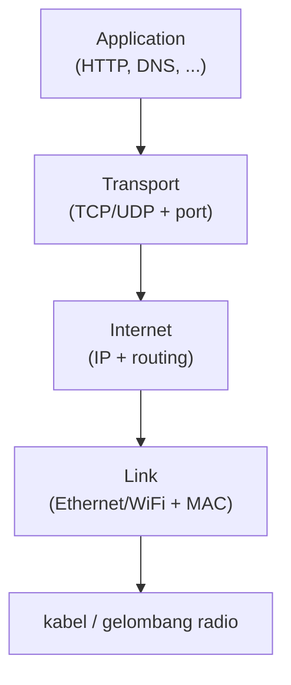

## TL;DR

Model TCP/IP adalah kerangka berpikir empat lapis untuk memahami komunikasi jaringan: **Link** (bagaimana bit dikirim di kabel/wifi lokal), **Internet** (bagaimana packet dirutekan dari satu jaringan ke jaringan lain lewat alamat IP), **Transport** (bagaimana data dikirim andal atau cepat antara dua endpoint lewat TCP/UDP dan port), dan **Application** (protokol yang benar-benar dipahami aplikasimu — HTTP, DNS, dan sejenisnya). Setiap lapisan hanya peduli pada lapisan tepat di bawah dan di atasnya, dan setiap paket data "dibungkus" header baru saat turun lapisan, lalu "dibuka" lagi saat naik di sisi penerima. Kerangka ini bukan sekadar teori — ia adalah alat diagnosis: begitu ada masalah jaringan, pertanyaan pertama yang harus dijawab adalah "di lapisan mana ini rusak?", bukan menebak dari gejala di lapisan paling atas saja.

## The Problem

Bayangkan kamu menerima laporan dari partner instansi pemerintah: "API kalian down, kami tidak bisa mengakses endpoint verifikasi dokumen sejak pagi." Tanpa kerangka berpikir yang jelas, respons pertama yang wajar tapi sering keliru adalah langsung memeriksa log aplikasi — mencari error di kode handler, di database, di service yang menangani endpoint itu. Kalau ternyata semua log aplikasi bersih dan endpoint itu terbukti bisa diakses dari server lain, waktu berharga sudah terbuang di lapisan yang salah.

Masalah sesungguhnya, dalam kasus seperti ini, sering ada jauh di bawah lapisan aplikasi — misalnya firewall di jaringan partner yang baru saja diperbarui dan diam-diam memblokir IP server-mu di lapisan Internet, atau DNS di sisi partner yang masih menunjuk ke IP lama di lapisan yang bahkan belum masuk model ini. Tanpa model mental yang membedakan "masalah di link/Internet/transport" dari "masalah di application", diagnosis jadi menebak-nebak alih-alih menelusuri secara sistematis dari lapisan bawah ke atas.

## Intuition

Bayangkan mengirim surat lewat pos internasional sebagai **amplop di dalam amplop**. Isi surat yang sebenarnya — pesan yang ingin kamu sampaikan — ada di paling dalam (Application layer, misalnya HTTP). Ia dimasukkan ke amplop yang menyatakan "ini surat tercatat, harus dikonfirmasi diterima" (Transport layer — TCP atau UDP). Amplop itu dimasukkan lagi ke amplop yang menulis alamat lengkap negara tujuan (Internet layer — IP). Dan amplop itu, terakhir, dimasukkan ke kantong kurir yang hanya tahu rute dari kantor pos ini ke kantor pos berikutnya (Link layer — Ethernet atau WiFi).

Urutan ini penting dan sering dibalik orang: yang **paling luar** adalah lapisan yang **paling dekat kabel**, bukan yang paling dekat aplikasi. Itu sebabnya router di tengah jalan cukup membuka satu lapis terluar untuk tahu ke mana meneruskan paket — ia tidak pernah perlu membuka isi surat.

Analogi ini bocor di titik yang penting untuk diketahui: pembagian rapi "amplop di dalam amplop" ini tidak selalu seketat itu di implementasi nyata. Beberapa protokol modern mengaburkan batas antar lapisan demi performa atau keamanan (misalnya QUIC, dasar dari HTTP/3, menggabungkan sebagian tanggung jawab transport dan enkripsi jadi satu). Model empat lapis ini adalah kerangka berpikir yang sangat berguna, bukan hukum fisika yang selalu dipatuhi persis oleh setiap protokol baru.

## How It Works

Empat lapis, dari paling dekat ke kabel sampai paling dekat ke aplikasi:

- **Link** — bagaimana bit dikirim secara fisik di satu jaringan lokal (Ethernet, WiFi), memakai alamat MAC.
- **Internet** — bagaimana packet dirutekan antar jaringan yang berbeda, memakai alamat IP. Lapisan ini tidak peduli apakah datanya sampai andal atau tidak — ia hanya mengurus routing.
- **Transport** — bagaimana data dikirim antara dua endpoint tertentu, diidentifikasi lewat port. **TCP** menjamin data sampai secara berurutan dan lengkap (lihat [[TCP Handshake and Connection Lifecycle]]); **UDP** tidak menjamin apa pun, hanya mengirim dan berharap sampai (lihat [[TCP vs UDP]]).
- **Application** — protokol yang benar-benar dipahami aplikasimu: HTTP, DNS, protokol database, dan seterusnya. Lapisan ini yang biasanya kamu tulis kodenya langsung.



Saat data dikirim, ia mengalir dari atas ke bawah — setiap lapisan menambahkan header-nya sendiri di depan data dari lapisan atasnya (encapsulation). Saat data diterima, alurnya terbalik — setiap lapisan membuka header miliknya, memeriksa apakah tujuannya cocok, lalu meneruskan isinya ke lapisan di atasnya. Karena strukturnya berlapis begini, sebuah masalah bisa diisolasi: kalau ping (Internet layer) gagal, masalahnya tidak mungkin ada di HTTP (Application layer) — masalahnya lebih rendah dari itu.

## In Go

Package `net` di Go dengan sengaja mengekspos batas antar lapisan ini. `net.Dial("tcp", "host:port")` bekerja tepat di batas Transport/Internet — ia menangani resolusi alamat dan pembentukan koneksi TCP, tapi tidak tahu apa-apa soal HTTP. Package `net/http` dibangun **di atas** `net.Conn`, menambahkan pemahaman protokol Application layer.

```go
// net.Dial bekerja di lapisan Transport — ia hanya tahu cara membuka
// koneksi TCP ke host:port, sama sekali tidak paham apa itu HTTP.
func rawTCPProbe(ctx context.Context, addr string) error {
    var d net.Dialer
    conn, err := d.DialContext(ctx, "tcp", addr)
    if err != nil {
        return fmt.Errorf("dial %s: %w", addr, err)
    }
    defer conn.Close()
    return nil // koneksi TCP berhasil dibuka; ini TIDAK membuktikan HTTP di atasnya bekerja
}

// http.Get membangun request Application-layer LENGKAP di atas net.Dial —
// ia gagal kalau TCP-nya gagal, TAPI TCP yang berhasil tidak menjamin
// HTTP di atasnya juga berhasil (misalnya server bisa menolak dengan 500).
func httpProbe(ctx context.Context, url string) error {
    req, err := http.NewRequestWithContext(ctx, http.MethodGet, url, nil)
    if err != nil {
        return fmt.Errorf("build request: %w", err)
    }
    resp, err := http.DefaultClient.Do(req)
    if err != nil {
        return fmt.Errorf("http request %s: %w", url, err)
    }
    defer resp.Body.Close()
    return nil
}
```

Membedakan dua function ini secara sadar berguna untuk diagnosis: kalau `rawTCPProbe` berhasil tapi `httpProbe` gagal, kamu tahu masalahnya ada di lapisan Application (server menerima koneksi TCP, tapi ada yang salah dengan HTTP-nya) — bukan di jaringan.

## In His Stack

Diagnosis lintas lapisan ini adalah alat kerja harian untuk koordinasi integrasi dengan partner eksternal: `ping <host>` menguji lapisan Internet (apakah host bisa dijangkau sama sekali), `telnet <host> <port>` atau `nc -zv <host> <port>` menguji lapisan Transport (apakah port-nya terbuka dan menerima koneksi TCP), dan `curl -v https://...` menguji sampai ke lapisan Application (termasuk TLS dan HTTP di atasnya). Ketika partner bilang "API kalian down", urutan diagnosis dari bawah ke atas ini — bukan langsung membuka log aplikasi — yang membedakan investigasi yang cepat dari yang menebak-nebak.

Di Kubernetes, model ini juga membantu memisahkan masalah: `NetworkPolicy` beroperasi di lapisan Internet/Transport (mengizinkan atau memblokir berdasarkan IP dan port), sementara masalah di Ingress atau di dalam aplikasi ada di lapisan Application — dua kelas masalah yang butuh alat diagnosis berbeda.

## Trade-offs and When Not To Use It

Model ini adalah alat berpikir, bukan keputusan desain — tidak ada "kapan tidak memakainya". Yang perlu diwaspadai adalah jangan memperlakukannya sebagai pemisahan yang selalu bersih di setiap protokol modern; TLS misalnya duduk di antara Transport dan Application tergantung cara pandangnya (dibahas di [[The TLS Handshake]]), dan protokol seperti QUIC (dasar HTTP/3) sengaja menggabungkan sebagian peran transport dan enkripsi untuk mengurangi round-trip.

## Common Mistakes

> [!warning] Jebakan
> Langsung menyalahkan lapisan Application (kode, database aplikasi) begitu ada laporan "sistem down", tanpa memeriksa lapisan yang lebih rendah dulu (DNS, firewall, koneksi TCP). Diagnosis yang efisien berjalan dari lapisan bawah ke atas, bukan sebaliknya.

> [!warning] Jebakan
> Mencampur terminologi model TCP/IP empat lapis dengan model OSI tujuh lapis tanpa sadar — keduanya sering dipakai bergantian dalam diskusi, tapi jumlah dan batasan lapisannya berbeda. Pastikan tahu model mana yang sedang dipakai dalam sebuah percakapan.

> [!warning] Jebakan
> Menganggap batas antar lapisan selalu bersih di semua protokol. Beberapa optimisasi (misalnya interaksi antara ukuran buffer TCP dan cara aplikasi mem-flush data) membuat perilaku satu lapisan diam-diam dipengaruhi keputusan di lapisan lain.

## Exercises

1. Sebutkan keempat lapis model TCP/IP secara berurutan, dari yang paling dekat kabel sampai paling dekat aplikasi.
2. Kenapa `ping` yang berhasil tidak membuktikan bahwa endpoint HTTP di server yang sama juga berfungsi?
3. Di lapisan mana firewall biasanya beroperasi, dan kenapa itu penting untuk diagnosis masalah konektivitas dengan partner?
4. Desain terbuka: sebuah partner instansi melaporkan "API kalian tidak bisa diakses" pada jam tertentu setiap hari, padahal monitoring internalmu menunjukkan service berjalan normal sepanjang waktu. Rancang urutan langkah diagnosis lengkap, dari lapisan paling bawah ke atas, untuk menemukan di lapisan mana masalah sesungguhnya terjadi — termasuk mempertimbangkan bahwa masalah bisa saja ada sepenuhnya di sisi jaringan partner, bukan di sisimu.

> [!success]- Kunci jawaban
> Urutan diagnosis: mulai dengan meminta partner menjalankan `ping <IP server>` pada jam bermasalah untuk memastikan lapisan Internet oke dari sisi mereka; kalau itu gagal padahal servermu terbukti up, curigai firewall/routing di sisi partner atau ISP mereka pada jam tersebut (bisa jadi ada kebijakan pembatasan bandwidth terjadwal). Kalau ping berhasil, minta mereka coba `telnet`/`nc` ke port API-mu untuk menguji lapisan Transport — kalau ini gagal padahal ping berhasil, curigai firewall yang spesifik memblokir port tersebut, bukan IP-nya secara keseluruhan. Kalau transport juga berhasil, baru periksa lapisan Application lewat `curl -v` dari sisi mereka untuk melihat apakah TLS handshake atau response HTTP yang bermasalah — di titik ini, cross-check dengan log server-mu sendiri pada jam yang sama untuk melihat apakah request dari IP partner benar-benar sampai. Karena masalahnya berpola per jam tertentu setiap hari, curigai juga kemungkinan ada proses terjadwal di jaringan partner (backup, rate limiting terjadwal) yang bukan salah sistemmu sama sekali.

## Self-Check

- Sebutkan keempat lapisan model TCP/IP secara berurutan.
- Apa yang dilakukan setiap lapisan saat data "turun" ke lapisan di bawahnya sebelum dikirim?
- Kenapa koneksi TCP yang berhasil dibuka tidak menjamin request HTTP di atasnya juga berhasil?
- Sebutkan satu alat command-line untuk menguji lapisan Transport secara terpisah dari lapisan Application.

## Connected Notes

- [[How An OS Handles Network Connections]] — prasyarat langsung: perjalanan packet yang dijelaskan di note itu adalah penerapan konkret model lapisan ini.
- [[TCP Handshake and Connection Lifecycle]] — pembahasan penuh apa yang terjadi persis di lapisan Transport untuk TCP.
- [[TCP vs UDP]] — dua pilihan protokol di lapisan Transport dengan trade-off yang sangat berbeda.
- [[The TLS Handshake]] — lapisan yang secara sengaja mengaburkan batas Transport/Application, disebut di bagian trade-off note ini.
- [[HTTP 1.1 In Depth]] — protokol Application layer paling relevan untuk pekerjaan sehari-hari.

## Further Reading

- RFC 1122 (*Requirements for Internet Hosts*) sebagai rujukan resmi definisi model empat lapis ini, meski jarang perlu dibaca penuh untuk kerja sehari-hari.

## Catatan Saya

*Tulis di sini kejadian nyata "sistem down" yang ternyata setelah ditelusuri masalahnya ada di lapisan yang tidak terduga (misalnya DNS atau firewall, bukan kode aplikasi).*
