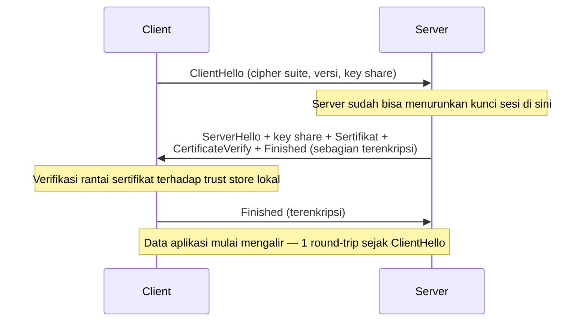

## TL;DR

TLS handshake terjadi tepat setelah koneksi TCP terbuka dan sebelum satu byte data aplikasi pun dikirim: kedua sisi menyepakati algoritma enkripsi yang dipakai, server membuktikan identitasnya lewat sertifikat yang ditandatangani otoritas tepercaya (CA), dan keduanya menurunkan kunci sesi bersama lewat pertukaran kunci — semua ini terjadi sebelum HTTP atau protokol aplikasi apa pun mulai bicara. HTTPS tidak membuat API-mu aman secara keseluruhan — TLS hanya menjamin data tidak bisa dibaca atau diubah di tengah jalan (confidentiality dan integrity) dan bahwa kamu memang sedang bicara dengan server yang benar, bukan penyerang yang menyamar. Otentikasi pengguna, otorisasi, dan validasi input tetap sepenuhnya tanggung jawab aplikasi di atasnya.

## The Problem

Bayangkan sebuah service Go yang perlu memanggil API sebuah partner instansi lewat HTTPS. Saat dicoba dengan `curl` dari laptop developer, semuanya berhasil sempurna. Tapi begitu dijalankan dari service Go di production, panggilan itu selalu gagal dengan error semacam `x509: certificate signed by unknown authority`.

Penyebab paling umum untuk kasus seperti ini: server partner hanya mengirim sertifikat mereka sendiri, tanpa **sertifikat intermediate** yang menghubungkannya ke root CA yang benar-benar tepercaya. Browser dan `curl` di banyak sistem punya mekanisme tambahan (seperti mengambil sertifikat intermediate yang hilang lewat informasi AIA di sertifikat, atau menyimpan cache intermediate dari kunjungan sebelumnya) yang membuat mereka tetap berhasil memverifikasi rantai kepercayaan meski server tidak mengirim rantai lengkap. Implementasi TLS di `crypto/tls` Go jauh lebih ketat secara default — ia hanya memverifikasi rantai yang benar-benar dikirim server saat handshake, tanpa mekanisme "menebak" tambahan itu. Hasilnya: kegagalan yang terlihat seperti bug di sisi Go-mu, padahal akar masalahnya ada di konfigurasi server partner.

## Intuition

Bayangkan TLS handshake seperti **pertemuan yang dimulai dengan menunjukkan kartu identitas resmi** sebelum membicarakan hal rahasia. Server menunjukkan "sertifikat" (identitasnya, ditandatangani oleh pihak yang kamu percaya sebelumnya — otoritas sertifikat/CA), kamu memeriksa apakah tanda tangan itu memang berasal dari pihak yang kamu percaya, lalu kedua pihak menyepakati "bahasa sandi" (algoritma enkripsi dan kunci sesi) yang akan dipakai untuk seluruh percakapan setelahnya.

Analogi ini bocor di soal bagaimana "kepercayaan" itu terbentuk. Berbeda dari hubungan manusia yang biasanya dibangun bertahap lewat interaksi berulang, kepercayaan di TLS sepenuhnya berasal dari daftar otoritas sertifikat (root CA) yang **sudah ditanamkan sebelumnya** di sistem operasi atau bahasa pemrogramanmu — kamu tidak "membangun" kepercayaan itu saat handshake terjadi, kamu hanya memverifikasi apakah sertifikat yang ditunjukkan memang ditandatangani oleh salah satu pihak yang sudah dipercaya sejak awal.

## How It Works

Handshake TLS modern (versi 1.3) secara garis besar:



Perhatikan bahwa client sudah mengirim key share-nya di `ClientHello`, dan server membalas seluruh sisanya dalam satu kiriman. Inilah alasan mekanis kenapa TLS 1.3 butuh lebih sedikit round-trip dibanding TLS 1.2, yang mengharuskan pertukaran kunci berlangsung dalam kiriman terpisah setelah sertifikat diterima.

Poin penting: verifikasi sertifikat bukan sekadar "apakah sertifikatnya valid", tapi apakah **rantai kepercayaan lengkap** dari sertifikat server sampai ke root CA yang ada di trust store klien bisa dibuktikan. Kalau server hanya mengirim sertifikatnya sendiri tanpa sertifikat intermediate yang menghubungkannya ke root CA, klien yang ketat (seperti `crypto/tls` Go secara default) akan menolak koneksi — inilah akar masalah di skenario "The Problem" di atas.

TLS 1.3 (dibanding TLS 1.2 sebelumnya) mengurangi jumlah round-trip yang dibutuhkan sebelum data aplikasi bisa mulai mengalir, dan mendukung mode resumption yang mempercepat koneksi berikutnya ke server yang sama.

> [!question] Perlu diverifikasi
> Klaim: detail jumlah round-trip pasti TLS 1.2 vs TLS 1.3, dan perilaku spesifik 0-RTT resumption.
> Kenapa ragu: detail ini bergantung pada mode resumption yang dipakai dan bisa berbeda antar implementasi/konfigurasi library.
> Cara verifikasi: baca RFC 8446 (TLS 1.3) bagian handshake, atau lakukan packet capture (`tcpdump`/Wireshark) langsung pada koneksi nyata untuk melihat jumlah round-trip sesungguhnya.

## In Go

```go
// JANGAN pernah melakukan ini di production — mematikan verifikasi
// sertifikat sepenuhnya, membuat koneksi rentan man-in-the-middle.
badClient := &http.Client{
    Transport: &http.Transport{
        TLSClientConfig: &tls.Config{InsecureSkipVerify: true}, // BAHAYA
    },
}

// Konfigurasi yang wajar: menetapkan versi TLS minimum secara eksplisit,
// tanpa mematikan verifikasi sertifikat sama sekali.
safeClient := &http.Client{
    Timeout: 10 * time.Second,
    Transport: &http.Transport{
        TLSClientConfig: &tls.Config{
            MinVersion: tls.VersionTLS12,
        },
    },
}

// Untuk mendiagnosis masalah rantai sertifikat seperti di "The Problem",
// periksa sertifikat yang benar-benar dikirim server:
func inspectServerCertChain(ctx context.Context, addr string) error {
    d := tls.Dialer{Config: &tls.Config{}}
    conn, err := d.DialContext(ctx, "tcp", addr)
    if err != nil {
        return fmt.Errorf("tls dial %s: %w", addr, err)
    }
    defer conn.Close()

    tlsConn, ok := conn.(*tls.Conn)
    if !ok {
        return fmt.Errorf("unexpected connection type for %s", addr)
    }

    for i, cert := range tlsConn.ConnectionState().PeerCertificates {
        fmt.Printf("sertifikat #%d: subject=%s issuer=%s\n", i, cert.Subject, cert.Issuer)
    }
    return nil
}
```

`inspectServerCertChain` mencetak persis sertifikat apa saja yang dikirim server saat handshake — kalau hanya ada satu sertifikat (milik server itu sendiri) tanpa sertifikat intermediate yang menghubungkannya ke root CA, itu konfirmasi langsung bahwa server tidak mengirim rantai lengkap, yang menjelaskan kenapa `crypto/tls` menolaknya meski `curl` di beberapa environment tetap berhasil.

## In His Stack

Insiden "berhasil di `curl` laptop, gagal di service Go production" karena rantai sertifikat tidak lengkap adalah salah satu masalah integrasi paling umum saat bekerja dengan partner instansi yang mengelola infrastruktur TLS mereka sendiri — kadang tim IT partner tidak menyadari bahwa mereka perlu mengirim sertifikat intermediate karena tool internal mereka (atau browser yang mereka pakai untuk mengecek) sudah menyimpan cache intermediate itu dari kunjungan sebelumnya.

**mTLS** (dibahas di [[../80 Security/mTLS|mTLS]]) memperluas handshake ini menjadi dua arah: bukan hanya klien yang memverifikasi identitas server, tapi server juga meminta dan memverifikasi sertifikat klien — pola yang makin umum dipakai di komunikasi antar service internal (service mesh) untuk memastikan kedua sisi saling terverifikasi, bukan hanya satu arah seperti HTTPS klasik.

## Trade-offs and When Not To Use It

TLS handshake menambah latency (round-trip tambahan sebelum data aplikasi mulai mengalir) dan sedikit overhead komputasi untuk operasi kriptografi — tapi untuk komunikasi apa pun yang melewati jaringan yang tidak sepenuhnya kamu percaya (termasuk semua komunikasi lewat internet publik), biaya ini hampir selalu sepadan dengan jaminan keamanan yang didapat. Pertimbangan mematikan TLS hanya masuk akal untuk komunikasi yang benar-benar terisolasi penuh di jaringan tepercaya (misalnya di dalam satu host yang sama lewat Unix socket) — bukan keputusan yang tepat untuk komunikasi lintas service atau lintas organisasi mana pun.

> [!warning] Jebakan
> HTTPS tidak membuat API-mu "aman" secara keseluruhan. TLS hanya menjamin data tidak bisa dibaca atau diubah di tengah jalan, dan bahwa kamu memang bicara dengan server yang benar. Otentikasi user, otorisasi, validasi input, dan seluruh OWASP Top 10 (lihat [[../80 Security/The OWASP Top 10|The OWASP Top 10]]) tetap sepenuhnya tanggung jawab lapisan aplikasi di atas TLS.

## Common Mistakes

> [!warning] Jebakan
> Menyetel `InsecureSkipVerify: true` "sementara" untuk membuat koneksi berhasil saat development, lalu lupa menghapusnya sebelum deploy ke production — ini mematikan seluruh verifikasi sertifikat, membuat koneksi rentan terhadap man-in-the-middle attack tanpa peringatan apa pun di level kode.

> [!warning] Jebakan
> Server yang tidak mengirim sertifikat intermediate lengkap, mengandalkan klien untuk "menebak" atau mengambilnya sendiri. Sebagian klien (browser modern, beberapa versi `curl`) cukup toleran soal ini; klien lain (termasuk `crypto/tls` Go secara default) tidak — dan mengasumsikan semua klien akan seberhasil `curl` di laptopmu adalah kesalahan diagnosis yang umum.

> [!warning] Jebakan
> Menganggap TLS otomatis berarti "aman dari semua ancaman" hanya karena koneksinya terenkripsi. Data yang dikirim lewat TLS bisa saja tetap berisi SQL injection, payload XSS, atau permintaan tanpa otorisasi yang benar — enkripsi transportnya tidak memeriksa isi datanya sama sekali.

## Exercises

1. Sebutkan dua hal yang dijamin TLS dan dua hal yang **tidak** dijamin TLS.
2. Kenapa `curl` bisa berhasil terhubung ke server dengan rantai sertifikat yang tidak lengkap, sementara `crypto/tls` Go menolaknya?
3. Kenapa `InsecureSkipVerify: true` berbahaya, dan dalam situasi apa (kalau ada) ia bisa diterima?
4. Desain terbuka: sebuah partner instansi baru saja memperbarui sertifikat TLS mereka, dan sejak itu service Go-mu gagal terhubung dengan error `x509: certificate signed by unknown authority`, padahal tim partner bersikeras "sertifikat kami valid, sudah dicek pakai browser". Rancang langkah investigasi lengkap untuk membuktikan (atau menyingkirkan) dugaan bahwa masalahnya ada di rantai sertifikat yang tidak lengkap, dan bagaimana mengomunikasikan temuan itu ke tim partner yang tidak familiar dengan detail teknis rantai sertifikat.

> [!success]- Kunci jawaban
> Investigasi: jalankan `openssl s_client -connect host:443 -showcerts` atau function `inspectServerCertChain` di atas terhadap endpoint partner untuk melihat persis sertifikat apa saja yang dikirim server saat handshake. Kalau hanya ada satu sertifikat (leaf certificate) tanpa sertifikat intermediate yang menghubungkannya ke root CA publik yang dikenal, itu bukti langsung bahwa server tidak mengirim rantai lengkap — terlepas dari apakah browser tim partner "berhasil" (browser modern sering menambal ini secara diam-diam lewat AIA fetching, membuat masalahnya tidak terlihat dari sisi mereka). Untuk komunikasi ke tim partner yang tidak familiar dengan istilah "certificate chain": jelaskan lewat analogi bahwa sertifikat mereka seperti KTP yang sah tapi tanpa surat pengantar dari instansi penerbitnya yang dibutuhkan sistem tertentu untuk memverifikasi keasliannya — kebanyakan CA menyediakan panduan eksplisit cara menyertakan sertifikat intermediate ("full chain" atau "certificate bundle") di konfigurasi web server mereka (Nginx/Apache), dan ini biasanya perbaikan konfigurasi yang cepat begitu diidentifikasi dengan benar.

## Self-Check

- Sebutkan dua jaminan yang diberikan TLS dan satu hal yang tidak dijaminnya.
- Kenapa server perlu mengirim sertifikat intermediate, bukan hanya sertifikat miliknya sendiri?
- Kenapa `InsecureSkipVerify: true` berbahaya di production?
- Apa perbedaan mendasar antara TLS (enkripsi transport) dan otorisasi aplikasi?

## Connected Notes

- [[DNS Resolution]] — prasyarat: TLS handshake terjadi setelah IP didapat dari DNS dan koneksi TCP dibuka ke IP itu.
- [[TCP Handshake and Connection Lifecycle]] — TLS handshake terjadi tepat di atas koneksi TCP yang sudah `ESTABLISHED`, sebelum data aplikasi mengalir.
- [[HTTP 1.1 In Depth]] — protokol Application layer yang biasanya berjalan di atas TLS sebagai HTTPS.
- [[../80 Security/mTLS|mTLS]] — perluasan handshake ini menjadi verifikasi identitas dua arah, dibahas penuh di domain Security.
- [[../80 Security/The OWASP Top 10|The OWASP Top 10]] — daftar kerentanan aplikasi yang sama sekali tidak dicegah oleh TLS semata.

## Further Reading

- RFC 8446 (*The Transport Layer Security (TLS) Protocol Version 1.3*) sebagai spesifikasi resmi.

## Catatan Saya

*Tulis di sini kalau kamu pernah mendiagnosis masalah TLS/sertifikat dengan partner, dan bagaimana akhirnya ditemukan akar masalahnya.*
