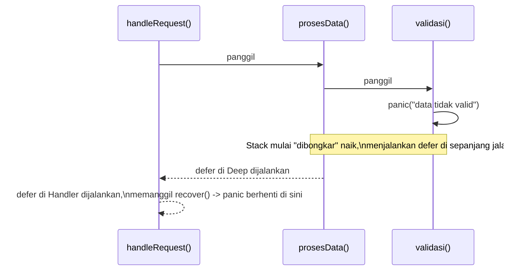

## TL;DR

`defer` menjadwalkan pemanggilan sebuah function agar dijalankan **tepat sebelum function yang mengelilinginya selesai** — dipakai luas untuk cleanup (`Close`, `Unlock`). Beberapa `defer` dijalankan dalam urutan **LIFO** (yang terakhir didaftarkan, dijalankan pertama). `panic` menghentikan alur normal dan mulai "membongkar" stack pemanggilan, menjalankan setiap `defer` di sepanjang jalan sambil naik; `recover()` bisa menghentikan proses pembongkaran itu, **tapi hanya kalau dipanggil langsung di dalam sebuah function yang di-defer** — dipanggil di tempat lain, ia tidak berbuat apa-apa. Memahami detail ini penting karena satu goroutine yang panic tanpa `recover` bisa mematikan **seluruh process Go**, bukan hanya request yang sedang ditanganinya.

## The Problem

Bayangkan sebuah handler HTTP yang memproses upload banyak file dalam satu request, membuka setiap file dengan `os.Open` di dalam loop dan memakai `defer file.Close()` tepat setelah setiap `Open` berhasil — pola yang terlihat benar dan idiomatic. Tapi kalau loop itu memproses ratusan file dalam satu pemanggilan function, **semua** `defer file.Close()` itu menumpuk dan baru benar-benar dieksekusi di **akhir seluruh function**, bukan di akhir setiap iterasi loop. Selama function itu masih berjalan, ratusan file descriptor (lihat [[../10 Foundations/Syscalls and File Descriptors|Syscalls and File Descriptors]]) tertahan terbuka sekaligus — berpotensi menghabiskan limit file descriptor sebelum function itu bahkan selesai.

Masalah kedua yang lebih serius: bayangkan sebuah goroutine yang di-spawn untuk memproses sesuatu di background (misalnya mengirim notifikasi setelah request selesai) memicu panic karena bug yang tidak terduga (misalnya nil pointer dereference), dan tidak ada `recover` di goroutine itu. Panic ini **tidak berhenti di goroutine itu saja** — ia mematikan **seluruh process Go**, termasuk semua goroutine lain yang sedang melayani request user yang berbeda-beda pada saat yang sama (lihat [[../10 Foundations/Processes vs Threads|Processes vs Threads]]).

## Intuition

Bayangkan `defer` seperti **menempelkan catatan tempel di mejamu**: "sebelum meninggalkan ruangan ini, lakukan X" — dan kalau kamu menempelkan beberapa catatan berurutan, kamu akan membacanya dari yang paling atas (paling baru ditempel) ke bawah saat benar-benar hendak keluar ruangan (LIFO). `panic` seperti alarm kebakaran — semua orang berhenti melakukan pekerjaan normal dan mulai keluar ruangan demi ruangan (unwind stack), membaca catatan tempel di masing-masing ruangan sepanjang jalan keluar. `recover()` seperti seseorang yang berdiri tepat di pintu sebuah ruangan dan berkata "alarm ini palsu, semua boleh kembali bekerja" — tapi hanya efektif kalau orang itu memang berdiri **tepat di pintu ruangan itu** (dipanggil langsung dalam function yang di-defer), bukan berteriak dari ruangan yang jauh.

Analogi ini bocor pada soal cakupan "ruangan". Alarm kebakaran sungguhan biasanya berlaku untuk satu gedung; panic di satu goroutine, kalau tidak di-`recover`, tidak "berhenti di satu ruangan" — ia menyebar dan mematikan **seluruh gedung** (seluruh process Go), bukan hanya lantai tempat panic itu terjadi.

## How It Works

- `defer f(x)` — argumen `x` **dievaluasi seketika** saat baris `defer` dieksekusi, bukan saat `f` benar-benar dipanggil nanti. Ini penting: kalau `x` berubah setelah baris `defer` tapi sebelum function selesai, `f` tetap menerima nilai `x` yang lama, **kecuali** kamu memakai closure (`defer func() { ... x ... }()`) yang menangkap variable-nya, bukan nilainya, sehingga melihat nilai terbaru saat closure itu benar-benar dijalankan.
- Semua `defer` dalam satu function dijalankan **LIFO** tepat sebelum function itu benar-benar return.
- `panic` menghentikan eksekusi normal dan mulai menjalankan `defer` yang terdaftar, naik dari function yang panic sampai ke pemanggilnya, dan seterusnya — kecuali dihentikan oleh `recover()`.
- `recover()` **hanya berlaku** kalau dipanggil langsung di dalam sebuah function yang dipanggil lewat `defer`. Dipanggil di tempat lain (langsung di alur normal, atau di dalam function yang dipanggil *oleh* function yang di-defer, bukan oleh defer itu sendiri), `recover()` tidak berbuat apa-apa dan mengembalikan `nil`.



## In Go

Perbaikan untuk masalah "defer menumpuk di loop" dari "The Problem":

```go
// SALAH: defer menumpuk sampai akhir function, bukan akhir iterasi.
func prosesSemuaFileSalah(paths []string) error {
    for _, p := range paths {
        f, err := os.Open(p)
        if err != nil {
            return fmt.Errorf("open %s: %w", p, err)
        }
        defer f.Close() // menumpuk sampai prosesSemuaFileSalah SELESAI
        // ... proses f ...
    }
    return nil
}

// BENAR: bungkus logika per-file dalam function terpisah, supaya
// defer berlaku di akhir SETIAP pemanggilan function itu, bukan
// menumpuk sampai akhir loop.
func prosesSemuaFile(paths []string) error {
    for _, p := range paths {
        if err := prosesSatuFile(p); err != nil {
            return fmt.Errorf("proses %s: %w", p, err)
        }
    }
    return nil
}

func prosesSatuFile(path string) error {
    f, err := os.Open(path)
    if err != nil {
        return fmt.Errorf("open %s: %w", path, err)
    }
    defer f.Close() // ditutup di akhir prosesSatuFile, bukan menumpuk

    // ... proses f ...
    return nil
}
```

Middleware `recover` untuk mencegah satu request yang panic mematikan seluruh server, langsung menjawab masalah kedua di "The Problem":

```go
func recoverMiddleware(next http.Handler) http.Handler {
    return http.HandlerFunc(func(w http.ResponseWriter, r *http.Request) {
        defer func() {
            if rec := recover(); rec != nil {
                log.Printf("panic tertangkap: %v\n%s", rec, debug.Stack())
                http.Error(w, "terjadi kesalahan internal", http.StatusInternalServerError)
            }
        }()
        next.ServeHTTP(w, r)
    })
}
```

Perlu diingat: `recover()` di middleware ini **hanya** melindungi goroutine yang menangani request HTTP itu sendiri. Goroutine terpisah yang di-spawn dari dalam handler (`go doSomethingAsync()`) **tidak** dilindungi oleh `recover` ini — goroutine baru itu butuh `recover`-nya sendiri kalau tidak ingin panic di dalamnya mematikan seluruh process.

## In His Stack

**PHP** tidak punya `defer`/`panic`/`recover` dalam bentuk yang sama — padanan terdekatnya adalah `try`/`finally`, yang secara sintaks terikat pada blok kode tertentu, bukan otomatis terikat pada seluruh sisa function seperti `defer`. Perbedaan yang lebih penting secara operasional: fatal error tak tertangani di PHP-FPM klasik hanya mematikan **satu worker request** itu (lihat [[../10 Foundations/Processes vs Threads|Processes vs Threads]]), sementara panic tak tertangani di Go bisa mematikan **seluruh process** yang sedang melayani banyak request sekaligus — inilah kenapa middleware `recover` di setiap boundary goroutine jauh lebih kritis di Go dibanding menangani fatal error di PHP.

## Trade-offs and When Not To Use It

`defer` menambah sedikit overhead dibanding memanggil function cleanup secara manual di akhir — pada praktiknya, untuk hampir semua kode aplikasi biasa, overhead ini tidak signifikan dan manfaat keterbacaan serta keamanannya (cleanup terjamin jalan bahkan kalau ada error di tengah) jauh lebih besar. Hanya di hot path yang benar-benar sudah dibuktikan lewat profiling (lihat [[../50 Concurrency and Performance/pprof Profiling|pprof Profiling]]) sensitif terhadap overhead ini, pertimbangkan memanggil cleanup manual — dan bahkan di situ, verifikasi dulu sebelum mengorbankan keterbacaan kode.

## Common Mistakes

> [!warning] Jebakan
> Menganggap `defer` di dalam loop dijalankan di akhir **setiap iterasi**. Ia menumpuk dan baru dijalankan di akhir **seluruh function**, LIFO — untuk cleanup per-iterasi, bungkus logikanya dalam function terpisah seperti contoh di atas.

> [!warning] Jebakan
> Memanggil `recover()` di tempat yang bukan langsung di dalam function yang di-defer — misalnya di function biasa yang dipanggil dari dalam defer, tapi bukan defer itu sendiri. `recover()` di luar konteks ini selalu mengembalikan `nil` dan tidak menghentikan panic sama sekali.

> [!warning] Jebakan
> Memasang `recover` di middleware HTTP dan menganggap seluruh aplikasi sudah "aman dari panic", lupa bahwa goroutine terpisah yang di-spawn dari dalam handler (`go func() {...}()`) butuh `recover`-nya sendiri — panic di goroutine itu tidak tertangkap oleh `recover` di goroutine handler utama.

## Exercises

1. Kenapa `defer` di dalam loop tidak dijalankan di akhir setiap iterasi, melainkan menumpuk sampai akhir function?
2. Kapan `recover()` benar-benar menghentikan sebuah panic, dan kapan ia tidak berpengaruh sama sekali?
3. Kenapa panic yang tidak di-`recover` di satu goroutine bisa mematikan seluruh process Go, bukan hanya goroutine itu?
4. Desain terbuka: sebuah handler HTTP sudah dilindungi middleware `recover`, tapi juga men-spawn goroutine terpisah untuk mengirim notifikasi email secara asynchronous setelah response dikirim ke client. Suatu hari, seluruh service tiba-tiba mati total meski dashboard tidak menunjukkan lonjakan traffic aneh. Diagnosis kemungkinan penyebabnya dan rancang perbaikan menyeluruh untuk mencegah pola ini terulang di seluruh codebase, bukan hanya di satu tempat.

> [!success]- Kunci jawaban
> Penyebab yang paling mungkin: panic terjadi di dalam goroutine pengiriman notifikasi email yang di-spawn dari handler, dan goroutine itu tidak punya `recover`-nya sendiri — middleware `recover` di level handler HTTP tidak melindungi goroutine terpisah ini sama sekali, sehingga panic di sana langsung mematikan seluruh process. Perbaikan menyeluruh: buat sebuah helper function (misalnya `safeGo(func())`) yang membungkus setiap pemanggilan `go func(){...}()` di seluruh codebase dengan `recover` bawaan di dalamnya, dan jadikan ini konvensi wajib tim — jangan pernah men-spawn goroutine mentah tanpa jaminan `recover` di dalamnya, terutama untuk goroutine fire-and-forget yang tidak diawasi lewat `errgroup` atau mekanisme serupa.

## Self-Check

- Urutan apa yang dipakai untuk menjalankan beberapa `defer` dalam satu function?
- Kenapa argumen sebuah `defer f(x)` dievaluasi seketika, bukan saat `f` benar-benar dipanggil?
- Di mana persis `recover()` harus dipanggil supaya benar-benar menghentikan panic?
- Kenapa `recover` di middleware HTTP tidak melindungi goroutine terpisah yang di-spawn dari dalam handler?

## Connected Notes

- [[../10 Foundations/Syscalls and File Descriptors|Syscalls and File Descriptors]] — `defer file.Close()` yang dibahas di note ini adalah pola paling umum untuk memastikan file descriptor selalu dilepas.
- [[../10 Foundations/Processes vs Threads|Processes vs Threads]] — alasan kenapa panic tak tertangani di satu goroutine bisa mematikan seluruh process, bukan hanya goroutine itu.
- [[Errors as Values]] — panic/recover sengaja dipisahkan dari mekanisme error handling normal Go, yang dibahas penuh di note itu.
- [[../30 APIs and Web/net-http Handlers and Middleware|net-http Handlers and Middleware]] — middleware `recover` di note ini adalah salah satu middleware paling penting dalam praktik.
- [[../50 Concurrency and Performance/Goroutine Leaks|Goroutine Leaks]] — goroutine fire-and-forget tanpa pengawasan yang disebut di note ini juga rawan bocor selain rawan panic tak tertangani.

## Further Reading

- Artikel resmi *"Defer, Panic, and Recover"* di blog resmi Go (go.dev/blog) — penjelasan otoritatif dengan lebih banyak contoh.

## Catatan Saya

*Tulis di sini kalau kamu pernah menemukan bug "defer menumpuk di loop" atau panic yang mematikan seluruh service karena goroutine tanpa recover.*
