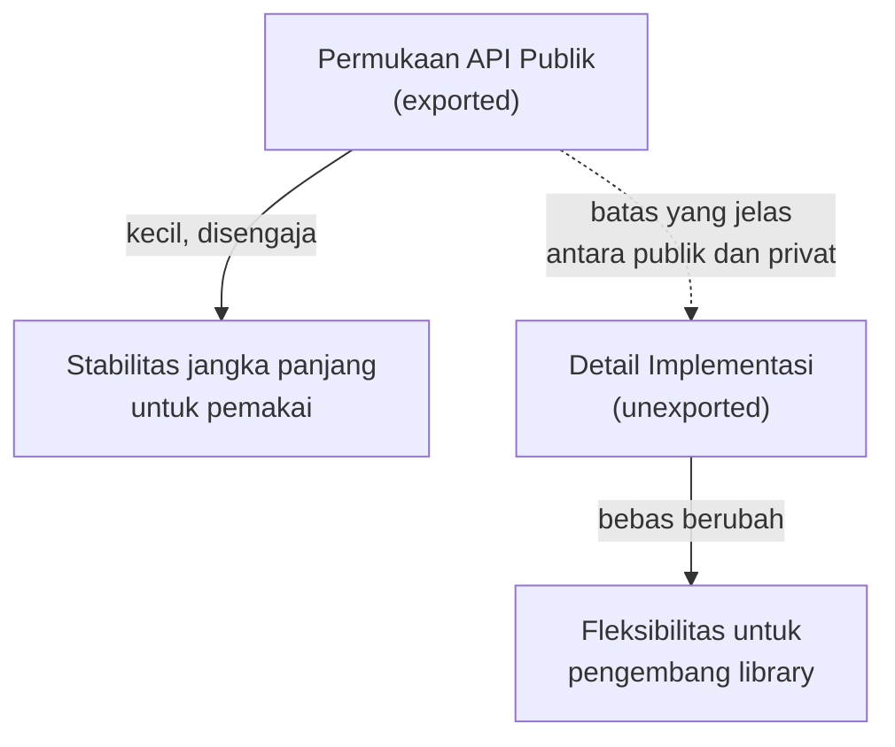

## TL;DR

Kode aplikasi yang salah bisa diperbaiki dan di-deploy ulang kapan saja tanpa memengaruhi siapa pun selain timmu sendiri. Kode **library** yang dipakai tim lain sepenuhnya berbeda sifatnya — begitu API-nya dipublikasikan dan dipakai, setiap perubahan yang tidak backward-compatible memaksa **semua pemakainya** mengubah kode mereka secara serentak atau tertinggal di versi lama selamanya. Merancang library yang stabil berarti membuat keputusan desain di awal yang secara sengaja memperkecil permukaan API publik, menyembunyikan detail implementasi yang bisa berubah, dan menyediakan jalur evolusi (seperti [[Functional Options]]) yang tidak memaksa breaking change setiap kali kemampuan baru ditambahkan.

## The Problem

Sebuah tim menulis package `common-validasi` yang dipakai lima aplikasi berbeda, mengekspor struct `HasilValidasi` dengan seluruh fieldnya public (huruf besar) karena "lebih mudah diakses". Enam bulan kemudian, tim menyadari perlu menambah field internal untuk keperluan debugging (`urutanAturanDieksekusi []string`) — tapi karena seluruh field struct ini public dan sudah diakses langsung oleh lima aplikasi pemakai (beberapa bahkan membuat struct `HasilValidasi` secara manual alih-alih lewat constructor), menambah field baru berisiko mematahkan kode yang membuat struct literal ini dengan positional fields, atau kode yang melakukan reflection/serialisasi yang mengasumsikan bentuk field tertentu.

Masalah kedua yang lebih mendasar: package yang sama mengekspor fungsi `ValidasiNIK(nik string) bool` yang mengembalikan `false` untuk NIK tidak valid **dan** untuk kasus lain (data kosong, format yang belum didukung). Ketika kebutuhan berkembang dan tim ingin membedakan "NIK tidak valid" dari "format belum didukung" (butuh penanganan berbeda di aplikasi pemakai), signature `bool` yang sudah dipublikasikan tidak punya ruang untuk membedakan kedua kasus itu — perbaikan yang benar (mengubah return type jadi error yang lebih ekspresif) berarti breaking change bagi seluruh pemakai fungsi ini, sesuatu yang bisa dihindari kalau desain awal sudah mempertimbangkan evolusi semacam ini.

## Intuition

Bayangkan desain API library seperti **merancang stopkontak listrik standar nasional** — begitu jutaan rumah dan alat elektronik dibangun mengikuti standar itu, mengubah bentuk stopkontak (bahkan untuk alasan yang secara teknis lebih baik) berarti memaksa jutaan alat dan rumah beradaptasi sekaligus, biaya yang sangat besar dan sering tidak realistis dilakukan. Perancang stopkontak yang baik memikirkan jauh ke depan: menyembunyikan detail kabel internal di balik dinding (implementasi privat), menyediakan sedikit titik kontak standar yang jelas (permukaan API publik yang kecil dan disengaja), dan kalau perlu menambah kemampuan (misalnya USB charging port tambahan), menambahkannya sebagai **tambahan** di samping stopkontak lama, bukan mengubah bentuk stopkontak yang sudah ada.

Analogi ini bocor pada satu hal: stopkontak fisik butuh keputusan standar yang benar-benar final sejak awal (mengubahnya di kemudian hari nyaris mustahil). API software punya jalan tengah yang tidak dimiliki hardware — lewat [[../90 Architecture and Design/Semantic Versioning|semantic versioning]], sebuah breaking change **tetap bisa** dilakukan, hanya dengan mekanisme yang eksplisit (menaikkan `MAJOR` version, mengubah import path untuk Go) yang memberi pemakai kendali kapan mereka siap bermigrasi — jalan keluar yang tidak tersedia untuk stopkontak fisik, tapi tetap sebuah operasi mahal yang idealnya dihindari lewat desain awal yang cermat.

## How It Works

**Prinsip inti merancang permukaan API yang kecil dan disengaja:**

- **Ekspor sesedikit mungkin.** Setiap identifier dengan huruf besar (exported) adalah janji stabilitas jangka panjang — field, function, atau tipe yang tidak diekspor (huruf kecil) bisa diubah bebas tanpa memengaruhi pemakai eksternal sama sekali. Pertanyaan yang harus selalu ditanya sebelum mengekspor sesuatu: "apakah pemakai eksternal benar-benar butuh mengakses ini secara langsung?"
- **Kembalikan interface, terima interface secara minimal** (aturan umum "accept interfaces, return structs" punya nuansa — lihat catatan di bawah). Struct konkret yang dikembalikan memberi fleksibilitas menambah method baru tanpa breaking change; parameter interface yang diterima memberi fleksibilitas pemakai menyediakan implementasi apa pun yang memenuhi kontrak minimal yang dibutuhkan.
- **Constructor, bukan struct literal.** Mendorong pemakai memakai `NewXxx()` alih-alih membuat struct literal langsung (`Xxx{}`) memberi kebebasan menambah field baru (termasuk field wajib yang perlu validasi) tanpa breaking change bagi kode yang sudah memakai constructor.
- **Functional options untuk konfigurasi yang mungkin berkembang** (lihat [[Functional Options]]) — memberi jalur menambah kemampuan tanpa breaking change pada signature constructor.



Diagram ini menunjukkan tujuan inti: memaksimalkan area yang **bebas diubah** (implementasi privat) sambil meminimalkan area yang **harus stabil selamanya** (API publik) — batas antara keduanya harus jelas dan disengaja, bukan kebetulan dari malas menandai sesuatu sebagai privat.

## Under The Hood

**"Accept interfaces, return structs"** adalah heuristik umum, bukan aturan mutlak — nuansanya: menerima parameter sebagai interface memberi fleksibilitas pemanggil (mereka bisa mengirim implementasi apa pun, termasuk mock untuk testing), tapi interface yang diminta harus **seminimal mungkin** (hanya method yang benar-benar dipakai fungsi itu, prinsip **interface segregation** — idealnya didefinisikan di sisi pemakai/consumer, bukan di sisi penyedia, konvensi umum di Go). Mengembalikan struct konkret (bukan interface) dari constructor memberi fleksibilitas penyedia library menambah method baru pada struct itu kapan pun tanpa breaking change — mengembalikan interface justru **membatasi** evolusi, karena interface yang sudah dipublikasikan tidak bisa menambah method baru tanpa mematahkan setiap implementasi lain yang sudah ada (kecuali pemakai hanya pernah menerima nilai itu, tidak pernah mengimplementasikannya sendiri).

**Error sebagai bagian dari kontrak API**: sentinel error dan error type yang diekspor (dibahas lebih dalam di [[Sentinel Errors vs Error Types]]) adalah bagian dari permukaan API publik yang sama pentingnya dengan signature fungsi — mengubah pesan teks sebuah error biasanya aman (pemakai yang benar memakai `errors.Is`/`errors.As`, bukan membandingkan string), tapi menghapus sentinel error yang sudah diekspor dan diperiksa banyak pemakai adalah breaking change yang sama seriusnya dengan menghapus sebuah fungsi publik.

## In Go

```go
package validasi

import "fmt"

// HasilValidasi TIDAK mengekspor field-nya — pemakai berinteraksi lewat
// method, bukan mengakses/membuat struct literal langsung. Ini memberi
// kebebasan menambah field internal (misalnya untuk debugging) kapan
// pun tanpa memengaruhi kode pemakai sama sekali.
type HasilValidasi struct {
	valid   bool
	pesan   string
	aturan  []string // field baru bisa ditambah kapan saja, aman
}

func (h HasilValidasi) Valid() bool    { return h.valid }
func (h HasilValidasi) Pesan() string  { return h.pesan }

// ValidasiNIK mengembalikan (HasilValidasi, error) — bukan bool murni —
// memberi ruang membedakan "input tidak valid" (HasilValidasi.Valid()
// false, tapi validasi BERHASIL dijalankan) dari "validasi gagal
// dijalankan sama sekali" (error, misalnya format yang belum didukung).
// Desain ini menghindari masalah persis seperti di "The Problem".
func ValidasiNIK(nik string) (HasilValidasi, error) {
	if len(nik) == 0 {
		return HasilValidasi{}, fmt.Errorf("nik tidak boleh kosong: %w", ErrInputTidakValid)
	}
	if len(nik) != 16 {
		return HasilValidasi{valid: false, pesan: "NIK harus 16 digit"}, nil
	}
	return HasilValidasi{valid: true}, nil
}

var ErrInputTidakValid = fmt.Errorf("input tidak valid")
```

```go
package consumer

// NotifikatorEmail adalah interface yang didefinisikan di SISI PEMAKAI
// (bukan di package yang menyediakan implementasi email), hanya berisi
// method yang BENAR-BENAR dipakai — prinsip interface segregation ala Go.
// Package penyedia (misalnya "emailkit") tidak perlu tahu interface ini
// ada sama sekali; ia cukup punya method Kirim yang cocok secara implisit.
type NotifikatorEmail interface {
	Kirim(tujuan, subjek, isi string) error
}
```

## In His Stack

Untuk `common-lib` yang dipakai lintas 13 aplikasi (disinggung juga di [[../20 Go Language/Packages and Modules|Packages and Modules]] soal semantic import versioning), disiplin permukaan API yang kecil punya dampak nyata: setiap identifier yang diekspor tanpa perlu adalah janji stabilitas yang harus dipenuhi selamanya (atau dipatahkan lewat breaking change yang mahal dikoordinasikan lintas 13 tim). Kontras dengan kebiasaan umum di PHP/Yii2 di mana hampir semua property class secara default bisa diakses public kecuali sengaja dijadikan `private`/`protected` — Go, dengan konvensi huruf besar/kecil yang eksplisit di setiap identifier, memaksa keputusan sadar tentang apa yang benar-benar perlu diekspor pada setiap penulisan kode baru, bukan default yang harus sengaja dipersempit belakangan.

## Trade-offs and When Not To Use It

Disiplin permukaan API kecil menambah friksi nyata dalam pengembangan awal — menulis getter method untuk setiap field alih-alih mengakses langsung, mendesain constructor dan functional options alih-alih struct literal sederhana, semuanya butuh kode tambahan dan pemikiran lebih di awal. Untuk kode yang **benar-benar** internal (hanya dipakai satu package/satu aplikasi, tidak pernah diimpor tim lain), disiplin ini bisa berlebihan — struct dengan field public yang diakses langsung sepenuhnya wajar dan lebih sederhana untuk kode yang cakupannya benar-benar terbatas. Disiplin ini paling bernilai justru untuk kode yang **akan** dipakai lintas tim atau lintas aplikasi — prasyaratnya adalah mengenali sejak awal mana kode yang benar-benar akan jadi "library" bagi orang lain, dan mana yang tetap kode aplikasi biasa.

## Common Mistakes

> [!warning] Jebakan
> Mengekspor seluruh field struct "karena lebih mudah diakses" tanpa mempertimbangkan bahwa setiap field yang diekspor adalah janji stabilitas — menyulitkan penambahan field baru atau perubahan struktur internal di kemudian hari.

> [!warning] Jebakan
> Mendorong pemakai membuat struct literal langsung (`Xxx{Field: nilai}`) alih-alih lewat constructor — menghilangkan kebebasan menambah field wajib baru atau validasi konstruksi tanpa breaking change bagi kode yang sudah ada.

> [!warning] Jebakan
> Mengembalikan tipe interface dari constructor "untuk fleksibilitas", padahal mengembalikan struct konkret memberi kebebasan menambah method baru tanpa breaking change — interface publik yang sudah dipakai luas justru membatasi evolusi API, kebalikan dari yang sering diasumsikan.

## Exercises

1. Jelaskan kenapa mengekspor field struct adalah janji stabilitas, dan bagaimana getter method memberi fleksibilitas lebih besar.
2. Kenapa mengembalikan struct konkret dari constructor umumnya lebih fleksibel untuk evolusi API dibanding mengembalikan interface?
3. Kenapa interface idealnya didefinisikan di sisi pemakai (consumer), bukan di sisi penyedia (provider), dalam konvensi Go?
4. Desain terbuka: kamu merancang library `common-http` yang akan dipakai 13 aplikasi untuk memanggil API partner eksternal, mencakup retry, timeout, dan logging otomatis. Rancang permukaan API publik minimal untuk library ini (fungsi/tipe apa saja yang diekspor), dan jelaskan keputusan desain yang membuatnya bisa berkembang (menambah fitur baru seperti circuit breaker di masa depan) tanpa breaking change bagi 13 tim pemakai.

> [!success]- Kunci jawaban
> **1.** Field yang diekspor bisa diakses dan **dimodifikasi** langsung oleh kode pemakai eksternal (kecuali diproteksi lewat cara lain) — begitu banyak kode pemakai bergantung pada keberadaan dan tipe field itu, mengubah nama, tipe, atau menghapusnya adalah breaking change yang memengaruhi setiap pemakai. Getter method (`func (h HasilValidasi) Valid() bool`) memberi lapisan indirection — implementasi internal (bagaimana nilai itu disimpan, dihitung, atau bahkan apakah field itu masih ada secara langsung) bisa berubah bebas selama method publiknya tetap mengembalikan tipe dan makna yang sama.
> **4.** Permukaan API minimal: `func NewClient(baseURL string, opts ...Option) *Client` (constructor dengan functional options, lihat [[Functional Options]]), method `func (c *Client) Get(ctx context.Context, path string) (*Response, error)` dan setara untuk method HTTP lain, serta tipe `Response` dengan getter method (bukan field public). Opsi seperti `WithRetryMax(n int) Option`, `WithTimeout(d time.Duration) Option`, `WithLogger(l Logger) Option` (di mana `Logger` adalah interface minimal yang didefinisikan di package ini). Keputusan yang memungkinkan evolusi tanpa breaking change: menambah `WithCircuitBreaker(cfg CircuitBreakerConfig) Option` di masa depan hanya menambah satu fungsi baru — signature `NewClient` tidak berubah, `Client` struct tetap dikembalikan sebagai struct konkret (bisa menambah field/method internal baru untuk mendukung circuit breaker tanpa mengubah kontrak publik), dan 13 tim pemakai yang tidak butuh circuit breaker sama sekali tidak perlu mengubah kode mereka — hanya tim yang ingin mengadopsi fitur baru itu yang menambahkan satu baris opsi ke pemanggilan `NewClient` mereka sendiri, kapan pun mereka siap.

## Self-Check

- Kenapa setiap identifier yang diekspor adalah janji stabilitas jangka panjang?
- Kenapa mengembalikan struct konkret umumnya lebih fleksibel untuk evolusi dibanding mengembalikan interface?
- Di mana idealnya interface didefinisikan dalam konvensi Go: sisi penyedia atau sisi pemakai?
- Kapan disiplin permukaan API kecil ini berlebihan untuk diterapkan?

## Connected Notes

- [[Functional Options]] — teknik konkret utama untuk menjaga constructor tetap stabil sambil memberi ruang menambah konfigurasi baru, dibahas penuh di note sebelumnya.
- [[../90 Architecture and Design/Semantic Versioning|Semantic Versioning]] — breaking change yang benar-benar tidak terhindarkan tetap punya jalur keluar eksplisit lewat semver, dibahas di note itu.
- [[Sentinel Errors vs Error Types]] — error yang diekspor adalah bagian dari kontrak API publik yang sama pentingnya dengan signature fungsi, dibahas mendalam di note berikutnya.
- [[Interfaces and Implicit Satisfaction]] — prinsip "define interface di sisi consumer" bertumpu langsung pada structural typing yang dijelaskan di note itu.
- [[../20 Go Language/Packages and Modules|Packages and Modules]] — semantic import versioning yang dibahas di note itu adalah mekanisme konkret menangani breaking change yang benar-benar tidak terhindarkan.

## Further Reading

- Dokumentasi resmi Go, "Go Proverbs" (Rob Pike) — kumpulan idiom termasuk "accept interfaces, return structs" dan filosofi desain API Go secara umum.

## Catatan Saya

*Tulis di sini library internal di kerjaanmu yang permukaan API-nya menurutmu terlalu besar/terekspos — bagian mana yang sebaiknya disembunyikan.*
