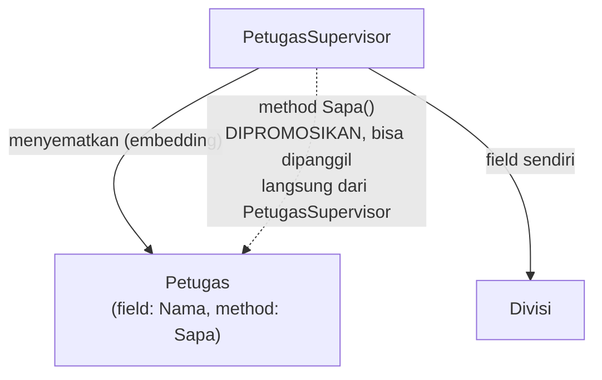

## TL;DR

Go tidak punya inheritance (pewarisan class) seperti PHP atau Java — sebagai gantinya, Go punya **embedding**: menyematkan satu struct (atau interface) di dalam struct lain tanpa nama field eksplisit, yang membuat method dan field dari tipe yang disematkan **dipromosikan** seolah-olah menjadi milik struct luar. Hasilnya terlihat mirip inheritance dari sudut pandang pemanggilan kode, tapi mekanismenya sepenuhnya berbeda dan lebih jujur: tidak ada polymorphism runtime otomatis, tidak ada "override" dalam pengertian OOP klasik — yang terjadi murni promosi method/field lewat komposisi, dengan aturan yang eksplisit dan bisa ditelusuri.

## The Problem

Seorang developer yang terbiasa dengan inheritance PHP/Java mencoba membuat `PetugasSupervisor` yang "mewarisi" seluruh method `Petugas` lalu menambah kemampuan baru, dengan asumsi Go punya mekanisme `extends` yang setara. Go tidak punya `class` atau `extends` sama sekali — mencoba memaksakan mental model inheritance ke Go biasanya berujung pada kebingungan soal bagaimana "override" method bekerja, atau kenapa sebuah `PetugasSupervisor` yang menyematkan `Petugas` tidak otomatis bisa dipakai di mana pun `Petugas` diharapkan sebagai parameter interface (polymorphism berbasis tipe, bukan berbasis hierarki class, adalah cara Go mencapai fleksibilitas semacam ini, lihat [[Interfaces and Implicit Satisfaction]]).

Masalah kedua yang lebih halus: embedding struct ke dalam struct lain untuk JSON marshalling (lihat [[../20 Go Language/Struct Tags and JSON Marshalling|Struct Tags and JSON Marshalling]]) punya efek samping yang mengejutkan pendatang baru — field dari struct yang disematkan **ikut muncul** di level teratas JSON output (bukan sebagai object bersarang), sebuah perilaku "flattening" otomatis yang bisa jadi tepat sekali atau justru merusak struktur API yang dimaksud, tergantung apakah developer menyadarinya sejak awal.

## Intuition

Bayangkan embedding seperti **menaruh sebuah kotak perkakas lengkap di dalam kotak perkakas yang lebih besar**, tanpa memberi label pada kotak kecil itu. Siapa pun yang membuka kotak besar bisa langsung mengambil obeng atau tang dari kotak kecil di dalamnya **seolah-olah** alat itu memang ada di kotak besar — kamu tidak perlu menyebut "buka kotak kecil dulu, baru ambil obengnya", cukup "ambil obeng" (method dipromosikan langsung). Tapi kotak kecil itu tetaplah kotak yang berdiri sendiri, punya identitasnya sendiri, dan **bisa** tetap diakses secara eksplisit lewat nama tipenya kalau memang dibutuhkan (`kotakBesar.KotakKecil.Obeng`).

Analogi ini bocor pada satu hal: promosi method di Go bersifat **statis** (ditentukan saat compile time berdasarkan struktur tipe), bukan dinamis seperti virtual method dispatch di OOP klasik. Kalau `PetugasSupervisor` menyematkan `Petugas` dan `Petugas` punya method `Sapa()`, lalu `PetugasSupervisor` mendefinisikan method `Sapa()`-nya sendiri, memanggil `petugas.Sapa()` di dalam method `Petugas` yang lain **tidak** akan otomatis memanggil versi `Sapa()` milik `PetugasSupervisor` — tidak ada "override virtual" seperti di Java/PHP; method `Petugas` selalu memanggil method `Petugas`, titik. Ini beda mendasar yang sering mengejutkan orang yang berharap perilaku polymorphism otomatis dari inheritance.

## How It Works

```go
package main

import "fmt"

type Petugas struct {
	Nama string
}

func (p Petugas) Sapa() string {
	return fmt.Sprintf("Halo, saya %s", p.Nama)
}

// PetugasSupervisor MENYEMATKAN Petugas (tanpa nama field eksplisit) —
// ini embedding, bukan inheritance. Method Sapa() milik Petugas
// DIPROMOSIKAN, bisa dipanggil langsung dari PetugasSupervisor.
type PetugasSupervisor struct {
	Petugas
	Divisi string
}

func main() {
	sup := PetugasSupervisor{
		Petugas: Petugas{Nama: "Budi"},
		Divisi:  "Verifikasi",
	}

	// Sapa() DIPROMOSIKAN dari Petugas — terlihat seperti method milik
	// PetugasSupervisor sendiri, meski sebenarnya milik Petugas.
	fmt.Println(sup.Sapa())

	// Akses eksplisit tetap mungkin dan kadang perlu (kalau ada ambiguitas
	// nama antar beberapa struct yang disematkan sekaligus).
	fmt.Println(sup.Petugas.Sapa())
}
```



Diagram ini menunjukkan bahwa `PetugasSupervisor` tidak "menjadi" `Petugas` dalam artian hierarki tipe (`PetugasSupervisor` tidak otomatis memenuhi interface apa pun yang diminta `Petugas` secara implisit hanya karena embedding) — ia hanya mendapat **promosi** akses ke method dan field `Petugas`, sebuah relasi komposisi ("has-a" via embedding yang berperilaku seperti "is-a" untuk kenyamanan akses), bukan pewarisan tipe sesungguhnya.

**Aturan promosi saat ada konflik nama**: kalau `PetugasSupervisor` mendefinisikan method dengan nama yang **sama** dengan method yang dipromosikan dari `Petugas` (misalnya `PetugasSupervisor` juga punya method `Sapa()` sendiri), method milik `PetugasSupervisor` **menang** — inilah satu-satunya bentuk "override" yang ada di Go, dan sifatnya statis (ditentukan struktur tipe, bukan virtual dispatch).

## Under The Hood

Embedding juga berlaku untuk **interface**, tidak hanya struct — menyematkan interface di dalam struct lain berarti struct itu harus menyediakan implementasi interface tersebut (biasanya lewat field bertipe interface yang diisi implementasi konkret), sebuah pola yang sangat umum dipakai untuk "decorator" atau "wrapper" yang hanya perlu mengubah sebagian kecil perilaku sambil mendelegasikan sisanya. Menyematkan **interface kosong** (`interface{}`/`any`) ke dalam struct adalah pola khusus yang kadang dipakai untuk membuat implementasi "parsial" yang panic kalau method yang belum diimplementasikan benar-benar dipanggil — pola yang harus dipakai hati-hati karena menyembunyikan kegagalan implementasi interface sampai runtime.

Untuk JSON marshalling, `encoding/json` (lewat reflection, lihat [[Reflection and Its Costs]]) memperlakukan field dari struct yang disematkan **tanpa tag json eksplisit** sebagai "flattened" — fieldnya muncul di level yang sama dengan field struct luar di output JSON, bukan sebagai object bersarang. Perilaku ini bisa dikontrol dengan memberi field eksplisit (bukan embedding) kalau struktur bersarang yang diinginkan, atau menerima flattening kalau memang itu yang dimaksud.

## In Go

```go
package handler

import "encoding/json"

type Alamat struct {
	Kota     string `json:"kota"`
	Provinsi string `json:"provinsi"`
}

// PermohonanFlatten menyematkan Alamat — hasil JSON-nya akan FLAT,
// field kota dan provinsi muncul sejajar dengan nomor, BUKAN sebagai
// object "alamat": {...} bersarang.
type PermohonanFlatten struct {
	Nomor string `json:"nomor"`
	Alamat
}

// PermohonanBersarang memakai field EKSPLISIT (bukan embedding) untuk
// mendapatkan struktur JSON bersarang yang mungkin lebih sesuai untuk
// kontrak API yang jelas — perbedaan satu kata (nama field eksplisit vs
// tanpa nama/embedding) mengubah bentuk output API secara signifikan.
type PermohonanBersarang struct {
	Nomor  string `json:"nomor"`
	Alamat Alamat `json:"alamat"`
}

func contohOutput() {
	pf := PermohonanFlatten{Nomor: "P-001", Alamat: Alamat{Kota: "Jakarta", Provinsi: "DKI Jakarta"}}
	pb := PermohonanBersarang{Nomor: "P-001", Alamat: Alamat{Kota: "Jakarta", Provinsi: "DKI Jakarta"}}

	hasilFlatten, _ := json.Marshal(pf)
	// {"nomor":"P-001","kota":"Jakarta","provinsi":"DKI Jakarta"}

	hasilBersarang, _ := json.Marshal(pb)
	// {"nomor":"P-001","alamat":{"kota":"Jakarta","provinsi":"DKI Jakarta"}}

	_ = hasilFlatten
	_ = hasilBersarang
}
```

## In His Stack

Developer yang datang dari Yii2/PHP sering mencoba memaksakan pola inheritance PHP (`class PetugasSupervisor extends Petugas`) ke Go — pergeseran mental yang perlu disadari eksplisit: Go secara sengaja tidak punya inheritance karena hierarki class dalam OOP klasik sering menciptakan coupling yang rapuh (perubahan di parent class bisa merusak child class yang jauh, "fragile base class problem") — komposisi lewat embedding memaksa relasi antar tipe tetap eksplisit dan dangkal (satu level promosi, bukan rantai hierarki panjang), sebuah trade-off desain filosofis yang disengaja oleh perancang Go, bukan keterbatasan bahasa yang tidak sempurna.

## Trade-offs and When Not To Use It

Embedding bisa membuat struktur data terlihat sederhana di permukaan tapi menyembunyikan kompleksitas nyata kalau dipakai berlebihan — struct dengan banyak lapis embedding (embedding di dalam embedding) membuat sulit melacak method mana sebenarnya berasal dari tipe mana tanpa membaca definisi struct secara hati-hati, kebalikan dari tujuan awalnya untuk menyederhanakan. Untuk relasi yang secara semantik benar-benar "memiliki" (has-a) tanpa perlu promosi method sama sekali (misalnya `Permohonan` yang punya field `Pemohon` tapi tidak ingin method `Pemohon` terpromosikan langsung ke `Permohonan`), field bernama eksplisit lebih tepat dan lebih jelas dibanding embedding — embedding sebaiknya dipakai justru ketika promosi method/field itu sendiri yang diinginkan, bukan default untuk semua relasi komposisi.

## Common Mistakes

> [!warning] Jebakan
> Mengharapkan embedding berperilaku seperti inheritance OOP klasik (virtual method dispatch, override yang dinamis) — promosi method di Go bersifat statis; method pada tipe yang disematkan tidak pernah otomatis memanggil versi "override" di tipe luar.

> [!warning] Jebakan
> Menyematkan struct untuk kemudahan penulisan tanpa menyadari efeknya pada JSON marshalling — field yang disematkan otomatis "flatten" ke level teratas output JSON, bisa merusak kontrak API yang seharusnya bersarang.

> [!warning] Jebakan
> Menumpuk banyak lapis embedding (struct di dalam struct di dalam struct) sehingga sulit melacak asal method tertentu — kompleksitas yang tersembunyi ini kontraproduktif terhadap tujuan awal embedding untuk menyederhanakan.

## Exercises

1. Jelaskan kenapa embedding bukan inheritance, meski memberi kemudahan akses method yang mirip.
2. Apa yang terjadi kalau struct luar mendefinisikan method dengan nama yang sama dengan method yang dipromosikan dari struct yang disematkan?
3. Kenapa embedding struct ke dalam struct lain memengaruhi output JSON marshalling secara signifikan?
4. Desain terbuka: kamu ingin membuat `LoggerBerkonteks` yang menambah field `request_id` ke setiap log, tapi tetap mendukung seluruh method logger standar (`Info`, `Error`, `Warn`) tanpa menulis ulang satu per satu. Rancang struct `LoggerBerkonteks` memakai embedding interface `Logger`, dan jelaskan method mana yang perlu ditulis ulang secara eksplisit vs yang cukup dipromosikan otomatis.

> [!success]- Kunci jawaban
> **1.** Inheritance OOP klasik menciptakan hierarki tipe (`PetugasSupervisor` **adalah** `Petugas`, bisa dipakai di mana pun `Petugas` diharapkan) dengan virtual dispatch (method yang di-override di child class otomatis dipanggil meski dipanggil dari method di parent class). Embedding hanya memberi **promosi akses** ke method/field tipe yang disematkan — `PetugasSupervisor` tidak otomatis memenuhi tipe `Petugas` untuk keperluan seperti parameter fungsi yang meminta tipe `Petugas` secara spesifik (kecuali lewat interface yang keduanya penuhi), dan tidak ada mekanisme virtual dispatch — method yang dipanggil selalu ditentukan berdasarkan tipe statis di mana method itu didefinisikan.
> **4.** `LoggerBerkonteks` menyematkan `Logger` (interface) sebagai field tanpa nama: `type LoggerBerkonteks struct { Logger; requestID string }`. Seluruh method `Logger` yang tidak ditulis ulang secara eksplisit (misalnya `Warn`) otomatis dipromosikan dan berfungsi normal memakai implementasi `Logger` yang disematkan. Method yang **perlu** menambahkan `request_id` ke setiap pemanggilan (misalnya `Info` dan `Error`) harus ditulis ulang secara eksplisit di `LoggerBerkonteks` — implementasinya memanggil method `Logger` yang disematkan (`l.Logger.Info(...)`) tapi menyisipkan `requestID` ke pesan atau field structured logging sebelum diteruskan. Ini menunjukkan pola umum "override" ala embedding: method yang perlu perilaku tambahan ditulis ulang eksplisit dan mendelegasikan ke tipe yang disematkan; method yang tidak butuh perubahan apa pun cukup dibiarkan terpromosi otomatis tanpa kode tambahan sama sekali.

## Self-Check

- Apa perbedaan mendasar embedding dan inheritance?
- Apa yang terjadi kalau ada konflik nama method antara struct luar dan struct yang disematkan?
- Kenapa embedding memengaruhi struktur output JSON secara signifikan?
- Kapan field bernama eksplisit lebih tepat dibanding embedding?

## Connected Notes

- [[Structs and Methods]] — embedding adalah mekanisme lanjutan di atas struct dan method dasar yang dijelaskan di note itu.
- [[Interfaces and Implicit Satisfaction]] — embedding interface adalah pola berbeda dari embedding struct, sering dipakai bersama untuk pola decorator/wrapper.
- [[../20 Go Language/Struct Tags and JSON Marshalling|Struct Tags and JSON Marshalling]] — efek "flattening" embedding pada JSON output adalah interaksi penting antara dua mekanisme ini.
- [[Reflection and Its Costs]] — `encoding/json` memakai reflection untuk menentukan perilaku promosi field yang disematkan saat marshalling.
- [[Functional Options]] — pola desain API lain yang sering dikombinasikan dengan struct embedding untuk membangun konfigurasi bertingkat, dibahas di note berikutnya.

## Further Reading

- Dokumentasi resmi Go, Effective Go bagian "Embedding" — penjelasan resmi mekanisme dan idiom penggunaannya.

## Catatan Saya

*Tulis di sini apakah kamu pernah mencoba memaksakan pola inheritance PHP ke Go, dan bagaimana akhirnya kamu menyelesaikannya lewat embedding atau interface.*
