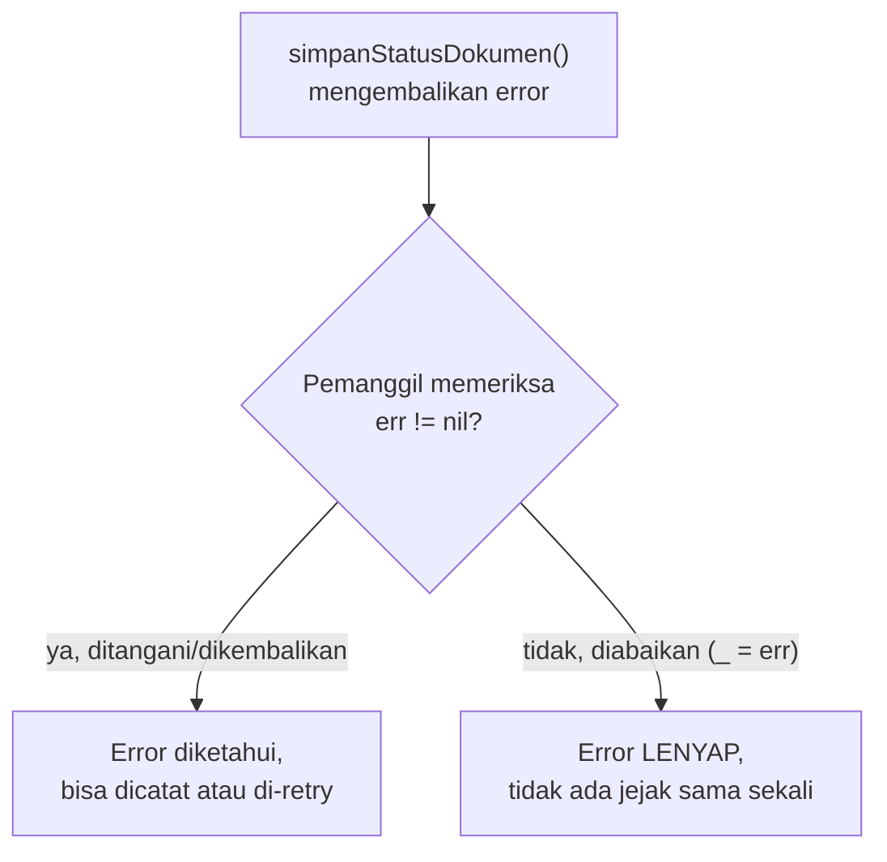

## TL;DR

Go tidak punya exception seperti PHP atau Java. `error` di Go hanyalah sebuah **interface biasa** (dengan satu method, `Error() string`) yang dikembalikan sebagai **nilai return biasa**, umumnya lewat pola `(hasil, error)`. Ini bukan keterbatasan bahasa — ini filosofi desain yang sengaja: error diperlakukan sebagai data yang harus **secara eksplisit** diperiksa di setiap titik pemanggilan, bukan sinyal yang otomatis "melompat" ke penanganan di tempat lain seperti exception. Konsekuensinya dua arah: kode Go jauh lebih eksplisit soal apa yang bisa gagal dan di mana, tapi tidak ada apa pun yang **memaksa** kamu memeriksa error itu — mengabaikannya (`_ = someFunc()`) sepenuhnya legal secara sintaks, dan kompilator tidak akan mengeluh.

## The Problem

Bayangkan seorang engineer yang terbiasa dengan exception PHP menulis kode Go dan mengabaikan return value error dari sebuah operasi penulisan penting — misalnya menyimpan status verifikasi dokumen ke database — dengan asumsi "kalau ada yang salah, pasti akan terlihat sebagai exception di suatu tempat". Kode ini lolos code review karena terlihat pendek dan bersih, lolos testing karena test tidak pernah mensimulasikan kegagalan database.

Berbulan-bulan kemudian, saat audit menemukan sejumlah dokumen yang seharusnya berstatus "terverifikasi" tapi tercatat "draft" di database, penelusuran mengarah tepat ke baris kode itu: penulisan ke database memang gagal secara sporadis (koneksi terputus sesaat, timeout), tapi karena error-nya diabaikan (`_`) alih-alih diperiksa, kegagalan itu tidak pernah tercatat di log, tidak pernah memicu retry, dan tidak pernah diketahui siapa pun sampai audit menemukannya — berbeda total dari exception yang, kalau tidak ditangkap, setidaknya akan terlihat sebagai crash yang jelas.

## Intuition

Bayangkan error di Go seperti **struk yang diberikan setiap kali kamu melakukan transaksi** — kamu harus secara aktif membaliknya dan memeriksa apakah tertulis "berhasil" atau "gagal". Ini berbeda dari exception, yang lebih mirip **alarm otomatis** yang berbunyi keras dan menghentikan segalanya begitu ada masalah, sampai seseorang di suatu tempat mematikannya (`catch`).

Analogi ini bocor pada satu hal krusial: alarm sungguhan **memaksa** perhatian — ia tidak bisa "diam-diam diabaikan" tanpa usaha eksplisit untuk mematikannya. Struk transaksi di Go tidak seperti itu — tidak ada apa pun yang memaksa kamu membacanya. Kalau kamu memilih untuk tidak memeriksanya (`_ = err`), Go tidak akan protes sama sekali, dan kegagalan yang direpresentasikan struk itu lenyap begitu saja, tanpa jejak. Disiplin memeriksa setiap error sepenuhnya budaya dan tooling (linter seperti `errcheck`), bukan dijamin oleh compiler atau runtime.

## How It Works

```go
type error interface {
    Error() string
}
```

Itu saja — `error` hanyalah interface dengan satu method. Function yang bisa gagal mengembalikannya sebagai nilai kedua (konvensi, bukan aturan bahasa yang dipaksakan):

```go
func simpanStatusDokumen(ctx context.Context, id string, status string) error {
    // ...
    return nil // atau: return fmt.Errorf("simpan status: %w", err)
}
```

Pemanggil **harus secara eksplisit** memeriksa `err != nil` di setiap titik pemanggilan. Tidak ada mekanisme otomatis yang "melempar" error ini ke lapisan atas seperti exception — kalau sebuah function tidak secara eksplisit memeriksa dan mengembalikan (atau menangani) error dari function yang dipanggilnya, error itu berhenti di situ, hilang selamanya.



## In Go

```go
// SALAH: error diabaikan sepenuhnya — kalau penulisan gagal,
// tidak ada yang pernah tahu.
func prosesVerifikasiSalah(ctx context.Context, id string) {
    _ = simpanStatusDokumen(ctx, id, "terverifikasi")
}

// BENAR: error diperiksa secara eksplisit dan diteruskan ke pemanggil
// dengan konteks tambahan (lihat Error Wrapping untuk detail %w).
func prosesVerifikasi(ctx context.Context, id string) error {
    if err := simpanStatusDokumen(ctx, id, "terverifikasi"); err != nil {
        return fmt.Errorf("proses verifikasi dokumen %s: %w", id, err)
    }
    return nil
}
```

Kapan memakai `panic` alih-alih `error`? Aturan praktis: `error` untuk kegagalan yang **diharapkan bisa terjadi** dan pemanggil punya cara masuk akal untuk menanganinya (dokumen tidak ditemukan, koneksi database gagal, input tidak valid) — `panic` hanya untuk bug programmer yang sungguh tidak seharusnya terjadi (index di luar batas array, invariant internal yang dilanggar) di mana melanjutkan eksekusi normal tidak masuk akal sama sekali.

```go
func ambilDokumen(id string) (*Dokumen, error) {
    doc, ditemukan := storage[id]
    if !ditemukan {
        // "Tidak ditemukan" adalah kondisi yang DIHARAPKAN bisa terjadi —
        // pemanggil (misalnya handler HTTP) tahu persis cara menanganinya
        // (kembalikan 404). Ini error, BUKAN panic.
        return nil, fmt.Errorf("dokumen %s: %w", id, ErrNotFound)
    }
    return doc, nil
}
```

## In His Stack

**PHP (Yii1/Yii2)** memakai exception sebagai mekanisme error handling utama — sebuah exception yang tidak ditangkap secara otomatis "melompat" ke atas lewat call stack sampai ditemukan `catch` yang cocok, atau sampai ke exception handler global Yii yang mengubahnya jadi response error HTTP. Model ini membuat engineer PHP terbiasa dengan asumsi "kalau saya lupa menangani, setidaknya akan terlihat sebagai error 500 di suatu tempat". Di Go, asumsi itu **tidak berlaku** — error yang diabaikan bukan crash yang terlihat, ia adalah kegagalan yang lenyap tanpa jejak. Ini pergeseran mental paling penting saat pindah dari PHP ke Go: disiplin memeriksa `if err != nil` di **setiap** titik yang relevan bukan formalitas, ia adalah satu-satunya jaring pengaman yang ada.

## Trade-offs and When Not To Use It

Model error-as-value membuat kode lebih verbose (`if err != nil { return err }` berulang di banyak tempat) dibanding exception yang bisa ditangkap sekali di satu tempat untuk banyak lapisan panggilan. Trade-off ini disengaja: setiap titik yang bisa gagal terlihat eksplisit di kode, tidak ada "lompatan tak terlihat" yang membuat alur kontrol sulit dinalar. Untuk tim yang datang dari bahasa berbasis exception, verbosity ini sering terasa seperti kemunduran di awal — tapi ia menghilangkan seluruh kelas bug di mana error dari lapisan dalam "menghilang" secara tidak sengaja karena tidak ada `catch` yang tepat di lapisan yang benar.

## Common Mistakes

> [!warning] Jebakan
> Mengabaikan return value error dengan `_ = someFunc()`, terutama untuk operasi penulisan data yang penting. Tidak ada mekanisme bahasa yang memaksa error ini diperiksa — begitu diabaikan, kegagalan itu lenyap tanpa jejak sama sekali.

> [!warning] Jebakan
> Memakai `panic` untuk kondisi kegagalan yang sebenarnya diharapkan bisa terjadi dan punya cara penanganan yang jelas (data tidak ditemukan, validasi gagal). `panic` seharusnya diperlakukan sebagai sinyal "ada bug programmer", bukan sebagai pengganti `error` untuk alur kontrol normal.

> [!warning] Jebakan
> Berasumsi error akan "otomatis merambat ke atas" seperti exception tanpa perlu ditulis eksplisit. Setiap lapisan function harus secara eksplisit memeriksa dan mengembalikan (atau menangani) error dari function yang dipanggilnya — melewatkan satu lapisan saja membuat sinyal kegagalan berhenti di situ.

## Exercises

1. Apa itu `error` di Go secara teknis, dan kenapa disebut sebagai "nilai biasa" bukan mekanisme bahasa khusus?
2. Kenapa mengabaikan error dengan `_ = someFunc()` lebih berbahaya secara diam-diam dibanding exception yang tidak tertangkap di PHP?
3. Sebutkan aturan praktis kapan memakai `error` dan kapan memakai `panic`.
4. Desain terbuka: sebuah tim baru pindah dari PHP ke Go dan terbiasa menaruh satu blok penanganan error besar di lapisan paling atas (mirip exception handler global Yii), dengan asumsi error dari lapisan mana pun akan "sampai" ke sana. Rancang panduan praktis dan (kalau relevan) tooling yang bisa membantu tim ini membangun disiplin memeriksa error di setiap lapisan, tanpa membuat kode jadi berantakan penuh `if err != nil` yang berulang tanpa makna.

> [!success]- Kunci jawaban
> Panduan praktis: setiap function yang mengembalikan error harus diperiksa **di titik pemanggilannya langsung** — kalau errornya tidak bisa ditangani bermakna di situ, teruskan (return) ke pemanggil dengan konteks tambahan (lihat [[Error Wrapping]]), jangan pernah diteruskan secara diam-diam lewat `_`. Untuk mencegah pola lama (satu handler besar di atas) terulang, adopsi layering yang jelas (lihat [[../90 Architecture and Design/Handler-Service-Repository Layering|Handler-Service-Repository Layering]]) di mana setiap layer (repository, service, handler) punya tanggung jawab jelas menangani atau meneruskan error jenis tertentu — repository mengembalikan error teknis (koneksi gagal, tidak ditemukan), service menerjemahkannya jadi error domain bisnis, handler HTTP menerjemahkan error domain jadi status code yang tepat. Untuk tooling, jalankan linter seperti `errcheck` di CI supaya error yang diabaikan tanpa sengaja terdeteksi otomatis sebelum merge, bukan ditemukan lewat audit berbulan-bulan kemudian.

## Self-Check

- Apa itu `error` secara teknis di Go?
- Kenapa mengabaikan error di Go tidak menghasilkan crash yang terlihat seperti exception tak tertangkap?
- Kapan sebaiknya memakai `panic` alih-alih `error`?
- Apa risiko dari asumsi "error akan otomatis merambat ke atas" di Go?

## Connected Notes

- [[The Go Type System]] — prasyarat: `error` hanyalah salah satu interface biasa, memenuhi aturan implicit satisfaction yang sama seperti interface lain.
- [[Defer, Panic, and Recover]] — kontras langsung: panic/recover sengaja dipisahkan dari alur error normal yang dijelaskan di note ini.
- [[Error Wrapping]] — kelanjutan langsung: cara menambahkan konteks pada error saat diteruskan ke lapisan atas.
- [[../90 Architecture and Design/Handler-Service-Repository Layering|Handler-Service-Repository Layering]] — layering yang memberi tempat jelas untuk menangani setiap jenis error di lapisan yang tepat.
- [[../30 APIs and Web/Consistent Error Responses|Consistent Error Responses]] — bagaimana error yang sudah diperiksa dan diteruskan dengan benar akhirnya diterjemahkan jadi response API yang konsisten.

## Further Reading

- Artikel resmi *"Error handling and Go"* di blog resmi Go (go.dev/blog) — penjelasan otoritatif filosofi ini langsung dari tim Go.

## Catatan Saya

*Tulis di sini kalau kamu (atau timmu) pernah mengabaikan error di Go yang ternyata menyebabkan masalah nyata baru diketahui jauh kemudian.*
