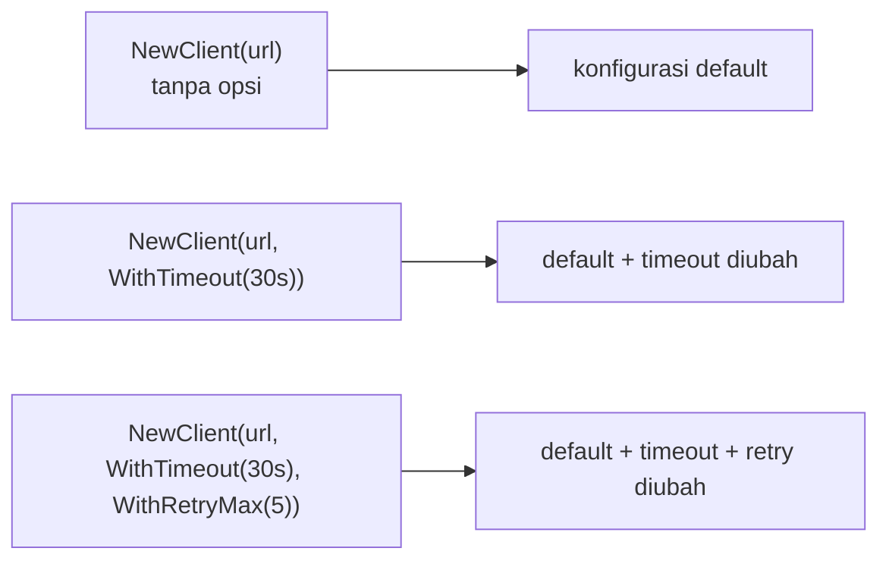

## TL;DR

Go tidak punya function overloading atau parameter default seperti bahasa lain — sebuah fungsi hanya punya satu signature. Ini jadi masalah nyata untuk constructor yang butuh banyak parameter opsional: `NewServer(host, port, timeout, maxConns, tlsEnabled, retryPolicy, ...)` dengan banyak nilai default yang jarang berubah membuat pemanggilan jadi tidak terbaca, dan menambah parameter baru berarti **breaking change** bagi setiap pemanggil yang sudah ada. Functional options menyelesaikan ini dengan pola: constructor menerima nilai wajib plus variadic `...Option`, masing-masing `Option` adalah fungsi yang memodifikasi konfigurasi internal — parameter baru bisa ditambahkan tanpa pernah mengubah signature constructor yang sudah ada, sebuah properti yang sangat berharga untuk stabilitas API jangka panjang.

## The Problem

Sebuah library HTTP client internal awalnya punya constructor sederhana: `NewClient(baseURL string) *Client`. Enam bulan kemudian, kebutuhan bertambah: beberapa pemakai butuh mengatur timeout kustom, beberapa butuh retry policy, beberapa butuh header default. Tim menambahkannya sebagai parameter baru: `NewClient(baseURL string, timeout time.Duration, retryMax int) *Client` — perubahan ini **memecah** setiap pemanggilan yang sudah ada di lima belas tempat berbeda di 13 aplikasi, karena signature function berubah total. Developer yang tidak butuh mengatur timeout kustom sekalipun terpaksa mengetahui dan mengisi parameter itu (biasanya dengan nilai default yang harus diketahui dan diulang di setiap pemanggilan), dan setiap penambahan parameter baru di masa depan akan mengulang masalah yang sama.

Alternatif "menambah banyak constructor terpisah" (`NewClient`, `NewClientWithTimeout`, `NewClientWithRetry`, `NewClientWithTimeoutAndRetry`, ...) berkembang jadi kombinatorial secepat jumlah opsi bertambah — untuk lima opsi independen, secara teoretis butuh puluhan kombinasi constructor untuk mencakup semua kemungkinan, jelas tidak praktis dipelihara.

## Intuition

Bayangkan functional options seperti **memesan kopi di kedai dengan formulir pesanan standar plus catatan tambahan opsional**, dibanding memesan lewat kombinasi menu tetap yang harus mencakup setiap variasi (kopi-susu-gula-panas, kopi-susu-tanpa-gula-panas, kopi-tanpa-susu-gula-dingin, dst.). Kamu cukup bilang "satu kopi" (nilai wajib), lalu menambahkan catatan opsional sebanyak yang kamu mau ("tanpa gula", "extra shot", "pakai gelas sendiri") — barista menerapkan setiap catatan itu satu per satu ke pesanan dasarmu, dan menambah jenis catatan baru di masa depan ("less ice") tidak mengharuskan mengubah cara kamu memesan kopi yang sudah biasa kamu lakukan sama sekali.

Analogi ini bocor pada satu hal: catatan pesanan kopi diproses manusia yang bisa menafsirkan permintaan yang saling bertentangan (misalnya "panas" dan "dingin" sekaligus) dengan penilaian. Functional options di Go diterapkan berurutan secara mekanis tanpa penilaian semacam itu — kalau dua opsi saling bertentangan diterapkan, opsi yang diterapkan **terakhir** menang begitu saja (kode dieksekusi berurutan), dan mendeteksi konflik semacam itu (kalau memang perlu) adalah tanggung jawab implementasi opsi itu sendiri, bukan sesuatu yang otomatis ditangani pola ini.

## How It Works

```go
package httpclient

import "time"

type konfigurasi struct {
	timeout    time.Duration
	retryMax   int
	headerDefault map[string]string
}

// Option adalah tipe fungsi yang memodifikasi konfigurasi internal —
// setiap fungsi WithXxx() di bawah mengembalikan Option, bukan langsung
// mengubah struct Client, menjaga struct konfigurasi tetap tidak diekspor
// (private) dan detail implementasinya bisa berubah bebas.
type Option func(*konfigurasi)

func WithTimeout(d time.Duration) Option {
	return func(k *konfigurasi) {
		k.timeout = d
	}
}

func WithRetryMax(n int) Option {
	return func(k *konfigurasi) {
		k.retryMax = n
	}
}

func WithHeaderDefault(key, value string) Option {
	return func(k *konfigurasi) {
		if k.headerDefault == nil {
			k.headerDefault = make(map[string]string)
		}
		k.headerDefault[key] = value
	}
}

type Client struct {
	baseURL string
	konfigurasi
}

// NewClient menerima HANYA nilai wajib (baseURL) plus variadic Option —
// pemanggil yang tidak butuh opsi apa pun cukup NewClient(url), dan
// menambah opsi baru di masa depan TIDAK PERNAH mengubah signature ini.
func NewClient(baseURL string, opts ...Option) *Client {
	k := konfigurasi{
		timeout:  10 * time.Second, // default wajar tanpa opsi eksplisit
		retryMax: 3,
	}
	for _, opt := range opts {
		opt(&k)
	}

	return &Client{baseURL: baseURL, konfigurasi: k}
}

func contohPenggunaan() {
	// Pemanggilan paling sederhana — tidak perlu tahu apa pun soal opsi.
	_ = NewClient("https://api.partner.example.gov.id")

	// Pemanggilan dengan opsi, urutan bebas, hanya yang relevan disebut.
	_ = NewClient(
		"https://api.partner.example.gov.id",
		WithTimeout(30*time.Second),
		WithRetryMax(5),
	)
}
```



Diagram ini menunjukkan fleksibilitas inti: jumlah dan kombinasi opsi yang dipakai bebas ditentukan pemanggil, tanpa perlu constructor terpisah untuk setiap kombinasi — satu constructor menangani seluruh spektrum dari "tanpa opsi sama sekali" sampai "semua opsi dipakai sekaligus".

## Under The Hood

Properti paling berharga dari pola ini untuk **stabilitas API jangka panjang** (dibahas lebih dalam di [[Designing Stable Library APIs]]): menambah `Option` baru (`WithCircuitBreaker(...)`, misalnya) di masa depan **tidak pernah** mengubah signature `NewClient`, karena parameter yang diterima tetap `baseURL string, opts ...Option` — kode pemanggil yang sudah ada, ditulis kapan pun sebelumnya, tetap compile dan berjalan tanpa perubahan, karena hanya menambah **implementasi baru** di dalam tipe `Option`, bukan mengubah kontrak fungsi yang sudah dipublikasikan. Ini kontras tajam dengan menambah parameter positional baru, yang selalu breaking change bagi seluruh pemanggil yang ada — perbedaan yang relevan langsung dengan [[../90 Architecture and Design/Semantic Versioning|Semantic Versioning]]: functional options membantu menambah fitur sebagai perubahan `MINOR` (backward compatible), bukan `MAJOR`.

Konfigurasi internal (`konfigurasi` di atas) sengaja **tidak diekspor** (huruf kecil) — pemanggil di luar package tidak bisa (dan tidak perlu) tahu struktur internalnya, hanya berinteraksi lewat fungsi `WithXxx()` yang diekspos. Ini menjaga detail implementasi tetap bisa berubah bebas (menambah field baru ke `konfigurasi`, mengubah tipe internal) tanpa memengaruhi kontrak publik sama sekali.

## In Go

```go
package server

import "time"

// Contoh yang lebih realistis: functional options untuk server HTTP
// dengan validasi di dalam Option itu sendiri — pola yang memberi
// kesempatan opsi memvalidasi nilainya sendiri, bukan sekadar assignment.
type Server struct {
	port         int
	readTimeout  time.Duration
	writeTimeout time.Duration
	err          error // menampung error validasi dari Option, diperiksa di akhir
}

type Option func(*Server)

func WithPort(port int) Option {
	return func(s *Server) {
		if port < 1 || port > 65535 {
			s.err = errPortTidakValid(port)
			return
		}
		s.port = port
	}
}

func errPortTidakValid(port int) error {
	return &portError{port: port}
}

type portError struct{ port int }

func (e *portError) Error() string {
	return "port tidak valid: harus antara 1-65535"
}

func NewServer(opts ...Option) (*Server, error) {
	s := &Server{
		port:         8080,
		readTimeout:  5 * time.Second,
		writeTimeout: 10 * time.Second,
	}
	for _, opt := range opts {
		opt(s)
		if s.err != nil {
			return nil, s.err
		}
	}
	return s, nil
}
```

Pola ini menunjukkan bahwa `Option` bisa melakukan validasi sendiri, bukan sekadar assignment mentah — mengumpulkan error validasi dan mengembalikannya lewat return value kedua dari constructor (`(*Server, error)`), konsisten dengan filosofi Go menangani error sebagai nilai eksplisit (lihat [[Errors as Values]]), bukan panic di tengah rantai konfigurasi.

## In His Stack

Untuk library internal yang dipakai lintas 13 aplikasi (misalnya client HTTP standar untuk memanggil API partner eksternal, atau wrapper koneksi database), functional options adalah pola yang sangat bernilai justru karena kebutuhan konfigurasi berbeda antar aplikasi (beberapa butuh timeout lebih panjang, beberapa butuh retry lebih agresif) sementara API dasar harus tetap stabil untuk seluruh 13 tim pemakai. Dibanding pola Yii2 yang sering memakai array konfigurasi asosiatif (`new Client(['timeout' => 30, 'retry' => 5])`) — yang juga fleksibel tapi kehilangan pengecekan tipe compiler dan tidak memberi kesempatan validasi per opsi — functional options di Go memberi fleksibilitas yang setara dengan keamanan tipe yang jauh lebih kuat.

## Trade-offs and When Not To Use It

Functional options menambah boilerplate nyata — setiap opsi butuh fungsi `WithXxx()` terpisah, dan untuk struct dengan hanya dua atau tiga field opsional yang jarang berubah, pola ini bisa terasa berlebihan dibanding sekadar struct konfigurasi biasa yang di-passing langsung (`NewClient(baseURL string, cfg Config)`) — pola struct konfigurasi eksplisit ini juga valid dan lebih sederhana untuk kasus yang tidak butuh evolusi API jangka panjang yang rumit. Functional options paling bernilai justru untuk **library publik atau dipakai lintas tim** yang stabilitas API-nya penting dan kebutuhan konfigurasinya diperkirakan akan terus bertambah seiring waktu — untuk kode internal satu aplikasi yang jarang dipanggil dari banyak tempat, kompleksitas tambahan pola ini belum tentu sepadan.

## Common Mistakes

> [!warning] Jebakan
> Memakai functional options untuk struct sederhana dengan sedikit field yang jarang berubah — menambah boilerplate tanpa manfaat nyata dibanding struct konfigurasi biasa yang lebih sederhana ditulis dan dibaca.

> [!warning] Jebakan
> Menyimpan error validasi opsi tapi lupa memeriksanya sebelum mengembalikan objek yang sudah dikonstruksi — objek yang "berhasil" dibuat padahal salah satu opsinya sebenarnya gagal divalidasi, menunda kegagalan ke titik yang lebih membingungkan di kemudian hari.

> [!warning] Jebakan
> Mengekspos struct konfigurasi internal (huruf besar, bisa diakses langsung dari luar package) alih-alih menjaganya privat — menghilangkan kebebasan mengubah detail implementasi konfigurasi tanpa memengaruhi kontrak publik, salah satu manfaat utama pola ini.

## Exercises

1. Jelaskan kenapa menambah parameter baru ke constructor biasa selalu breaking change, sementara menambah `Option` baru tidak.
2. Kenapa struct konfigurasi internal pada functional options sebaiknya tidak diekspor (huruf kecil)?
3. Kapan struct konfigurasi biasa (passing langsung) lebih tepat dibanding functional options?
4. Desain terbuka: kamu merancang library `NewKonsumerKafka(topik string, opts ...Option)` yang akan dipakai lintas beberapa tim untuk konsumsi pesan Kafka, dengan kebutuhan konfigurasi yang diperkirakan terus bertambah (consumer group, offset awal, jumlah worker paralel, dead letter queue). Rancang minimal tiga fungsi `Option` untuk kebutuhan ini, dan jelaskan bagaimana desain ini melindungi seluruh tim pemakai dari breaking change setiap kali kebutuhan konfigurasi baru muncul di masa depan.

> [!success]- Kunci jawaban
> **1.** Constructor biasa dengan parameter positional (`NewClient(url, timeout, retry)`) mengikat pemanggil pada **urutan dan jumlah** parameter yang persis sama setiap kali — menambah parameter baru (bahkan di akhir) mengubah signature fungsi, yang berarti setiap pemanggilan yang sudah ada (yang menyediakan jumlah argumen sesuai signature lama) akan gagal compile terhadap signature baru. Functional options menjaga signature constructor tetap konstan (`baseURL string, opts ...Option`) selamanya — menambah kemampuan baru berarti menambah **fungsi `WithXxx()` baru**, sebuah penambahan murni yang tidak menyentuh atau mengubah apa pun yang sudah ada, sehingga kode pemanggil lama tetap valid tanpa perubahan apa pun.
> **4.** Tiga opsi minimal: `WithConsumerGroup(nama string) Option`, `WithOffsetAwal(offset Offset) Option` (misalnya `OffsetTerlama`/`OffsetTerbaru`), dan `WithJumlahWorker(n int) Option`. Desain ini melindungi seluruh tim pemakai karena setiap tim hanya memanggil opsi yang relevan untuk kebutuhan mereka (`NewKonsumerKafka("topik-permohonan", WithConsumerGroup("tim-a"))`), dan begitu kebutuhan baru muncul (misalnya `WithDeadLetterQueue(topikDLQ string) Option` ditambahkan bulan depan), seluruh pemanggilan yang sudah ada di kode 13 aplikasi **tidak perlu diubah sama sekali** — mereka tetap compile dan berjalan seperti sebelumnya, dan hanya tim yang benar-benar butuh fitur dead letter queue yang perlu menambahkan satu baris `WithDeadLetterQueue(...)` ke pemanggilan mereka sendiri, kapan pun mereka siap mengadopsinya.

## Self-Check

- Kenapa menambah parameter constructor biasa selalu breaking change?
- Kenapa struct konfigurasi internal pada functional options sebaiknya privat?
- Bagaimana pola ini memberi kesempatan validasi per opsi, dan kenapa itu berguna?
- Kapan functional options adalah overhead yang tidak sepadan?

## Connected Notes

- [[Embedding]] — struct embedding sering dikombinasikan dengan functional options untuk membangun konfigurasi bertingkat pada tipe yang lebih kompleks.
- [[Designing Stable Library APIs]] — functional options adalah salah satu teknik konkret utama untuk mencapai stabilitas API jangka panjang, dibahas prinsip umumnya di note berikutnya.
- [[../90 Architecture and Design/Semantic Versioning|Semantic Versioning]] — kemampuan menambah fitur tanpa breaking change lewat pola ini adalah alasan konkret sebuah perubahan API bisa tetap dianggap MINOR, bukan MAJOR.
- [[Errors as Values]] — validasi di dalam Option yang mengumpulkan error dan mengembalikannya lewat return value constructor adalah aplikasi langsung filosofi error Go yang dijelaskan di note itu.
- [[../90 Architecture and Design/Manual Dependency Injection in Go|Manual Dependency Injection in Go]] — functional options sering dipakai berdampingan dengan constructor injection untuk mengonfigurasi dependency yang disuntikkan.

## Further Reading

- Rob Pike, "Self-referential functions and the design of options" (artikel blog pribadi) — salah satu tulisan awal yang mempopulerkan pola ini di komunitas Go.

## Catatan Saya

*Tulis di sini apakah ada constructor di kerjaanmu yang sudah "kebanyakan parameter" dan bisa disederhanakan dengan functional options.*
