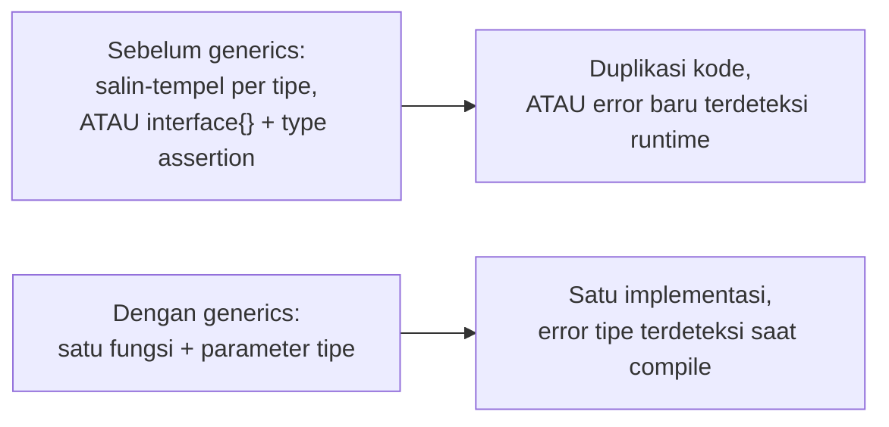

## TL;DR

Sebelum generics ditambahkan ke bahasa, menulis fungsi yang bekerja untuk banyak tipe data di Go berarti memilih salah satu dari dua hal yang sama-sama tidak memuaskan: menyalin-tempel fungsi yang identik untuk setiap tipe (`JumlahInt`, `JumlahFloat64`, dst.), atau memakai `interface{}` (sekarang `any`) dan kehilangan pengecekan tipe saat kompilasi, mengandalkan type assertion yang bisa panic di runtime kalau salah. Generics memberi jalan tengah: fungsi dan tipe bisa ditulis **sekali** dengan parameter tipe, dan compiler tetap memverifikasi kebenaran tipe pada saat kompilasi — bukan runtime — untuk setiap pemanggilan dengan tipe konkret yang berbeda.

## The Problem

Sebuah fungsi `Maksimum(a, b int) int` bekerja baik untuk `int`, tapi tim segera butuh versi yang sama untuk `float64` (menghitung nilai maksimum dari dua skor desimal) dan `string` (membandingkan dua kode referensi secara leksikografis). Sebelum generics, solusi paling umum adalah menulis ulang fungsi yang identik strukturnya tiga kali (`MaksimumInt`, `MaksimumFloat64`, `MaksimumString`) — logika yang sama persis, hanya beda tipe, disalin manual dan harus dipelihara tiga kali kalau ada bug atau perubahan logika di masa depan.

Alternatif lain sebelum generics — memakai `interface{}` sebagai parameter dan type assertion di dalam fungsi — menghilangkan duplikasi kode, tapi menghilangkan jaminan keamanan tipe compiler bersamanya: `Maksimum(a, b interface{}) interface{}` menerima **apa pun**, termasuk kombinasi tipe yang tidak masuk akal (`Maksimum(5, "halo")`), dan kesalahan semacam ini baru terdeteksi saat program **dijalankan** (panic di type assertion), bukan saat kode di-compile — persis jenis bug yang di bahasa dengan sistem tipe kuat seperti Go seharusnya bisa dicegah sejak awal.

## Intuition

Bayangkan generics seperti **cetakan kue yang bentuknya tetap, tapi bisa dipakai untuk adonan apa pun** — cetakan bintang tetap menghasilkan bentuk bintang, entah adonannya cokelat, vanila, atau red velvet, tanpa perlu membuat cetakan terpisah untuk setiap rasa adonan. Yang penting, kamu tetap **menyatakan** rasa adonan yang dipakai (bukan "adonan apa saja tanpa aturan"), dan cetakan itu menjamin bentuk akhirnya konsisten terlepas dari rasa yang dipilih.

Analogi ini bocor pada satu hal: cetakan kue fisik tidak "memeriksa" apakah adonan yang dituang benar-benar valid sebagai adonan kue (bisa saja seseorang menuang lumpur ke cetakan itu). Generics di Go, lewat **constraint** (batasan tipe), justru menegakkan pemeriksaan ini secara eksplisit — parameter tipe bisa dibatasi hanya menerima tipe yang mendukung operasi tertentu (misalnya hanya tipe yang bisa dibandingkan dengan `<`), sehingga compiler menolak pemanggilan dengan tipe yang tidak memenuhi batasan itu, jauh sebelum kode sempat dijalankan.

## How It Works

```go
package main

import "fmt"

// Constraint tipe: T harus salah satu dari tipe numerik atau string yang
// mendukung operator pembanding (<, >). "constraints.Ordered" adalah
// constraint umum yang sering dipakai (dari package golang.org/x/exp/constraints
// atau didefinisikan manual seperti contoh di bawah).
type Ordered interface {
	~int | ~int64 | ~float64 | ~string
}

// Maksimum ditulis SEKALI, bekerja untuk int, float64, string, atau tipe
// apa pun yang memenuhi constraint Ordered — compiler memverifikasi
// kebenaran tipe di setiap titik pemanggilan, tanpa type assertion runtime.
func Maksimum[T Ordered](a, b T) T {
	if a > b {
		return a
	}
	return b
}

func main() {
	fmt.Println(Maksimum(3, 7))         // int
	fmt.Println(Maksimum(2.5, 1.8))     // float64
	fmt.Println(Maksimum("abc", "abd")) // string

	// Maksimum(5, "halo") // TIDAK COMPILE — kesalahan tertangkap saat build,
	// bukan panic saat runtime seperti pendekatan interface{} lama.
}
```



Diagram ini menunjukkan pergeseran inti: generics memindahkan pemeriksaan kebenaran tipe dari **runtime** (type assertion yang bisa panic) ke **compile time** (compiler menolak kode yang salah sebelum program pernah dijalankan), sekaligus menghilangkan duplikasi kode yang sebelumnya jadi trade-off untuk mendapat keamanan tipe itu.

**Tanda `~`** di constraint (`~int`) berarti "tipe apa pun yang **underlying type**-nya `int`", bukan hanya `int` itu sendiri — penting karena banyak kode mendefinisikan tipe custom berbasis `int` (`type StatusCode int`), dan tanpa `~`, constraint `int` murni akan menolak tipe custom itu meski secara struktural identik dengan `int`.

## Under The Hood

Generics di Go diimplementasikan lewat pendekatan yang disebut **GC shape stenciling** — bukan generate kode terpisah untuk setiap tipe konkret secara naif (yang akan membengkakkan ukuran binary drastis), dan bukan pula murni lewat interface/boxing seperti beberapa bahasa lain (yang akan menambah overhead runtime signifikan). Go mengelompokkan tipe-tipe dengan "bentuk" memori yang identik (misalnya semua tipe pointer punya ukuran dan representasi yang sama) untuk berbagi satu implementasi kode mesin, sementara tipe dengan ukuran berbeda (`int32` vs `int64`, misalnya) mungkin tetap mendapat instansiasi kode terpisah — pendekatan hybrid yang menyeimbangkan ukuran binary dengan performa runtime.

> [!question] Perlu diverifikasi
> Klaim: detail mekanisme "GC shape stenciling" persis seperti dijelaskan di atas.
> Kenapa ragu: ini adalah detail implementasi internal compiler Go yang cukup teknis dan berpotensi terus disempurnakan antar versi rilis Go.
> Cara verifikasi: dokumentasi desain resmi Go tentang implementasi generics (proposal dan technical design doc di repository Go).

Penting dipahami: generics **tidak menggantikan** interface — keduanya menyelesaikan masalah berbeda. Interface (lihat [[Interfaces and Implicit Satisfaction]]) mendefinisikan **perilaku** yang harus dipenuhi tipe apa pun (polymorphism berbasis method). Generics mendefinisikan **hubungan tipe** antar parameter dan return value suatu fungsi/struct, memastikan compiler tahu tipe konkret apa yang sedang dipakai di setiap pemanggilan — keduanya sering dipakai bersama (constraint generics sering **adalah** sebuah interface).

## In Go

```go
package cache

import "sync"

// CachePeriksa adalah struct generic — bekerja untuk cache dengan tipe key
// dan value apa pun, tanpa perlu menulis ulang struct ini untuk setiap
// kombinasi tipe yang berbeda.
type CachePeriksa[K comparable, V any] struct {
	mu   sync.RWMutex
	data map[K]V
}

func NewCachePeriksa[K comparable, V any]() *CachePeriksa[K, V] {
	return &CachePeriksa[K, V]{data: make(map[K]V)}
}

// Ambil mengembalikan value dan flag keberadaannya — signature ini TETAP
// type-safe: pemanggil CachePeriksa[string, int] akan mendapat (int, bool),
// bukan (interface{}, bool) yang butuh type assertion tambahan.
func (c *CachePeriksa[K, V]) Ambil(key K) (V, bool) {
	c.mu.RLock()
	defer c.mu.RUnlock()
	v, ada := c.data[key]
	return v, ada
}

func (c *CachePeriksa[K, V]) Simpan(key K, value V) {
	c.mu.Lock()
	defer c.mu.Unlock()
	c.data[key] = value
}

func contohPenggunaan() {
	cacheSesi := NewCachePeriksa[string, int64]() // K=string, V=int64
	cacheSesi.Simpan("sesi-abc", 42)

	userID, ada := cacheSesi.Ambil("sesi-abc")
	if ada {
		_ = userID // userID sudah bertipe int64, tanpa type assertion
	}
}
```

`comparable` di sini adalah constraint bawaan Go — memastikan tipe `K` bisa dipakai sebagai key `map` (mendukung operator `==`), constraint yang tidak bisa dinyatakan sebelum generics ada tanpa kehilangan keamanan tipe sama sekali.

## In His Stack

Sebelum Go 1.18 (rilis yang memperkenalkan generics), banyak library Go (termasuk sebagian kode yang mungkin sudah ada di ekosistem kerja) memakai `interface{}` secara luas untuk fungsi utilitas generik — kode itu masih valid dan berjalan, tapi migrasi bertahap ke generics untuk fungsi utilitas baru (bukan API publik yang sudah stabil dan dipakai luas, lihat [[Designing Stable Library APIs]]) memberi keamanan tipe tambahan tanpa biaya performa signifikan. Untuk kode yang berinteraksi dengan Yii2/PHP lewat API (JSON), generics tidak banyak berperan langsung — JSON marshalling tetap bekerja lewat `interface{}`/reflection di baliknya (lihat [[../20 Go Language/Struct Tags and JSON Marshalling|Struct Tags and JSON Marshalling]]), tapi generics tetap sangat berguna untuk logika bisnis internal yang generik (cache, koleksi data, helper query) yang sebelumnya terpaksa memakai `interface{}` atau duplikasi kode.

## Trade-offs and When Not To Use It

Generics menambah kompleksitas sintaksis yang nyata — kode dengan banyak constraint bertingkat bisa menjadi sulit dibaca dibanding versi non-generic yang eksplisit per tipe, terutama bagi developer yang belum terbiasa dengan notasi constraint. Untuk fungsi yang **hanya** pernah dipakai dengan satu tipe konkret (dan tidak ada rencana realistis untuk tipe lain), menulis versi generic dari awal adalah abstraksi prematur yang menambah kerumitan tanpa manfaat nyata — tulis versi konkret dulu, generalisasi ke generic **setelah** benar-benar terbukti dibutuhkan lebih dari satu tipe, bukan sebaliknya. Generics juga tidak selalu memberi performa yang identik dengan kode non-generic yang ditulis tangan untuk satu tipe spesifik — untuk kode yang sangat sensitif performa, benchmark tetap perlu dijalankan (lihat domain `50 Concurrency and Performance`) untuk memastikan generics tidak memperkenalkan overhead tak terduga pada kasus tertentu.

## Common Mistakes

> [!warning] Jebakan
> Menulis fungsi generic untuk kasus yang hanya pernah dipakai satu tipe, "untuk jaga-jaga masa depan" — menambah kompleksitas sintaksis tanpa manfaat nyata; generalisasi sebaiknya menyusul kebutuhan nyata, bukan mendahuluinya.

> [!warning] Jebakan
> Lupa tanda `~` di constraint saat perlu menerima tipe custom yang underlying type-nya cocok (`type StatusCode int`) — constraint `int` murni tanpa `~` akan menolak `StatusCode` meski secara struktural identik.

> [!warning] Jebakan
> Mengira generics menggantikan kebutuhan interface sepenuhnya — keduanya menyelesaikan masalah berbeda (hubungan tipe vs kontrak perilaku) dan sering dipakai berdampingan, bukan saling menggantikan.

## Exercises

1. Jelaskan kenapa generics memindahkan pemeriksaan kebenaran tipe dari runtime ke compile time, dibanding pendekatan `interface{}` + type assertion.
2. Apa fungsi tanda `~` dalam constraint tipe, dan kapan ia dibutuhkan?
3. Jelaskan perbedaan tujuan generics dan interface — kenapa keduanya bukan konsep yang saling menggantikan?
4. Desain terbuka: kamu punya tiga fungsi terpisah yang identik strukturnya — `FilterPermohonanAktif`, `FilterDokumenTervalidasi`, `FilterPetugasOnDuty` — masing-masing menerima slice dari tipe berbeda dan mengembalikan sub-slice yang memenuhi kondisi tertentu. Rancang satu fungsi generic yang menggantikan ketiganya, dan jelaskan constraint tipe apa (kalau ada) yang dibutuhkan parameternya.

> [!success]- Kunci jawaban
> **1.** Dengan `interface{}`, compiler tidak tahu apa-apa soal tipe konkret yang sebenarnya dipakai — ia menerima **apa pun**, dan kode di dalam fungsi harus melakukan type assertion (`v.(int)`, misalnya) untuk mengakses nilai dengan tipe spesifik; kalau tipe yang dikirim ternyata tidak sesuai, ini baru terdeteksi saat assertion itu dijalankan (panic). Dengan generics, parameter tipe (`T`) dinyatakan eksplisit di signature fungsi, dan compiler memverifikasi setiap pemanggilan terhadap tipe yang benar-benar dikirim **sebelum** program dijalankan — kesalahan tipe menjadi error kompilasi, bukan panic runtime.
> **4.** Fungsi generic: `func Filter[T any](item []T, kondisi func(T) bool) []T` — menerima slice dari tipe apa pun (`T any`, tidak butuh constraint khusus karena hanya perlu menyimpan dan mengembalikan nilai, tidak melakukan operasi spesifik pada `T` seperti perbandingan) dan sebuah fungsi kondisi yang menentukan apakah satu elemen lolos filter. Pemanggilan menjadi `Filter(daftarPermohonan, func(p Permohonan) bool { return p.Status == "aktif" })`, `Filter(daftarDokumen, func(d Dokumen) bool { return d.Tervalidasi })`, dan seterusnya — logika iterasi dan filtering ditulis sekali, hanya kondisi spesifik per tipe yang berbeda-beda, dikirim sebagai fungsi terpisah alih-alih diduplikasi ke tiga fungsi identik.

## Self-Check

- Kenapa generics dianggap jalan tengah antara duplikasi kode dan `interface{}`?
- Apa fungsi constraint tipe dalam generics?
- Kapan menulis fungsi generic adalah abstraksi prematur?
- Apa perbedaan mendasar antara generics dan interface?

## Connected Notes

- [[Interfaces and Implicit Satisfaction]] — constraint generics sering berupa interface itu sendiri; kedua mekanisme saling melengkapi, bukan saling menggantikan.
- [[The Go Type System]] — generics adalah perluasan sistem tipe Go yang dijelaskan fondasinya di note itu.
- [[Reflection and Its Costs]] — alternatif lama untuk kode generik sebelum generics ada (memakai reflection dengan `interface{}`), dengan trade-off performa yang jauh berbeda, dibahas di note berikutnya.
- [[../50 Concurrency and Performance/_Overview|Concurrency and Performance Overview]] — benchmark generics vs kode non-generic spesifik tipe adalah praktik yang relevan dengan domain profiling dan benchmarking di sana.
- [[Designing Stable Library APIs]] — keputusan memakai generics di API publik punya implikasi stabilitas jangka panjang yang dibahas lebih dalam di note itu.

## Further Reading

- Dokumentasi resmi Go, "A Tutorial for Generics" (go.dev) — pengantar resmi konsep dan sintaks generics.
- Proposal desain resmi Go untuk generics (golang/proposal repository) — rujukan mendalam soal motivasi dan trade-off desain.

## Catatan Saya

*Tulis di sini fungsi utilitas di kerjaanmu yang saat ini masih memakai `interface{}` atau duplikasi per tipe — apakah generics bisa menyederhanakannya.*
