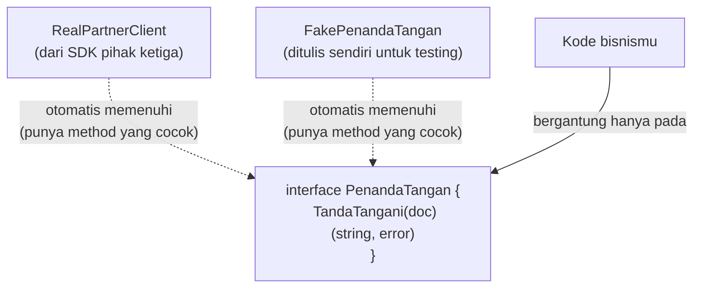

## TL;DR

Sebuah tipe di Go memenuhi sebuah `interface` **secara implisit** — cukup dengan memiliki method yang cocok, tanpa deklarasi `implements` seperti di PHP atau Java. Ini bukan sekadar sintaks lebih ringkas: ia memungkinkan siapa saja (termasuk kode yang mengonsumsi sebuah dependency) mendefinisikan interface kecil sesuai kebutuhannya sendiri, dan tipe apa pun — bahkan dari package pihak ketiga yang tidak kamu kendalikan — otomatis memenuhinya asal method-nya cocok. Idiom Go yang lahir dari ini: **"accept interfaces, return structs"**, dan interface yang baik biasanya kecil — sering hanya satu method.

## The Problem

Bayangkan sebuah service yang mengintegrasikan proses tanda tangan dokumen digital lewat SDK milik partner pihak ketiga. Kamu ingin menguji seluruh alur bisnis (validasi dokumen, memanggil proses tanda tangan, mencatat hasilnya) tanpa benar-benar memanggil API partner setiap kali menjalankan test — API itu lambat, kadang butuh koneksi jaringan asli, dan test yang bergantung padanya jadi rapuh (lihat [[Mocking Through Interfaces]]).

Di bahasa dengan interface eksplisit seperti PHP, kamu perlu memodifikasi SDK partner itu sendiri agar class-nya secara eksplisit `implements PenandaTanganDokumen` — sesuatu yang sering kali tidak mungkin dilakukan karena SDK itu adalah kode pihak ketiga yang tidak kamu kendalikan. Di Go, kamu tidak perlu menyentuh kode SDK sama sekali: cukup definisikan sebuah interface kecil di kode *milikmu sendiri*, berisi method yang kamu benar-benar pakai dari SDK itu — dan karena Go memeriksa kecocokan method secara implisit, tipe dari SDK itu otomatis dianggap memenuhi interface-mu, tanpa perlu tahu interface itu bahkan ada.

## Intuition

Bayangkan ini seperti **duck typing** yang sudah dikenal dari bahasa dinamis: "kalau ia berjalan seperti bebek dan bersuara seperti bebek, perlakukan sebagai bebek" — tidak peduli apa nama resmi tipe aslinya, yang penting perilakunya cocok. Analogi ini secara umum tepat untuk menjelaskan *filosofi* interface Go.

Tapi analoginya bocor pada satu hal penting: duck typing klasik (misalnya di Python) diperiksa saat **runtime** — kamu baru tahu sesuatu "bukan bebek" saat kode itu benar-benar dijalankan dan gagal memanggil method yang tidak ada. Go memeriksa kecocokan ini sepenuhnya saat **compile time** — kalau sebuah tipe tidak memenuhi interface yang dibutuhkan, program bahkan tidak akan berhasil dikompilasi. Ini lebih tepat disebut "duck typing statis": fleksibilitas gaya duck typing, tapi dengan jaminan keamanan compile-time yang tidak dimiliki bahasa dinamis.

## How It Works



Diagram ini menunjukkan inti dari kekuatan pola ini: kode bisnismu (`App`) hanya bergantung pada interface `PenandaTangan`, tidak pernah bergantung langsung pada `RealPartnerClient` atau `FakePenandaTangan`. Keduanya bisa saling menggantikan tanpa mengubah satu baris pun kode bisnis, karena keduanya **secara independen** memenuhi interface yang sama — tidak ada yang perlu "mendaftar" sebagai implementasi interface itu.

Idiom yang mengikuti dari ini: **"accept interfaces, return structs"**. Function yang menerima dependency sebaiknya menerima interface (fleksibel, mudah diganti untuk testing), tapi function yang mengembalikan sesuatu (constructor, factory) sebaiknya mengembalikan tipe konkret (`*Dokumen`, bukan `Dokumen` sebagai interface) — supaya pemanggil punya akses penuh ke seluruh kemampuan tipe itu, bukan dibatasi hanya pada method yang kebetulan ada di sebuah interface.

## In Go

```go
// Interface didefinisikan di package milikmu sendiri, berisi HANYA
// method yang benar-benar kamu pakai — bukan seluruh kemampuan SDK partner.
type PenandaTangan interface {
    TandaTangani(ctx context.Context, dokumen []byte) (signedURL string, err error)
}

// Kode bisnis hanya bergantung pada interface ini, tidak tahu apa-apa
// soal implementasi konkretnya.
type LayananDokumen struct {
    penandaTangan PenandaTangan
}

func NewLayananDokumen(pt PenandaTangan) *LayananDokumen {
    return &LayananDokumen{penandaTangan: pt}
}

func (l *LayananDokumen) ProsesDokumen(ctx context.Context, dokumen []byte) (string, error) {
    url, err := l.penandaTangan.TandaTangani(ctx, dokumen)
    if err != nil {
        return "", fmt.Errorf("tanda tangan dokumen: %w", err)
    }
    return url, nil
}

// --- di production, dipanggil dengan client SDK partner sungguhan ---
// partnerClient adalah tipe dari package SDK pihak ketiga — TIDAK PERNAH
// mendeklarasikan "implements PenandaTangan" di mana pun, tapi tetap
// memenuhi interface ini karena method-nya kebetulan cocok.
// layanan := NewLayananDokumen(partnerClient)

// --- di test, dipanggil dengan fake yang ditulis sendiri ---
type fakePenandaTangan struct{}

func (f *fakePenandaTangan) TandaTangani(ctx context.Context, dokumen []byte) (string, error) {
    return "https://fake.local/signed/123", nil
}

func TestProsesDokumen(t *testing.T) {
    layanan := NewLayananDokumen(&fakePenandaTangan{})
    url, err := layanan.ProsesDokumen(context.Background(), []byte("dokumen contoh"))
    if err != nil {
        t.Fatalf("unexpected error: %v", err)
    }
    if url == "" {
        t.Fatal("expected non-empty signed URL")
    }
}
```

Perhatikan: `fakePenandaTangan` dan tipe dari SDK partner sama sekali tidak saling tahu satu sama lain, tidak berbagi kode apa pun, dan tidak pernah secara eksplisit menyatakan "aku memenuhi interface ini" — keduanya memenuhi `PenandaTangan` murni karena method set-nya cocok.

## In His Stack

**PHP** mengharuskan class secara eksplisit menulis `implements PenandaTanganDokumen` di deklarasinya — ini berarti, untuk membuat kelas dari SDK pihak ketiga "memenuhi" sebuah interface tertentu, kamu harus memodifikasi kelas itu sendiri (sering kali tidak mungkin) atau membungkusnya dengan adapter class tambahan. Di Go, langkah pembungkusan itu sering kali tidak diperlukan sama sekali — asal method-nya cocok, tipe apa pun otomatis memenuhi interface yang kamu definisikan, bahkan interface yang didefinisikan **setelah** tipe itu ada.

## Trade-offs and When Not To Use It

Interface kecil yang didefinisikan di sisi konsumen (bukan di sisi "produser" seperti gaya Java) memberi fleksibilitas maksimal untuk testing dan penggantian implementasi. Tapi ini bukan alasan untuk membuat interface untuk **setiap** dependency — kalau sebuah tipe hanya punya satu implementasi yang masuk akal selamanya, dan tidak ada rencana nyata untuk menggantinya (bukan hanya untuk testing), interface tambahan hanya menambah lapisan indirection tanpa manfaat nyata. Aturan praktis yang umum dipakai komunitas Go: **jangan buat interface sampai ada kebutuhan konkret untuknya** (biasanya: butuh mock untuk testing, atau benar-benar ada lebih dari satu implementasi).

## Common Mistakes

> [!warning] Jebakan
> Mendefinisikan interface besar berisi banyak method "kalau-kalau dibutuhkan nanti", meniru gaya interface header ala Java. Interface Go idiomatic biasanya kecil (satu atau dua method) dan didefinisikan tepat sesuai apa yang benar-benar dipakai konsumennya — `io.Reader` dan `io.Writer` di stdlib, masing-masing hanya satu method, adalah contoh terbaik.

> [!warning] Jebakan
> Membuat interface untuk tipe yang hanya punya satu implementasi dan tidak ada rencana realistis untuk diganti atau di-mock. Ini menambah indirection tanpa manfaat, membuat kode lebih sulit dinavigasi ("lompat ke definisi" berhenti di interface, bukan implementasi sungguhan) tanpa alasan kuat.

> [!warning] Jebakan
> Mengembalikan tipe interface dari function constructor (`func NewX() SomeInterface`) alih-alih tipe konkret (`func NewX() *SomeStruct`). Ini membatasi pemanggil hanya pada method yang kebetulan ada di interface tersebut, padahal mereka mungkin butuh akses ke method lain milik tipe konkretnya.

## Exercises

1. Apa yang membedakan interface Go dari interface di PHP dari segi bagaimana sebuah tipe "menyatakan" pemenuhannya?
2. Kenapa duck typing di Go disebut "statis", berbeda dari duck typing di bahasa seperti Python?
3. Kenapa idiom "accept interfaces, return structs" masuk akal — apa yang hilang kalau sebuah constructor mengembalikan interface alih-alih tipe konkret?
4. Desain terbuka: sebuah service perlu mengintegrasikan tiga partner berbeda untuk verifikasi identitas, masing-masing dengan SDK dan bentuk API yang sama sekali berbeda. Tim ingin bisa mengganti partner (atau menambah partner baru) tanpa mengubah logika bisnis inti, dan ingin bisa menguji logika bisnis itu tanpa memanggil API partner mana pun. Rancang struktur interface dan kode yang memenuhi kedua kebutuhan ini.

> [!success]- Kunci jawaban
> Definisikan satu interface kecil di package logika bisnis, misalnya `VerifikatorIdentitas` dengan method tunggal seperti `Verifikasi(ctx context.Context, nik string) (VerifikasiResult, error)`. Untuk masing-masing partner, tulis satu tipe adapter (`PartnerAClient`, `PartnerBClient`, `PartnerCClient`) yang membungkus SDK partner masing-masing dan mengekspos method `Verifikasi` dengan signature yang sama — masing-masing secara independen memenuhi interface `VerifikatorIdentitas` tanpa saling tahu satu sama lain. Logika bisnis inti hanya bergantung pada interface ini, menerima implementasi mana pun lewat constructor (dependency injection manual, lihat [[../90 Architecture and Design/Manual Dependency Injection in Go|Manual Dependency Injection in Go]]). Untuk testing, tulis satu fake tambahan yang memenuhi interface yang sama tanpa menyentuh SDK partner mana pun. Menambah partner keempat di masa depan hanya berarti menulis satu adapter baru, tanpa mengubah logika bisnis inti sama sekali.

## Self-Check

- Apa perbedaan mendasar antara cara Go dan PHP menentukan apakah sebuah tipe memenuhi interface?
- Kenapa Go disebut memakai "duck typing statis"?
- Kenapa interface Go idiomatic cenderung kecil?
- Kapan sebaiknya kamu **tidak** membuat interface untuk sebuah dependency?

## Connected Notes

- [[Structs and Methods]] dan [[Pointer vs Value Receivers]] — prasyarat: method set yang menentukan pemenuhan interface secara teknis.
- [[Embedding]] — mekanisme komposisi lain di Go yang sering dipakai berdampingan dengan interface untuk membangun perilaku bertingkat.
- [[Mocking Through Interfaces]] — penerapan langsung pola di note ini untuk kebutuhan testing.
- [[../90 Architecture and Design/Manual Dependency Injection in Go|Manual Dependency Injection in Go]] — dependency injection di Go seluruhnya bertumpu pada mekanisme implicit satisfaction yang dijelaskan di sini.
- [[../90 Architecture and Design/Hexagonal and Clean Architecture in Go|Hexagonal and Clean Architecture in Go]] — batas arsitektur (port/adapter) yang secara idiomatic diimplementasikan lewat interface kecil seperti di note ini.

## Further Reading

- Dokumentasi resmi *Effective Go* (go.dev/doc/effective_go), bagian "Interfaces" untuk penjelasan resmi filosofi ini.

## Catatan Saya

*Tulis di sini interface kecil yang pernah (atau seharusnya) kamu buat untuk memudahkan testing integrasi partner di kerjaanmu.*
