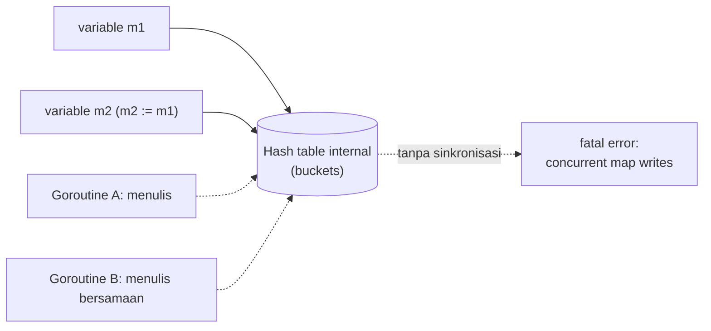

## TL;DR

Map di Go adalah hash table yang diakses lewat **sebuah pointer**. Meng-copy variable map hanya menyalin pointer itu, bukan isi hash table-nya — dua variable map bisa menunjuk hash table yang sama persis. Ini **mirip tapi tidak sama** dengan slice: slice membawa header tiga-field (pointer, len, cap) sebagai value, sehingga `append` bisa menghasilkan header baru yang tidak terlihat pemanggil, sementara map tidak punya perilaku semacam itu — setiap perubahan pada map selalu terlihat oleh semua variable yang menunjuk ke sana. Urutan iterasi map **sengaja diacak** setiap kali dijalankan, supaya tidak ada kode yang diam-diam bergantung pada urutan tertentu. Yang paling penting untuk backend engineer: **map bukan tipe data yang aman diakses dari banyak goroutine sekaligus tanpa sinkronisasi** — akses konkuren (satu goroutine menulis sementara yang lain membaca atau menulis) bisa membuat program crash secara sengaja (`fatal error: concurrent map writes`), dan ini adalah kategori bug yang mungkin sama sekali baru bagi engineer yang datang dari PHP klasik.

## The Problem

Bayangkan sebuah service Go membangun cache sederhana di memori memakai `map[string]int` biasa untuk menghitung berapa kali setiap ID dokumen diakses, dibagikan ke semua goroutine yang menangani request masuk. Di testing lokal dengan traffic rendah, semuanya berjalan mulus. Begitu dijalankan di production dengan ratusan request konkuren, service ini tiba-tiba mati total dengan pesan `fatal error: concurrent map writes` — bukan panic biasa yang bisa di-`recover`, tapi **fatal error** yang mematikan seluruh process tanpa ampun.

Ini bukan bug yang "kadang muncul kadang tidak karena keberuntungan" — ini adalah konsekuensi langsung dari desain map Go yang secara sengaja **tidak** aman untuk diakses konkuren tanpa sinkronisasi eksplisit, dan runtime Go punya detektor bawaan yang (dalam banyak kasus, meski tidak dijamin 100% dalam segala kondisi timing) menangkap akses konkuren ini dan langsung mematikan program alih-alih membiarkan data internal map menjadi korup secara diam-diam. Engineer yang datang dari PHP klasik (di mana satu request = satu eksekusi tunggal, tidak ada goroutine yang berbagi memori secara default) sering tidak punya insting untuk mencurigai ini sebagai sumber masalah.

## Intuition

Bayangkan map seperti **lemari arsip bersama yang tidak dikunci** — satu orang bisa mengambil dan menaruh folder dengan lancar. Tapi kalau dua orang secara bersamaan mencoba menata ulang lemari yang sama tanpa koordinasi (dua goroutine menulis ke map yang sama tanpa lock), isi lemari bisa jadi kacau, dan Go — daripada membiarkan kekacauan itu diam-diam merusak data — sengaja "membanting pintu" (fatal error) begitu mendeteksi ini terjadi.

Analogi "membanting pintu" ini bocor pada soal seberapa bisa diandalkannya deteksi itu. Runtime Go melakukan deteksi konkurensi map ini secara **best-effort** — dalam kondisi timing tertentu, akses konkuren yang salah mungkin tidak selalu terdeteksi rapi sebagai fatal error, dan berpotensi menyebabkan korupsi data yang lebih sulit dilacak daripada sekadar crash yang jelas. Jangan menganggap fatal error yang "rapi" ini sebagai jaring pengaman yang bisa diandalkan — anggap ia sebagai bukti bahwa bug itu ada, bukan mekanisme perlindungan yang disengaja.

> [!question] Perlu diverifikasi
> Klaim: seberapa konsisten runtime Go mendeteksi *concurrent map access* sebagai fatal error di semua kondisi timing dan versi Go.
> Kenapa ragu: detektor ini bersifat best-effort dan detail implementasinya bisa berbeda antar versi Go.
> Cara verifikasi: baca dokumentasi resmi package `runtime` dan catatan rilis Go terkait deteksi race pada map, serta jalankan `go test -race` untuk mendapati race condition secara eksplisit alih-alih mengandalkan fatal error runtime.

## How It Works

Map Go diimplementasikan sebagai hash table yang datanya disimpan dalam struktur bucket internal. Variable map yang kamu tulis di kode (`m := map[string]int{}`) adalah pointer ke struktur internal ini — meng-copy variable map ke variable lain, atau mengopernya ke function, hanya menyalin pointer itu, **bukan** seluruh isi hash table-nya. Ini artinya dua variable map bisa jadi "dua nama untuk hash table yang sama persis" — beda dengan slice, yang membawa header tiga-field sebagai value (lihat [[Slice Internals]]).

> [!question] Perlu diverifikasi
> Klaim: struktur internal map Go berupa "bucket".
> Kenapa ragu: implementasi map Go pernah diganti secara mendasar di rilis yang relatif baru, dan istilah internalnya ikut berubah. Perilaku yang terlihat dari luar (urutan iterasi diacak, tidak aman diakses konkuren) tidak berubah, tapi deskripsi internalnya bisa sudah usang.
> Cara verifikasi: release notes Go untuk versi yang dipakai, dan komentar di source `runtime/map*.go`.

Zero value map adalah `nil`. Map `nil` **aman dibaca** (mengembalikan zero value tipe hasilnya kalau key tidak ditemukan) tapi **panic kalau ditulis** — perbedaan yang sering mengejutkan pemula yang lupa memakai `make()` sebelum menulis ke map.



## In Go

Bug nil map, dan perbaikan cache konkuren dari "The Problem":

```go
// Panic: menulis ke map nil.
var m map[string]int
// m["a"] = 1 // panic: assignment to entry in nil map

m2 := make(map[string]int) // sekarang aman ditulis
m2["a"] = 1

// SALAH: map biasa dibagikan ke banyak goroutine tanpa sinkronisasi —
// berpotensi fatal error di production saat traffic konkuren tinggi.
type CacheSalah struct {
    data map[string]int
}

func (c *CacheSalah) Increment(key string) {
    c.data[key]++ // race condition kalau dipanggil dari banyak goroutine
}

// BENAR: dilindungi mutex — hanya satu goroutine yang boleh mengakses
// map ini pada satu waktu.
type CacheAman struct {
    mu   sync.Mutex
    data map[string]int
}

func NewCacheAman() *CacheAman {
    return &CacheAman{data: make(map[string]int)}
}

func (c *CacheAman) Increment(key string) {
    c.mu.Lock()
    defer c.mu.Unlock()
    c.data[key]++
}

func (c *CacheAman) Get(key string) int {
    c.mu.Lock()
    defer c.mu.Unlock()
    return c.data[key]
}
```

`CacheAman` menambahkan `sync.Mutex` (dibahas penuh di [[../50 Concurrency and Performance/The Sync Package|The Sync Package]]) yang memastikan hanya satu goroutine yang boleh membaca atau menulis `data` pada satu waktu — inilah perbaikan langsung untuk bug fatal error di "The Problem".

## In His Stack

**PHP (Yii1/Yii2)** dalam model eksekusi klasiknya (satu request = satu proses/eksekusi tunggal PHP-FPM, lihat [[Processes vs Threads]]) tidak pernah menghadapi masalah "associative array diakses konkuren dari banyak thread" dalam kode aplikasi biasa — setiap request punya memorinya sendiri sepenuhnya terisolasi. Ini kenapa bug seperti di note ini terasa sepenuhnya baru bagi engineer yang pindah dari PHP: bukan karena Go "lebih rawan bug", tapi karena model concurrency Go (banyak goroutine berbagi memori dalam satu process yang sama) memperkenalkan kategori bug yang di PHP klasik nyaris tidak mungkin terjadi.

## Trade-offs and When Not To Use It

`map` + `sync.Mutex` adalah solusi paling sederhana dan seringkali cukup untuk kebutuhan cache/counter konkuren biasa. `sync.Map` (dari package `sync`) adalah alternatif yang dioptimalkan untuk pola akses **spesifik** — terutama saat key yang sama jarang ditulis ulang setelah pertama kali di-set, atau saat goroutine yang berbeda mengakses key yang sepenuhnya disjoint. `sync.Map` **bukan** pengganti umum "map yang aman untuk semua kasus konkuren" — untuk pola read-write campuran yang berat pada key yang sama, `map` biasa dengan `sync.Mutex` (atau `sync.RWMutex` untuk baca yang lebih dominan) sering kali lebih sederhana untuk dinalar dan tidak selalu lebih lambat.

## Common Mistakes

> [!warning] Jebakan
> Membagikan `map` biasa ke banyak goroutine tanpa sinkronisasi apa pun, karena kode terlihat bekerja baik di testing dengan traffic rendah. Bug ini murni soal timing dan concurrency — tidak akan terdeteksi tanpa test yang secara sengaja mensimulasikan akses konkuren (`go test -race`).

> [!warning] Jebakan
> Menulis ke map yang dideklarasikan tanpa `make()` (`var m map[string]int`), lupa bahwa map nil aman dibaca tapi panic saat ditulis. Ini sering muncul saat struct dengan field map lupa diinisialisasi di constructor-nya.

> [!warning] Jebakan
> Mengganti semua `map` + `sync.Mutex` dengan `sync.Map` secara membabi buta dengan asumsi "lebih thread-safe jadi lebih baik". `sync.Map` dioptimalkan untuk pola akses tertentu dan bisa jadi lebih lambat untuk pola read-write campuran yang berat pada key yang sering ditulis ulang.

## Exercises

1. Kenapa meng-copy variable map ke variable lain tidak menghasilkan dua hash table yang independen?
2. Apa perbedaan perilaku antara membaca dan menulis ke map yang bernilai `nil`?
3. Kenapa `fatal error: concurrent map writes` tidak bisa ditangkap dengan `recover()` seperti panic biasa?
4. Desain terbuka: sebuah service Go menyimpan statistik penggunaan endpoint di memori memakai `map[string]int` yang diakses dari setiap goroutine handler HTTP untuk increment counter, dan sesekali (tidak selalu) crash dengan fatal error saat traffic tinggi. Rancang perbaikan yang tetap performan untuk pola akses "banyak goroutine, sering menulis ke key yang sama berulang-ulang" ini, dan jelaskan kenapa `sync.Map` mungkin bukan pilihan terbaik di sini.

> [!success]- Kunci jawaban
> Untuk pola "banyak goroutine sering menulis ke key yang sama berulang-ulang" (counter per endpoint, jumlah endpoint terbatas dan sering di-increment), `map` biasa dilindungi `sync.Mutex` (seperti `CacheAman` di atas) umumnya lebih tepat daripada `sync.Map` — `sync.Map` dioptimalkan untuk kasus di mana key jarang ditulis ulang setelah pertama kali diset, atau akses antar goroutine cenderung ke key yang berbeda-beda (disjoint), bukan pola "semua goroutine sering menulis ke sedikit key yang sama". Kalau kontensi mutex ternyata menjadi bottleneck nyata (dibuktikan lewat profiling, lihat [[../50 Concurrency and Performance/pprof Profiling|pprof Profiling]]), pertimbangkan sharding map itu sendiri (beberapa map dengan mutex terpisah, dipilih lewat hash key) untuk mengurangi kontensi pada satu mutex tunggal — tapi ini optimisasi lanjutan yang hanya masuk akal setelah dibuktikan perlu, bukan langkah pertama.

## Self-Check

- Kenapa meng-copy map ke variable lain tidak memberi salinan independen?
- Apa perbedaan perilaku antara membaca dan menulis map bernilai `nil`?
- Kenapa map biasa tidak aman diakses dari banyak goroutine tanpa sinkronisasi?
- Kapan `sync.Map` tepat dipakai, dan kapan `map` + `sync.Mutex` lebih tepat?

## Connected Notes

- [[Slice Internals]] — prasyarat: map dan slice berbagi perilaku "header yang menunjuk struktur internal", meski detail internalnya berbeda.
- [[../50 Concurrency and Performance/The Sync Package|The Sync Package]] — pembahasan penuh `sync.Mutex`, `sync.RWMutex`, dan `sync.Map` yang disinggung di note ini.
- [[../50 Concurrency and Performance/Race Conditions and the Race Detector|Race Conditions and the Race Detector]] — alat (`go test -race`) untuk menangkap bug akses konkuren map sebelum production.
- [[../50 Concurrency and Performance/Goroutines|Goroutines]] — unit concurrency yang membuat masalah di note ini mungkin terjadi sejak awal.
- [[../50 Concurrency and Performance/Cache-Aside, Write-Through, and Write-Behind|Cache-Aside, Write-Through, and Write-Behind]] — cache map in-memory di note ini adalah bentuk paling sederhana dari cache-aside; note itu membahas kapan ia perlu naik jadi cache terdistribusi.

## Further Reading

- Dokumentasi resmi package `sync` (pkg.go.dev/sync), khususnya `sync.Map`, untuk memahami pola akses yang dioptimalkannya secara spesifik.

## Catatan Saya

*Tulis di sini kalau kamu pernah menemukan (atau mencurigai) bug concurrent map access di service Go-mu sendiri.*
