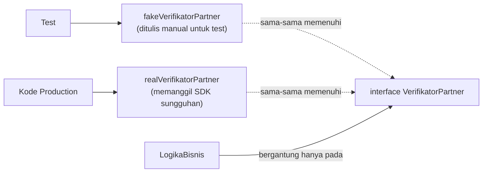

## TL;DR

Go tidak punya framework mocking bawaan seperti PHPUnit — mocking sepenuhnya bertumpu pada [[Interfaces and Implicit Satisfaction]]: definisikan interface kecil di sisi konsumen, lalu tulis (atau generate) implementasi palsu yang memenuhi interface itu untuk dipakai di test, menggantikan dependency asli (database, SDK partner) yang lambat atau sulit disimulasikan. Ini membuat testing bisa berjalan cepat dan terisolasi — tapi mock hanya melakukan **persis** apa yang kamu program, tidak lebih. Mock tidak bisa menangkap bug integrasi yang muncul kalau asumsimu tentang perilaku dependency asli ternyata salah — test yang lolos dengan mock tidak menjamin sistem sungguhan bekerja.

## The Problem

Bayangkan sebuah service bergantung langsung pada tipe konkret client SDK partner verifikasi dokumen di seluruh logika bisnisnya — memanggil method SDK itu langsung dari dalam function yang juga berisi aturan bisnis (misalnya "retry hanya kalau error tertentu, kirim notifikasi kalau gagal permanen"). Menguji aturan bisnis ini tanpa benar-benar memanggil API partner (yang lambat, kadang butuh koneksi asli, dan tidak bisa disuruh "pura-pura gagal" untuk menguji jalur retry) jadi mustahil — satu-satunya cara menguji jalur bisnis itu adalah lewat integration test yang lambat dan rapuh, bukan unit test yang cepat.

Solusinya bukan menulis ulang seluruh SDK — cukup mendefinisikan sebuah interface kecil di package milikmu sendiri berisi hanya method yang benar-benar dipakai, lalu tulis implementasi palsu (mock) yang bisa "diperintah" mengembalikan error tertentu, sukses, atau lambat — memungkinkan setiap cabang aturan bisnis diuji secara terisolasi dan cepat.

## Intuition

Bayangkan mock seperti **pemeran pengganti (stunt double)** dalam adegan berbahaya atau mahal — sutradara (test) hanya butuh pemeran pengganti itu melakukan gerakan tertentu secara meyakinkan sesuai skrip singkat yang diberikan (interface kecil), bukan benar-benar seorang ahli hukum internasional yang memproses dokumen sungguhan.

Analogi ini bocor pada soal keandalan. Pemeran pengganti kadang bisa improvisasi realistis melampaui skripnya; mock di Go **tidak bisa** — ia hanya melakukan persis apa yang kamu program, tidak lebih. Kalau asumsimu tentang perilaku API partner asli (format error, kondisi timeout, urutan pemanggilan) ternyata salah, mock tidak akan pernah "menyadari" ketidaksesuaian itu — test tetap lolos mulus meski integrasi sungguhan mungkin sudah rusak. Ini kenapa mock tidak pernah boleh jadi satu-satunya lapisan test untuk sebuah integrasi — tetap butuh sejumlah integration test (lihat [[../30 APIs and Web/Integration Testing Across an Organisational Boundary|Integration Testing Across an Organisational Boundary]]) yang menyentuh dependency asli, meski jumlahnya lebih sedikit.

## How It Works



## In Go

```go
// Interface kecil, didefinisikan di package logika bisnis, hanya
// berisi method yang benar-benar dipakai.
type VerifikatorPartner interface {
    Verifikasi(ctx context.Context, nik string) (bool, error)
}

// Logika bisnis bergantung pada interface, bukan SDK konkret.
type LayananVerifikasi struct {
    partner    VerifikatorPartner
    maxRetry   int
}

func (l *LayananVerifikasi) VerifikasiDenganRetry(ctx context.Context, nik string) (bool, error) {
    var lastErr error
    for i := 0; i < l.maxRetry; i++ {
        ok, err := l.partner.Verifikasi(ctx, nik)
        if err == nil {
            return ok, nil
        }
        lastErr = err
        if !errors.Is(err, ErrPartnerTimeout) {
            return false, fmt.Errorf("verifikasi gagal permanen: %w", err) // tidak retry untuk error non-timeout
        }
    }
    return false, fmt.Errorf("verifikasi gagal setelah %d percobaan: %w", l.maxRetry, lastErr)
}

// Mock ditulis manual: bisa "diperintah" mengembalikan hasil tertentu,
// dan mencatat berapa kali dipanggil untuk diverifikasi test.
type mockVerifikatorPartner struct {
    panggilanKe int
    responses   []struct {
        ok  bool
        err error
    }
}

func (m *mockVerifikatorPartner) Verifikasi(ctx context.Context, nik string) (bool, error) {
    r := m.responses[m.panggilanKe]
    m.panggilanKe++
    return r.ok, r.err
}

func TestVerifikasiDenganRetry_BerhentiKalauErrorPermanen(t *testing.T) {
    mock := &mockVerifikatorPartner{
        responses: []struct {
            ok  bool
            err error
        }{
            {ok: false, err: ErrNIKTidakValid}, // error PERMANEN, bukan timeout
        },
    }
    layanan := &LayananVerifikasi{partner: mock, maxRetry: 3}

    _, err := layanan.VerifikasiDenganRetry(context.Background(), "invalid")

    require.Error(t, err)
    require.Equal(t, 1, mock.panggilanKe) // WAJIB hanya dipanggil SEKALI,
                                           // membuktikan tidak retry untuk
                                           // error permanen
}
```

Test ini memverifikasi **perilaku** (tidak retry untuk error permanen) sekaligus **interaksi** (jumlah pemanggilan `Verifikasi` persis satu kali) — keduanya penting untuk membuktikan logic retry bekerja benar, tanpa pernah menyentuh SDK partner sungguhan.

## In His Stack

**PHPUnit** menyediakan mocking bawaan lewat `createMock()`/`getMockBuilder()` — kerangka kerja mocking sudah terintegrasi penuh di framework testing-nya. Go sengaja **tidak** menyediakan ini di stdlib: filosofinya, mocking hanyalah konsekuensi alami dari interface kecil yang sudah didesain dengan baik (lihat [[Interfaces and Implicit Satisfaction]]), bukan fitur framework terpisah. Untuk interface besar yang tetap butuh mock (jarang, kalau interface memang didesain kecil), tool generator komunitas seperti `mockgen` (dari `gomock`) atau `moq` bisa menghasilkan boilerplate mock otomatis dari definisi interface, tapi ini tetap opsional, bukan bagian dari toolchain bawaan.

## Trade-offs and When Not To Use It

Mock yang ditulis manual sederhana dan mudah dipahami, tapi bisa jadi tedious untuk interface besar — tanda bahwa interface itu mungkin terlalu besar (lihat [[Interfaces and Implicit Satisfaction]] soal interface kecil). Mock hasil generate mengurangi boilerplate tapi menambah langkah code-gen ke build process. Yang lebih penting dari pilihan tools: **jangan mock semuanya**. Test yang terlalu bergantung pada mock untuk setiap dependency — termasuk hal-hal sederhana yang tidak butuh isolasi — akhirnya hanya memverifikasi bahwa kode memanggil mock sesuai yang diprogram, bukan memverifikasi perilaku sungguhan. Sisakan sejumlah integration test yang benar-benar menyentuh dependency asli (di sandbox atau lingkungan test partner) untuk menangkap ketidaksesuaian asumsi yang tidak bisa ditangkap mock.

## Common Mistakes

> [!warning] Jebakan
> Bergantung langsung pada tipe konkret SDK/dependency eksternal di seluruh logika bisnis, tanpa lapisan interface sama sekali — membuat testing tanpa menyentuh dependency asli jadi mustahil.

> [!warning] Jebakan
> Mocking berlebihan — memakai mock untuk setiap dependency termasuk yang sederhana dan cepat, sampai test suite hanya memverifikasi bahwa kode memanggil mock persis seperti yang diprogram, bukan memverifikasi perilaku sungguhan yang berguna.

> [!warning] Jebakan
> Menganggap test yang lolos dengan mock adalah bukti integrasi sungguhan bekerja. Mock hanya seakurat asumsi yang kamu tulis saat membuatnya — kalau perilaku API partner asli berubah atau ternyata berbeda dari asumsi itu, mock tidak akan pernah "menyadarkan" test bahwa ada masalah.

## Exercises

1. Kenapa mocking di Go tidak butuh framework khusus, berbeda dari PHPUnit?
2. Apa risiko dari test yang bergantung sepenuhnya pada mock tanpa integration test sama sekali?
3. Kenapa interface yang terlalu besar membuat mocking jadi tedious, dan apa solusinya?
4. Desain terbuka: sebuah service bergantung langsung pada tiga tipe konkret berbeda dari SDK tiga partner verifikasi berbeda, tersebar di banyak tempat dalam logika bisnisnya, membuat testing lambat karena selalu menyentuh API asli. Rancang langkah refactor bertahap menuju desain yang testable lewat interface, dan tentukan bagian mana yang tetap harus diuji lewat integration test meski sudah ada mock.

> [!success]- Kunci jawaban
> Refactor bertahap: (1) identifikasi method spesifik dari masing-masing SDK partner yang benar-benar dipakai logika bisnis; (2) definisikan satu interface kecil per kebutuhan (bisa jadi satu interface umum kalau ketiga partner punya bentuk operasi yang mirip, atau tiga interface terpisah kalau berbeda signifikan); (3) buat adapter tipis yang membungkus masing-masing SDK partner dan memenuhi interface itu; (4) ubah logika bisnis untuk bergantung pada interface, diinjeksikan lewat constructor (lihat [[../90 Architecture and Design/Manual Dependency Injection in Go|Manual Dependency Injection in Go]]). Setelah refactor, tulis unit test dengan mock untuk semua cabang logika bisnis (retry, fallback antar partner, dst.) — cepat dan terisolasi. Tetap pertahankan segelintir integration test (bisa dijalankan lebih jarang, misalnya di pipeline nightly, lihat [[../30 APIs and Web/Sandbox Environments|Sandbox Environments]]) yang benar-benar memanggil sandbox masing-masing partner, khusus untuk memverifikasi bahwa adapter benar-benar cocok dengan perilaku SDK asli — ini yang menangkap ketidaksesuaian yang tidak bisa ditangkap mock manapun.

## Self-Check

- Kenapa mocking di Go bertumpu sepenuhnya pada interface, bukan framework terpisah?
- Apa yang dimaksud "mocking berlebihan", dan kenapa itu masalah?
- Kenapa test yang lolos dengan mock tidak menjamin integrasi sungguhan bekerja?
- Kapan sebaiknya memakai mock generator (mockgen/moq) dibanding menulis mock manual?

## Connected Notes

- [[Interfaces and Implicit Satisfaction]] — prasyarat mutlak: seluruh mekanisme mocking di Go bertumpu pada implicit satisfaction yang dijelaskan di note itu.
- [[Stdlib Testing vs Testify]] — assertion library yang biasa dipakai bersamaan dengan mock untuk memverifikasi hasil dan interaksi.
- [[Table-Driven Tests]] — pola tabel yang sering dikombinasikan dengan mock untuk menguji banyak skenario dependency eksternal sekaligus.
- [[../30 APIs and Web/Integration Testing Across an Organisational Boundary|Integration Testing Across an Organisational Boundary]] — pelengkap wajib bagi unit test bermock, untuk menangkap ketidaksesuaian asumsi yang tidak terlihat lewat mock.
- [[../90 Architecture and Design/Manual Dependency Injection in Go|Manual Dependency Injection in Go]] — mekanisme menyuntikkan mock (atau implementasi asli) ke dalam logika bisnis.

## Further Reading

- Dokumentasi resmi *"Testing Techniques"* di go.dev, dan repository `gomock`/`moq` di GitHub untuk referensi tool generator mock yang umum dipakai komunitas.

## Catatan Saya

*Tulis di sini dependency eksternal di kerjaanmu yang paling sulit diuji saat ini, dan bagaimana mocking lewat interface bisa (atau tidak bisa) membantu.*
