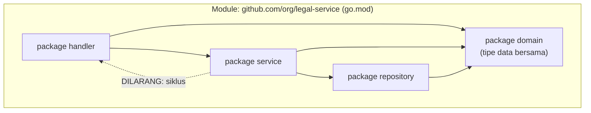

## TL;DR

**Package** adalah unit organisasi kode terkecil di Go — satu direktori berisi file `.go` yang berbagi deklarasi `package` yang sama, dan menjadi batas visibilitas: identifier yang diawali huruf besar (`Dokumen`) *exported* (bisa diakses package lain), yang diawali huruf kecil (`dokumen`) hanya terlihat di dalam package itu sendiri. **Module** adalah satu tingkat di atasnya — kumpulan package yang dikelola bersama sebagai satu unit versi, didefinisikan lewat `go.mod` (dependency apa saja yang dipakai, versi berapa) dan `go.sum` (checksum untuk verifikasi integritas). Go **menolak mengompilasi** kalau ada circular import antar package — sebuah batasan yang sengaja, dan sering mengejutkan engineer yang datang dari bahasa dengan autoloading lebih longgar seperti PHP.

## The Problem

Bayangkan sebuah tim menyusun service Go dengan package `handler` yang mengimpor package `service` untuk memanggil logika bisnis, tapi package `service` itu sendiri butuh sebuah tipe data yang "kebetulan" didefinisikan di package `handler` (misalnya sebuah struct request yang awalnya ditulis di sana). Solusi cepat yang terasa wajar: `service` mengimpor balik `handler` untuk memakai tipe itu. Go menolak mengompilasi ini sama sekali, dengan pesan `import cycle not allowed`.

Ini bukan bug tooling — ini batasan desain yang sengaja. Berbeda dari PHP dengan autoloading PSR-4 yang me-resolve class secara lazy saat pertama kali dipakai (sehingga referensi melingkar antar class kadang "kebetulan" bekerja tanpa disadari, meski tetap tanda desain yang buruk), Go menganalisis **seluruh graf dependency antar package** saat kompilasi dan mengharuskannya berbentuk **DAG (directed acyclic graph)** — tidak boleh ada siklus sama sekali. Tim yang tidak memahami ini akan terjebak berulang kali memindahkan tipe data ke sana kemari mencoba "menghindari" siklus tanpa memahami akar masalahnya: batas package yang tidak dirancang dengan baik sejak awal.

## Intuition

Bayangkan package seperti **ruangan dengan pintu berlabel** — hanya barang yang diletakkan di rak berlabel besar (identifier exported, diawali huruf besar) yang bisa diambil orang dari ruangan lain; rak berlabel kecil (unexported) hanya bisa diakses orang yang memang berada di ruangan itu. Module lebih seperti **kontainer pengiriman** yang berisi beberapa ruangan seperti itu sekaligus, dengan manifest (`go.mod`) yang mencatat kontainer lain (dependency) mana saja yang dibutuhkan dan versi berapa, plus segel anti-rusak (`go.sum`) yang membuktikan isi kontainer itu belum diubah sejak pertama kali diunduh.

Analogi ini bocor pada soal siklus: dua ruangan di dunia nyata boleh saja punya pintu yang saling menghadap satu sama lain tanpa masalah. Go tidak mengizinkan ini di level package — kalau `handler` "membutuhkan pintu ke" `service`, maka `service` **tidak boleh** punya pintu balik ke `handler`, betapa pun kecil kebutuhannya. Batasan ini memaksa desain yang lebih bersih sejak awal, bukan sekadar aturan sintaks yang mengganggu.

## How It Works



Diagram ini menunjukkan solusi umum untuk masalah di "The Problem": tipe data yang dipakai lintas layer (seperti struct `Dokumen`) dipindahkan ke package terpisah (`domain`) yang **tidak** mengimpor `handler` maupun `service` — keduanya boleh sama-sama mengimpor `domain`, tapi `domain` sendiri tidak pernah mengimpor balik ke arah mereka, sehingga tidak ada siklus.

`go.mod` mendefinisikan module beserta dependency-nya:

```
module github.com/org/legal-service

go 1.22

require (
    github.com/lib/pq v1.10.9
    golang.org/x/sync v0.6.0
)
```

`go.sum` mencatat checksum kriptografis setiap versi dependency yang pernah diunduh — dipakai `go build`/`go mod verify` untuk memastikan dependency yang diunduh saat ini **identik** dengan yang pertama kali diverifikasi, mencegah dependency yang diam-diam berubah isinya di antara satu build dan build lainnya.

## In Go

```go
// file: domain/dokumen.go
package domain

type Dokumen struct {
    ID     string
    Status string
}

// unexported — hanya bisa dipakai di dalam package domain sendiri
func validasiInternal(d Dokumen) bool {
    return d.ID != ""
}

// Exported — bisa dipakai package lain yang mengimpor domain
func Validasi(d Dokumen) error {
    if !validasiInternal(d) {
        return fmt.Errorf("dokumen tidak valid")
    }
    return nil
}
```

```go
// file: service/verifikasi.go
package service

import "github.com/org/legal-service/domain"

func Verifikasi(d domain.Dokumen) error {
    return domain.Validasi(d) // memakai Validasi (exported),
                                // TIDAK BISA memanggil validasiInternal
}
```

Perhatikan: `service` bisa memanggil `domain.Validasi` (exported) tapi **tidak bisa sama sekali** memanggil `domain.validasiInternal` — ini bukan soal kenyamanan, compiler akan menolaknya sepenuhnya karena identifier itu tidak terlihat di luar package `domain`.

## In His Stack

**PHP (Yii1/Yii2)** dengan autoloading PSR-4 me-resolve class secara lazy — sebuah class hanya benar-benar "dimuat" saat pertama kali dipakai, yang berarti referensi melingkar antar class (bahkan lintas namespace) kadang bisa "kebetulan bekerja" tanpa terdeteksi sebagai masalah desain, sampai suatu titik ketergantungannya benar-benar dieksekusi dalam urutan yang salah dan gagal secara runtime. Go memindahkan pengecekan ini seluruhnya ke **compile time** — kalau ada siklus di graf dependency package, build langsung gagal, jauh sebelum kode itu pernah dijalankan. Ini salah satu alasan struktur package di codebase Go cenderung lebih disiplin dari awal dibanding banyak codebase PHP yang tumbuh organik.

## Trade-offs and When Not To Use It

Larangan circular import memaksa pemisahan tanggung jawab yang lebih jelas sejak awal — trade-off-nya adalah butuh sedikit lebih banyak perencanaan struktur package di muka, dan kadang terasa seperti hambatan saat refactor cepat. Di sisi lain, memecah kode jadi terlalu banyak package kecil ("nanopackages") tanpa kohesi nyata juga jadi masalah tersendiri — navigasi kode jadi berat tanpa manfaat pemisahan yang sepadan. Aturan praktis: package sebaiknya dipisah berdasarkan **tanggung jawab domain** yang jelas (seperti contoh `domain`, `service`, `repository`, `handler` di atas), bukan dipecah sekadar untuk "kelihatan modular".

## Common Mistakes

> [!warning] Jebakan
> Membiarkan dua package saling mengimpor satu sama lain (langsung atau tidak langsung lewat package ketiga), lalu bingung kenapa `go build` gagal dengan "import cycle not allowed". Solusinya selalu memindahkan tipe/fungsi yang dibutuhkan kedua sisi ke package ketiga yang lebih rendah dalam graf dependency, bukan memaksakan siklus.

> [!warning] Jebakan
> Meng-export (mengawali huruf besar) semua identifier "kalau-kalau dibutuhkan nanti", bukan secara sengaja memutuskan apa yang benar-benar jadi API publik sebuah package. Ini menciptakan permukaan API yang jauh lebih besar dari yang dimaksudkan, membuat perubahan internal jadi berisiko mematahkan package lain yang tidak seharusnya bergantung pada detail itu.

> [!warning] Jebakan
> Menerbitkan versi mayor baru (v2 ke atas) sebuah module internal tanpa memperbarui import path-nya sesuai aturan *semantic import versioning* Go (path harus menyertakan `/v2`, dst.) — mengabaikan aturan ini menyebabkan kebingungan versi dependency yang sulit didiagnosis di module lain yang memakainya.

## Exercises

1. Apa yang membedakan visibilitas exported dan unexported di Go, dan bagaimana cara menandainya?
2. Kenapa Go menolak circular import antar package, sementara PHP dengan autoloading sering "membiarkan" referensi melingkar terjadi?
3. Apa fungsi `go.sum` yang berbeda dari `go.mod`?
4. Desain terbuka: timmu ingin membuat sebuah Go module internal bersama (`common-lib`) yang dipakai lintas beberapa dari 13 aplikasi legal-services untuk hal-hal seperti logging terstruktur dan helper HTTP. Rancang struktur package di dalam module itu supaya tidak menjadi satu package raksasa "utils" yang semua orang impor tanpa pikir panjang, dan jelaskan bagaimana strategi versioning-nya seiring module ini berkembang dan dipakai banyak tim sekaligus.

> [!success]- Kunci jawaban
> Pecah `common-lib` menjadi beberapa package kecil dengan tanggung jawab jelas (misalnya `logging`, `httputil`, `errors`) alih-alih satu package `utils` tunggal — ini membuat setiap tim yang memakainya hanya mengimpor apa yang benar-benar mereka butuhkan, dan perubahan di satu package (misalnya `logging`) tidak memaksa recompile/redeploy kode yang hanya bergantung pada `httputil`. Untuk versioning, ikuti semantic versioning ketat (lihat [[../90 Architecture and Design/Semantic Versioning|Semantic Versioning]]): breaking change apa pun butuh bump versi mayor **dan** perubahan import path sesuai aturan semantic import versioning Go begitu mencapai v2 — komunikasikan perubahan ini eksplisit ke semua tim pemakai lewat changelog, karena module internal yang dipakai lintas banyak aplikasi pemerintah butuh koordinasi upgrade yang lebih hati-hati dibanding dependency pihak ketiga biasa.

## Self-Check

- Apa yang menentukan apakah sebuah identifier exported atau tidak di Go?
- Kenapa Go menolak circular import antar package?
- Apa perbedaan fungsi `go.mod` dan `go.sum`?
- Apa risiko meng-export semua identifier tanpa pertimbangan?

## Connected Notes

- [[The Go Type System]] — prasyarat: aturan exported/unexported bekerja di atas sistem tipe yang dijelaskan di note itu.
- [[The Go Toolchain]] — perintah `go build`, `go mod tidy` yang beroperasi langsung pada package dan module yang dijelaskan di note ini.
- [[../90 Architecture and Design/Hexagonal and Clean Architecture in Go|Hexagonal and Clean Architecture in Go]] — batas arsitektur yang secara konkret diimplementasikan lewat pemisahan package seperti dijelaskan di note ini.
- [[../90 Architecture and Design/Semantic Versioning|Semantic Versioning]] — aturan versioning module yang disinggung soal semantic import versioning.
- [[Interfaces and Implicit Satisfaction]] — package `domain` berisi interface kecil sering jadi titik temu yang menghindari siklus antara `service` dan `repository`.

## Further Reading

- Dokumentasi resmi *"How to Write Go Code"* dan *"Go Modules Reference"* di go.dev — sumber kebenaran untuk aturan module dan versioning yang bisa berubah antar rilis Go.

## Catatan Saya

*Tulis di sini kalau kamu pernah terjebak circular import di Go, dan bagaimana akhirnya restrukturisasi package menyelesaikannya.*
