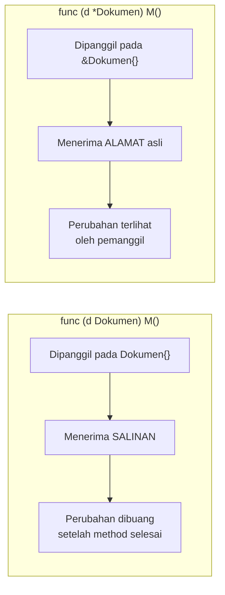

## TL;DR

Method dengan **value receiver** (`func (d Dokumen) M()`) menerima **salinan** struct — perubahan di dalamnya tidak pernah terlihat pemanggil. Method dengan **pointer receiver** (`func (d *Dokumen) M()`) menerima **alamat** struct asli — perubahan di dalamnya langsung terlihat pemanggil. Ini bukan sekadar gaya penulisan: pilihan ini menentukan apakah method bisa mengubah state, seberapa mahal setiap pemanggilan (menyalin struct besar tidak gratis), dan — yang paling sering mengejutkan pemula — **apakah sebuah value memenuhi sebuah interface sama sekali**, karena method set pointer dan value berbeda.

## The Problem

Bayangkan seorang engineer menulis struct `Counter` dengan method `Increment()` yang memakai value receiver, memanggilnya berkali-kali dalam loop, lalu bingung kenapa nilai counter-nya tetap nol di akhir. Tidak ada error, tidak ada panic — kode berjalan mulus, hanya saja hasilnya tidak seperti yang diharapkan. Bug ini murni soal semantik: `Increment()` dengan value receiver menerima **salinan** `Counter` setiap kali dipanggil, mengubah salinan itu, lalu salinan itu dibuang begitu function selesai — counter asli di pemanggil tidak pernah tersentuh.

Masalah kedua yang lebih membingungkan pemula: sebuah tipe dengan method yang memakai pointer receiver, dicoba di-assign ke variable interface sebagai **value** (bukan pointer), dan compiler menolak dengan pesan "does not implement interface" — padahal method-nya sudah didefinisikan dan terlihat benar. Ini bukan bug compiler; ini konsekuensi langsung dari aturan **method set** yang jarang dijelaskan eksplisit ke pemula.

## Intuition

Bayangkan value receiver seperti **diberi fotokopi denah ruangan** — kamu bebas mencoret-coret fotokopi itu sepuasnya, tapi ruangan aslinya tidak berubah sama sekali. Pointer receiver seperti **diberi kunci asli ruangan itu** — apa pun yang kamu ubah di dalamnya adalah perubahan sungguhan pada ruangan yang sama yang dilihat semua orang.

Analogi ini bocor pada soal biaya. Fotokopi di dunia nyata harganya kurang lebih sama berapa pun ukuran ruangannya — tapi menyalin `struct` di Go **benar-benar menyalin semua byte di dalamnya**. Untuk struct kecil (beberapa field angka/string), biaya ini nyaris tidak terasa. Untuk struct besar (banyak field, atau menyimpan slice/array besar di dalamnya) yang method-nya dipanggil jutaan kali, biaya penyalinan ini menjadi nyata dan terukur — bukan lagi sekadar "fotokopi gratis".

## How It Works

Setiap tipe di Go punya **method set** — kumpulan method yang bisa dipanggil pada value tipe itu:

- Method dengan **value receiver** masuk ke method set baik untuk `T` maupun `*T`.
- Method dengan **pointer receiver** hanya masuk ke method set untuk `*T` — **tidak** untuk `T` biasa, kecuali value itu addressable (variable biasa, bukan hasil langsung dari map atau interface) sehingga compiler bisa otomatis mengambil alamatnya.

Ini artinya: kalau sebuah interface mensyaratkan method dengan pointer receiver, hanya `*T` yang memenuhi interface itu — `T` polos tidak akan pernah dianggap memenuhi interface tersebut, berapa pun mirip method-nya terlihat.



## In Go

Bug counter dari "The Problem", dan perbaikannya:

```go
type Counter struct {
    nilai int
}

// SALAH: value receiver, perubahan hilang setelah method selesai.
func (c Counter) IncrementSalah() {
    c.nilai++ // hanya mengubah salinan lokal c
}

// BENAR: pointer receiver, perubahan terlihat oleh pemanggil.
func (c *Counter) Increment() {
    c.nilai++
}

func main() {
    c := Counter{}
    c.IncrementSalah()
    c.IncrementSalah()
    fmt.Println(c.nilai) // 0 — mengejutkan!

    c.Increment()
    c.Increment()
    fmt.Println(c.nilai) // 2 — sesuai harapan
}
```

Gotcha method set dan interface, dengan komentar yang menjelaskan kenapa satu baris gagal dikompilasi:

```go
type Validator interface {
    Validasi() error
}

type Dokumen struct{ Status string }

// Method ini memakai POINTER receiver.
func (d *Dokumen) Validasi() error {
    if d.Status == "" {
        return fmt.Errorf("status dokumen kosong")
    }
    return nil
}

func main() {
    doc := Dokumen{Status: "draft"}

    var v Validator
    // v = doc // COMPILE ERROR: Dokumen tidak memenuhi Validator,
    //         // karena Validasi() punya pointer receiver — hanya
    //         // *Dokumen yang masuk method set yang benar.
    v = &doc // BENAR: *Dokumen memenuhi Validator
    if err := v.Validasi(); err != nil {
        fmt.Println("invalid:", err)
    }
}
```

## In His Stack

Pola ini muncul langsung di stdlib Go yang sering dipakai: `json.Unmarshal` mengharuskan kamu mengoper **pointer** ke struct tujuan (`json.Unmarshal(data, &doc)`, bukan `json.Unmarshal(data, doc)`) tepat karena Unmarshal perlu **mengubah** struct itu — kalau dioper sebagai value, ia hanya akan mengubah salinan yang langsung dibuang begitu function selesai, dan struct aslimu tetap kosong. Ini penjelasan teknis di balik error yang sering membingungkan pemula: "kenapa hasil `Unmarshal` selalu struct kosong" — jawabannya hampir selalu lupa memakai `&`.

## Trade-offs and When Not To Use It

Pakai **pointer receiver** ketika method perlu mengubah state, atau ketika struct-nya besar dan biaya penyalinan berulang kali signifikan. Pakai **value receiver** ketika struct kecil dan kamu justru ingin jaminan bahwa method tidak akan mengubah data asli — berguna untuk struct yang dipakai sebagai value object yang dibagi ke banyak tempat tanpa risiko mutasi tak terduga. Konvensi yang umum diikuti komunitas Go: kalau **satu saja** method pada sebuah tipe butuh pointer receiver, konsistenkan **semua** method pada tipe itu memakai pointer receiver — mencampur keduanya pada tipe yang sama membingungkan pembaca soal apakah tipe itu "dimaksudkan" mutable atau tidak.

## Common Mistakes

> [!warning] Jebakan
> Mendefinisikan method yang dimaksudkan mengubah state dengan value receiver, lalu bingung kenapa perubahannya tidak pernah "menempel" di luar method itu. Kalau method perlu mengubah field, ia **harus** memakai pointer receiver.

> [!warning] Jebakan
> Mencampur pointer receiver dan value receiver pada method-method berbeda di tipe yang sama tanpa alasan jelas — ini membingungkan pembaca kode soal apakah tipe tersebut dimaksudkan mutable, dan bisa memicu gotcha method set saat tipe itu dipakai lewat interface.

> [!warning] Jebakan
> Terkejut saat compiler menolak meng-assign value (bukan pointer) ke variable interface, padahal method-nya "terlihat" sudah didefinisikan. Ini bukan bug — method dengan pointer receiver memang hanya masuk method set dari tipe pointer-nya, bukan tipe value-nya.

## Exercises

1. Kenapa method dengan value receiver tidak bisa mengubah state struct aslinya?
2. Kenapa `json.Unmarshal` mengharuskan pointer ke struct tujuan, bukan struct itu sendiri?
3. Sebuah tipe `Dokumen` punya method `Validasi()` dengan pointer receiver. Kenapa `var v Validator = Dokumen{}` gagal dikompilasi, sementara `var v Validator = &Dokumen{}` berhasil?
4. Desain terbuka: sebuah struct `Konfigurasi` cukup besar (banyak field bersarang) dan method-nya hanya membaca nilai konfigurasi, tidak pernah mengubahnya, tapi dipanggil jutaan kali per detik di hot path aplikasi. Timmu berdebat apakah harus memakai value receiver (lebih "aman", tidak bisa mengubah state) atau pointer receiver (menghindari biaya penyalinan). Rancang argumen untuk memutuskan, dan pertimbangkan apakah ada opsi ketiga.

> [!success]- Kunci jawaban
> Untuk struct besar yang hanya dibaca tapi dipanggil sangat sering, pointer receiver lebih tepat justru karena alasan performa (menghindari penyalinan struct besar berulang kali), bukan karena butuh mengubah state — pointer receiver tidak berarti "harus mengubah", ia hanya berarti "menerima alamat, bukan salinan". Jaminan "tidak bisa mengubah" tetap bisa dipertahankan lewat disiplin kode (method hanya membaca field, tidak pernah menulis) dan lewat test yang memverifikasi ini, bukan lewat value receiver semata. Opsi ketiga yang valid: kalau struct ini benar-benar tidak pernah berubah setelah dibuat (immutable), pertimbangkan membuatnya diakses lewat pointer ke instance yang dibagikan (shared, read-only) sejak awal, dihindari disalin sama sekali di titik manapun — verifikasi lewat profiling (lihat [[../50 Concurrency and Performance/pprof Profiling|pprof Profiling]]) sebelum mengoptimalkan lebih jauh dari itu.

## Self-Check

- Apa perbedaan mendasar antara method set tipe `T` dan `*T`?
- Kenapa `json.Unmarshal` butuh pointer ke struct tujuan?
- Kapan sebaiknya semua method pada satu tipe konsisten memakai pointer receiver?
- Kenapa struct besar yang di-passing sebagai value berulang kali bisa jadi masalah performa?

## Connected Notes

- [[Structs and Methods]] — prasyarat: method dan receiver yang dijelaskan lebih detail konsekuensinya di note ini.
- [[The Go Type System]] — value semantics yang mendasari kenapa value receiver menyalin, bukan mereferensikan.
- [[Interfaces and Implicit Satisfaction]] — aturan method set yang dijelaskan di note ini menentukan langsung apakah sebuah tipe memenuhi interface tertentu.
- [[Slice Internals]] — kontras penting: slice punya perilaku "setengah reference" yang berbeda dari struct biasa, sering disalahpahami bersamaan dengan topik ini.
- [[../50 Concurrency and Performance/Reducing Allocations|Reducing Allocations]] — biaya penyalinan struct besar lewat value receiver adalah salah satu sumber alokasi yang bisa dioptimalkan.

## Further Reading

- Dokumentasi resmi *Effective Go* (go.dev/doc/effective_go), bagian "Pointers vs. Values" untuk panduan resmi kapan memilih masing-masing.

## Catatan Saya

*Tulis di sini kalau kamu pernah terjebak bug "perubahan tidak menempel" karena value receiver, dan bagaimana akhirnya ditemukan.*
