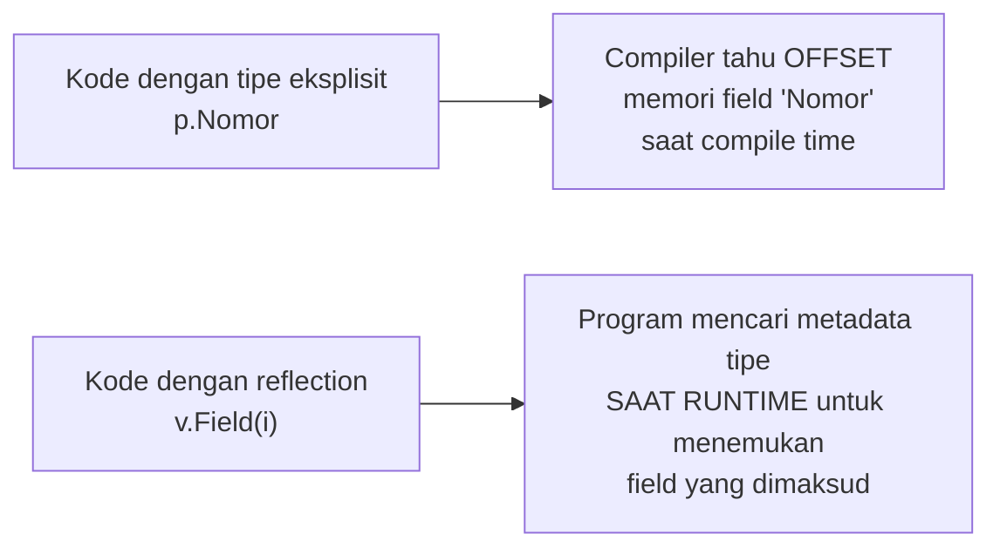

## TL;DR

Reflection adalah kemampuan sebuah program memeriksa dan memanipulasi struktur tipenya sendiri **saat runtime** — membaca nama field sebuah struct, memanggil method berdasarkan nama string, atau membangun nilai dari tipe yang hanya diketahui saat program berjalan, bukan saat ditulis. Package `encoding/json` yang dipakai di hampir setiap handler HTTP Go bekerja lewat reflection di baliknya — itulah kenapa `json.Marshal` bisa menerima struct apa pun tanpa kode khusus per tipe. Tapi kekuatan ini datang dengan tiga biaya nyata: performa yang jauh lebih lambat dari kode non-reflective, keamanan tipe yang hilang (error baru terdeteksi runtime, bukan compile time), dan kode yang jauh lebih sulit dibaca — reflection adalah alat untuk kasus yang benar-benar butuh introspeksi runtime, bukan alat default.

## The Problem

Sebuah tim menulis fungsi generik untuk "menyalin semua field yang namanya sama antara dua struct berbeda" (pola yang umum saat memetakan model database ke DTO API) memakai reflection, dipanggil di **setiap** request pada endpoint dengan volume tinggi. Fitur ini bekerja benar secara fungsional, tapi setelah di-deploy, profiling menunjukkan endpoint ini menghabiskan proporsi waktu CPU yang tidak proporsional dibanding endpoint lain dengan kompleksitas logika bisnis yang serupa. Reflection yang dipanggil berulang-ulang di jalur kritis (hot path) ternyata jauh lebih mahal dari yang diperkirakan, karena setiap pemanggilan `reflect.ValueOf`, iterasi field, dan penetapan nilai lewat reflection punya overhead yang tidak ada pada assignment field langsung (`dto.Nama = model.Nama`).

Masalah kedua yang lebih berbahaya: kode yang memakai reflection untuk memanggil method berdasarkan nama string (`reflect.ValueOf(obj).MethodByName("Proses").Call(nil)`) terlihat fleksibel, tapi kesalahan ketik pada nama method ("Proses" vs "proses", atau method yang dihapus saat refactoring) tidak akan terdeteksi compiler. Kesalahan itu baru muncul sebagai panic saat kode benar-benar dijalankan dan mencoba memanggil method yang "tidak ada", di titik yang jauh dari baris kode aslinya ditulis, membuat root cause sulit dilacak.

## Intuition

Bayangkan reflection seperti **membongkar mesin untuk memeriksa komponennya satu per satu saat mesin sedang menyala**, dibanding membaca cetak biru (blueprint) mesin itu sebelum dirakit. Membaca cetak biru (kode yang ditulis dengan tipe eksplisit, diperiksa compiler) jauh lebih cepat dan aman — kamu tahu persis apa yang ada di sana sebelum apa pun dijalankan. Membongkar mesin yang sedang menyala (reflection) memberi fleksibilitas untuk memeriksa/mengubah apa pun secara dinamis, tapi jelas jauh lebih lambat (perlu membuka penutup, memeriksa satu per satu) dan berisiko (komponen yang ternyata tidak ada di tempat yang diharapkan menyebabkan masalah seketika, bukan diketahui lebih dulu dari cetak biru).

Analogi ini bocor pada satu hal: membongkar mesin fisik butuh alat dan waktu yang jelas terlihat mahal. Biaya reflection di kode **tidak terlihat** dari membaca kodenya. Satu baris `reflect.ValueOf(x).Field(0)` terlihat sederhana, padahal di baliknya compiler Go tidak bisa lagi melakukan banyak optimasi yang biasa diterapkan pada akses field langsung, dan overhead ini baru benar-benar terlihat lewat profiling (lihat domain `50 Concurrency and Performance`), bukan dari membaca kode itu sendiri.

## How It Works

```go
package main

import (
	"fmt"
	"reflect"
)

type Permohonan struct {
	Nomor  string
	Status string
}

func main() {
	p := Permohonan{Nomor: "P-001", Status: "menunggu"}

	// reflect.ValueOf membungkus nilai p menjadi reflect.Value — mulai
	// dari titik ini, akses field dilakukan lewat API reflection,
	// bukan lagi p.Nomor langsung.
	v := reflect.ValueOf(p)
	t := reflect.TypeOf(p)

	for i := 0; i < v.NumField(); i++ {
		namaField := t.Field(i).Name
		nilaiField := v.Field(i).Interface()
		fmt.Printf("%s = %v\n", namaField, nilaiField)
	}
}
```



Diagram ini menunjukkan akar perbedaan biaya: akses field biasa sudah "diselesaikan" compiler saat compile time (offset memori field sudah diketahui, akses jadi operasi langsung yang sangat cepat), sementara reflection harus mencari metadata tipe (nama field, tipe, offset) **saat program berjalan**, sebuah lapisan indirection tambahan yang selalu lebih lambat dari akses langsung.

`encoding/json`, `encoding/xml`, dan library ORM (GORM, dan sebagian mekanisme Active Record di ekosistem lain) semuanya bergantung pada reflection untuk bekerja generik lintas tipe struct apa pun. Inilah trade-off yang diterima secara sadar oleh desain library-library itu: fleksibilitas menerima tipe struct apa pun, dengan biaya performa yang biasanya masih bisa diterima untuk operasi seperti serialisasi JSON (yang jarang menjadi bottleneck utama dibanding I/O jaringan/database). Tapi ini bisa menjadi masalah nyata kalau reflection dipakai secara naif di jalur kode yang benar-benar hot path dengan volume sangat tinggi.

## Under The Hood

Tiga API inti paket `reflect`: **`reflect.TypeOf`** mengembalikan informasi tipe (nama, kind, field-field untuk struct); **`reflect.ValueOf`** mengembalikan nilai yang bisa dibaca (dan, dengan syarat tertentu, diubah) secara dinamis; dan **`reflect.Value.Interface()`** mengonversi nilai reflection kembali jadi `interface{}` biasa. Untuk **mengubah** nilai lewat reflection (bukan sekadar membaca), nilai itu harus **addressable** — biasanya berarti harus dikirim sebagai pointer (`reflect.ValueOf(&p).Elem()`), bukan value langsung, karena Go passes-by-value secara default dan reflection tidak bisa mengubah salinan yang sudah terlepas dari nilai aslinya.

`struct tag` (`json:"nama_field"`, dibahas di [[../20 Go Language/Struct Tags and JSON Marshalling|Struct Tags and JSON Marshalling]]) dibaca lewat reflection juga — `t.Field(i).Tag.Get("json")` mengembalikan string tag mentah yang kemudian di-parse manual. Ini penjelasan mekanis kenapa struct tag "hanya" berupa string biasa tanpa validasi compiler — compiler Go tidak pernah memvalidasi bahwa isi string tag itu masuk akal; validasinya sepenuhnya tanggung jawab kode yang membacanya lewat reflection saat runtime (misalnya `encoding/json` sendiri).

## In Go

```go
package mapper

import (
	"fmt"
	"reflect"
)

// SalinFieldSamaNama menunjukkan pola reflection yang UMUM dipakai untuk
// memetakan struct sumber ke struct tujuan berdasarkan nama field yang
// sama — TAPI perhatikan komentar trade-off di bawah: pola ini sebaiknya
// TIDAK dipanggil di hot path bervolume tinggi tanpa pengukuran performa.
func SalinFieldSamaNama(sumber, tujuan interface{}) error {
	vSumber := reflect.ValueOf(sumber)
	vTujuan := reflect.ValueOf(tujuan)

	if vTujuan.Kind() != reflect.Ptr || vTujuan.IsNil() {
		return fmt.Errorf("tujuan harus berupa pointer non-nil")
	}
	vTujuan = vTujuan.Elem()

	tSumber := vSumber.Type()
	for i := 0; i < vSumber.NumField(); i++ {
		namaField := tSumber.Field(i).Name
		fieldTujuan := vTujuan.FieldByName(namaField)

		if fieldTujuan.IsValid() && fieldTujuan.CanSet() && fieldTujuan.Type() == vSumber.Field(i).Type() {
			fieldTujuan.Set(vSumber.Field(i))
		}
	}
	return nil
}

// VersiEksplisit adalah alternatif TANPA reflection untuk kasus yang SAMA —
// sedikit lebih verbose ditulis, tapi jauh lebih cepat (tidak ada overhead
// pencarian metadata tipe saat runtime) dan lebih aman (kesalahan nama
// field terdeteksi compiler, bukan panic runtime).
type ModelPermohonan struct {
	Nomor  string
	Status string
}

type DTOPermohonan struct {
	Nomor  string
	Status string
}

func VersiEksplisit(m ModelPermohonan) DTOPermohonan {
	return DTOPermohonan{
		Nomor:  m.Nomor,
		Status: m.Status,
	}
}
```

Untuk operasi yang dijalankan sekali per request (bukan jutaan kali per detik), perbedaan performa keduanya mungkin tidak signifikan — tapi untuk kode yang dipanggil dalam loop ketat atau volume sangat tinggi, `VersiEksplisit` selalu lebih aman sebagai default, dengan reflection dipertimbangkan hanya kalau duplikasi kodenya benar-benar tidak proporsional (dan generics, lihat [[Generics]], seringkali menjadi alternatif yang lebih baik dari reflection untuk kasus semacam ini, karena tetap type-safe di compile time).

## In His Stack

`encoding/json` yang dipakai di hampir setiap handler HTTP Go bergantung penuh pada reflection — ini penjelasan mekanis kenapa serialisasi JSON struct besar dengan banyak field bisa terasa lebih lambat dibanding menulis serialisasi manual, meski untuk kebanyakan aplikasi web biasa, biaya ini jauh kalah signifikan dibanding waktu I/O jaringan atau query database. Untuk kode yang berinteraksi dengan Yii2 Active Record (yang di PHP juga banyak memakai reflection-like mechanism lewat magic method `__get`/`__set` dan `ActiveRecord::attributes()`), memahami biaya reflection membantu memahami kenapa ORM secara umum, di bahasa apa pun, punya overhead dibanding raw query, dan kenapa beberapa tim memilih query builder yang lebih tipis untuk jalur kode yang benar-benar sensitif performa.

## Trade-offs and When Not To Use It

Reflection adalah pilihan yang tepat untuk kode infrastruktur/library yang **harus** bekerja generik lintas tipe yang tidak diketahui saat menulis library itu (serialisasi, ORM, dependency injection container) — di situ, fleksibilitasnya adalah keharusan, bukan pilihan. Untuk kode aplikasi biasa (logika bisnis, handler, service), reflection hampir selalu bisa dihindari dengan interface eksplisit ([[Interfaces and Implicit Satisfaction]]) atau generics ([[Generics]]) yang memberi fleksibilitas serupa **tanpa** kehilangan pengecekan tipe saat compile atau membayar overhead runtime reflection. Aturan praktis: kalau kamu bisa menuliskan tipe konkret yang dibutuhkan sejak awal (bahkan lewat generics), lakukan itu — reflection adalah pilihan terakhir untuk kasus yang benar-benar butuh introspeksi tipe yang tidak diketahui sampai runtime.

## Common Mistakes

> [!warning] Jebakan
> Memakai reflection di jalur kode dengan volume panggilan sangat tinggi (hot path) tanpa mengukur dampak performanya lewat profiling — overhead reflection yang terasa kecil per panggilan bisa terakumulasi signifikan pada volume tinggi.

> [!warning] Jebakan
> Memanggil method berdasarkan nama string lewat `MethodByName` untuk logika yang sebenarnya bisa dinyatakan lewat interface — kesalahan ketik nama method tidak terdeteksi compiler, hanya panic saat runtime di titik yang jauh dari kode aslinya.

> [!warning] Jebakan
> Memakai reflection sebagai solusi pertama untuk kebutuhan "kode generik", tanpa mempertimbangkan generics atau interface lebih dulu — reflection biasanya adalah pilihan yang lebih mahal dan kurang aman dibanding kedua alternatif itu untuk kebanyakan kasus.

## Exercises

1. Jelaskan kenapa akses field lewat reflection selalu lebih lambat dibanding akses field langsung, secara mekanis.
2. Kenapa kesalahan nama field/method yang diakses lewat reflection tidak terdeteksi compiler?
3. Sebutkan dua alternatif yang biasanya lebih baik dari reflection untuk kebutuhan "kode yang bekerja lintas banyak tipe", dan kapan masing-masing lebih tepat.
4. Desain terbuka: kamu menemukan kode yang memakai reflection untuk memvalidasi bahwa semua field wajib (ditandai tag `validate:"required"`) pada sebuah struct terisi, dipanggil di setiap request endpoint yang menerima volume sangat tinggi. Profiling menunjukkan validasi ini menyumbang porsi signifikan waktu CPU endpoint tersebut. Rancang pendekatan yang mengurangi biaya reflection ini tanpa kehilangan fleksibilitas "field wajib ditandai lewat tag", dan jelaskan trade-off pendekatanmu.

> [!success]- Kunci jawaban
> **1.** Akses field langsung (`p.Nomor`) sudah diselesaikan compiler saat compile time — compiler tahu persis offset memori field itu dalam struct, sehingga akses menjadi operasi pembacaan memori langsung yang sangat cepat. Akses lewat reflection (`v.Field(i)`) harus mencari metadata tipe (termasuk offset field) **saat runtime**, lapisan pencarian tambahan yang tidak pernah ada di akses langsung — setiap panggilan reflection membayar biaya pencarian ini berulang kali, bahkan untuk field yang sama yang diakses berkali-kali.
> **4.** Pendekatan yang mengurangi biaya: cache hasil parsing struct tag `validate:"required"` **sekali** saat startup aplikasi (atau saat pertama kali tipe itu ditemui), menyimpan daftar field wajib per tipe struct dalam sebuah `map[reflect.Type][]string` — reflection tetap dipakai untuk membangun cache ini, tapi hanya sekali, bukan setiap request. Validasi berikutnya untuk tipe yang sama memakai hasil cache itu (masih perlu reflection untuk membaca **nilai** field saat validasi runtime, tapi tidak perlu mem-parsing ulang **tag** setiap kali) — mengurangi porsi pekerjaan reflection yang paling mahal (parsing string tag berulang) tanpa kehilangan fleksibilitas mendefinisikan field wajib lewat tag. Trade-off: kompleksitas tambahan mengelola cache (termasuk memastikan thread-safety kalau cache diakses banyak goroutine sekaligus), yang sepadan hanya karena volume panggilan endpoint ini memang terbukti tinggi lewat profiling nyata.

## Self-Check

- Kenapa reflection lebih lambat dari akses field/method langsung, secara mekanis?
- Apa syarat sebuah `reflect.Value` bisa diubah (addressable)?
- Sebutkan dua library standar Go yang bergantung pada reflection di baliknya.
- Kapan reflection benar-benar dibutuhkan, dibanding generics atau interface?

## Connected Notes

- [[Generics]] — alternatif yang lebih type-safe dan lebih cepat dibanding reflection untuk banyak kasus "kode generik", dibahas di note sebelumnya.
- [[../20 Go Language/Struct Tags and JSON Marshalling|Struct Tags and JSON Marshalling]] — struct tag dibaca lewat reflection persis seperti dijelaskan di note ini; keduanya saling melengkapi.
- [[Interfaces and Implicit Satisfaction]] — interface adalah cara type-safe mencapai polymorphism yang sering jadi alternatif lebih baik dibanding reflection.
- [[../50 Concurrency and Performance/_Overview|Concurrency and Performance Overview]] — profiling (pprof) adalah alat konkret untuk mengukur dampak nyata reflection di kode produksi, dibahas mendalam di domain itu.
- [[Embedding]] — mekanisme komposisi lain di Go yang, seperti reflection, sering disalahpahami perilakunya tanpa memeriksa detail mekanisnya, dibahas di note berikutnya.

## Further Reading

- Rob Pike, "The Laws of Reflection" (artikel resmi blog Go) — penjelasan konsep dan API `reflect` dari salah satu perancang bahasa Go.

## Catatan Saya

*Tulis di sini apakah ada kode di kerjaanmu yang memakai reflection secara eksplisit (bukan lewat library seperti encoding/json) — dan apakah performanya pernah diukur.*
