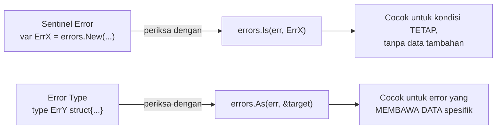

## TL;DR

Ketika kode pemanggil perlu memeriksa **jenis** error yang terjadi (bukan sekadar tahu bahwa sesuatu gagal), Go menyediakan dua pola berbeda: **sentinel error** — sebuah nilai error tunggal yang telah ditentukan sebelumnya (`var ErrTidakDitemukan = errors.New(...)`), diperiksa lewat `errors.Is`; dan **error type** — sebuah tipe struct yang mengimplementasikan interface `error`, membawa data tambahan (bukan sekadar pesan teks), diperiksa lewat `errors.As`. Keduanya menjawab pertanyaan yang sama ("error apa ini?") dengan cara berbeda, dan memilih yang salah untuk kebutuhan tertentu berarti kode pemanggil kehilangan informasi yang sebenarnya tersedia, atau terpaksa melakukan pengecekan yang lebih rumit dari seharusnya.

## The Problem

Sebuah fungsi `AmbilPermohonan(id int64) (Permohonan, error)` mengembalikan error generik `fmt.Errorf("permohonan tidak ditemukan")` ketika baris tidak ada di database. Kode pemanggil yang perlu membedakan "permohonan tidak ditemukan" (harus mengembalikan HTTP 404) dari "koneksi database gagal" (harus mengembalikan HTTP 500) tidak punya cara membedakan keduanya selain **membandingkan teks pesan error** — pendekatan yang rapuh, karena perubahan kecil pada pesan error (memperbaiki typo, menerjemahkan pesan) akan diam-diam merusak logika pemanggil yang bergantung pada teks persis itu, tanpa error compile time apa pun yang memperingatkan.

Masalah kedua: sebuah fungsi validasi butuh mengembalikan **daftar** field mana saja yang gagal validasi dan kenapa (bukan sekadar "validasi gagal") — informasi terstruktur yang tidak bisa dimuat dalam sentinel error tunggal, yang secara desain hanya berupa satu nilai konstan tanpa kapasitas membawa data tambahan spesifik per kejadian. Memaksakan sentinel error untuk kasus ini berarti kode pemanggil kehilangan detail yang sebenarnya tersedia saat error itu dibuat, dan harus mem-parsing ulang informasi itu dari teks pesan (kalau memang disertakan di sana) — pola yang rapuh dan tidak idiomatic.

## Intuition

Bayangkan sentinel error seperti **lampu indikator dengan warna tetap** di sebuah mesin — lampu merah selalu berarti "kertas habis", tidak peduli mesin mana atau kapan itu terjadi; operator cukup mengenali warna itu (`errors.Is(err, ErrKertasHabis)`) untuk tahu persis apa yang terjadi, tanpa butuh informasi tambahan apa pun karena kondisinya sendiri sudah cukup deskriptif dan seragam setiap saat.

Error type seperti **layar digital yang menampilkan kode error beserta detail spesifik** — bukan sekadar "terjadi kesalahan", tapi "kesalahan E205: sensor suhu di bagian atas menunjukkan 85°C, melebihi batas 80°C". Operator yang membaca layar ini mendapat informasi terstruktur (kode error, lokasi, nilai aktual, batas yang dilanggar) yang tidak bisa dimuat dalam satu warna lampu sederhana — informasi ini spesifik per kejadian, bukan konstan yang sama setiap kali.

Analogi ini bocor pada satu hal: lampu indikator fisik dan layar digital adalah dua perangkat keras yang terpisah secara fisik. Di Go, keduanya sama-sama "hanya" nilai yang mengimplementasikan interface `error` — perbedaannya murni pada **bagaimana nilai itu dibuat dan diperiksa** (`errors.Is` untuk membandingkan identitas nilai sentinel, `errors.As` untuk mengekstrak dan memeriksa struktur tipe), bukan mekanisme bahasa yang secara fundamental berbeda.

## How It Works

```go
package repository

import (
	"errors"
	"fmt"
)

// SENTINEL ERROR: satu nilai tetap, dibandingkan lewat errors.Is.
// Cocok untuk kondisi yang SAMA setiap kali terjadi, tanpa data tambahan
// yang perlu disertakan.
var ErrTidakDitemukan = errors.New("data tidak ditemukan")

func AmbilPermohonan(id int64) (Permohonan, error) {
	// ... query database ...
	if tidakAda {
		return Permohonan{}, fmt.Errorf("ambil permohonan %d: %w", id, ErrTidakDitemukan)
	}
	// ...
	return Permohonan{}, nil
}

// ERROR TYPE: struct yang mengimplementasikan interface error, membawa
// DATA TAMBAHAN spesifik per kejadian (daftar field yang gagal validasi).
type ErrorValidasi struct {
	FieldGagal map[string]string // nama field -> alasan gagal
}

func (e *ErrorValidasi) Error() string {
	return fmt.Sprintf("validasi gagal pada %d field", len(e.FieldGagal))
}

func ValidasiPermohonan(p Permohonan) error {
	gagal := make(map[string]string)
	if p.Nomor == "" {
		gagal["nomor"] = "wajib diisi"
	}
	if len(gagal) > 0 {
		return &ErrorValidasi{FieldGagal: gagal}
	}
	return nil
}
```

```go
package handler

import (
	"errors"
	"net/http"
)

func Tangani(err error) {
	// errors.Is membandingkan IDENTITAS nilai sentinel — bekerja meski
	// error sudah dibungkus berkali-kali lewat fmt.Errorf("...: %w", err),
	// lihat Error Wrapping.
	if errors.Is(err, repository.ErrTidakDitemukan) {
		// respond 404
		return
	}

	// errors.As mengekstrak error TYPE tertentu dari rantai error (juga
	// tahan terhadap wrapping) — kalau berhasil, errValidasi terisi
	// dengan DATA TAMBAHAN dari error asli, bukan sekadar mengetahui
	// jenisnya.
	var errValidasi *repository.ErrorValidasi
	if errors.As(err, &errValidasi) {
		// akses errValidasi.FieldGagal untuk respons yang detail
		return
	}

	// respond 500 untuk error yang tidak dikenali
}
```



## Under The Hood

`errors.Is` bekerja dengan menelusuri **rantai error** (dibentuk lewat `fmt.Errorf("...: %w", err)`, lihat [[Error Wrapping]]) dan membandingkan setiap error dalam rantai itu terhadap target menggunakan `==` (identitas pointer/nilai) — atau, kalau error dalam rantai mengimplementasikan method `Is(target error) bool` sendiri, memakai logika kustom itu. `errors.As` juga menelusuri rantai yang sama, tapi mencari error dengan **tipe** yang cocok (lewat type assertion internal), dan kalau ditemukan, **mengisi** variabel target dengan nilai error itu — inilah yang memungkinkan mengekstrak data tambahan (`FieldGagal` pada contoh di atas), bukan sekadar mengetahui "ya, ini jenis error itu".

**Kapan memilih yang mana**: sentinel error cocok untuk kondisi yang identitasnya sudah cukup deskriptif tanpa data tambahan (`ErrTidakDitemukan`, `ErrDitolakOtorisasi`, `sql.ErrNoRows` dari stdlib sendiri adalah contoh sentinel error). Error type cocok begitu kode pemanggil butuh **informasi lebih** dari sekadar "jenis error apa" — data spesifik kejadian itu, seperti field mana yang gagal, nilai berapa yang melebihi batas, atau kode status HTTP eksternal yang diterima dari API partner.

## In Go

```go
package integrasi

import "fmt"

// ErrorAPIPartner adalah error type yang membawa detail respons dari
// partner eksternal — informasi yang SANGAT spesifik per kejadian
// (status code, body respons) yang tidak masuk akal dipaksakan jadi
// sentinel error tunggal.
type ErrorAPIPartner struct {
	StatusCode int
	Body       string
	Partner    string
}

func (e *ErrorAPIPartner) Error() string {
	return fmt.Sprintf("partner %s mengembalikan status %d", e.Partner, e.StatusCode)
}

// ErrPartnerTimeout, sebaliknya, adalah SENTINEL — kondisi "timeout"
// itu sendiri sudah cukup deskriptif tanpa perlu data tambahan spesifik
// (durasi timeout biasanya sudah diketahui dari konfigurasi, tidak perlu
// disertakan di error itu sendiri).
var ErrPartnerTimeout = fmt.Errorf("request ke partner timeout")

func PanggilPartner(url string) error {
	// ... panggilan HTTP ...
	// kalau timeout:
	// return fmt.Errorf("panggil %s: %w", url, ErrPartnerTimeout)

	// kalau partner mengembalikan status error dengan detail:
	// return fmt.Errorf("panggil %s: %w", url, &ErrorAPIPartner{
	//     StatusCode: resp.StatusCode, Body: string(body), Partner: "instansi-x",
	// })
	return nil
}
```

## In His Stack

Untuk kode yang berinteraksi dengan API partner eksternal (relevan langsung dengan pekerjaan integrasi lintas instansi), error type yang membawa status code dan body respons mentah dari partner adalah pola yang jauh lebih berguna dibanding sentinel error generik — saat sebuah integrasi gagal di production, tim butuh tahu **persis** apa yang dikembalikan partner (untuk melaporkan ke tim partner, atau untuk debugging), informasi yang hanya bisa dibawa lewat error type, bukan sentinel error yang secara desain seragam untuk setiap kejadian. Yii2/PHP secara historis lebih sering memakai exception class dengan hierarki inheritance (`class ValidationException extends Exception`) untuk kebutuhan serupa — error type Go mencapai tujuan yang sama (membawa data terstruktur) tanpa hierarki class, cukup lewat struct dan interface `error`.

## Trade-offs and When Not To Use It

Sentinel error yang diekspor menjadi bagian dari kontrak API publik (dibahas di [[Designing Stable Library APIs]]) — sekali diekspor dan diperiksa banyak pemakai lewat `errors.Is`, menghapusnya adalah breaking change. Error type menambah sedikit lebih banyak kode (definisi struct, method `Error()`) dibanding sentinel error yang cukup satu baris — untuk kondisi error yang benar-benar tidak butuh data tambahan, sentinel error tetap pilihan yang lebih sederhana dan sebaiknya tidak "di-upgrade" jadi error type tanpa alasan nyata. Kebalikannya juga berlaku: memaksakan sentinel error untuk kasus yang sebenarnya butuh data spesifik per kejadian (seperti error validasi dengan daftar field) memaksa kode pemanggil kehilangan informasi yang seharusnya tersedia, biasanya berujung pada parsing teks pesan error yang rapuh sebagai jalan pintas yang buruk.

## Common Mistakes

> [!warning] Jebakan
> Membandingkan error lewat teks pesan (`err.Error() == "tidak ditemukan"`) alih-alih `errors.Is`/`errors.As` — rapuh terhadap perubahan pesan error yang seharusnya tidak memengaruhi logika, dan tidak tahan terhadap error yang sudah dibungkus (wrapped).

> [!warning] Jebakan
> Memaksakan sentinel error untuk kasus yang butuh data spesifik per kejadian (misalnya daftar field yang gagal validasi) — kode pemanggil kehilangan informasi yang seharusnya tersedia, dan sering berujung pada workaround yang rapuh seperti parsing teks pesan.

> [!warning] Jebakan
> Membuat error type untuk kondisi sederhana yang sebenarnya tidak butuh data tambahan apa pun — menambah kode dan kompleksitas tanpa manfaat nyata dibanding sentinel error yang jauh lebih sederhana untuk kasus itu.

## Exercises

1. Jelaskan perbedaan mendasar kapan sentinel error tepat dipakai, dan kapan error type lebih tepat.
2. Kenapa membandingkan error lewat teks pesan (`err.Error() == "..."`) dianggap rapuh, dan apa alternatif yang benar?
3. Bagaimana `errors.Is` dan `errors.As` masing-masing bekerja menelusuri rantai error yang sudah dibungkus berkali-kali?
4. Desain terbuka: fungsi `PanggilAPIPembayaran` bisa gagal karena tiga alasan berbeda: (a) timeout jaringan (tidak butuh data tambahan), (b) partner mengembalikan status error dengan kode dan pesan spesifik dari sistem mereka, (c) saldo tidak cukup (butuh menyertakan jumlah saldo saat ini dan jumlah yang dibutuhkan). Rancang strategi error (sentinel vs error type) untuk masing-masing dari ketiga kasus ini, dan jelaskan alasannya.

> [!success]- Kunci jawaban
> **1.** Sentinel error tepat dipakai ketika kondisi errornya **seragam dan cukup deskriptif dari identitasnya sendiri** — tidak ada data tambahan yang berubah-ubah per kejadian yang perlu disertakan (misalnya "tidak ditemukan", "operasi dibatalkan"). Error type lebih tepat begitu kode pemanggil butuh **informasi tambahan spesifik** dari kejadian error itu — data yang nilainya berbeda-beda setiap kali error terjadi (field mana yang gagal, nilai apa yang melebihi batas, status code berapa yang diterima).
> **4.** (a) Timeout jaringan → **sentinel error** (`ErrTimeout`), karena kondisinya seragam dan tidak butuh data tambahan (durasi timeout biasanya sudah diketahui dari konfigurasi pemanggil). (b) Status error dari partner → **error type** (`ErrorPembayaranPartner{KodeError, PesanPartner string}`), karena setiap kejadian membawa data spesifik (kode dan pesan berbeda-beda) yang harus bisa diakses pemanggil untuk logging/debugging atau logika penanganan berbeda per kode. (c) Saldo tidak cukup → **error type** (`ErrorSaldoTidakCukup{SaldoSaatIni, JumlahDibutuhkan int64}`), karena pemanggil (misalnya untuk menampilkan pesan ke pengguna: "saldo Anda Rp X, dibutuhkan Rp Y") butuh kedua angka spesifik itu, yang jelas tidak bisa dimuat sentinel error tunggal.

## Self-Check

- Kapan sentinel error adalah pilihan yang tepat, dan kapan error type lebih tepat?
- Kenapa membandingkan error lewat teks pesan dianggap rapuh?
- Bagaimana `errors.As` memungkinkan mengekstrak data tambahan dari sebuah error?
- Kenapa sentinel error yang diekspor menjadi bagian dari kontrak API publik yang harus dijaga stabil?

## Connected Notes

- [[Error Wrapping]] — `errors.Is`/`errors.As` bekerja menelusuri rantai error yang dibentuk lewat mekanisme wrapping yang dijelaskan penuh di note itu.
- [[Errors as Values]] — sentinel error dan error type adalah dua wujud konkret dari filosofi "error sebagai nilai" yang dibahas fondasinya di note itu.
- [[Designing Stable Library APIs]] — error yang diekspor library adalah bagian dari kontrak API publik yang harus dijaga stabilitasnya, dibahas di note sebelumnya.
- [[../90 Architecture and Design/Handler-Service-Repository Layering|Handler-Service-Repository Layering]] — pola pemeriksaan error lewat `errors.Is`/`errors.As` di handler untuk menerjemahkan error domain jadi status code HTTP adalah aplikasi langsung dari note ini.
- [[../30 APIs and Web/Consistent Error Responses|Consistent Error Responses]] — error type yang membawa data terstruktur sering menjadi sumber langsung field detail pada response error API yang konsisten.

## Further Reading

- Dokumentasi resmi Go, package `errors` — `errors.Is`, `errors.As`, dan `errors.Unwrap`.
- Go blog resmi, "Working with Errors in Go 1.13" — pengantar resmi pola wrapping dan pemeriksaan error modern.

## Catatan Saya

*Tulis di sini satu fungsi di kerjaanmu yang errornya masih diperiksa lewat perbandingan teks pesan — apakah sebaiknya diubah jadi sentinel error atau error type.*
