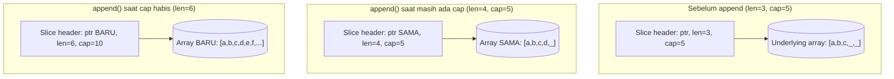

## TL;DR

Slice di Go bukan array — ia adalah **header kecil** berisi tiga hal: pointer ke underlying array, panjang (`len`), dan kapasitas (`cap`). Mem-*slice* sebuah slice (`s[a:b]`) tidak menyalin data — ia membuat header baru yang **menunjuk ke array yang sama**, sehingga mengubah isi satu slice bisa diam-diam mengubah slice lain yang berbagi array yang sama. `append()` memperumit ini lebih jauh: kalau masih ada ruang (`len < cap`), ia menulis di tempat ke array yang sama (terlihat oleh slice lain yang berbagi array itu); kalau ruang habis (`len == cap`), ia **diam-diam mengalokasikan array baru**, menyalin semua data ke sana, dan slice hasil `append` itu sepenuhnya lepas dari array lama. Perilaku yang berubah tergantung kapasitas inilah sumber bug slice paling umum di Go.

## The Problem

Bayangkan sebuah function yang menerima slice `[]byte` berisi potongan dokumen, dan dimaksudkan untuk menambahkan beberapa byte metadata di akhirnya sebelum dikirim ke partner. Kadang perubahan itu "terlihat" oleh kode pemanggil, kadang tidak — perilakunya terasa acak, padahal sebenarnya sepenuhnya deterministik: tergantung apakah slice yang dioper masih punya kapasitas cadangan (`cap > len`) di titik itu atau tidak.

Kalau masih ada kapasitas cadangan, `append()` di dalam function menulis langsung ke underlying array yang sama yang dipegang slice pemanggil — perubahan terlihat. Kalau kapasitas sudah pas habis, `append()` mengalokasikan array baru sepenuhnya, dan slice pemanggil (yang masih menunjuk array lama) tidak pernah melihat perubahan itu. Bug seperti ini terkenal sulit dilacak karena ia **tidak selalu muncul** — hanya muncul di kondisi kapasitas tertentu yang mungkin berbeda antara environment development dan production tergantung ukuran data yang diproses.

## Intuition

Bayangkan slice seperti **jendela yang menghadap ke sebuah ruangan (array)** — kamu bisa menggeser atau mempersempit jendela itu (sub-slicing) tanpa memindahkan ruangannya sama sekali; semua jendela yang menghadap ruangan yang sama tetap melihat ruangan fisik yang sama persis. Tapi kalau kamu mencoba memperluas jendela itu melampaui batas ruangan yang ada (`append` melampaui `cap`), sesuatu yang tidak mungkin terjadi di dunia nyata terjadi di Go: **ruangan baru yang lebih besar tiba-tiba dibangun**, semua isi ruangan lama disalin ke sana, dan jendelamu diam-diam berpindah menghadap ruangan baru itu — sementara jendela lain yang masih menghadap ruangan lama tidak ikut berpindah.

Analogi ini bocor tepat di titik "pembangunan ruangan baru" itu — tidak ada padanan nyata untuk realokasi diam-diam ini di dunia fisik. Memahami persis kapan realokasi ini terjadi (soal kapasitas, bukan soal isi datanya) adalah kunci menghindari bug yang dijelaskan di atas.

## How It Works



Diagram ini menunjukkan tiga keadaan: sub-slicing dan append yang masih muat berbagi array yang persis sama (slice lain yang menunjuk array ini akan melihat perubahannya), sementara append yang melampaui kapasitas melompat ke array yang sama sekali baru — memutus hubungan dengan slice lain yang masih menunjuk array lama.

## In Go

Bug aliasing dari sub-slicing, dan bug append yang perilakunya bergantung kapasitas:

```go
// Bug 1: aliasing lewat sub-slicing.
original := []int{1, 2, 3, 4, 5}
potongan := original[1:3] // [2, 3] — BERBAGI array yang sama dengan original
potongan[0] = 99
fmt.Println(original) // [1, 99, 3, 4, 5] — original ikut berubah!

// Bug 2: append yang perilakunya bergantung kapasitas.
func tambahMetadata(data []byte) []byte {
    return append(data, []byte("-METADATA")...)
}

func main() {
    // Kasus A: slice dengan cap PAS-PAS SAMA dengan len — append memicu realokasi.
    a := make([]byte, 3, 3) // len=3, cap=3, TIDAK ada ruang cadangan
    copy(a, []byte("abc"))
    b := tambahMetadata(a)
    fmt.Println(string(a)) // "abc" — TIDAK berubah, array baru dibuat untuk b
    fmt.Println(string(b)) // "abc-METADATA"

    // Kasus B: slice dengan cap lebih besar dari len — append menulis di tempat.
    c := make([]byte, 3, 20) // len=3, cap=20, ADA ruang cadangan
    copy(c, []byte("abc"))
    d := tambahMetadata(c)
    fmt.Println(string(c[:12])) // ikut berubah! menulis ke array yang sama
    fmt.Println(string(d))      // "abc-METADATA"
}
```

Perilaku `tambahMetadata` berbeda total antara Kasus A dan B, meski kodenya identik persis — satu-satunya yang berbeda adalah kapasitas cadangan slice yang dioper. Ini persis bug yang dijelaskan di "The Problem".

## In His Stack

**PHP array** memakai semantik copy-on-write yang jauh lebih konsisten dan dapat diprediksi — meng-assign array ke variable lain (atau mengopernya ke function tanpa referensi eksplisit `&`) secara efektif memberi salinan independen tanpa gotcha aliasing seperti slice Go. Ini kenapa migrasi mental dari PHP ke Go butuh perhatian ekstra soal slice: kebiasaan "array itu selalu tersalin aman" yang terbentuk dari PHP justru berbahaya kalau diterapkan mentah-mentah ke slice Go.

Slice Go relevan langsung untuk kerja streaming file upload (lihat [[../30 APIs and Web/Streaming vs Buffering|Streaming vs Buffering]]) — buffer `[]byte` yang dipakai ulang lintas beberapa pembacaan chunk sering jadi sumber bug aliasing kalau tidak hati-hati soal kapan buffer itu di-*slice* ulang vs disalin.

## Trade-offs and When Not To Use It

Berbagi underlying array lewat sub-slicing itu **cepat** (tidak ada penyalinan) dan sering kali persis yang diinginkan — misalnya memproses bagian-bagian besar dari satu buffer tanpa menyalin data berkali-kali. Tapi begitu ada kemungkinan dua bagian kode memodifikasi slice yang saling berbagi array secara independen, aliasing ini berbahaya — solusinya adalah menyalin eksplisit lewat `copy()` ke slice baru saat isolasi benar-benar dibutuhkan, dengan harga sedikit alokasi tambahan (lihat [[../50 Concurrency and Performance/Reducing Allocations|Reducing Allocations]] soal kapan alokasi ini benar-benar signifikan).

## Common Mistakes

> [!warning] Jebakan
> Berasumsi `append()` selalu (atau tidak pernah) memodifikasi slice asli di tempat. Perilakunya bergantung sepenuhnya pada apakah `cap` slice yang dioper masih menyisakan ruang — kode yang sama bisa berperilaku berbeda tergantung data yang diproses.

> [!warning] Jebakan
> Mem-*slice* sebagian kecil dari array/slice yang sangat besar dan menyimpan slice kecil itu untuk jangka panjang, tanpa sadar seluruh underlying array besar tetap hidup di memori (tidak bisa di-garbage-collect) selama slice kecil itu masih dipegang — karena slice header masih menunjuk ke array besar yang sama.

> [!warning] Jebakan
> Mengoper slice ke function dengan asumsi ia berperilaku seperti value type yang sepenuhnya terisolasi (seperti struct biasa). Slice selalu berbagi underlying array kecuali secara eksplisit disalin — mengubah elemen (bukan menambah lewat `append`) di dalam function **selalu** terlihat oleh pemanggil, terlepas dari kapasitas.

## Exercises

1. Sebutkan tiga komponen dari slice header di Go.
2. Kenapa mengubah elemen hasil sub-slicing bisa mengubah slice aslinya, tapi `append()` kadang tidak?
3. Tulis kode yang menunjukkan bahwa `append()` bisa memicu alokasi array baru, dan jelaskan kapan itu terjadi.
4. Desain terbuka: sebuah service memproses upload dokumen besar dalam potongan (chunk) memakai satu buffer `[]byte` yang dipakai ulang untuk setiap pembacaan chunk demi menghindari alokasi berulang. Salah satu chunk yang sudah "selesai diproses" ternyata datanya berubah sendiri setelah chunk berikutnya dibaca. Diagnosis akar masalahnya dan rancang perbaikan yang tetap menghindari alokasi berlebihan.

> [!success]- Kunci jawaban
> Akar masalah hampir pasti: kode menyimpan slice hasil sub-slice dari buffer yang dipakai ulang (`chunk := buffer[:n]`) tanpa menyalinnya, lalu buffer yang sama dipakai ulang untuk membaca chunk berikutnya (`io.ReadFull(r, buffer)`) — menimpa data yang sama yang masih "dipegang" oleh slice `chunk` sebelumnya, karena keduanya menunjuk underlying array yang identik. Perbaikan: kalau data chunk perlu disimpan melewati satu iterasi pembacaan berikutnya, salin secara eksplisit lewat `dataChunk := make([]byte, n); copy(dataChunk, buffer[:n])` sebelum buffer dipakai ulang — biaya alokasi ini hanya terjadi untuk chunk yang benar-benar perlu disimpan, bukan untuk setiap pembacaan, sehingga tetap jauh lebih hemat dibanding mengalokasikan buffer baru di setiap iterasi.

## Self-Check

- Apa tiga komponen slice header, dan mana yang menentukan kapan `append()` memicu realokasi?
- Kenapa mengubah elemen slice hasil sub-slicing bisa memengaruhi slice aslinya?
- Kapan `append()` menulis di tempat (in-place) dan kapan ia mengalokasikan array baru?
- Kenapa menyimpan slice kecil hasil sub-slice dari array besar bisa mencegah array besar itu di-garbage-collect?

## Connected Notes

- [[The Go Type System]] — prasyarat: slice adalah salah satu tipe yang perilakunya tidak sepenuhnya value maupun reference semantics, kontras dengan struct biasa.
- [[Map Internals]] — tipe built-in lain dengan perilaku "setengah reference" yang mirip, dibahas dengan perbandingan langsung.
- [[../50 Concurrency and Performance/Reducing Allocations|Reducing Allocations]] — teknik `make([]T, 0, n)` dan pola pre-allocation yang bersandar langsung pada pemahaman kapasitas slice di note ini.
- [[../30 APIs and Web/Streaming vs Buffering|Streaming vs Buffering]] — pemrosesan chunk demi chunk yang rawan bug aliasing seperti dijelaskan di note ini.
- [[../50 Concurrency and Performance/Goroutines|Goroutines]] — berbagi slice antar goroutine tanpa sinkronisasi adalah kombinasi berbahaya dari aliasing dan race condition sekaligus.

## Further Reading

- Artikel resmi *"Go Slices: usage and internals"* di blog resmi Go (go.dev/blog) — penjelasan paling otoritatif dan mendalam soal topik ini.

## Catatan Saya

*Tulis di sini kalau kamu pernah terjebak bug aliasing atau append yang perilakunya "tidak konsisten" di kode Go-mu sendiri.*
