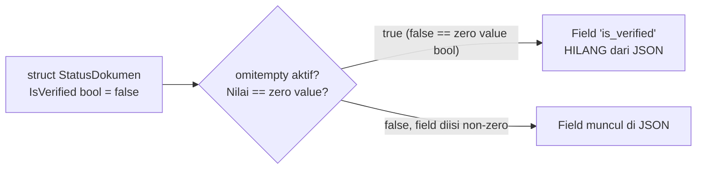

## TL;DR

Struct tag adalah metadata string yang ditempel di field struct, dibaca lewat reflection oleh package seperti `encoding/json` untuk menentukan bagaimana field itu dipetakan ke JSON — nama key (`json:"nama"`), apakah dihilangkan saat kosong (`omitempty`), atau dikecualikan sepenuhnya (`json:"-"`). Yang paling sering menjebak: `omitempty` menghilangkan field berdasarkan **zero value bahasa** (`0`, `""`, `false`, slice/map kosong), bukan berdasarkan makna bisnis "field ini memang tidak diisi" — untuk field seperti `bool` yang nilai `false`-nya justru bermakna penting, `omitempty` bisa diam-diam menghilangkan informasi yang seharusnya dikirim.

## The Problem

Bayangkan sebuah API mengembalikan status verifikasi dokumen ke partner instansi lewat field `IsVerified bool` dengan tag `json:"is_verified,omitempty"`. Selama dokumen sudah terverifikasi (`true`), semuanya baik-baik saja — field itu muncul di response. Tapi begitu status dokumen **belum** terverifikasi (`false`), field `is_verified` **menghilang sepenuhnya** dari JSON response, karena `false` adalah zero value untuk `bool`, dan `omitempty` menghilangkan field apa pun yang bernilai zero value, tanpa peduli apakah nilai itu memang bermakna penting.

Di sisi partner, sistem mereka menginterpretasikan field yang tidak ada sebagai "belum diketahui statusnya" atau — lebih buruk — mengasumsikan default `true` di kode mereka sendiri, membuat dokumen yang sebenarnya **belum** terverifikasi terlihat seolah **sudah** terverifikasi di sistem partner. Bug ini murni berasal dari kesalahpahaman soal apa yang sebenarnya diperiksa `omitempty` — ia memeriksa apakah nilainya sama dengan zero value bahasa, bukan apakah field itu "secara bisnis" perlu ditampilkan.

## Intuition

Bayangkan struct tag seperti **label yang ditempel di kotak gudang**, dibaca oleh petugas pengiriman (`encoding/json` lewat reflection) yang mengikuti instruksi apa pun yang tertulis di label itu — "sebut kotak ini 'nama' saat dikirim" (`json:"nama"`), "lewati kotak ini kalau isinya kosong" (`omitempty`).

Analogi ini bocor pada soal siapa yang menilai "kosong". Petugas gudang sungguhan bisa menilai secara kontekstual apakah sebuah kotak "kosong secara bermakna" atau tidak. `omitempty` tidak melakukan penilaian kontekstual — ia murni mekanis, memeriksa apakah nilainya identik dengan zero value tipe itu (`0`, `""`, `false`, slice/map/pointer `nil`). Nilai `false` yang sengaja diisi dan nilai `false` karena field itu memang tidak pernah diisi **terlihat sama persis** bagi `omitempty` — keduanya dihilangkan tanpa pembedaan.

## How It Works

```go
type StatusDokumen struct {
    ID         string `json:"id"`
    IsVerified bool   `json:"is_verified,omitempty"` // BAHAYA untuk bool!
    Catatan    string `json:"catatan,omitempty"`      // aman untuk string
    Internal   string `json:"-"`                       // tidak pernah muncul di JSON
}
```

`encoding/json` hanya memproses field yang **exported** (diawali huruf besar) — field yang diawali huruf kecil tidak pernah muncul di JSON output maupun input, terlepas dari tag apa pun yang ditempel padanya (karena reflection tidak bisa mengaksesnya dari luar package). Format tag `json:"nama,opsi"` mendukung beberapa opsi: nama key custom, `omitempty` (hilangkan kalau zero value), dan `-` (kecualikan sepenuhnya dari marshalling).



## In Go

Perbaikan untuk bug di "The Problem" — memakai pointer `*bool` untuk membedakan "belum diisi" dari "sengaja `false`":

```go
type StatusDokumenSalah struct {
    ID         string `json:"id"`
    IsVerified bool   `json:"is_verified,omitempty"` // false ikut hilang!
}

// Perbaikan: gunakan pointer *bool. Zero value pointer adalah nil,
// BUKAN false — sehingga omitempty hanya menghilangkan field ini
// kalau memang benar-benar belum diisi, bukan saat nilainya false.
type StatusDokumenBenar struct {
    ID         string `json:"id"`
    IsVerified *bool  `json:"is_verified,omitempty"`
}

func boolPtr(b bool) *bool { return &b }

func main() {
    belumTerverifikasi := StatusDokumenBenar{
        ID:         "A-001",
        IsVerified: boolPtr(false), // sengaja false, TETAP muncul di JSON
    }
    data, _ := json.Marshal(belumTerverifikasi)
    fmt.Println(string(data)) // {"id":"A-001","is_verified":false}

    belumDiisi := StatusDokumenBenar{ID: "A-002"} // IsVerified nil
    data2, _ := json.Marshal(belumDiisi)
    fmt.Println(string(data2)) // {"id":"A-002"} — is_verified benar-benar tidak ada
}
```

Dengan `*bool`, ada tiga keadaan yang bisa dibedakan: `nil` (tidak diisi sama sekali), `&false` (sengaja diisi false), `&true` (sengaja diisi true) — sesuatu yang tidak mungkin dibedakan dengan `bool` polos plus `omitempty`.

## In His Stack

**PHP** dengan `json_encode()` pada associative array tidak butuh mekanisme tag sama sekali — array asosiatif PHP sudah berbentuk pasangan key-value secara alami, jadi memetakan ke JSON tidak perlu metadata tambahan. Kebutuhan struct tag di Go adalah konsekuensi langsung dari static typing (lihat [[The Go Type System]]): struct punya bentuk tetap yang ditentukan saat kompilasi, sehingga dibutuhkan mekanisme eksplisit untuk memberitahu bagaimana bentuk tetap itu dipetakan ke format yang lebih fleksibel seperti JSON.

## Trade-offs and When Not To Use It

`omitempty` berguna untuk field yang benar-benar opsional (field string kosong yang memang berarti "tidak diisi", slice kosong yang memang berarti "tidak ada item") — mengurangi noise di payload API. Untuk field yang nilai zero-nya (`0`, `false`, `""`) punya makna bisnis yang berbeda dari "tidak diisi", hindari `omitempty` polos: gunakan tipe pointer (`*bool`, `*int`) untuk membedakan ketiga keadaan (tidak diisi / sengaja zero / sengaja non-zero), atau pertimbangkan tidak memakai `omitempty` sama sekali dan biarkan field itu selalu muncul dengan nilai eksplisit.

## Common Mistakes

> [!warning] Jebakan
> Memakai `omitempty` pada field `bool` atau numerik tanpa menyadari bahwa nilai zero yang bermakna (`false`, `0`) akan ikut dihilangkan dari output, bukan hanya field yang benar-benar tidak diisi.

> [!warning] Jebakan
> Lupa bahwa `encoding/json` hanya memproses field yang exported (diawali huruf besar). Field yang diawali huruf kecil tidak akan pernah muncul di JSON, berapa pun tag yang ditempel padanya — bug ini sering muncul sebagai "kenapa field saya hilang dari response" pada pemula.

> [!warning] Jebakan
> Tidak memperhatikan efek embedding struct pada output JSON — field dari struct yang di-embed biasanya "dinaikkan" (promoted) langsung ke level JSON induknya, yang bisa menyebabkan tabrakan nama key yang tidak terduga kalau tidak diperiksa dengan sengaja.

## Exercises

1. Apa yang diperiksa `omitempty` secara teknis — apakah field "diisi" atau apakah nilainya "zero value"?
2. Kenapa field `bool` dengan `omitempty` berbahaya untuk data yang nilai `false`-nya bermakna penting?
3. Bagaimana `*bool` menyelesaikan masalah yang tidak bisa diselesaikan `bool` polos plus `omitempty`?
4. Desain terbuka: sebuah API pemerintah yang kamu kelola perlu menambahkan field baru `sudah_dibayar bool` ke response status permohonan, dan tim ingin field ini `omitempty` supaya payload lama (dari versi API sebelumnya) tetap kompatibel untuk permohonan yang belum punya konsep pembayaran. Rancang skema field ini (tipe data dan tag) yang tetap membedakan "belum ada konsep pembayaran" dari "sudah ada tapi belum dibayar" dari "sudah dibayar", dan jelaskan kenapa pilihanmu aman untuk partner yang sudah mengintegrasikan versi API lama.

> [!success]- Kunci jawaban
> Gunakan `SudahDibayar *bool` dengan tag `json:"sudah_dibayar,omitempty"`. Untuk permohonan lama yang belum punya konsep pembayaran, biarkan field ini `nil` — field tidak muncul sama sekali di JSON, sehingga partner yang belum familiar dengan field baru ini tidak terpengaruh (kompatibel mundur). Untuk permohonan yang sudah punya konsep pembayaran tapi belum dibayar, set eksplisit ke `&false` — field **tetap muncul** di JSON dengan nilai `false`, membedakannya jelas dari kasus "belum ada konsep pembayaran sama sekali". Partner yang ingin memakai informasi ini bisa memeriksa dulu apakah field ada sebelum membaca nilainya, dan partner lama yang tidak peduli field ini tidak akan terpengaruh sama sekali karena field baru selalu opsional dalam JSON, sesuai prinsip [[../30 APIs and Web/API Versioning|API Versioning]] yang aman.

## Self-Check

- Apa yang sebenarnya diperiksa `omitempty` — kehadiran field atau nilai zero value?
- Kenapa `bool` dengan `omitempty` berisiko menghilangkan informasi bermakna?
- Kenapa field yang diawali huruf kecil tidak pernah muncul di JSON?
- Bagaimana pointer (`*bool`, `*int`) membantu membedakan "tidak diisi" dari "sengaja zero"?

## Connected Notes

- [[Structs and Methods]] dan [[The Go Type System]] — prasyarat: struct dan zero value yang mendasari perilaku `omitempty`.
- [[../30 APIs and Web/REST Principles|REST Principles]] — desain payload API yang bergantung langsung pada pemahaman marshalling ini.
- [[../30 APIs and Web/API Versioning|API Versioning]] — strategi menambah field baru secara aman, seperti dicontohkan di exercise note ini.
- [[../30 APIs and Web/Consistent Error Responses|Consistent Error Responses]] — format JSON yang konsisten untuk error juga bergantung pada disiplin struct tag yang sama.
- [[Embedding]] — efek embedding struct pada output JSON yang disebut sebagai jebakan di note ini.

## Further Reading

- Dokumentasi resmi package `encoding/json` (pkg.go.dev/encoding/json) — referensi lengkap seluruh opsi tag yang didukung.

## Catatan Saya

*Tulis di sini kalau kamu pernah menemukan bug `omitempty` yang menghilangkan data bermakna di API-mu sendiri atau saat mengintegrasikan API partner.*
