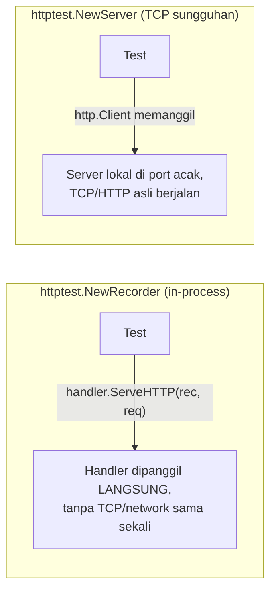

## TL;DR

Package `httptest` menyediakan dua alat berbeda untuk dua kebutuhan berbeda: `httptest.NewRecorder()` + `httptest.NewRequest()` menguji handler HTTP **langsung di dalam process**, tanpa server sungguhan berjalan sama sekali — cepat dan tidak rawan konflik port. `httptest.NewServer()` justru menjalankan server HTTP sungguhan di port lokal acak — lebih lambat, tapi berguna saat kamu perlu menguji kode **klien** (misalnya `http.Client` yang memanggil partner) terhadap server palsu yang bisa dikendalikan penuh perilakunya, tanpa menyentuh jaringan asli sama sekali.

## The Problem

Bayangkan seorang engineer ingin menguji sebuah handler HTTP dan menulis test yang benar-benar menjalankan `http.ListenAndServe(":8080", handler)` di goroutine terpisah, lalu mengirim request sungguhan lewat `http.Get("http://localhost:8080/...")`. Ini bekerja, tapi lambat (overhead jaringan sungguhan meski lokal) dan rawan gagal secara acak saat banyak test berjalan paralel dan kebetulan berebut port yang sama.

Masalah kedua: sebuah function yang memanggil API partner lewat `http.Client` — logikanya termasuk retry saat partner merespons `500`. Menguji logika retry ini butuh cara mengendalikan persis kapan "server partner" merespons error dan kapan sukses — sesuatu yang tidak mungkin dilakukan dengan memanggil API partner sungguhan dari dalam test (partner tidak akan pernah "diperintah" gagal sesuai skenario test).

## Intuition

Bayangkan `httptest.NewRecorder` seperti **panggung latihan** — aktor (handler) tampil persis seperti akan tampil di depan penonton sungguhan, tapi alat perekam (recorder) menangkap semuanya tanpa perlu gedung teater atau penonton sungguhan hadir. `httptest.NewServer` lebih seperti **set syuting mini yang sungguhan** — cukup nyata (benar-benar memakai TCP/HTTP asli) untuk membuat kode klienmu benar-benar melakukan panggilan jaringan sesungguhan, tapi dibangun sekali pakai untuk kebutuhan test itu saja, lalu dibongkar begitu selesai.

Analogi "panggung latihan" untuk `NewRecorder` bocor pada satu hal: ia tidak sepenuhnya meniru semantik server sungguhan — kalau handler men-spawn goroutine yang terus menulis ke response setelah handler itu sendiri selesai (pola yang jarang tapi ada), `ResponseRecorder` tidak menangkapnya seperti koneksi jaringan sungguhan akan menangkapnya. `NewRecorder` sangat cocok untuk menguji logika handler, tapi bukan pengganti penuh untuk test end-to-end yang benar-benar menguji semantik jaringan.

## How It Works



## In Go

Menguji handler langsung, tanpa server sungguhan — menjawab masalah pertama:

```go
func TestDocumentHandler(t *testing.T) {
    req := httptest.NewRequest(http.MethodGet, "/dokumen/A-001", nil)
    rec := httptest.NewRecorder()

    documentHandler(rec, req) // dipanggil LANGSUNG, tanpa server/network

    require.Equal(t, http.StatusOK, rec.Code)

    var body map[string]string
    require.NoError(t, json.Unmarshal(rec.Body.Bytes(), &body))
    require.Equal(t, "A-001", body["id"])
}
```

Menguji logic klien (retry saat partner merespons 500) — menjawab masalah kedua, memakai server palsu yang bisa dikendalikan penuh:

```go
func TestCallPartnerWithRetry(t *testing.T) {
    var jumlahPanggilan int
    fakePartner := httptest.NewServer(http.HandlerFunc(func(w http.ResponseWriter, r *http.Request) {
        jumlahPanggilan++
        if jumlahPanggilan < 3 {
            w.WriteHeader(http.StatusInternalServerError) // gagal 2x dulu
            return
        }
        w.WriteHeader(http.StatusOK) // sukses di percobaan ke-3
    }))
    defer fakePartner.Close() // WAJIB — mencegah goroutine server bocor

    err := callPartnerWithRetry(context.Background(), fakePartner.URL, 3)

    require.NoError(t, err)
    require.Equal(t, 3, jumlahPanggilan) // membuktikan retry benar-benar terjadi
}
```

`fakePartner.URL` memberi alamat server lokal sungguhan (`http://127.0.0.1:PORT_ACAK`) — kode klien yang diuji sama sekali tidak tahu bahwa ini bukan server partner asli, karena secara protokol memang server HTTP/TCP sungguhan yang berjalan lokal.

## In His Stack

Pola pengujian handler seperti ini berbeda dari kebiasaan test fungsional Yii2 yang sering menjalankan siklus request penuh lewat framework (atau tool seperti Codeception yang benar-benar mengarahkan request ke aplikasi yang berjalan) — `httptest.NewRecorder` di Go sengaja dibuat jauh lebih ringan: memanggil handler langsung sebagai function biasa, tanpa framework atau siklus hidup request yang berat, mencerminkan filosofi Go yang menghindari "magic" tersembunyi dalam testing.

## Trade-offs and When Not To Use It

`httptest.NewRecorder` cepat dan andal untuk menguji **logika** handler (status code, isi response, pemanggilan service yang tepat) — tapi tidak sepenuhnya menguji semantik jaringan sungguhan (timeout koneksi, perilaku middleware yang bergantung pada koneksi TCP asli). `httptest.NewServer` lebih realistis (TCP/HTTP asli) tapi lebih lambat dan memakai port sungguhan — pakai ini secukupnya, terutama untuk menguji kode **klien** yang benar-benar perlu melakukan round-trip jaringan asli (seperti retry, timeout), bukan untuk setiap test handler biasa.

## Common Mistakes

> [!warning] Jebakan
> Menjalankan `http.ListenAndServe` pada port tetap di dalam test, alih-alih memakai `httptest.NewRecorder` atau `httptest.NewServer` (yang otomatis memilih port acak yang tersedia). Ini lebih lambat dan rawan gagal acak saat test berjalan paralel dan berebut port yang sama.

> [!warning] Jebakan
> Hanya menguji logika handler lewat `NewRecorder` dan tidak pernah menguji kode klien (retry, timeout, parsing response) lewat `NewServer` yang dikendalikan skenarionya — bug di jalur klien (bukan handler) jadi tidak pernah tertangkap unit test.

> [!warning] Jebakan
> Lupa memanggil `defer server.Close()` setelah `httptest.NewServer()`. Server ini benar-benar menjalankan goroutine dan listener TCP sungguhan di belakang layar — lupa menutupnya membocorkan resource yang menumpuk seiring banyaknya test yang dijalankan dalam satu suite.

## Exercises

1. Apa perbedaan mendasar antara `httptest.NewRecorder` dan `httptest.NewServer`?
2. Kenapa `httptest.NewRecorder` jauh lebih cepat dibanding menjalankan server sungguhan di port tetap?
3. Kapan `httptest.NewServer` lebih tepat dipakai dibanding `httptest.NewRecorder`?
4. Desain terbuka: sebuah tim ingin menguji kode integrasi mereka dengan API partner verifikasi dokumen, termasuk skenario partner mengembalikan rate limit (`429`) dan skenario partner lambat merespons (mendekati timeout). Rancang test lengkap memakai `httptest.NewServer` yang mensimulasikan kedua skenario ini tanpa pernah menyentuh API partner sungguhan.

> [!success]- Kunci jawaban
> Untuk skenario `429`, buat `httptest.NewServer` dengan handler yang mengembalikan status `429` pada panggilan pertama (dengan header `Retry-After` kalau kode klien memang membacanya) dan `200` di panggilan berikutnya, lalu verifikasi kode klien menunggu sesuai `Retry-After` sebelum mencoba lagi (lihat [[../30 APIs and Web/Rate Limiting Algorithms|Rate Limiting Algorithms]] dari sisi yang menerima rate limit, bukan menerapkannya). Untuk skenario lambat, buat handler yang sengaja `time.Sleep` melebihi timeout yang dikonfigurasi di `http.Client` milik kode yang diuji, lalu verifikasi function tersebut benar-benar mengembalikan error timeout dalam waktu yang diharapkan (bukan menggantung tanpa batas) — ini menguji [[../30 APIs and Web/Timeout Budgets|Timeout Budgets]] secara langsung tanpa perlu partner sungguhan yang benar-benar lambat.

## Self-Check

- Apa perbedaan mendasar `httptest.NewRecorder` dan `httptest.NewServer`?
- Kenapa `httptest.NewRecorder` tidak butuh port jaringan sama sekali?
- Kenapa lupa `defer server.Close()` berbahaya untuk test suite yang besar?
- Kapan `httptest.NewServer` lebih tepat dibanding `httptest.NewRecorder`?

## Connected Notes

- [[Mocking Through Interfaces]] — pelengkap: mocking menggantikan dependency lewat interface, `httptest` menggantikan server/network sungguhan secara spesifik untuk HTTP.
- [[../30 APIs and Web/net-http Handlers and Middleware|net-http Handlers and Middleware]] — handler yang diuji lewat `httptest.NewRecorder` di note ini.
- [[../30 APIs and Web/Timeout Budgets|Timeout Budgets]] dan [[../30 APIs and Web/Retries with Exponential Backoff and Jitter|Retries with Exponential Backoff and Jitter]] — pola resilience yang paling natural diuji lewat `httptest.NewServer`.
- [[../30 APIs and Web/Integration Testing Across an Organisational Boundary|Integration Testing Across an Organisational Boundary]] — `httptest.NewServer` sebagai jembatan antara unit test murni dan integration test penuh terhadap partner sungguhan.

## Further Reading

- Dokumentasi resmi package `net/http/httptest` (pkg.go.dev/net/http/httptest) — referensi lengkap API `NewRecorder`, `NewRequest`, dan `NewServer`.

## Catatan Saya

*Tulis di sini kode integrasi partner di kerjaanmu yang paling sulit diuji, dan bagaimana httptest.NewServer bisa membantu menyimulasikan skenario yang sulit direproduksi dengan partner asli.*
