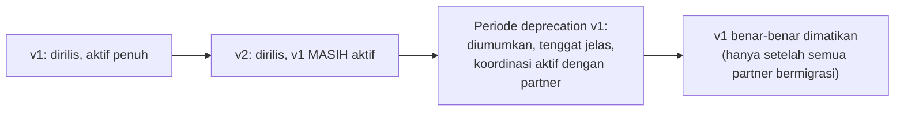

## TL;DR

Versioning API menjawab satu pertanyaan: bagaimana mengubah kontrak API tanpa mematahkan klien yang sudah terintegrasi dengan versi sebelumnya. Perubahan **aditif** (field opsional baru, endpoint baru) tidak butuh bump versi. Perubahan **breaking** (field dihapus/diganti nama, tipe berubah, field yang tadinya opsional jadi wajib) butuh bump versi **dan** kebijakan deprecation dengan tenggat waktu nyata. Nomor versi sendiri **tidak otomatis menyelesaikan** masalah migrasi — ia hanya memberi sinyal; memigrasikan klien yang sudah ada dari versi lama tetap butuh proses aktif, terutama untuk partner pemerintah/enterprise yang fleksibilitas teknisnya terbatas dan tidak bisa "langsung pindah begitu ada versi baru".

## The Problem

Bayangkan sebuah tim mengubah nama field `nama_lengkap` jadi `full_name` di response API yang sudah diintegrasikan beberapa instansi partner selama berbulan-bulan, tanpa bump versi dan tanpa pemberitahuan — perubahan ini terasa "kecil" dari sudut pandang tim internal. Tapi tanpa sinyal apa pun, sistem partner yang membaca field `nama_lengkap` tiba-tiba mulai menerima `null`/kosong untuk field itu, karena field itu memang sudah tidak ada lagi di response — kode integrasi mereka tidak error secara eksplisit (parsing JSON tetap "berhasil"), tapi data yang mereka proses jadi salah secara diam-diam.

Karena partner instansi pemerintah biasanya tidak punya tim yang siaga 24/7 memantau perubahan API pihak lain, dan siklus perubahan di sisi mereka sering butuh waktu jauh lebih lama (birokrasi internal, jadwal deployment yang jarang) dibanding tim software biasa, insiden seperti ini bisa berlangsung berhari-hari sebelum ada yang menyadarinya — dan saat disadari, memperbaikinya di sisi partner butuh waktu jauh lebih lama daripada sekadar "deploy patch cepat" yang biasa dilakukan tim internal sendiri.

## Intuition

Bayangkan versi API seperti **nomor revisi resmi sebuah undang-undang** — kalau perubahan hanya menambah catatan penjelas (aditif), tidak perlu revisi baru. Tapi kalau perubahan itu mengubah hak dan kewajiban yang sudah berlaku (breaking), harus diterbitkan sebagai revisi bernomor baru, dan revisi lama tetap berlaku untuk kasus-kasus yang sedang berjalan sampai masa transisi berakhir.

Analogi ini bocor pada satu hal penting: nomor revisi undang-undang membuat pembacanya otomatis sadar versi mana yang sedang dipegang. Nomor versi API **tidak menegakkan dirinya sendiri** — tidak ada yang mencegah klien lama terus memanggil versi lama tanpa batas waktu, kecuali penyedia API secara aktif menetapkan dan mengomunikasikan tanggal sunset, lalu benar-benar mematikannya. Disiplin benar-benar mempensiunkan versi lama harus dikelola secara aktif — ia tidak terjadi otomatis hanya karena versi baru sudah dirilis.

## How It Works

Dua strategi versioning yang umum:

- **URL path versioning** (`/v1/dokumen`, `/v2/dokumen`) — sederhana, sangat terlihat, mudah diuji manual (termasuk langsung dari browser), tapi cenderung mendorong bump versi untuk **seluruh API** meski hanya satu endpoint yang berubah.
- **Header-based versioning** (`Accept: application/vnd.instansi.v2+json`, atau header kustom) — URL tetap stabil, lebih granular per perubahan, tapi lebih sulit diuji manual dan butuh pemahaman teknis lebih tinggi dari konsumen API.



Untuk konteks partner pemerintah/enterprise dengan fleksibilitas teknis terbatas, jendela periode deprecation ini **harus jauh lebih panjang** dan melibatkan komunikasi aktif (bukan sekadar catatan changelog) dibanding audiens SaaS konsumen biasa yang bisa migrasi dalam hitungan hari.

## In Go

Pola URL versioning dengan logika bisnis inti dibagi (bukan diduplikasi) antar versi:

```go
mux := http.NewServeMux()
mux.HandleFunc("GET /v1/dokumen/{id}", v1GetDokumenHandler)
mux.HandleFunc("GET /v2/dokumen/{id}", v2GetDokumenHandler)

// Logika bisnis inti (service layer) SAMA untuk kedua versi —
// hanya lapisan translasi response yang berbeda per versi.
func v1GetDokumenHandler(w http.ResponseWriter, r *http.Request) {
    doc, err := docService.AmbilDokumen(r.Context(), r.PathValue("id"))
    if err != nil {
        writeError(w, err)
        return
    }
    // v1 masih memakai nama field lama untuk kompatibilitas klien lama
    respondJSON(w, http.StatusOK, map[string]any{
        "id":           doc.ID,
        "nama_lengkap": doc.NamaLengkap,
    })
}

func v2GetDokumenHandler(w http.ResponseWriter, r *http.Request) {
    doc, err := docService.AmbilDokumen(r.Context(), r.PathValue("id")) // service YANG SAMA
    if err != nil {
        writeError(w, err)
        return
    }
    // v2 memakai nama field baru
    respondJSON(w, http.StatusOK, map[string]any{
        "id":        doc.ID,
        "full_name": doc.NamaLengkap,
    })
}
```

Kuncinya: `docService.AmbilDokumen` (logika bisnis inti, lihat [[../90 Architecture and Design/Handler-Service-Repository Layering|Handler-Service-Repository Layering]]) **tidak diduplikasi** antar versi — hanya lapisan translasi response di handler yang berbeda. Ini mencegah versi API yang berbeda diam-diam berevolusi jadi punya logika bisnis yang berbeda pula, yang justru menciptakan bug baru.

## In His Stack

Konteks kerja koordinasi teknis lintas 13+ aplikasi pemerintah membuat pertimbangan ini bukan teori abstrak: partner instansi biasanya punya siklus perubahan yang jauh lebih lambat daripada tim software murni — perubahan di sisi mereka sering butuh persetujuan internal, jadwal deployment yang jarang, dan terkadang keterbatasan tim teknis. Kebijakan deprecation yang realistis untuk "SaaS konsumen biasa" (misalnya sunset dalam 30 hari) hampir pasti tidak realistis di konteks ini — jendela waktu yang jauh lebih panjang, plus koordinasi aktif (bukan sekadar pengumuman satu arah), biasanya jadi keharusan, bukan kemewahan.

## Trade-offs and When Not To Use It

URL versioning sederhana dan sangat terlihat, tapi cenderung mendorong bump versi untuk seluruh API meski perubahannya kecil, dan berpotensi menduplikasi routing/kode kalau tidak disiplin memisahkan logika bisnis dari translasi versi (seperti contoh di atas). Header-based versioning lebih granular dan lebih sesuai semangat REST murni, tapi menuntut kematangan teknis lebih tinggi dari konsumen API — untuk audiens partner yang fleksibilitas teknisnya terbatas (konteks kerja ini persis), URL versioning yang sederhana dan mudah diuji manual sering kali pilihan yang lebih pragmatis, meski secara teori "kurang RESTful".

## Common Mistakes

> [!warning] Jebakan
> Melakukan perubahan breaking (menghapus/mengganti nama field, mengubah tipe data, membuat field opsional jadi wajib) tanpa bump versi dan tanpa pemberitahuan — partner tidak pernah tahu ada perubahan sampai integrasi mereka rusak secara diam-diam.

> [!warning] Jebakan
> Bump versi untuk perubahan yang sebenarnya aditif/backward-compatible (menambah field opsional baru, menambah endpoint baru), memaksa semua konsumen — termasuk partner dengan siklus perubahan lambat — melalui migrasi yang sebenarnya tidak perlu.

> [!warning] Jebakan
> Mengumumkan sunset versi lama dengan tenggat waktu yang realistis untuk tim software internal tapi tidak realistis untuk partner pemerintah/enterprise dengan keterbatasan fleksibilitas teknis, tanpa koordinasi aktif — hanya mengandalkan satu email atau catatan changelog sebagai pemberitahuan.

## Exercises

1. Apa yang membedakan perubahan aditif dari perubahan breaking pada sebuah API?
2. Kenapa nomor versi saja tidak menyelesaikan masalah migrasi klien lama?
3. Kenapa jendela deprecation untuk partner pemerintah/enterprise biasanya harus lebih panjang dibanding audiens SaaS biasa?
4. Desain terbuka: sebuah tim perlu mengubah struktur response endpoint `GET /permohonan/{id}` secara signifikan (field yang berubah tipe dari string ke object bertingkat) karena kebutuhan bisnis baru, dan endpoint ini sudah diintegrasikan lima instansi partner berbeda dengan tingkat kematangan teknis yang bervariasi. Rancang rencana versioning dan migrasi lengkap, termasuk komunikasi ke partner.

> [!success]- Kunci jawaban
> Rilis `/v2/permohonan/{id}` dengan struktur baru, sambil mempertahankan `/v1/permohonan/{id}` berjalan penuh tanpa perubahan — keduanya dilayani logika bisnis inti yang sama (lihat contoh kode di atas), hanya lapisan translasi response yang berbeda. Komunikasikan ke kelima partner secara individual (bukan hanya broadcast satu arah) dengan dokumentasi migrasi konkret, contoh kode before/after, dan tenggat waktu yang disesuaikan kemampuan masing-masing partner (partner dengan tim teknis lebih matang mungkin bisa migrasi dalam beberapa minggu, yang lain mungkin butuh berbulan-bulan). Sediakan periode di mana v1 dan v2 berjalan **bersamaan** cukup lama, dengan monitoring eksplisit yang melacak partner mana saja yang masih memanggil v1 — baru pertimbangkan mematikan v1 setelah traffic v1 dari partner tersebut benar-benar nol atau setelah konfirmasi eksplisit dari partner bahwa mereka sudah bermigrasi penuh, bukan berdasarkan tenggat waktu semata.

## Self-Check

- Apa yang membedakan perubahan aditif dari perubahan breaking?
- Kenapa nomor versi tidak otomatis menyelesaikan masalah migrasi?
- Kenapa jendela deprecation untuk partner pemerintah biasanya lebih panjang?
- Sebutkan satu trade-off antara URL versioning dan header-based versioning.

## Connected Notes

- [[Resource Modelling]] — perubahan struktur resource adalah alasan paling umum sebuah versi baru dibutuhkan.
- [[Consistent Error Responses]] — format error yang konsisten juga perlu dijaga stabil lintas versi.
- [[Contract Negotiation and Versioning]] — pembahasan lebih dalam soal negosiasi kontrak dengan partner yang fleksibilitasnya terbatas.
- [[../90 Architecture and Design/API Governance|API Governance]] — kebijakan versioning lintas tim sebagai bagian dari tata kelola API yang lebih besar.
- [[../90 Architecture and Design/Handler-Service-Repository Layering|Handler-Service-Repository Layering]] — layering yang mencegah logika bisnis terduplikasi antar versi API, seperti dicontohkan di note ini.

## Further Reading

- Panduan versioning API resmi dari penyedia API besar (misalnya Stripe API Versioning docs) sebagai referensi praktik industri yang matang — meski kebijakan waktu spesifik mereka bisa berbeda dari kebutuhan konteks partner pemerintah.

## Catatan Saya

*Tulis di sini perubahan API di kerjaanmu yang pernah (atau nyaris) mematahkan integrasi partner karena tidak di-versioning dengan benar.*
