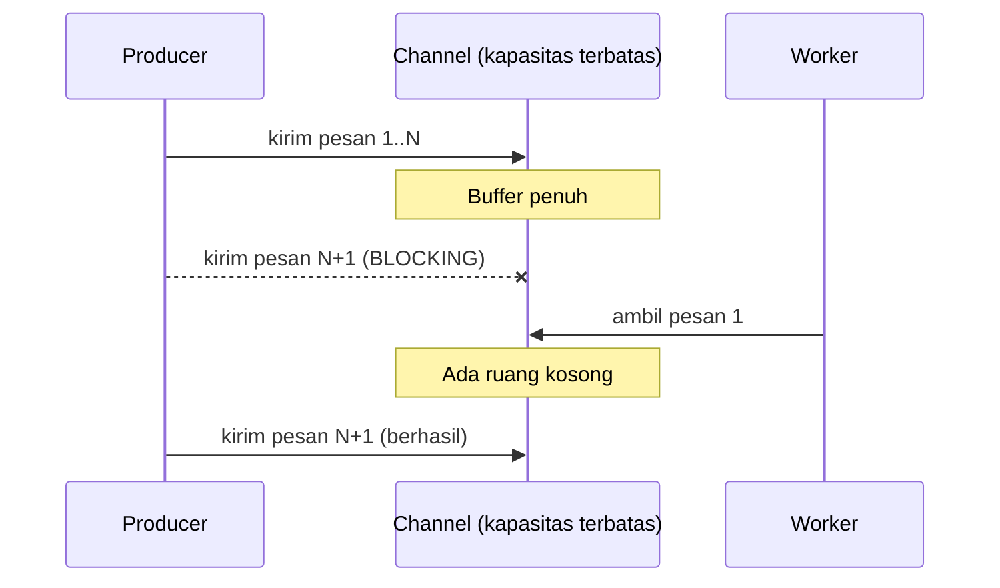

## TL;DR

**Backpressure** adalah mekanisme yang membiarkan penerima yang kewalahan memberi tahu pengirim untuk memperlambat, alih-alih menyerap semua yang dikirim padanya tanpa batas sampai akhirnya kehabisan resource dan crash. Tanpa backpressure, sistem yang menerima lebih banyak pekerjaan daripada yang bisa ia proses hanya punya dua nasib: buffer yang terus membengkak sampai memori habis, atau data yang dibuang diam-diam ketika buffer akhirnya penuh. Backpressure mengubah kelebihan beban dari kegagalan tak terduga menjadi sinyal eksplisit yang bisa direspons — pengirim memperlambat, request baru ditolak dengan jelas, atau pekerjaan diprioritaskan — alih-alih membiarkan sistem runtuh secara diam-diam.

## The Problem

Sebuah service di sistem legal-services menerima event dari Kafka dan memproses setiap event dengan memanggil layanan OCR eksternal yang lambat — sekitar dua detik per dokumen. Producer mengirim event jauh lebih cepat dari itu, terutama menjelang tenggat waktu layanan tahunan ketika ribuan permohonan masuk dalam hitungan menit. Consumer menampung pesan yang belum sempat diproses di dalam channel Go internal dengan buffer besar, dengan asumsi "buffer besar berarti aman dari kehilangan pesan".

Asumsi ini keliru dua arah. Kalau buffer memang besar tapi terbatas, dan laju masuk terus melebihi laju keluar, buffer itu pada akhirnya tetap penuh — pertanyaannya hanya kapan, bukan apakah. Kalau buffer dibuat "tidak terbatas" (channel unbuffered yang ditampung lewat goroutine penerima tanpa batas, atau struktur data yang terus tumbuh), memori service itu terus naik sampai proses itu sendiri di-kill oleh out-of-memory killer Kubernetes — bukan gagal dengan pesan error yang jelas, tapi mati mendadak tanpa peringatan, membawa serta seluruh pekerjaan yang sedang ditampung di buffer itu, hilang tanpa jejak.

## Intuition

Cara paling mudah memahaminya: bayangkan jalur produksi pabrik dengan dua stasiun kerja berurutan — stasiun pertama merakit komponen dengan cepat, stasiun kedua memeriksa kualitas dengan lambat karena butuh ketelitian. Tanpa mekanisme apa pun, komponen dari stasiun pertama akan menumpuk tak terkendali di depan stasiun kedua sampai lantai pabrik penuh. Sistem produksi nyata menyelesaikan ini dengan **conveyor belt bertingkat terbatas**: begitu ruang di conveyor belt penuh, stasiun pertama otomatis berhenti merakit sampai ada ruang kosong lagi — pemberitahuan "saya penuh, tunggu" mengalir mundur dari stasiun lambat ke stasiun cepat.

Analogi ini berhenti bekerja pada satu titik: pabrik fisik hanya punya satu jalur linear yang jelas ke mana tekanan itu mengalir mundur. Sistem terdistribusi sering punya banyak lapisan (client, load balancer, service, database) dan sinyal backpressure harus mengalir mundur melalui **semua** lapisan itu secara konsisten — satu lapisan yang tidak meneruskan sinyal ini membuat lapisan di depannya tetap kewalahan meski lapisan di belakangnya sudah memperlambat diri.

## How It Works



Diagram ini menunjukkan bentuk backpressure paling dasar di Go: **channel buffered dengan kapasitas terbatas**. Begitu buffer penuh, operasi kirim (`ch <- pesan`) otomatis **memblokir** goroutine pengirim sampai ada ruang kosong — mekanisme backpressure ini sudah bawaan bahasa, bukan sesuatu yang perlu dibangun manual, selama channel unbuffered atau buffered dipakai alih-alih struktur data yang tumbuh tanpa batas seperti slice yang terus di-append.

Backpressure di level yang lebih luas (antar service, bukan hanya antar goroutine) butuh mekanisme eksplisit karena tidak ada channel bawaan yang menjembatani jaringan:

- **Menolak request baru secara eksplisit** ketika kapasitas penuh — mengembalikan HTTP `503 Service Unavailable` atau `429 Too Many Requests`, memberi sinyal jelas ke pengirim untuk mencoba lagi nanti, alih-alih diam-diam mengantre tanpa batas.
- **Bounded queue dengan kebijakan penuh yang eksplisit** — ketika antrean penuh, keputusan sadar harus dibuat: tolak pesan baru (load shedding, dibahas di [[Load Shedding]]), atau buang pesan terlama untuk memberi ruang yang terbaru (masuk akal untuk data yang basi cepat, seperti update lokasi real-time).
- **Rate limiting di sisi pengirim** yang secara proaktif membatasi laju kirim berdasarkan kapasitas yang diketahui penerima, dibahas lebih formal di [[Rate Limiting Algorithms]].

## In Go

```go
package main

import (
	"context"
	"fmt"
)

const kapasitasBuffer = 100

func jalankanPipelineDenganBackpressure(ctx context.Context, sumberEvent <-chan Event) error {
	// Channel buffered dengan kapasitas terbatas adalah backpressure
	// paling sederhana: begitu penuh, pengirim otomatis diblokir.
	antrean := make(chan Event, kapasitasBuffer)

	go func() {
		defer close(antrean)
		for event := range sumberEvent {
			select {
			case antrean <- event:
				// Berhasil masuk antrean.
			case <-ctx.Done():
				return
			}
		}
	}()

	for event := range antrean {
		if err := prosesEvent(ctx, event); err != nil {
			return fmt.Errorf("gagal memproses event %s: %w", event.ID, err)
		}
	}
	return nil
}
```

Dengan `kapasitasBuffer` yang terbatas, goroutine yang membaca dari `sumberEvent` dan mengirim ke `antrean` akan secara alami tertahan (blocking di `antrean <- event`) begitu antrean penuh — memberi waktu bagi `prosesEvent` menyelesaikan pekerjaannya, alih-alih membiarkan `sumberEvent` terus dibaca tanpa kendali dan menumpuk di memori.

## In His Stack

Backpressure jadi pertimbangan penting di titik-titik integrasi dengan Kafka — consumer Go yang membaca dari Kafka lebih lambat dari laju partition menerima pesan baru akan otomatis tertahan (Kafka sendiri menyimpan pesan yang belum dibaca di broker, bukan di consumer, sehingga backpressure alami terjadi lewat consumer yang berhenti fetch sampai siap), berbeda dari kalau consumer secara naif membaca semua pesan ke channel internal tanpa batas seperti skenario di atas. Untuk endpoint HTTP yang menerima traffic dari partner eksternal, backpressure biasanya diwujudkan lewat rate limiting eksplisit (dibahas di [[Rate Limiting Algorithms]]) daripada membiarkan goroutine per request menumpuk tanpa batas di server Go.

## Trade-offs and When Not To Use It

Backpressure yang ketat (menolak request begitu kapasitas penuh) berarti sebagian pekerjaan sengaja ditolak alih-alih diterima dan diproses lambat — trade-off yang tepat untuk sistem yang lebih mementingkan stabilitas keseluruhan daripada memastikan setiap request diterima. Untuk sistem yang benar-benar tidak boleh kehilangan satu pun pekerjaan (misalnya permohonan legal yang harus diterima meski lambat diproses), backpressure sebaiknya diarahkan ke **memperlambat penerimaan** (mengantre di sisi pengirim, seperti pola outbox) alih-alih menolak sepenuhnya — pilihan ini butuh sistem antrean yang tahan lama (Kafka, database) di sisi pengirim, bukan sekadar channel Go dalam memori yang hilang kalau proses itu sendiri crash.

## Common Mistakes

> [!warning] Jebakan
> Memakai channel Go unbuffered besar atau slice yang terus di-append sebagai "buffer aman", padahal keduanya tetap dibatasi oleh memori yang tersedia — begitu laju masuk melebihi laju keluar dalam jangka panjang, sistem akan tetap kehabisan memori, hanya lebih lambat terlihat dibanding buffer kecil.

> [!warning] Jebakan
> Menerapkan backpressure hanya di satu lapisan sistem (misalnya consumer internal) tanpa meneruskan sinyalnya ke lapisan sebelumnya (producer, atau client yang memanggil API) — lapisan yang tidak menerima sinyal itu tetap mengirim secepat mungkin, memindahkan masalah ke lapisan yang menampung, bukan menyelesaikannya.

> [!warning] Jebakan
> Mengabaikan backpressure dengan alasan "hardware akan terus di-scale up kalau perlu" — menaikkan kapasitas hardware menunda titik kegagalan, tapi tidak pernah menghapusnya; laju pertumbuhan traffic yang tidak terkendali akan tetap mengejar kapasitas berapa pun besarnya, cepat atau lambat.

## Exercises

1. Jelaskan kenapa channel Go buffered dengan kapasitas terbatas secara otomatis memberikan backpressure, tanpa kode tambahan apa pun.
2. Bandingkan dua kebijakan menangani antrean penuh: menolak pesan baru versus membuang pesan terlama. Sebutkan satu kasus penggunaan yang cocok untuk masing-masing.
3. Sebuah service menerima traffic dari partner eksternal lewat HTTP dan meneruskannya ke channel internal tanpa batas kapasitas. Jelaskan apa yang terjadi saat partner mengirim traffic melebihi kapasitas pemrosesan service, dan bagaimana menambahkan backpressure mengubah perilaku ini.
4. **(Open-ended)** Sistem verifikasi dokumen di skenario Masalah di atas perlu backpressure yang tidak kehilangan satu pun permohonan, meski boleh memperlambat penerimaannya saat beban tinggi. Rancang arsitektur end-to-end (dari endpoint HTTP penerima sampai consumer OCR) yang mewujudkan ini, dan jelaskan kenapa channel Go dalam memori saja tidak cukup untuk kebutuhan ini.

> [!success]- Kunci jawaban
> Untuk soal 4: endpoint HTTP penerima permohonan menulis ke Kafka (atau tabel outbox, lihat [[The Transactional Outbox Pattern]]) segera setelah validasi dasar, lalu langsung membalas sukses ke pemohon — penerimaan permohonan tidak menunggu OCR selesai. Consumer OCR membaca dari Kafka pada laju yang sesuai kapasitasnya sendiri, dan Kafka sendiri yang menampung pesan yang belum dibaca (di disk broker, bukan di memori consumer) selama laju masuk sementara melebihi laju proses. Channel Go dalam memori tidak cukup untuk kebutuhan ini karena isinya hilang total kalau proses consumer crash atau di-restart — Kafka (atau tabel outbox yang persisten) memberi daya tahan yang tidak dimiliki struktur data dalam memori, sekaligus tetap memberi backpressure alami: consumer yang lambat tidak memaksa Kafka menerima lebih cepat dari yang sanggup ditulis ke disk broker.

## Self-Check

- Apa yang terjadi pada goroutine pengirim ketika channel buffered Go penuh?
- Kenapa backpressure yang hanya diterapkan di satu lapisan sistem tidak cukup?
- Sebutkan dua kebijakan berbeda menangani antrean yang penuh dan kapan masing-masing tepat dipakai.

## Connected Notes

- [[Buffered vs Unbuffered Channels]] — mekanisme dasar Go yang memberikan backpressure otomatis, dibahas lebih detail sifat blocking-nya di note itu.
- [[Ordering Guarantees in Streaming Systems]] — pemrosesan paralel yang dibahas di note itu punya interaksi dengan backpressure: menambah paralelisme adalah salah satu cara menaikkan laju keluar tanpa menolak pekerjaan.
- [[Rate Limiting Algorithms]] — bentuk backpressure proaktif di level API, membatasi laju masuk sebelum sistem kewalahan.
- [[Load Shedding]] — kebijakan eksplisit menolak sebagian pekerjaan ketika backpressure saja tidak cukup mengendalikan beban.
- [[The Transactional Outbox Pattern]] — pola yang memberikan daya tahan terhadap crash sekaligus backpressure alami lewat Kafka, dibanding buffer dalam memori.

## Further Reading

- Tidak ada tambahan di luar dokumentasi Go mengenai channel dan dokumentasi Kafka yang sudah dirujuk di note-note sebelumnya.

## Catatan Saya

*Tulis pertanyaanmu sendiri, contoh kode dari pekerjaanmu, atau bagian yang belum jelas di sini.*
