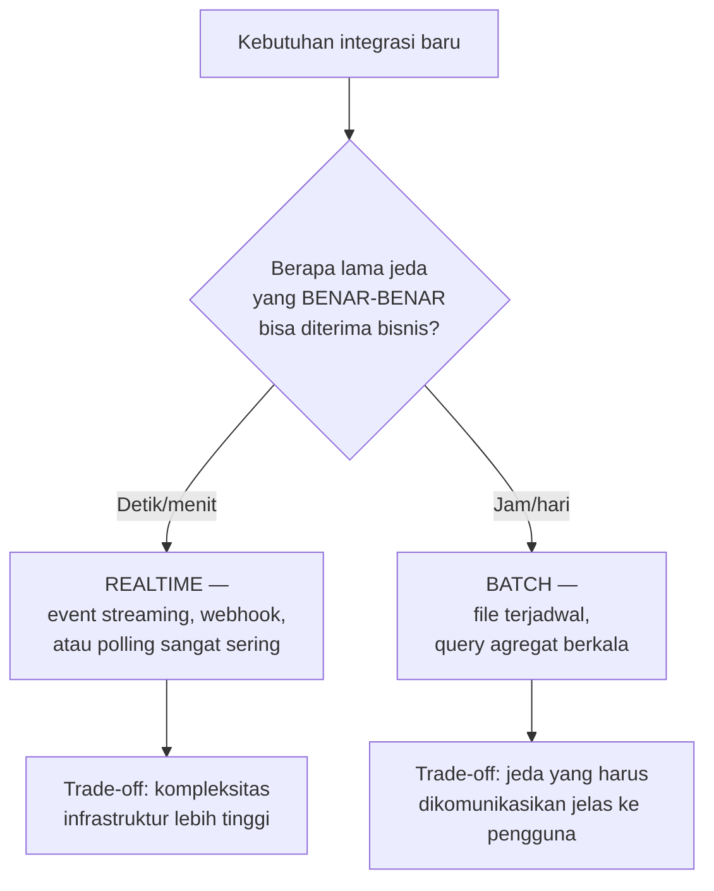

## TL;DR

[[Polling vs Push|Polling vs push]] dan [[File-Based Integration|file-based integration]] adalah **mekanisme** integrasi. Batch vs realtime adalah keputusan yang lebih mendasar di atasnya: **ritme** yang sesuai dengan kebutuhan bisnis sesungguhnya. Realtime berarti setiap kejadian diproses segera saat terjadi (satu per satu). Batch berarti sejumlah kejadian dikumpulkan dan diproses bersamaan pada interval tertentu (per jam, per hari). Kesalahan paling umum bukan memilih salah satu secara teknis salah, tapi memaksakan realtime untuk kebutuhan yang sebenarnya batch (kompleksitas tambahan tanpa manfaat nyata), atau sebaliknya memaksakan batch untuk kebutuhan yang sebenarnya butuh realtime (pengalaman pengguna yang buruk karena jeda tidak perlu).

## The Problem

Sebuah tim membangun integrasi **realtime** penuh (setiap perubahan data langsung disinkronkan lewat event streaming) untuk kebutuhan laporan rekapitulasi bulanan yang sebenarnya hanya perlu **akurat sekali sebulan** — investasi infrastruktur streaming yang kompleks (Kafka, consumer, monitoring lag) dibangun untuk kebutuhan yang sebenarnya bisa dipenuhi jauh lebih sederhana lewat query batch terjadwal sekali sebulan, memboroskan waktu pengembangan dan menambah permukaan kegagalan (banyak komponen streaming yang bisa gagal) untuk manfaat yang tidak pernah benar-benar dimanfaatkan (tidak ada yang butuh laporan bulanan itu update setiap detik).

Masalah kebalikan: sebuah sistem verifikasi status pembayaran memakai batch harian (memproses seluruh pembayaran yang masuk sekali per hari di malam hari) untuk kebutuhan yang sebenarnya **harus** diketahui segera — warga yang membayar di pagi hari harus menunggu sampai malam sebelum status pembayarannya diperbarui, menciptakan kebingungan dan keluhan yang bisa dihindari sepenuhnya kalau ritme integrasinya sesuai kebutuhan nyata (realtime atau near-realtime, bukan batch harian).

## Intuition

Bayangkan batch seperti **surat pos yang dikumpulkan dan dikirim sekali sehari**, dan realtime seperti **pesan instan yang terkirim seketika**. Surat pos sepenuhnya masuk akal untuk korespondensi yang tidak butuh jawaban segera (laporan resmi bulanan, dokumen arsip) — mengumpulkan dan mengirim sekaligus lebih efisien daripada mengantar satu per satu setiap kali ada surat baru. Tapi untuk percakapan yang butuh respons cepat (koordinasi darurat), menunggu "surat pos besok" jelas tidak masuk akal — pesan instan adalah kebutuhan nyata di situ, bukan sekadar preferensi kecepatan.

Analogi ini bocor pada satu hal: memilih surat pos vs pesan instan untuk korespondensi personal biasanya jelas dan intuitif bagi pengirim. Dalam sistem software, batas "kapan sesuatu benar-benar butuh realtime" sering **tidak sejelas itu** — sebuah fitur mungkin terlihat "penting, harus cepat" secara emosional, padahal analisis kebutuhan bisnis sesungguhnya menunjukkan jeda beberapa jam sepenuhnya bisa diterima; sebaliknya, sesuatu yang terlihat "bisa nanti saja" ternyata berdampak signifikan pada pengalaman pengguna kalau ditunda terlalu lama.

## How It Works



**Pertanyaan kunci menentukan ritme yang tepat**: apa konsekuensi nyata kalau informasi ini terlambat diketahui selama X waktu? (Kalau jawabannya "tidak ada dampak berarti", batch dengan interval X sudah cukup.) Berapa volume data yang terlibat, dan apakah volume itu secara alami menciptakan "gelombang" (semua data datang bersamaan di waktu tertentu, cocok diproses batch) atau tersebar merata sepanjang waktu (lebih cocok diproses realtime satu per satu saat masing-masing tiba)?

## Under The Hood

**Batch sering lebih efisien secara komputasi** untuk operasi yang bisa dioptimasi lewat pemrosesan sekaligus — menghitung agregat (total permohonan per provinsi) jauh lebih efisien dilakukan sekali untuk seluruh data batch (satu query `GROUP BY`) dibanding memperbarui angka itu secara realtime setiap kali satu permohonan baru masuk (yang berarti banyak operasi update kecil berulang, berpotensi menciptakan kontensi seperti dibahas di [[../40 Databases/Locking and Row Locks|Locking and Row Locks]]). Ini kenapa bahkan sistem yang secara keseluruhan realtime seringkali tetap memakai batch untuk komponen spesifik seperti laporan agregat — keputusan ritme idealnya dibuat **per komponen**, bukan kebijakan seragam seluruh sistem.

**Realtime menambah kompleksitas kegagalan parsial** yang tidak ada di batch — kalau proses batch gagal di tengah jalan, biasanya jelas: seluruh batch itu ditandai gagal dan diulang (atau resume dari titik kegagalan, lihat [[File-Based Integration]]). Realtime yang memproses kejadian satu per satu terus-menerus butuh penanganan kegagalan per-kejadian yang lebih rumit (retry individual, dead letter queue untuk kejadian yang terus gagal, lihat [[Dead Letter Queues]]) karena aliran kejadian tidak pernah benar-benar "berhenti" untuk diperiksa ulang secara keseluruhan seperti batch.

## In Go

```go
package integrasi

import (
	"context"
	"time"
)

// KeputusanRitme menunjukkan bagaimana KOMPONEN BERBEDA dalam SATU
// sistem bisa punya ritme integrasi yang BERBEDA, sesuai kebutuhan
// masing-masing — bukan kebijakan seragam untuk seluruh sistem.

// SinkronisasiStatusPembayaran: REALTIME — pengguna butuh tahu segera.
func SinkronisasiStatusPembayaran(ctx context.Context, event PembayaranEvent) error {
	// diproses SEGERA saat event diterima, satu per satu
	return prosesSatuPembayaran(ctx, event)
}

// GenerateLaporanBulanan: BATCH — dijadwalkan, tidak perlu realtime.
func GenerateLaporanBulanan(ctx context.Context) error {
	// dijalankan SEKALI per bulan lewat cron/scheduler, memproses
	// SELURUH data periode itu sekaligus dalam satu operasi agregat.
	return hitungAgregatBulanan(ctx)
}

type PembayaranEvent struct{}

func prosesSatuPembayaran(ctx context.Context, e PembayaranEvent) error { return nil }
func hitungAgregatBulanan(ctx context.Context) error                    { return nil }

func contohPenjadwalanBatch(ctx context.Context) {
	ticker := time.NewTicker(24 * time.Hour)
	defer ticker.Stop()
	for range ticker.C {
		GenerateLaporanBulanan(ctx)
	}
}
```

## In His Stack

Untuk 13 aplikasi legal-services, ritme integrasi yang tepat sering ditentukan oleh **dampak hukum/administratif** dari keterlambatan, bukan sekadar preferensi teknis — status yang memengaruhi hak warga secara langsung (persetujuan izin, status pembayaran yang menentukan tindakan berikutnya) cenderung butuh realtime atau near-realtime, sementara data rekapitulasi untuk pelaporan ke atasan/kementerian yang secara alami bersifat periodik cocok dengan batch. Menyalahartikan kebutuhan ini ke arah manapun — memaksakan realtime untuk laporan periodik atau batch untuk keputusan yang berdampak langsung ke warga — menciptakan masalah yang bisa dihindari sepenuhnya lewat analisis kebutuhan yang tepat sejak awal.

## Trade-offs and When Not To Use It

Realtime menambah kompleksitas infrastruktur (event streaming, monitoring lag, penanganan kegagalan per-kejadian) yang harus dipelihara terus-menerus — investasi ini hanya sepadan kalau kebutuhan bisnis benar-benar membutuhkan jeda minimal. Batch lebih sederhana dioperasikan tapi menciptakan jeda yang harus **dikomunikasikan jelas** ke pengguna (mereka harus tahu "data ini diperbarui sekali sehari", bukan berasumsi selalu real-time) — kegagalan mengomunikasikan ini menciptakan kebingungan yang mirip masalah cache stampede/staleness yang dibahas di domain lain (lihat [[../50 Concurrency and Performance/Cache Invalidation Strategies|Cache Invalidation Strategies]]). Keputusan ritme yang salah di kedua arah punya biaya nyata — bukan sekadar "kurang optimal", tapi bisa berarti pengalaman pengguna yang buruk (batch yang seharusnya realtime) atau pemborosan sumber daya signifikan (realtime yang seharusnya batch).

## Common Mistakes

> [!warning] Jebakan
> Membangun infrastruktur realtime yang kompleks untuk kebutuhan yang sebenarnya bisa dipenuhi jauh lebih sederhana lewat batch terjadwal — memboroskan waktu pengembangan dan menambah permukaan kegagalan tanpa manfaat yang pernah benar-benar dimanfaatkan.

> [!warning] Jebakan
> Memakai batch dengan interval panjang untuk kebutuhan yang sebenarnya butuh jeda minimal — menciptakan pengalaman pengguna yang buruk dan kebingungan yang bisa dihindari sepenuhnya dengan analisis kebutuhan yang tepat.

> [!warning] Jebakan
> Menetapkan kebijakan ritme integrasi seragam untuk seluruh sistem, tanpa mempertimbangkan bahwa komponen berbeda dalam sistem yang sama bisa punya kebutuhan ritme yang sangat berbeda.

## Exercises

1. Jelaskan pertanyaan kunci yang membantu menentukan apakah sebuah kebutuhan integrasi harus realtime atau batch.
2. Kenapa operasi agregat (seperti laporan) seringkali lebih efisien diproses batch, bahkan dalam sistem yang secara keseluruhan realtime?
3. Kenapa realtime menambah kompleksitas penanganan kegagalan dibanding batch?
4. Desain terbuka: sistemmu punya fitur "notifikasi ke warga begitu permohonan mereka disetujui" dan fitur "laporan jumlah permohonan per jenis layanan untuk kementerian". Tentukan ritme yang tepat untuk masing-masing (realtime atau batch), dan jelaskan bagaimana kamu akan menjelaskan keputusan ini ke stakeholder yang mungkin berasumsi "semuanya harus realtime karena itu terdengar lebih modern".

> [!success]- Kunci jawaban
> **1.** Pertanyaan kunci: "apa konsekuensi nyata kalau informasi ini terlambat diketahui selama waktu X?" — kalau jawabannya "tidak ada dampak berarti bagi siapa pun" untuk X yang cukup panjang (jam, hari), batch dengan interval sekitar X sudah memadai. Kalau keterlambatan bahkan beberapa menit menciptakan kebingungan, keluhan, atau dampak nyata pada keputusan berikutnya, realtime (atau near-realtime) dibutuhkan.
> **4.** Notifikasi persetujuan permohonan: **realtime** (atau near-realtime) — warga menunggu kepastian ini secara aktif, dan jeda berjam-jam menciptakan kecemasan dan volume pertanyaan ke layanan pelanggan yang tidak perlu terjadi. Laporan jumlah permohonan per jenis layanan untuk kementerian: **batch**, dijadwalkan sesuai siklus pelaporan yang sebenarnya dibutuhkan (harian atau mingguan, bukan setiap detik) — kementerian tidak memantau angka ini detik demi detik, dan laporan yang diperbarui sekali per hari sepenuhnya memadai untuk kebutuhan pengambilan keputusan di level itu. Untuk menjelaskan ke stakeholder yang berasumsi "semuanya harus realtime": gunakan kerangka biaya-manfaat konkret — jelaskan bahwa realtime untuk laporan kementerian berarti investasi infrastruktur tambahan (event streaming, monitoring) yang biayanya nyata, sementara manfaatnya (mengetahui angka detik demi detik) tidak pernah benar-benar dipakai siapa pun dalam proses pengambilan keputusan mereka yang sebenarnya berjalan mingguan/bulanan — "modern" bukan berarti "realtime untuk semuanya", tapi "ritme yang tepat untuk kebutuhan yang sebenarnya".

## Self-Check

- Apa pertanyaan kunci menentukan ritme integrasi yang tepat?
- Kenapa operasi agregat sering lebih efisien diproses batch?
- Kenapa realtime menambah kompleksitas penanganan kegagalan?
- Kenapa keputusan ritme sebaiknya dibuat per komponen, bukan kebijakan seragam?

## Connected Notes

- [[File-Based Integration]] — file-based integration hampir selalu bersifat batch, salah satu mekanisme konkret yang dibahas di note sebelumnya.
- [[Polling vs Push]] — polling dengan interval panjang secara efektif adalah bentuk batch, sementara push cenderung mendukung ritme realtime.
- [[Handling an Unreliable Counterparty]] — kelanjutan langsung: bagaimana menangani partner yang tidak sepenuhnya andal, relevan untuk kedua ritme integrasi, dibahas di note berikutnya.
- [[Dead Letter Queues]] — penanganan kegagalan per-kejadian yang dibutuhkan integrasi realtime, dibahas mendalam di note lain domain ini.
- [[../50 Concurrency and Performance/Cache Invalidation Strategies|Cache Invalidation Strategies]] — masalah komunikasi staleness data yang mirip dengan kebutuhan mengomunikasikan jeda batch ke pengguna.

## Further Reading

- Materi umum tentang trade-off batch vs stream processing dalam arsitektur data (dibahas luas dalam literatur data engineering, termasuk buku "Designing Data-Intensive Applications" oleh Martin Kleppmann).

## Catatan Saya

*Tulis di sini satu integrasi di kerjaanmu yang menurutmu ritmenya (batch/realtime) tidak sesuai kebutuhan bisnis sesungguhnya.*
