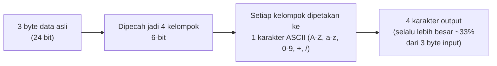

## TL;DR

Base64 mengubah data biner jadi teks ASCII yang aman dimasukkan ke string JSON — tapi ini bukan gratis: setiap 3 byte data asli menjadi 4 karakter output, membuat ukurannya membengkak sekitar **sepertiga** lebih besar dari ukuran aslinya, plus biaya CPU nyata untuk encode di sisi pengirim dan decode di sisi penerima. Ini "pajak" yang harus dibayar setiap kali file biner dipaksa masuk ke payload JSON — dan pajak ini sering dilupakan justru saat menghitung batas ukuran file yang diizinkan, menyebabkan file yang seharusnya "masih dalam batas" ditolak begitu sudah di-encode.

## The Problem

Bayangkan sebuah partner instansi pemerintah bersikeras hanya bisa berintegrasi lewat payload JSON murni — sistem lama mereka tidak mendukung `multipart/form-data` sama sekali (lihat [[Content Types and multipart-form-data]]). Kesepakatan integrasi menyebutkan batas ukuran dokumen maksimal 5 MB. Timmu memvalidasi ukuran file di sisi pengirim sebelum dikirim — memastikan file **asli** tidak melebihi 5 MB — lalu meng-encode-nya jadi base64 dan mengirimnya lewat JSON.

Sebagian pengiriman gagal ditolak oleh gateway partner dengan pesan "ukuran request melebihi batas", padahal file aslinya jelas di bawah 5 MB. Yang terjadi: batas 5 MB yang disepakati partner ternyata berlaku untuk **ukuran payload JSON keseluruhan**, bukan ukuran file mentah sebelum di-encode. File berukuran 4 MB, setelah di-base64-kan, membengkak jadi sekitar 5.3 MB — melampaui batas yang sama sekali tidak diperhitungkan saat validasi ukuran dilakukan di sisi pengirim.

## Intuition

Bayangkan base64 seperti **menerjemahkan buku yang ditulis dalam alfabet kompak 256 simbol ke alfabet 64 simbol yang "aman dicetak di mana saja"** — terjemahan ini menjamin buku itu bisa dicetak dengan aman di percetakan mana pun (dikirim lewat kanal yang hanya menerima teks, seperti JSON), tapi buku hasil terjemahan itu butuh lebih banyak halaman untuk menyampaikan isi yang sama (overhead ukuran), dan mesin percetakan (CPU) harus benar-benar bekerja melakukan terjemahan itu, bolak-balik.

Analogi "terjemahan" ini bocor pada satu hal: terjemahan sastra sungguhan bisa kehilangan atau menambah nuansa makna. Base64 sama sekali bukan proses seperti itu — ia adalah transformasi bit yang murni mekanis dan **lossless**: setiap 3 byte (24 bit) data asli dipecah jadi empat kelompok 6-bit, masing-masing dipetakan ke satu karakter ASCII yang dapat dicetak. Tidak ada "makna" yang diinterpretasikan ulang — hanya pengemasan ulang bit dengan rasio overhead yang tetap dan bisa dihitung persis, bukan proses perkiraan seperti terjemahan sungguhan.

## How It Works



Karena rasio ini **tetap** (4 karakter output untuk setiap 3 byte input), overhead-nya bisa dihitung persis: file 1 MB menjadi kira-kira 1.33 MB setelah di-base64-kan (belum termasuk sedikit tambahan dari tanda kutip string JSON di sekelilingnya, yang biasanya dapat diabaikan). Overhead JSON escaping tambahan biasanya minimal karena alfabet base64 sengaja dipilih memakai karakter yang sudah aman di dalam string JSON.

## In Go

```go
func hitungUkuranSetelahBase64(ukuranAsli int) int {
    // Setiap 3 byte input menjadi 4 karakter output.
    return int(math.Ceil(float64(ukuranAsli) / 3.0)) * 4
}

func encodeDokumenKeBase64(data []byte) string {
    return base64.StdEncoding.EncodeToString(data)
}

func validasiUkuranSebelumKirim(ukuranAsliByte int, batasPayloadByte int) error {
    ukuranSetelahEncode := hitungUkuranSetelahBase64(ukuranAsliByte)
    if ukuranSetelahEncode > batasPayloadByte {
        return fmt.Errorf(
            "dokumen %d byte akan menjadi %d byte setelah base64, melebihi batas payload %d byte",
            ukuranAsliByte, ukuranSetelahEncode, batasPayloadByte,
        )
    }
    return nil
}
```

Fungsi `validasiUkuranSebelumKirim` inilah yang seharusnya ada di "The Problem" — memvalidasi ukuran **setelah** memperhitungkan pembengkakan base64, terhadap batas payload yang sebenarnya berlaku, bukan terhadap ukuran file mentah.

Satu hal penting yang sering diabaikan: decode base64 yang berhasil (`base64.StdEncoding.DecodeString` tidak mengembalikan error) **hanya membuktikan** bahwa teks yang diterima berbentuk base64 yang valid — ia **tidak membuktikan** data yang di-decode identik dengan yang aslinya dikirim. Korupsi data yang kebetulan tetap menghasilkan bentuk base64 yang valid tidak akan pernah terdeteksi hanya dari keberhasilan decode. Untuk kepastian integritas sungguhan, sertakan checksum (misalnya SHA-256) dari data asli di luar proses encoding, diverifikasi terpisah setelah decode.

## In His Stack

Skenario "The Problem" adalah bentuk paling konkret dari tema integrasi yang sangat umum dalam koordinasi teknis lintas instansi pemerintah: partner dengan sistem lama yang keterbatasan teknisnya nyata (bukan sekadar preferensi), memaksa base64-in-JSON sebagai satu-satunya opsi realistis. Dalam negosiasi kontrak integrasi semacam ini, batas ukuran yang disepakati **harus** secara eksplisit dinyatakan mengacu pada ukuran apa — file mentah, atau payload JSON setelah encoding — supaya kesalahpahaman seperti di "The Problem" tidak terjadi.

## Trade-offs and When Not To Use It

Base64-in-JSON bisa diterima untuk lampiran kecil (gambar tanda tangan, dokumen singkat beberapa ratus KB) dan untuk konteks di mana partner benar-benar tidak mendukung `multipart/form-data` sama sekali. Untuk dokumen besar (scan dokumen legal multi-halaman) atau volume tinggi, overhead 33% ini bukan lagi angka kosmetik — ia berdampak nyata pada bandwidth, storage, dan CPU encode/decode di kedua sisi, sekaligus memperbesar risiko melampaui [[Request Size Limits Along The Path|batas ukuran request]] di sepanjang jalur (load balancer, reverse proxy, server aplikasi). Keputusan menerima base64-in-JSON sebaiknya selalu jadi kesepakatan eksplisit dan terdokumentasi dengan partner, bukan default yang diambil begitu saja tanpa mempertanyakan dulu apakah `multipart` atau [[Pre-signed URLs|pre-signed URL]] benar-benar tidak memungkinkan di sisi mereka.

## Common Mistakes

> [!warning] Jebakan
> Memvalidasi ukuran file terhadap batas yang disepakati memakai ukuran file **mentah**, padahal batas itu sebenarnya berlaku untuk ukuran payload **setelah** base64 encoding — menyebabkan file yang terlihat "masih dalam batas" tetap ditolak.

> [!warning] Jebakan
> Menganggap decode base64 yang berhasil sebagai bukti integritas data. Decode yang berhasil hanya membuktikan bentuk base64-nya valid, bukan bahwa isi datanya identik dengan aslinya — korupsi data yang halus bisa lolos tanpa terdeteksi tanpa checksum eksplisit.

> [!warning] Jebakan
> Langsung memilih base64-in-JSON sebagai default begitu mendengar "partner butuh JSON", tanpa pernah benar-benar mempertanyakan ke partner apakah `multipart/form-data` atau pre-signed URL benar-benar tidak memungkinkan di sisi mereka.

## Exercises

1. Kenapa base64 selalu membuat data membengkak sekitar sepertiga lebih besar, bukan angka acak?
2. Kenapa decode base64 yang berhasil tidak membuktikan integritas data?
3. Bagaimana cara menghitung ukuran payload setelah base64 encoding dari ukuran file asli?
4. Desain terbuka: sebuah partner pemerintah menyepakati batas ukuran dokumen 2 MB untuk integrasi JSON murni, tapi tidak menjelaskan apakah batas itu berlaku untuk file mentah atau payload setelah encoding. Rancang cara mengklarifikasi ini secara konkret ke partner, dan desain validasi di sisi sistemmu yang aman terlepas dari jawaban mereka.

> [!success]- Kunci jawaban
> Klarifikasi paling langsung: minta partner mengirim satu contoh request yang mereka anggap "pas di batas 2 MB" dan ukur langsung apakah itu ukuran file mentah atau payload JSON lengkap — bukti konkret lebih dapat diandalkan daripada asumsi dari dokumentasi yang ambigu. Sambil menunggu klarifikasi itu, desain validasi di sisimu secara defensif: hitung ukuran file mentah, proyeksikan ukuran setelah base64 encoding lewat rumus `4/3` seperti di atas, dan validasi terhadap batas yang **lebih ketat** (asumsikan batas berlaku untuk payload setelah encoding, skenario terburuk) — ini mencegah kegagalan pengiriman yang baru diketahui setelah sampai di sisi partner, dan tetap aman berapa pun jawaban klarifikasi mereka nantinya.

## Self-Check

- Kenapa base64 membuat data membengkak sekitar sepertiga, bukan dua kali lipat atau tetap sama?
- Kenapa decode base64 yang berhasil bukan bukti integritas data?
- Kapan base64-in-JSON masih bisa diterima, dan kapan sebaiknya dihindari?
- Kenapa batas ukuran yang disepakati dengan partner harus eksplisit menyebut "file mentah" atau "payload setelah encoding"?

## Connected Notes

- [[Content Types and multipart-form-data]] — prasyarat: alternatif yang menghindari base64 tax sepenuhnya untuk kasus yang mendukungnya.
- [[Request Size Limits Along The Path]] — batas ukuran yang harus memperhitungkan pembengkakan base64 di seluruh jalur request.
- [[Pre-signed URLs]] — alternatif yang memisahkan transfer file besar dari payload JSON sepenuhnya.
- [[../94 Case Studies/Case - Sending PDFs Through a JSON API|Case - Sending PDFs Through a JSON API]] — studi kasus penuh yang menerapkan konsep di note ini pada skenario nyata.

## Further Reading

- RFC 4648 (*The Base16, Base32, and Base64 Data Encodings*) — spesifikasi resmi algoritma base64.

## Catatan Saya

*Tulis di sini partner yang pernah (atau masih) memaksa integrasi base64-in-JSON, dan apakah batas ukurannya sudah jelas mengacu ke ukuran apa.*
