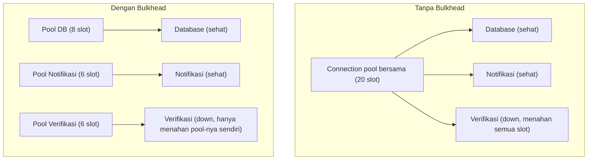

## TL;DR

**Bulkhead** adalah pola mengisolasi resource (koneksi, goroutine, memori) yang dipakai untuk memanggil satu dependensi, supaya kegagalan atau kelambatan di dependensi itu tidak menghabiskan resource yang sama yang dibutuhkan dependensi lain yang sehat. Namanya dipinjam dari sekat kedap air di lambung kapal — kapal dibagi menjadi beberapa kompartemen terpisah oleh sekat, sehingga kalau satu kompartemen bocor dan kebanjiran, air tidak menyebar ke seluruh kapal dan menenggelamkannya; kompartemen lain tetap kering dan kapal tetap mengapung. Bulkhead software menerapkan prinsip yang sama: connection pool terpisah, goroutine pool terpisah, atau semaphore terpisah untuk setiap dependensi, supaya satu dependensi yang lambat atau macet tidak menghabiskan seluruh resource bersama yang juga dibutuhkan untuk melayani dependensi lain.

## The Problem

Service permohonan di sistem legal-services memanggil tiga dependensi berbeda dalam menangani satu request: database internal (cepat, hampir selalu sehat), layanan notifikasi email (kadang lambat tapi jarang benar-benar down), dan layanan verifikasi dokumen eksternal (kadang mengalami downtime, seperti dibahas di note-note sebelumnya). Ketiga panggilan ini memakai **goroutine pool HTTP client yang sama** dengan jumlah koneksi maksimum terbatas (praktik umum untuk membatasi resource, dibahas di [[Tuning the Connection Pool]]).

Ketika layanan verifikasi dokumen mengalami downtime dan setiap panggilan ke sana menunggu penuh sampai timeout sebelum gagal, goroutine-goroutine yang menunggu itu menahan slot di connection pool bersama dalam waktu lama. Karena pool itu dipakai bersama ketiga dependensi, slot yang tersedia untuk memanggil database internal dan layanan notifikasi juga ikut habis — meski keduanya sepenuhnya sehat dan cepat merespons. Request yang seharusnya hanya butuh database internal (yang sehat) ikut gagal atau tertahan lama, karena tidak ada slot connection pool tersisa untuknya — satu dependensi yang bermasalah "menenggelamkan" kemampuan sistem melayani permintaan yang sama sekali tidak bergantung padanya.

## Intuition

Cara paling mudah memahaminya lewat asal-usul namanya sendiri: kapal tanpa sekat kedap air yang mengalami kebocoran di satu titik akan kebanjiran secara keseluruhan — air mengalir bebas ke seluruh lambung kapal sampai kapal tenggelam sepenuhnya, meski kerusakan awal hanya terjadi di satu titik kecil. Kapal dengan sekat kedap air membatasi kerusakan itu hanya pada kompartemen yang bocor; kompartemen-kompartemen lain tetap kering dan berfungsi normal, dan kapal tetap mengapung meski satu kompartemen penuh air. Bulkhead software bekerja dengan logika identik: mengisolasi resource per dependensi supaya "kebocoran" (kelambatan atau kegagalan) di satu dependensi tidak menenggelamkan kemampuan sistem melayani dependensi lain yang sehat.

Analogi ini nyaris tidak bocor sama sekali — bahkan istilah teknis "bulkhead" di dunia software memang diambil langsung dari terminologi perkapalan, dan mekanisme kegagalannya (resource bersama yang habis akibat satu titik masalah) memang persis paralel dengan air yang mengalir bebas tanpa sekat.

## How It Works



Diagram ini menunjukkan perbandingan langsung: tanpa bulkhead, satu pool bersama berarti satu dependensi bermasalah bisa menghabiskan seluruh kapasitas yang dibutuhkan dependensi lain. Dengan bulkhead, setiap dependensi punya alokasi resource-nya sendiri yang terisolasi — layanan verifikasi yang down hanya menghabiskan pool miliknya sendiri (enam slot), sementara pool database dan notifikasi tetap punya kapasitas penuh untuk melayani permintaan yang bergantung pada mereka.

Bulkhead bisa diterapkan di beberapa level:

**Connection pool terpisah per dependensi** — setiap `http.Client` atau koneksi database punya pool-nya sendiri dengan batas maksimum tersendiri, bukan satu pool bersama untuk semua tujuan.

**Goroutine pool atau semaphore terpisah** — membatasi jumlah goroutine yang boleh aktif memanggil dependensi tertentu secara bersamaan, mencegah satu dependensi lambat memicu ledakan goroutine yang menghabiskan memori sistem secara keseluruhan.

**Thread pool terpisah** (lebih umum di bahasa dengan model concurrency berbasis thread berat) — di Go, konsep ini lebih relevan diwujudkan lewat worker pool dengan jumlah worker terbatas per dependensi, dibahas di [[Worker Pools]].

## In Go

```go
package main

import (
	"context"
	"fmt"
	"net/http"
)

// Bulkhead diwujudkan lewat semaphore berbasis channel buffered,
// satu per dependensi — masing-masing punya batas kapasitas sendiri
// yang tidak bisa dipakai berlebihan oleh dependensi lain.
type Bulkhead struct {
	semaphore chan struct{}
}

func NewBulkhead(kapasitas int) *Bulkhead {
	return &Bulkhead{semaphore: make(chan struct{}, kapasitas)}
}

func (b *Bulkhead) Jalankan(ctx context.Context, operasi func(context.Context) error) error {
	select {
	case b.semaphore <- struct{}{}:
		defer func() { <-b.semaphore }()
	case <-ctx.Done():
		return fmt.Errorf("dibatalkan saat menunggu slot bulkhead: %w", ctx.Err())
	default:
		return fmt.Errorf("bulkhead penuh, menolak panggilan untuk mencegah kelebihan beban")
	}

	return operasi(ctx)
}

var (
	bulkheadDatabase    = NewBulkhead(8)
	bulkheadNotifikasi  = NewBulkhead(6)
	bulkheadVerifikasi  = NewBulkhead(6)
)

func handlePermohonan(w http.ResponseWriter, r *http.Request) {
	ctx := r.Context()

	err := bulkheadDatabase.Jalankan(ctx, func(ctx context.Context) error {
		return simpanPermohonan(ctx)
	})
	if err != nil {
		http.Error(w, "gagal menyimpan permohonan", http.StatusInternalServerError)
		return
	}

	// Panggilan ke verifikasi dokumen memakai bulkhead terpisah —
	// kalau layanan ini down dan bulkheadVerifikasi penuh, itu
	// TIDAK memengaruhi kapasitas bulkheadDatabase atau bulkheadNotifikasi.
	err = bulkheadVerifikasi.Jalankan(ctx, func(ctx context.Context) error {
		return panggilLayananVerifikasi(ctx)
	})
	if err != nil {
		fmt.Fprintln(w, "permohonan diterima, verifikasi tertunda")
		return
	}

	fmt.Fprintln(w, "permohonan diterima dan diverifikasi")
}
```

Tiga bulkhead terpisah (`bulkheadDatabase`, `bulkheadNotifikasi`, `bulkheadVerifikasi`) memastikan kapasitas untuk satu dependensi tidak pernah "dipinjam paksa" oleh dependensi lain yang sedang bermasalah — kalau `bulkheadVerifikasi` penuh karena layanan verifikasi down, `bulkheadDatabase` tetap punya delapan slot penuh tersedia untuk menyimpan permohonan baru.

## In His Stack

Bulkhead paling relevan diterapkan di titik-titik integrasi dengan beberapa dependensi eksternal sekaligus — persis situasi sistem legal-services yang memanggil banyak layanan berbeda (verifikasi, notifikasi, pembayaran, instansi terkait) dari satu service yang sama. Tanpa bulkhead, arsitektur yang secara logis terlihat modular (setiap panggilan ke dependensi berbeda ditulis di fungsi terpisah) tetap bisa gagal secara terkopel di level resource, karena semuanya diam-diam berbagi connection pool atau goroutine pool yang sama — bulkhead memastikan isolasi logis di level kode juga tercermin sebagai isolasi nyata di level resource.

## Trade-offs and When Not To Use It

Bulkhead menambah kompleksitas konfigurasi: setiap dependensi butuh keputusan eksplisit tentang berapa kapasitas yang dialokasikan untuknya, dan alokasi yang keliru (terlalu kecil untuk dependensi yang sering dipanggil) bisa menciptakan bottleneck buatan yang sebenarnya tidak perlu ada kalau resource itu dipakai bersama secara dinamis. Untuk sistem dengan sedikit dependensi eksternal atau di mana semua dependensi punya karakteristik keandalan yang serupa (sama-sama stabil, atau sama-sama tidak kritis), isolasi resource yang ketat mungkin tidak sepadan dengan kompleksitas tambahannya — bulkhead paling bernilai justru ketika ada dependensi dengan keandalan yang jelas berbeda-beda dipanggil dari komponen yang sama.

## Common Mistakes

> [!warning] Jebakan
> Menggunakan satu connection pool atau goroutine pool bersama untuk semua dependensi eksternal, dengan asumsi "membatasi total resource" sudah cukup — pembatasan total tidak mencegah satu dependensi menghabiskan seluruh kapasitas itu sendirian, hanya mencegah keseluruhan sistem memakai resource tak terbatas.

> [!warning] Jebakan
> Mengalokasikan kapasitas bulkhead berdasarkan tebakan tanpa mengukur pola traffic sungguhan ke setiap dependensi — dependensi yang jarang dipanggil tapi dialokasikan kapasitas besar membuang resource yang seharusnya bisa dipakai dependensi lain yang lebih sering dipanggil.

> [!warning] Jebakan
> Menerapkan bulkhead tanpa circuit breaker sebagai pelengkap — bulkhead membatasi berapa banyak resource yang bisa dihabiskan satu dependensi, tapi tidak mencegah setiap panggilan individual tetap menunggu penuh sampai timeout; keduanya saling melengkapi, bukan saling menggantikan.

## Exercises

1. Jelaskan kenapa membatasi total jumlah koneksi HTTP client tidak cukup untuk mencegah satu dependensi menghabiskan kapasitas yang dibutuhkan dependensi lain.
2. Rancang alokasi kapasitas bulkhead untuk tiga dependensi dengan pola traffic berbeda: satu dipanggil di setiap request (sangat sering), satu dipanggil sesekali untuk fitur opsional (jarang), satu lagi kritis tapi punya SLA lambat dari partner eksternal (sering, tapi lambat).
3. Jelaskan hubungan antara bulkhead dan circuit breaker — kenapa keduanya biasanya diterapkan bersama, bukan salah satu saja.
4. **(Open-ended)** Sistem permohonan di skenario Masalah di atas sekarang punya tiga bulkhead terpisah untuk database, notifikasi, dan verifikasi. Tim menemukan bahwa selama traffic puncak menjelang tenggat waktu tahunan, bulkhead verifikasi sering penuh (dependensi itu memang lambat secara alami, bukan sedang down) sehingga banyak permohonan yang ditolak `Jalankan` karena bulkhead penuh, padahal layanan verifikasi sebenarnya masih berfungsi, hanya lambat. Evaluasi apakah solusinya menaikkan kapasitas bulkhead verifikasi, atau ada pendekatan lain yang lebih tepat.

> [!success]- Kunci jawaban
> Untuk soal 4: menaikkan kapasitas bulkhead verifikasi begitu saja mengatasi gejala, bukan akar masalah — kalau layanan verifikasi memang secara struktural lambat (bukan down), menaikkan kapasitas berarti lebih banyak goroutine menunggu lebih lama, memindahkan tekanan ke resource lain (memori, jumlah goroutine total) tanpa benar-benar mempercepat throughput verifikasi itu sendiri. Pendekatan yang lebih tepat: pisahkan "menerima permohonan" dari "verifikasi selesai" secara asinkron (pola outbox atau antrean, seperti dibahas di kunci jawaban soal 4 pada [[Circuit Breakers]]) — permohonan diterima segera tanpa menunggu bulkhead verifikasi, dan verifikasi diproses di latar belakang dengan laju yang sesuai kapasitas layanan verifikasi yang sebenarnya, bukan dipaksa menyesuaikan laju traffic puncak yang jauh melebihi kapasitas alaminya.

## Self-Check

- Kenapa satu connection pool bersama untuk semua dependensi tidak memberikan isolasi yang sama seperti bulkhead terpisah per dependensi?
- Apa hubungan antara bulkhead dan circuit breaker, dan kenapa keduanya saling melengkapi?
- Kapan alokasi kapasitas bulkhead yang ketat justru menciptakan bottleneck yang tidak perlu?

## Connected Notes

- [[Circuit Breakers]] — pola resiliensi komplementer: circuit breaker menghentikan panggilan ke dependensi yang gagal, bulkhead membatasi resource yang bisa dihabiskan dependensi itu sebelum breaker sempat terbuka.
- [[Tuning the Connection Pool]] — bulkhead pada dasarnya adalah keputusan mengalokasikan connection pool secara terpisah per dependensi, bukan satu pool bersama.
- [[Worker Pools]] — implementasi bulkhead di level goroutine di Go biasanya berbentuk worker pool dengan kapasitas terbatas per dependensi.
- [[Rate Limiting Algorithms]] — pola komplementer yang membatasi laju masuk dari sisi pemanggil, sementara bulkhead membatasi resource yang dipakai di sisi pemanggil untuk setiap dependensi keluar.

## Further Reading

- Michael Nygard, buku "Release It!" — sumber yang memperkenalkan pola bulkhead secara luas ke industri software.

## Catatan Saya

*Tulis pertanyaanmu sendiri, contoh kode dari pekerjaanmu, atau bagian yang belum jelas di sini.*
