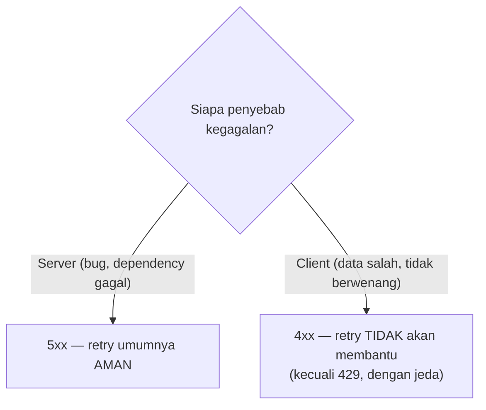

## TL;DR

Status code HTTP bukan sekadar formalitas — ia adalah sinyal yang bisa dibaca mesin **tanpa perlu memahami isi body**, dipakai client, retry logic, monitoring, dan API gateway untuk mengambil keputusan otomatis. Kelas besarnya jelas (`2xx` sukses, `4xx` kesalahan klien, `5xx` kesalahan server), tapi memilih kode **spesifik** yang tepat di dalam setiap kelas (`404` vs `410`, `401` vs `403`, `400` vs `422`) penting karena logic di sisi klien — terutama logic retry — biasanya memperlakukan `5xx` sebagai "boleh dicoba lagi" dan `4xx` (selain `429`) sebagai "jangan diulang sampai request-nya sendiri diperbaiki".

## The Problem

Bayangkan sebuah API mengembalikan `500 Internal Server Error` untuk kasus validasi input yang gagal — misalnya NIK yang formatnya salah dikirim client. Secara teknis, request ini memang "gagal", tapi ini adalah kesalahan di sisi **klien** (data yang dikirim tidak valid), bukan kegagalan di sisi server. Client yang mengimplementasikan retry otomatis (lihat [[Retries with Exponential Backoff and Jitter]]) — sesuai konvensi umum yang menganggap `5xx` sebagai layak dicoba lagi — akan mencoba ulang request yang **sama persis** berkali-kali, padahal request itu tidak akan pernah berhasil sampai data yang dikirim benar-benar diperbaiki.

Kalikan ini dengan banyak client yang melakukan hal serupa secara bersamaan, dan kesalahan kategorisasi status code yang sederhana ini bisa berkontribusi pada retry storm (lihat [[../94 Case Studies/Case - The Retry Storm That Became a Total Outage|Case - The Retry Storm That Became a Total Outage]]) — server dibanjiri retry yang tidak pernah bisa berhasil, murni karena kode status yang salah memberi sinyal yang salah ke semua sistem otomatis yang membacanya.

## Intuition

Bayangkan status code seperti **label triase standar di ruang gawat darurat rumah sakit** — sebuah kode (warna label) yang langsung dipahami staf mana pun tanpa perlu membaca seluruh rekam medis pasien, memungkinkan keputusan penanganan cepat dan otomatis.

Analogi ini bocor pada soal subjektivitas. Triase rumah sakit melibatkan penilaian manusia yang bisa bervariasi antar staf. Status code HTTP dimaksudkan **deterministik** — secara spesifikasi, ada satu kode yang paling tepat untuk setiap situasi tertentu, meski dalam praktik banyak API memakainya secara longgar atau tidak konsisten. Tujuannya bukan "kira-kira mendekati", tapi benar-benar mengikuti makna yang sudah disepakati secara luas industri, supaya tooling generik bisa mengandalkannya tanpa perlu penyesuaian khusus per API.

## How It Works

Kode yang paling sering dibutuhkan sehari-hari, dan kapan masing-masing tepat:

- **`200 OK`** — sukses umum dengan body.
- **`201 Created`** — sukses membuat resource baru (biasanya untuk `POST`), idealnya disertai header `Location` menunjuk resource yang baru dibuat.
- **`204 No Content`** — sukses tanpa body (umum untuk `DELETE` atau `PUT` yang tidak perlu mengembalikan apa-apa).
- **`400 Bad Request`** — request secara sintaks tidak valid (JSON rusak, field wajib hilang).
- **`401 Unauthorized`** — tidak terautentikasi sama sekali, atau kredensial tidak valid — client biasanya merespons dengan meminta login ulang.
- **`403 Forbidden`** — sudah terautentikasi, tapi tidak diizinkan melakukan aksi ini — client biasanya menampilkan pesan izin ditolak, bukan meminta login ulang.
- **`404 Not Found`** — resource tidak ditemukan.
- **`409 Conflict`** — request bertentangan dengan state resource saat ini (misalnya percobaan membuat resource yang sudah ada, atau conflict edit konkuren).
- **`422 Unprocessable Entity`** — sintaks valid, tapi data secara semantik tidak valid (misalnya NIK format benar tapi checksum-nya salah).
- **`429 Too Many Requests`** — client melampaui rate limit — **satu-satunya** kode di kelas `4xx` yang umumnya tetap dianggap layak diretry, dengan jeda (lihat [[Rate Limiting Algorithms]]).
- **`500 Internal Server Error`** — kegagalan server yang tidak terduga.
- **`503 Service Unavailable`** — server sedang tidak sanggup melayani (overload, maintenance) — biasanya layak diretry setelah jeda.



## In Go

Alih-alih memanggil `http.Error` dengan status code yang ditulis manual dan tersebar di banyak tempat, pusatkan pemetaan error domain ke status code di satu tempat:

```go
func statusCodeFor(err error) int {
    switch {
    case errors.Is(err, ErrNotFound):
        return http.StatusNotFound
    case errors.Is(err, ErrValidasiGagal):
        return http.StatusUnprocessableEntity
    case errors.Is(err, ErrTidakBerwenang):
        return http.StatusForbidden
    case errors.Is(err, ErrKonflikData):
        return http.StatusConflict
    default:
        return http.StatusInternalServerError
    }
}

func handleAmbilDokumen(w http.ResponseWriter, r *http.Request) {
    doc, err := ambilDokumen(r.Context(), r.PathValue("id"))
    if err != nil {
        code := statusCodeFor(err)
        log.Printf("ambil dokumen gagal: %v (status %d)", err, code)
        http.Error(w, publicMessageFor(err), code)
        return
    }
    respondJSON(w, http.StatusOK, doc)
}
```

Sentralisasi seperti ini (lihat juga [[../20 Go Language/Sentinel Errors vs Error Types|Sentinel Errors vs Error Types]]) mencegah status code yang tersebar dan tidak konsisten di banyak handler berbeda.

## In His Stack

**Yii2** menyediakan exception bertipe (`NotFoundHttpException`, `ForbiddenHttpException`, `UnauthorizedHttpException`) yang otomatis dipetakan ke status code yang sesuai oleh framework — pola yang sebenarnya sama persis dengan `statusCodeFor` di atas, hanya diimplementasikan lewat hierarki exception alih-alih function pemetaan eksplisit. Mengadopsi disiplin serupa di Go (satu titik pemetaan error ke status code, bukan `http.Error` yang ditulis manual tersebar di banyak handler) memberi konsistensi yang sama.

## Trade-offs and When Not To Use It

Presisi ekstra dalam memilih status code (membedakan `400` dari `422`, `401` dari `403`) menambah sedikit overhead desain, tapi untuk API yang diintegrasikan partner eksternal — apalagi partner instansi yang membangun otomatisasi (retry, alerting) di atas API-mu — presisi ini berdampak nyata pada keandalan integrasi mereka. Untuk API internal kecil yang hanya dipakai satu tim yang sama, tingkat presisi ini kadang bisa dilonggarkan sedikit, tapi tetap disarankan menjaga pemisahan minimal `4xx` vs `5xx` dengan benar — perbedaan inilah yang paling langsung memengaruhi perilaku retry otomatis.

## Common Mistakes

> [!warning] Jebakan
> Mengembalikan `500` untuk kesalahan yang sebenarnya berasal dari client (validasi gagal, data tidak lengkap). Ini memicu retry otomatis yang tidak akan pernah berhasil, berpotensi berkontribusi pada retry storm.

> [!warning] Jebakan
> Mencampur `401` dan `403` tanpa membedakan "tidak terautentikasi" dari "terautentikasi tapi tidak berwenang". Client sering bergantung pada perbedaan ini untuk memutuskan apakah harus meminta login ulang (`401`) atau menampilkan pesan izin ditolak (`403`).

> [!warning] Jebakan
> Mengembalikan `404` untuk resource yang sebenarnya ada tapi caller tidak berwenang melihatnya, tanpa mempertimbangkan ini sebagai keputusan keamanan yang disengaja. Kadang menyembunyikan keberadaan resource (`404` alih-alih `403`) memang tepat untuk mencegah kebocoran informasi — tapi ini harus jadi keputusan sadar, bukan kecelakaan karena tidak memikirkan bedanya.

## Exercises

1. Kenapa kelas status code (`4xx` vs `5xx`) penting untuk logic retry otomatis di sisi klien?
2. Apa perbedaan makna `401` dan `403`, dan bagaimana client biasanya merespons masing-masing secara berbeda?
3. Kapan `422` lebih tepat dipakai dibanding `400`?
4. Desain terbuka: sebuah endpoint permohonan dokumen legal perlu menangani kasus di mana permohonan dengan NIK yang sama sudah pernah diajukan dan masih dalam proses. Rancang status code yang tepat untuk kasus ini, dan pertimbangkan apakah ini `409 Conflict`, `422 Unprocessable Entity`, atau kode lain — jelaskan alasan pilihanmu dan bagaimana ini memengaruhi cara client (termasuk partner) menangani responsnya.

> [!success]- Kunci jawaban
> `409 Conflict` adalah pilihan paling tepat: request secara sintaks dan semantik valid (NIK-nya benar, formatnya benar — jadi bukan `400`/`422`), tapi bertentangan dengan **state saat ini** dari sistem (sudah ada permohonan aktif dengan NIK yang sama) — persis definisi `409`. Sertakan di body response referensi ke permohonan yang sedang berjalan (misalnya ID-nya) supaya client bisa mengarahkan user untuk memeriksa status permohonan yang sudah ada, bukan sekadar menampilkan pesan error generik. Client (termasuk partner) yang menerima `409` seharusnya tidak melakukan retry otomatis dengan payload yang sama — sinyal `409` memberitahu bahwa masalahnya ada di state, bukan di request itu sendiri, sehingga tindakan yang tepat adalah menampilkan informasi itu ke user, bukan mencoba lagi.

## Self-Check

- Kenapa `5xx` umumnya dianggap layak diretry sementara `4xx` (selain `429`) tidak?
- Apa perbedaan `401` dan `403`?
- Kapan `422` lebih tepat dipakai dibanding `400`?
- Kenapa memilih antara `404` dan `403` untuk resource yang tidak bisa diakses adalah keputusan keamanan, bukan sekadar teknis?

## Connected Notes

- [[REST Principles]] dan [[Resource Modelling]] — prasyarat: status code adalah bagian dari uniform interface yang dijelaskan di note itu.
- [[Consistent Error Responses]] — status code yang tepat dipasangkan dengan format body error yang konsisten.
- [[Retries with Exponential Backoff and Jitter]] — logic retry di sisi klien yang secara langsung bergantung pada kategorisasi status code yang benar.
- [[Idempotency]] — status code seperti `409` sering muncul justru karena pertimbangan idempotency yang dijelaskan di note itu.
- [[../94 Case Studies/Case - The Retry Storm That Became a Total Outage|Case - The Retry Storm That Became a Total Outage]] — konsekuensi nyata dari status code yang salah kategori memicu retry yang tidak seharusnya.

## Further Reading

- RFC 9110 (*HTTP Semantics*), bagian 15 ("Status Codes") — definisi resmi lengkap setiap kode status.

## Catatan Saya

*Tulis di sini status code di API-mu yang menurutmu, setelah membaca note ini, ternyata kurang tepat dipilih.*
