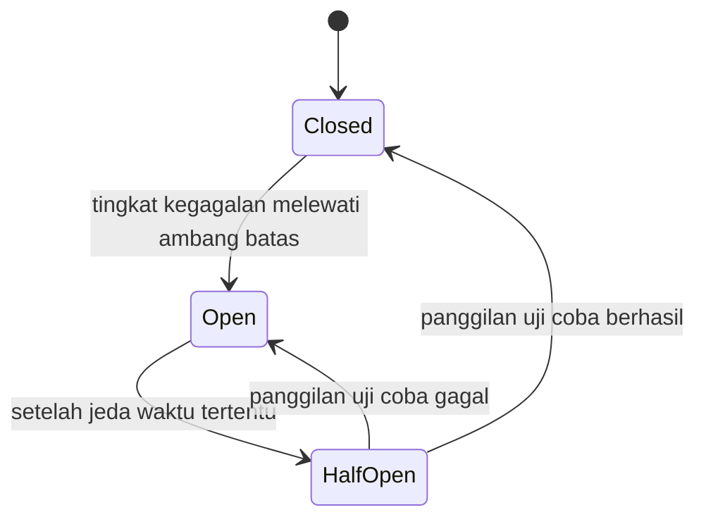

## TL;DR

**Circuit breaker** adalah komponen yang berhenti mencoba memanggil layanan yang sudah terbukti gagal berulang kali, alih-alih terus mencoba (bahkan dengan retry dan backoff yang benar) sampai layanan itu pulih sendiri. Namanya dipinjam langsung dari pemutus arus listrik rumah: begitu terdeteksi arus abnormal (korsleting), pemutus arus memutus sirkuit segera, mencegah kerusakan lebih lanjut, alih-alih membiarkan arus terus mengalir sampai kabelnya terbakar. Circuit breaker software bekerja serupa — begitu tingkat kegagalan panggilan ke sebuah layanan melewati ambang batas, breaker "terbuka" dan menolak panggilan berikutnya **secara instan tanpa mencoba memanggil layanan itu sama sekali**, memberi layanan yang bermasalah waktu untuk pulih tanpa terus dibebani, sekaligus membuat pemanggil gagal cepat alih-alih menunggu timeout berulang kali.

## The Problem

Layanan verifikasi dokumen eksternal di sistem legal-services mengalami downtime total selama sepuluh menit. Consumer Go yang memanggilnya sudah menerapkan retry dengan exponential backoff dan jitter (dari [[Retries with Exponential Backoff and Jitter]]) — pendekatan yang benar untuk kegagalan sementara. Tapi untuk downtime sepanjang sepuluh menit, setiap request yang masuk selama periode itu tetap menjalani seluruh siklus retry lengkap (lima percobaan, masing-masing menunggu timeout beberapa detik sebelum menyerah) sebelum akhirnya gagal — setiap request individual butuh puluhan detik untuk akhirnya menyerah, meski layanan tujuan sudah pasti akan gagal sejak percobaan pertama.

Akibatnya, ribuan goroutine yang menangani request-request ini semuanya tertahan menunggu retry yang hampir pasti akan gagal, menghabiskan resource server (goroutine, koneksi database yang mereka pegang selama menunggu, memori) untuk pekerjaan yang secara statistik sudah diketahui sia-sia. Layanan internal itu sendiri mulai kehabisan resource dan menjadi lambat merespons request lain yang sebenarnya sehat, sama sekali tidak berhubungan dengan layanan verifikasi yang down — satu dependensi eksternal yang bermasalah mulai menyeret layanan internal yang sehat ikut bermasalah.

## Intuition

Cara paling mudah memahaminya lewat asal-usul namanya sendiri: pemutus arus di rumah tidak menunggu kabel benar-benar terbakar sebelum bertindak — begitu arus abnormal terdeteksi, ia memutus sambungan **segera**, jauh lebih cepat daripada menunggu kerusakan nyata terjadi. Circuit breaker software bekerja dengan logika yang sama: begitu pola kegagalan terdeteksi (bukan satu kegagalan tunggal, tapi tingkat kegagalan yang konsisten melewati ambang batas), ia "memutus sirkuit" ke layanan yang bermasalah, menolak panggilan berikutnya secara instan tanpa benar-benar mencoba menghubunginya.

Analogi ini berhenti bekerja pada satu titik: pemutus arus rumah butuh campur tangan manusia untuk dinyalakan kembali setelah masalahnya diperbaiki. Circuit breaker software biasanya mencoba **menyalakan diri sendiri secara otomatis** setelah jeda waktu tertentu, mengirim sejumlah kecil panggilan uji coba untuk memeriksa apakah layanan sudah pulih, sebelum memutuskan membuka penuh kembali atau menutup lagi kalau ternyata masih bermasalah — perilaku yang dibahas sebagai state ketiga di bagian berikutnya.

## How It Works



Diagram ini menunjukkan tiga state inti circuit breaker:

**Closed** — kondisi normal. Panggilan diteruskan seperti biasa ke layanan tujuan, dan breaker terus memantau tingkat kegagalan.

**Open** — breaker mendeteksi tingkat kegagalan melewati ambang batas (misalnya lebih dari 50% dari sepuluh panggilan terakhir gagal) dan **berhenti meneruskan panggilan sama sekali** — setiap panggilan langsung gagal secara instan dengan error "circuit open", tanpa mencoba menghubungi layanan tujuan. Inilah yang menghemat resource: tidak ada lagi goroutine yang tertahan menunggu timeout dari layanan yang sudah diketahui bermasalah.

**Half-Open** — setelah jeda waktu tertentu di state Open, breaker mengizinkan **sejumlah kecil** panggilan uji coba lewat untuk memeriksa apakah layanan sudah pulih. Kalau panggilan uji coba berhasil, breaker kembali ke Closed. Kalau masih gagal, breaker kembali ke Open dan menunggu jeda berikutnya sebelum mencoba lagi.

## In Go

```go
package main

import (
	"context"
	"errors"
	"fmt"
	"sync"
	"time"
)

type stateBreaker int

const (
	closed stateBreaker = iota
	open
	halfOpen
)

type CircuitBreaker struct {
	mu               sync.Mutex
	state            stateBreaker
	jumlahGagal      int
	ambangBatasGagal int
	waktuDibuka      time.Time
	jedaSebelumUji   time.Duration
}

var ErrCircuitTerbuka = errors.New("circuit breaker terbuka, panggilan ditolak")

func NewCircuitBreaker(ambangBatasGagal int, jedaSebelumUji time.Duration) *CircuitBreaker {
	return &CircuitBreaker{
		ambangBatasGagal: ambangBatasGagal,
		jedaSebelumUji:   jedaSebelumUji,
	}
}

func (cb *CircuitBreaker) Panggil(ctx context.Context, operasi func(context.Context) error) error {
	cb.mu.Lock()
	if cb.state == open {
		if time.Since(cb.waktuDibuka) < cb.jedaSebelumUji {
			cb.mu.Unlock()
			return ErrCircuitTerbuka
		}
		// Jeda sudah lewat — izinkan satu panggilan uji coba.
		cb.state = halfOpen
	}
	cb.mu.Unlock()

	err := operasi(ctx)

	cb.mu.Lock()
	defer cb.mu.Unlock()

	if err != nil {
		cb.jumlahGagal++
		if cb.state == halfOpen || cb.jumlahGagal >= cb.ambangBatasGagal {
			cb.state = open
			cb.waktuDibuka = time.Now()
		}
		return fmt.Errorf("operasi gagal: %w", err)
	}

	// Berhasil — reset penuh, tidak peduli state sebelumnya.
	cb.state = closed
	cb.jumlahGagal = 0
	return nil
}
```

Panggilan kode ini di praktik: `breaker.Panggil(ctx, func(ctx context.Context) error { return panggilLayananVerifikasi(ctx) })` — begitu breaker terbuka, panggilan berikutnya langsung mengembalikan `ErrCircuitTerbuka` tanpa pernah mengeksekusi `panggilLayananVerifikasi` sama sekali, persis mekanisme "gagal cepat" yang dibahas di atas.

## In His Stack

Circuit breaker paling bernilai tepat di titik integrasi dengan layanan eksternal yang tidak sepenuhnya bisa diandalkan — API instansi lain, gateway pembayaran, layanan OCR pihak ketiga — persis konteks kerja sehari-hari mengintegrasikan sistem legal-services dengan counterparty yang tidak selalu stabil. Untuk panggilan antar service Go internal di Kubernetes yang sama-sama kamu kendalikan penuh, circuit breaker tetap berguna tapi kurang kritis dibanding untuk dependensi eksternal, karena kegagalan service internal biasanya lebih cepat terdeteksi dan diperbaiki lewat observability dan deployment yang kamu kendalikan sendiri.

## Trade-offs and When Not To Use It

Circuit breaker menambah state yang harus dikelola dan diuji — parameter ambang batas kegagalan dan jeda sebelum uji coba yang keliru bisa membuat breaker terbuka terlalu mudah (menolak traffic yang sebenarnya masih bisa berhasil) atau terlalu lambat terbuka (tidak melindungi sistem cukup cepat). Untuk operasi yang sifatnya sekali pakai dan tidak sering dipanggil berulang dalam waktu singkat, circuit breaker kurang bermanfaat dibanding retry sederhana — nilai circuit breaker paling terasa justru pada sistem dengan volume panggilan tinggi ke dependensi yang sama, di mana kegagalan berulang cepat menumpuk dan resource yang terbuang jadi signifikan.

## Common Mistakes

> [!warning] Jebakan
> Menetapkan ambang batas kegagalan berdasarkan jumlah kegagalan absolut (misalnya "lima kegagalan") tanpa mempertimbangkan volume traffic — lima kegagalan dari sepuluh panggilan adalah sinyal kuat masalah, lima kegagalan dari sepuluh ribu panggilan mungkin masih dalam rentang wajar dan tidak seharusnya membuka circuit.

> [!warning] Jebakan
> Tidak membedakan jenis error yang dihitung sebagai kegagalan oleh circuit breaker — error validasi input dari client sendiri (client salah mengirim data) bukan tanda layanan tujuan bermasalah, dan seharusnya tidak ikut dihitung menuju ambang batas yang membuka circuit.

> [!warning] Jebakan
> Menerapkan circuit breaker tanpa fallback yang jelas ketika circuit terbuka — kalau aplikasi hanya mengembalikan error generik ke pengguna tanpa penjelasan atau alternatif (misalnya menampilkan data cache lama, atau pesan yang jelas "coba lagi nanti"), pengalaman pengguna tidak lebih baik daripada menunggu timeout yang lama.

## Exercises

1. Jelaskan perbedaan tujuan circuit breaker dan retry dengan backoff — kenapa keduanya sering dipakai bersama, bukan sebagai pengganti satu sama lain?
2. Jelaskan fungsi state Half-Open dan kenapa breaker tidak langsung kembali ke Closed setelah jeda waktu berakhir tanpa mencoba panggilan uji coba lebih dulu.
3. Sebuah circuit breaker menghitung setiap error (termasuk error validasi input 400 Bad Request) sebagai kegagalan menuju ambang batas. Jelaskan kenapa ini bisa membuka circuit secara keliru, dan bagaimana memperbaikinya.
4. **(Open-ended)** Sistem verifikasi dokumen di skenario Masalah di atas sekarang punya circuit breaker. Rancang perilaku fallback yang masuk akal untuk endpoint yang memanggil layanan verifikasi ketika circuit dalam keadaan terbuka — apakah permohonan ditolak sepenuhnya, ditunda, atau ada opsi lain — dan jelaskan pertimbangan yang membuatmu memilih itu.

> [!success]- Kunci jawaban
> Untuk soal 4: menolak permohonan sepenuhnya adalah opsi yang buruk untuk sistem legal-services, karena warga yang mengajukan permohonan tidak seharusnya menanggung akibat dari masalah teknis layanan eksternal. Pilihan yang lebih baik: ketika circuit terbuka, permohonan tetap **diterima** dan disimpan (statusnya ditandai "menunggu verifikasi"), lalu dimasukkan ke antrean terpisah (bisa lewat pola outbox dari [[The Transactional Outbox Pattern]]) yang diproses ulang otomatis setelah circuit breaker mendeteksi layanan verifikasi pulih. Ini memisahkan "menerima permohonan" dari "memverifikasinya", memberi pengalaman pengguna yang jauh lebih baik (permohonan tidak hilang atau ditolak begitu saja) sambil tetap melindungi sistem dari terus membebani layanan verifikasi yang sedang bermasalah.

## Self-Check

- Apa tiga state circuit breaker, dan apa yang memicu transisi antar state itu?
- Kenapa circuit breaker menghemat resource dibanding retry saja untuk kegagalan yang berlangsung lama?
- Kenapa error validasi input sebaiknya tidak dihitung sebagai kegagalan menuju ambang batas circuit breaker?

## Connected Notes

- [[Retries with Exponential Backoff and Jitter]] — circuit breaker dan retry saling melengkapi: retry menangani kegagalan sesaat, circuit breaker menangani kegagalan yang persisten.
- [[Bulkheads]] — pola resiliensi komplementer: bulkhead mengisolasi resource antar dependensi, circuit breaker mengisolasi panggilan ke dependensi yang bermasalah.
- [[Handling an Unreliable Counterparty]] — circuit breaker adalah salah satu pertahanan konkret yang dibahas secara umum di note itu.
- [[The Transactional Outbox Pattern]] — pola yang bisa dipakai bersama circuit breaker untuk memastikan pekerjaan tidak hilang ketika circuit terbuka, seperti dibahas di kunci jawaban soal 4.

## Further Reading

- Martin Fowler, artikel "CircuitBreaker" di situs pribadinya — salah satu penjelasan pola ini yang paling sering dirujuk di industri.

## Catatan Saya

*Tulis pertanyaanmu sendiri, contoh kode dari pekerjaanmu, atau bagian yang belum jelas di sini.*
