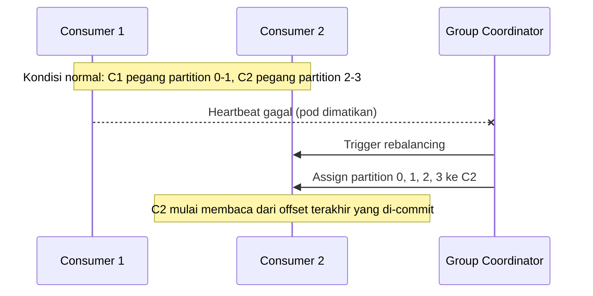

## TL;DR

Sebuah **consumer group** adalah sekumpulan consumer yang bekerja sama membaca satu topic, di mana Kafka menjamin setiap partition hanya dibaca oleh **satu** consumer di dalam grup itu pada satu waktu — inilah mekanisme yang membagi beban kerja secara paralel tanpa dua consumer memproses pesan yang sama secara duplikat dalam grup yang sama. **Rebalancing** adalah proses Kafka menyusun ulang pembagian partition ke consumer ketika keanggotaan grup berubah — consumer baru bergabung, consumer lama mati, atau consumer gagal mengirim heartbeat tepat waktu. Selama rebalancing berlangsung, seluruh grup berhenti memproses sesaat, dan kalau tidak ditangani hati-hati, proses ini bisa menjadi sumber duplikasi pesan atau pesan yang diproses dua kali oleh consumer berbeda.

## The Problem

Sistem legal-services dengan empat partition topic `status-permohonan` menjalankan empat instance consumer di Kubernetes, satu per partition, semuanya tergabung dalam consumer group yang sama bernama `pemroses-status`. Selama traffic normal, pembagian ini berjalan mulus — setiap consumer memproses satu partition secara paralel.

Saat Kubernetes melakukan rolling deployment untuk versi baru consumer, satu pod dimatikan lalu digantikan pod baru. Momen pod lama mati, Kafka mendeteksi consumer itu hilang (lewat kegagalan heartbeat) dan memicu rebalancing — partition yang tadinya ditangani pod itu dialihkan ke pod lain yang masih hidup. Tapi rebalancing versi lama (eager rebalancing) menghentikan **seluruh** consumer di grup itu sesaat, bukan hanya partition yang berpindah — untuk beberapa detik, seluruh pemrosesan status permohonan berhenti total, bukan hanya seperempatnya. Pada sistem dengan banyak rolling deployment (umum di Kubernetes yang melakukan deployment beberapa kali sehari), efek berhenti sesaat ini terjadi berulang kali dan mulai terasa sebagai gangguan nyata bagi pengguna yang menunggu status permohonannya diperbarui.

Masalah kedua yang lebih berbahaya: seorang consumer memproses pesan, lalu **sebelum** sempat mengirim commit offset ke Kafka (menandai "pesan ini sudah selesai diproses"), rebalancing terjadi dan partition itu dialihkan ke consumer lain. Consumer baru itu mulai membaca dari offset terakhir yang **berhasil di-commit** — yaitu sebelum pesan yang tadi sudah diproses tapi belum sempat di-commit. Pesan itu diproses ulang oleh consumer baru, menghasilkan duplikasi.

## Intuition

Cara paling mudah memahaminya: bayangkan consumer group seperti tim petugas yang membagi rak-rak arsip di antara mereka — setiap rak hanya dipegang satu petugas pada satu waktu, supaya tidak ada dua petugas membaca dan mencatat rak yang sama secara bersamaan. Ketika seorang petugas keluar tim (sakit, pindah tugas), rak yang tadinya ia pegang harus dibagikan ulang ke petugas yang tersisa — proses pembagian ulang inilah rebalancing. Kalau petugas yang keluar sedang di tengah membaca satu halaman dan belum mencatat "sudah sampai sini" sebelum keluar, petugas penggantinya akan mulai dari catatan terakhir yang tertulis, mengulang halaman yang sebenarnya sudah dibaca tapi belum tercatat.

Analogi ini berhenti bekerja pada satu titik: pembagian ulang rak fisik antar petugas manusia bisa dilakukan bertahap, sedikit demi sedikit, tanpa menghentikan seluruh tim. Rebalancing versi lama (eager) di Kafka justru menghentikan **seluruh grup** terlebih dahulu sebelum membagi ulang — desain yang kemudian diperbaiki lewat mekanisme **cooperative rebalancing** yang membagi ulang secara lebih halus, dibahas di bagian berikutnya.

## How It Works



Diagram ini menunjukkan bahwa **group coordinator** — salah satu broker Kafka yang ditunjuk mengelola keanggotaan grup tertentu — adalah pihak yang mendeteksi consumer hilang dan memicu pembagian ulang partition. Consumer yang masih hidup menerima assignment baru dan melanjutkan dari offset yang sudah tercatat, bukan dari awal partition.

**Commit offset** adalah tindakan consumer memberi tahu Kafka "saya sudah selesai memproses sampai offset ini". Ada dua pola umum:

- **Auto-commit** — client library meng-commit offset secara berkala di latar belakang, sederhana tapi berisiko: kalau consumer crash di antara auto-commit terakhir dan pemrosesan pesan berikutnya, pesan yang sudah diproses tapi belum ter-commit akan diproses ulang.
- **Manual commit** — aplikasi eksplisit meng-commit offset setelah benar-benar yakin pesan selesai diproses (misalnya setelah hasil pemrosesan berhasil disimpan ke database), memberi kontrol lebih besar atas kapan sebuah pesan dianggap "selesai", meski tetap tidak menghilangkan kemungkinan duplikasi sepenuhnya — hanya menyempitkan jendela waktu terjadinya.

## Under The Hood

Rebalancing versi awal (**eager rebalancing**) mengikuti pola "stop-the-world": seluruh consumer di grup melepaskan semua partition yang mereka pegang, baru kemudian group coordinator membagikan ulang partition ke seluruh consumer yang tersisa. Ini sederhana untuk diimplementasikan tapi mahal secara operasional — seluruh grup berhenti memproses selama proses ini berlangsung, meski hanya satu consumer yang sebenarnya berubah.

**Cooperative (incremental) rebalancing**, ditambahkan di versi Kafka yang lebih baru, memperbaiki ini: hanya partition yang benar-benar perlu berpindah kepemilikan yang dilepas dan dibagikan ulang, sementara consumer yang assignment-nya tidak berubah terus memproses tanpa jeda. Ini mengurangi dampak rebalancing dari "seluruh grup berhenti" menjadi "hanya sebagian kecil grup yang terdampak", relevan langsung untuk skenario rolling deployment yang dibahas di atas.

> [!question] Perlu diverifikasi
> Klaim: versi Kafka atau client library minimum yang mengaktifkan cooperative rebalancing secara default, dan apakah ini perlu dikonfigurasi eksplisit.
> Kenapa ragu: perilaku default berubah antar versi rilis dan antar client library (Java client vs `kafka-go` di Go bisa berbeda kematangan dukungannya).
> Cara verifikasi: dokumentasi resmi Kafka mengenai `partition.assignment.strategy`, dan dokumentasi client library Go yang dipakai.

## In Go

```go
package main

import (
	"context"
	"fmt"

	"github.com/segmentio/kafka-go"
)

func jalankanConsumer(ctx context.Context, reader *kafka.Reader) error {
	for {
		// FetchMessage TIDAK meng-commit offset secara otomatis —
		// commit dilakukan eksplisit lewat CommitMessages setelah
		// pemrosesan benar-benar selesai.
		msg, err := reader.FetchMessage(ctx)
		if err != nil {
			return fmt.Errorf("gagal mengambil pesan: %w", err)
		}

		if err := prosesEventPermohonan(ctx, msg.Value); err != nil {
			// Jangan commit offset kalau pemrosesan gagal — biarkan
			// pesan ini diproses ulang oleh consumer yang sama atau
			// consumer lain setelah rebalancing.
			fmt.Printf("gagal memproses pesan, akan diulang: %v\n", err)
			continue
		}

		if err := reader.CommitMessages(ctx, msg); err != nil {
			return fmt.Errorf("gagal commit offset: %w", err)
		}
	}
}
```

Pola ini — proses dulu, commit belakangan, hanya setelah pemrosesan benar-benar berhasil — adalah dasar dari **at-least-once delivery**, dibahas lebih lanjut sebagai kelas jaminan pengiriman di [[Delivery Semantics]]. Konsekuensinya: `prosesEventPermohonan` harus **idempotent** — aman dijalankan berkali-kali untuk pesan yang sama tanpa efek samping ganda — karena rebalancing atau restart bisa membuat pesan yang sama diproses lebih dari sekali, prinsip yang dibahas mendalam di [[Idempotent Consumers]].

## In His Stack

Di Kubernetes, setiap rolling deployment consumer Kafka memicu rebalancing setidaknya dua kali — sekali saat pod lama dimatikan, sekali saat pod baru bergabung. Untuk sistem dengan banyak service dan deployment yang sering, dampak kumulatif rebalancing ini nyata kalau tidak diperhitungkan. Praktik yang membantu: mengatur `session.timeout.ms` dan graceful shutdown consumer (menutup koneksi Kafka dengan rapi sebelum pod berhenti, bukan dibunuh paksa) supaya Kafka mendeteksi consumer keluar secara terkontrol, bukan menunggu heartbeat timeout yang lebih lambat — konsep yang sama dengan [[Graceful Shutdown]] untuk server HTTP, hanya diterapkan ke koneksi consumer Kafka.

## Trade-offs and When Not To Use It

Consumer group adalah mekanisme yang datang otomatis begitu memakai Kafka untuk pemrosesan paralel — bukan sesuatu yang bisa dihindari selama masih memakai model log dengan banyak consumer. Trade-off sungguhan ada di **jumlah consumer per grup**: menjalankan consumer lebih banyak dari jumlah partition topic tidak menambah paralelisme (consumer kelebihan itu menganggur, seperti dibahas di note sebelumnya), sementara menjalankan consumer terlalu sedikit dibanding partition meninggalkan sebagian partition tanpa consumer aktif menanganinya kalau salah satu consumer mati mendadak, sampai rebalancing berikutnya membagikannya ulang.

## Common Mistakes

> [!warning] Jebakan
> Memakai auto-commit offset untuk pemrosesan yang punya efek samping penting (menulis ke database, mengirim email), sehingga kalau consumer crash tepat setelah auto-commit tapi sebelum efek samping selesai, pesan itu dianggap "sudah diproses" oleh Kafka padahal sebenarnya belum — kebalikan dari duplikasi, ini kehilangan pesan secara diam-diam.

> [!warning] Jebakan
> Mematikan pod consumer secara paksa (`SIGKILL`) tanpa graceful shutdown, sehingga Kafka baru mendeteksi consumer hilang lewat heartbeat timeout yang jauh lebih lambat dibanding kalau consumer menutup koneksinya secara eksplisit sebelum mati.

> [!warning] Jebakan
> Menulis logika pemrosesan pesan yang tidak idempotent dengan asumsi "setiap pesan pasti hanya diproses sekali" — asumsi ini gagal tepat di momen rebalancing atau restart, situasi yang pasti terjadi cepat atau lambat di sistem produksi jangka panjang.

## Exercises

1. Jelaskan kenapa consumer group menjamin satu partition hanya dibaca satu consumer pada satu waktu, tapi tidak menjamin satu pesan hanya diproses tepat sekali.
2. Bandingkan eager rebalancing dan cooperative rebalancing dari sisi dampaknya terhadap consumer yang assignment-nya tidak berubah.
3. Sebuah consumer memproses pesan, menyimpan hasilnya ke database, lalu crash sebelum sempat commit offset. Jelaskan apa yang terjadi ketika consumer group melakukan rebalancing dan partition itu dialihkan ke consumer lain.
4. **(Open-ended)** Timmu menjalankan empat consumer Kafka di Kubernetes untuk topic dengan empat partition, dan rolling deployment terjadi tiga kali sehari, masing-masing memicu rebalancing yang terasa mengganggu pengguna karena jeda pemrosesan. Rancang perbaikan konkret yang mengurangi dampak ini, dengan mempertimbangkan strategi rebalancing, graceful shutdown, dan pola deployment itu sendiri.

> [!success]- Kunci jawaban
> Untuk soal 4: tiga perbaikan yang saling melengkapi. Pertama, pastikan cooperative rebalancing aktif (bukan eager) supaya hanya partition yang benar-benar berpindah yang terdampak, bukan seluruh grup. Kedua, implementasikan graceful shutdown di consumer — menangani sinyal terminasi Kubernetes (`SIGTERM`), menyelesaikan pemrosesan pesan yang sedang berjalan, commit offset, baru menutup koneksi Kafka secara eksplisit sebelum pod benar-benar berhenti — ini membuat Kafka mendeteksi consumer keluar secara instan lewat "leave group" eksplisit, bukan menunggu heartbeat timeout yang lebih lambat. Ketiga, pertimbangkan strategi rolling deployment yang mengganti satu pod pada satu waktu dengan jeda (bukan beberapa pod sekaligus), supaya rebalancing yang terjadi juga bertahap, bukan menumpuk dalam satu momen.

## Self-Check

- Apa yang dijamin consumer group terhadap pembagian partition, dan apa yang **tidak** dijaminnya terhadap duplikasi pesan?
- Kenapa cooperative rebalancing mengurangi dampak dibanding eager rebalancing?
- Kenapa auto-commit offset berisiko untuk pemrosesan dengan efek samping penting?

## Connected Notes

- [[Topics, Partitions, and Offsets]] — prasyarat langsung: consumer group membagi partition yang dibahas di note itu di antara anggotanya.
- [[Delivery Semantics]] — kelanjutan langsung: pola commit-setelah-proses di note ini adalah dasar dari jaminan at-least-once yang dibahas lebih formal di sana.
- [[Idempotent Consumers]] — solusi terhadap duplikasi pesan yang bisa muncul dari rebalancing, dibahas mendalam di note itu.
- [[Graceful Shutdown]] — konsep yang sama diterapkan ke koneksi consumer Kafka, bukan hanya server HTTP.

## Further Reading

- Dokumentasi resmi Apache Kafka, bagian "Consumer Groups" dan "Incremental Cooperative Rebalancing": kafka.apache.org

## Catatan Saya

*Tulis pertanyaanmu sendiri, contoh kode dari pekerjaanmu, atau bagian yang belum jelas di sini.*
