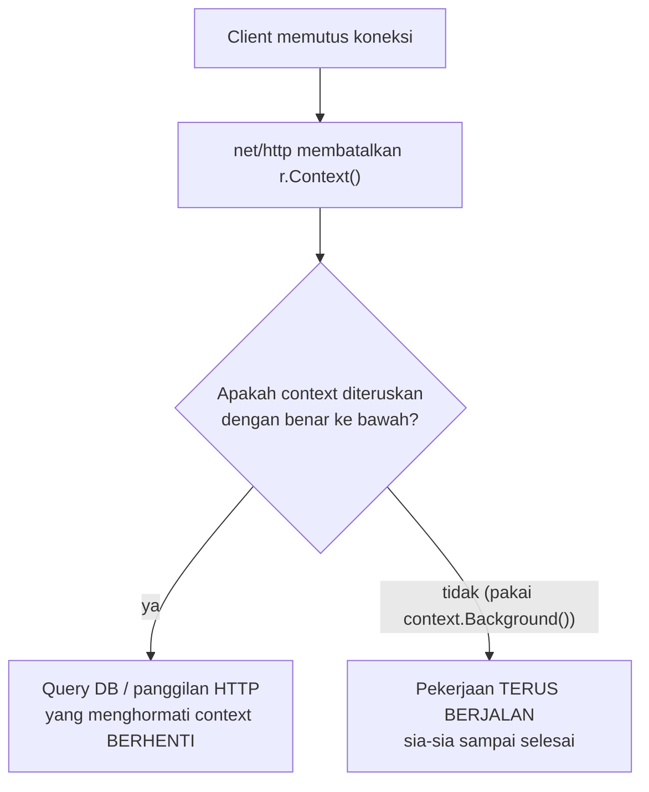

## TL;DR

`context.Context` membawa deadline, sinyal pembatalan, dan nilai lintas-request lewat seluruh rantai pemanggilan — dari `r.Context()` di handler, turun ke service, repository, sampai panggilan ke database atau partner eksternal. Setiap function yang melakukan I/O atau bisa memblokir **harus** menerima dan menghormati context, meneruskannya ke bawah — supaya begitu client terputus atau request dibatalkan, pekerjaan yang sedang berjalan jauh di dalam stack pemanggilan benar-benar berhenti, bukan terus berjalan sia-sia untuk hasil yang tidak akan pernah diterima siapa pun.

## The Problem

Bayangkan sebuah handler memanggil query database yang berat, tapi memanggilnya dengan `context.Background()` alih-alih `r.Context()` yang seharusnya diteruskan dari request masuk. Kalau client memutus koneksi di tengah jalan (tab browser ditutup, load balancer timeout dan memutus koneksi), `r.Context()` yang sesungguhnya otomatis dibatalkan oleh `net/http` — tapi karena query database dipanggil dengan `context.Background()` yang terpisah sepenuhnya, query itu **tetap berjalan sampai selesai**, menghabiskan resource database dan CPU untuk hasil yang tidak akan pernah dikirim ke siapa pun, karena tidak ada lagi koneksi yang menunggunya.

Bug ini invisible di kondisi normal — hanya terasa saat beban tinggi, ketika banyak request yang ditinggalkan/dibatalkan menumpuk sekaligus, masing-masing tetap menghabiskan resource server yang seharusnya sudah dibebaskan begitu client pergi. Server jadi terlihat "lambat" atau "kehabisan resource" tanpa alasan yang jelas dari metrik permukaan, padahal akar masalahnya sesederhana satu baris kode yang salah memakai context.

## Intuition

Bayangkan context seperti **sinyal "panggilan masih tersambung" yang mengalir lewat setiap tahap transfer telepon** ke berbagai departemen customer service — kalau pelanggan menutup telepon, idealnya setiap departemen yang sedang menangani kasus itu segera diberi tahu untuk berhenti bekerja pada panggilan yang sudah tidak ada yang mendengarkan lagi, alih-alih terus meneliti masalah pelanggan selama 10 menit lagi tanpa sadar mereka sudah menutup telepon.

Analogi ini bocor pada satu detail teknis krusial: sistem telepon sungguhan mendeteksi "tutup telepon" secara otomatis dan langsung, terbangun di jaringan telepon itu sendiri. Di Go, function yang sedang melakukan pekerjaan sungguhan (query database yang lambat, loop yang berat secara CPU) **tidak otomatis berhenti** hanya karena context-nya dibatalkan — function itu sendiri harus secara eksplisit memeriksa `ctx.Done()`/`ctx.Err()`, atau meneruskan context itu ke sesuatu yang sudah menghormatinya (seperti `database/sql` atau `http.Client`). Sinyal "dibatalkan" hanya dihormati oleh kode yang memang ditulis untuk memeriksanya — ini pembatalan **kooperatif**, bukan interupsi paksa seperti yang tersirat dari analogi telepon.

## How It Works



Konvensi Go: `context.Context` selalu jadi **parameter pertama** function yang melakukan I/O atau bisa memblokir (`ctx context.Context`), diteruskan eksplisit dari satu function ke function berikutnya di seluruh rantai pemanggilan — dari handler HTTP, ke service, ke repository, sampai ke driver database atau HTTP client.

## In Go

```go
// SALAH: context.Background() sepenuhnya terputus dari context request
// asli — pembatalan/timeout dari client TIDAK PERNAH sampai ke sini.
func (r *DokumenRepository) AmbilDokumenSalah(id string) (*Dokumen, error) {
    row := r.db.QueryRowContext(context.Background(), "SELECT ... WHERE id = ?", id)
    // ...
}

// BENAR: context diteruskan dari pemanggil, mengalir sampai ke
// database/sql — kalau client memutus koneksi, query ini ikut berhenti.
func (r *DokumenRepository) AmbilDokumen(ctx context.Context, id string) (*Dokumen, error) {
    row := r.db.QueryRowContext(ctx, "SELECT ... WHERE id = ?", id)
    // ...
}

func handleAmbilDokumen(w http.ResponseWriter, r *http.Request) {
    // r.Context() dibatalkan otomatis oleh net/http kalau client
    // memutus koneksi — INILAH yang harus diteruskan, bukan Background().
    doc, err := docRepo.AmbilDokumen(r.Context(), r.PathValue("id"))
    // ...
}
```

Untuk operasi yang benar-benar melakukan loop panjang secara manual (bukan lewat library yang sudah menghormati context seperti `database/sql`), pembatalan harus diperiksa **secara eksplisit**:

```go
func prosesBatchBesar(ctx context.Context, items []Item) error {
    for _, item := range items {
        select {
        case <-ctx.Done():
            return fmt.Errorf("dibatalkan: %w", ctx.Err())
        default:
        }
        // ... proses item ...
    }
    return nil
}
```

Tanpa `select { case <-ctx.Done(): ... }` eksplisit ini, loop akan terus berjalan sampai selesai berapa pun context-nya sudah dibatalkan — context yang diteruskan dengan benar saja **tidak cukup** kalau kode di dalamnya tidak secara aktif memeriksanya.

## In His Stack

**PHP (Yii1/Yii2)** dengan model eksekusi klasik tidak punya mekanisme setara context propagation yang idiomatic — setiap request PHP berjalan sampai selesai di dalam satu proses/eksekusi tunggal, tanpa konsep "membatalkan pekerjaan di tengah jalan karena client sudah pergi" yang mengalir otomatis lewat kode biasa (PHP punya `connection_aborted()`/`ignore_user_abort()` tapi jarang dipakai dan jauh lebih kasar). Ini kenapa disiplin meneruskan context di Go adalah kebiasaan yang benar-benar **baru** untuk engineer yang datang dari PHP — bukan sesuatu yang otomatis terbawa dari kebiasaan lama, harus dibangun sengaja.

## Trade-offs and When Not To Use It

Meneruskan context dengan benar lewat setiap lapisan (parameter pertama, konsisten di seluruh codebase) menambah sedikit boilerplate berulang — tapi alternatifnya (resource yang terbuang sia-sia untuk request yang sudah ditinggalkan) adalah biaya nyata, meski sering tidak terlihat sampai beban tinggi. `context.WithValue` (membawa nilai lewat context, bukan hanya deadline/pembatalan) adalah alat yang sah tapi sempit — cocok untuk metadata lintas-request seperti correlation ID, **tidak cocok** untuk parameter logika bisnis biasa yang seharusnya jadi parameter function eksplisit dan bertipe jelas. Menyalahgunakan `context.WithValue` untuk hal ini membuat alur data implisit dan kehilangan keamanan tipe saat kompilasi.

## Common Mistakes

> [!warning] Jebakan
> Memanggil operasi I/O (query database, HTTP call ke partner) dengan `context.Background()` atau `context.TODO()` alih-alih meneruskan `r.Context()` dari request asli — memutus koneksi antara pembatalan client dan pekerjaan yang sedang berjalan, membuang resource untuk hasil yang tidak akan pernah dipakai.

> [!warning] Jebakan
> Meneruskan context dengan benar tapi lupa memeriksa `ctx.Done()`/`ctx.Err()` secara eksplisit di dalam loop atau operasi panjang buatan sendiri — pembatalan context adalah sinyal kooperatif yang harus aktif diperiksa kode, bukan interupsi otomatis.

> [!warning] Jebakan
> Menyalahgunakan `context.WithValue` untuk membawa parameter logika bisnis yang seharusnya jadi argumen function eksplisit — membuat alur data sulit ditelusuri dan kehilangan pengecekan tipe saat kompilasi.

## Exercises

1. Kenapa memanggil `context.Background()` di dalam handler HTTP memutus hubungan antara pembatalan client dan pekerjaan yang sedang berjalan?
2. Kenapa context yang diteruskan dengan benar tidak otomatis menghentikan sebuah loop panjang tanpa pemeriksaan eksplisit?
3. Kapan `context.WithValue` tepat dipakai, dan kapan sebaiknya dihindari?
4. Desain terbuka: sebuah service Go memproses laporan besar yang butuh waktu beberapa menit, dipanggil dari endpoint HTTP. Client sering membatalkan (menutup koneksi) sebelum laporan selesai karena timeout di sisi mereka, tapi proses di server tetap menghabiskan resource sampai selesai. Rancang perbaikan lengkap yang memastikan pembatalan client benar-benar menghentikan pekerjaan di server, termasuk bagian mana dari kode yang perlu diperiksa.

> [!success]- Kunci jawaban
> Pertama, pastikan seluruh rantai pemanggilan dari handler sampai ke logika pembuatan laporan meneruskan `r.Context()` secara konsisten (bukan `context.Background()` di titik mana pun). Kedua, periksa apakah logika pembuatan laporan melibatkan loop panjang atau pemrosesan manual (bukan hanya satu query database) — kalau ya, tambahkan pemeriksaan `select { case <-ctx.Done(): ...}` di titik-titik strategis dalam loop itu (misalnya setiap beberapa ratus iterasi, bukan setiap iterasi tunggal kalau overhead pemeriksaan itu sendiri jadi signifikan). Ketiga, kalau laporan ini sebenarnya sesuai lebih baik diproses asinkron (client mendapat ID job dan memantau statusnya, lihat pola di [[REST Principles]] soal endpoint yang merepresentasikan proses/job), pertimbangkan memindahkan pemrosesan laporan ke luar siklus hidup request HTTP sepenuhnya — job yang berjalan di background tidak terikat pada context request HTTP yang bisa dibatalkan client kapan saja, dan client bisa memantau progresnya secara terpisah tanpa harus menahan satu koneksi HTTP tetap terbuka selama proses berjalan.

## Self-Check

- Kenapa `context.Background()` di dalam handler memutus hubungan dengan pembatalan client?
- Kenapa pembatalan context disebut "kooperatif", bukan otomatis?
- Kapan `context.WithValue` tepat dipakai?
- Apa risiko menyalahgunakan `context.WithValue` untuk parameter logika bisnis?

## Connected Notes

- [[Routing in Go]] — prasyarat: handler yang menerima `r.Context()` sebagai titik awal propagasi context.
- [[../50 Concurrency and Performance/Context for Cancellation and Deadlines|Context for Cancellation and Deadlines]] — pembahasan lebih dalam mekanisme context di level concurrency Go secara umum.
- [[Timeouts in HTTP Servers]] — timeout server pada dasarnya diimplementasikan lewat context dengan deadline.
- [[../70 Infrastructure and Delivery/Correlation IDs|Correlation IDs]] — salah satu penggunaan `context.WithValue` yang sah dan idiomatic.
- [[../40 Databases/database-sql and sqlx|database-sql and sqlx]] — `database/sql` sudah menghormati context secara native lewat method `...Context`.

## Further Reading

- Artikel resmi *"Context and structs"* atau *"Go Concurrency Patterns: Context"* di blog resmi Go (go.dev/blog) — penjelasan otoritatif filosofi context.

## Catatan Saya

*Tulis di sini apakah kamu pernah menemukan (atau mencurigai) pekerjaan yang terus berjalan sia-sia di server karena context tidak diteruskan dengan benar.*
