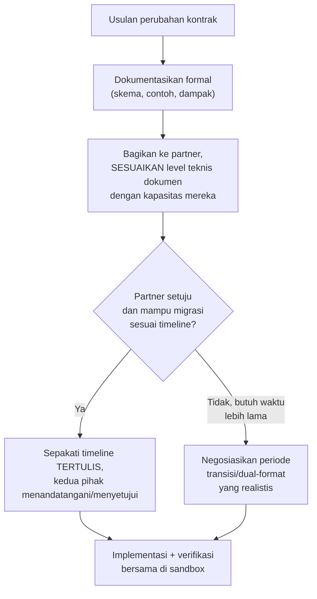

## TL;DR

[[API Versioning]] menjelaskan strategi versioning untuk API yang **kamu** kontrol penuh. Kontrak dengan partner eksternal berbeda secara fundamental: perubahan kontrak butuh **kesepakatan dua pihak**, bukan keputusan sepihak — dan pihak partner (terutama instansi pemerintah dengan siklus anggaran dan prioritas sendiri) mungkin tidak punya kapasitas teknis untuk bermigrasi secepat yang kamu inginkan, atau bahkan tidak punya insentif sama sekali untuk berubah kalau sistem lama mereka "masih berfungsi" dari sudut pandang mereka. Negosiasi kontrak yang efektif berarti mendokumentasikan kesepakatan secara formal (bukan hanya percakapan lisan), memberi jalur migrasi yang realistis dengan mempertimbangkan keterbatasan partner, dan merancang perubahan yang **meminimalkan** beban migrasi di sisi mereka, bahkan kalau itu berarti menanggung sedikit lebih banyak kompleksitas di sisi sendiri.

## The Problem

Sebuah tim ingin mengubah format tanggal dalam kontrak integrasi dari `DD-MM-YYYY` (format yang membingungkan dan rawan salah baca) menjadi ISO 8601 (`YYYY-MM-DD`) — perubahan yang secara teknis sepele dan jelas lebih baik. Tapi partner (sebuah instansi dengan sistem legacy yang jarang di-maintain) memberi tahu bahwa mengubah parsing tanggal di sisi mereka butuh proses pengajuan perubahan internal yang memakan waktu enam bulan, karena sistem itu dikelola vendor eksternal dengan kontrak pemeliharaan terbatas. Perubahan yang "seharusnya" hanya butuh beberapa jam kerja di kedua sisi malah terjebak dalam proses birokrasi yang jauh melampaui ekspektasi awal.

Masalah kedua: sebuah kesepakatan kontrak API dibuat lewat email dan rapat, tanpa dokumen formal yang disepakati kedua pihak — beberapa bulan kemudian muncul perselisihan soal "apakah field X memang seharusnya opsional atau wajib", karena tidak ada rujukan tertulis yang jelas yang bisa dicek kedua pihak, hanya ingatan masing-masing pihak yang ternyata berbeda soal apa yang sebenarnya disepakati.

## Intuition

Bayangkan kontrak API dengan partner eksternal seperti **perjanjian sewa properti antara dua institusi**, bukan sekadar kesepakatan verbal antar tetangga. Perjanjian sewa properti dituliskan formal, ditandatangani kedua pihak, dan memuat detail eksplisit (durasi, syarat perubahan, apa yang terjadi kalau salah satu pihak ingin mengubah kesepakatan) — bukan karena kedua pihak tidak saling percaya, tapi karena institusi besar butuh rujukan tertulis yang jelas untuk keperluan audit, pergantian personel, dan menghindari perselisihan interpretasi di masa depan. Kontrak API antar organisasi idealnya diperlakukan dengan formalitas yang sama — skema yang terdokumentasi jelas (lewat [[OpenAPI]] atau skema Protobuf, misalnya), disepakati eksplisit, bukan berdasarkan pemahaman informal yang bisa berbeda antar pihak.

Analogi ini bocor pada satu hal: perjanjian sewa properti biasanya sudah mengikuti template hukum standar yang dipahami kedua pihak secara setara. Kontrak API antar dua organisasi dengan kapasitas teknis yang **timpang** (timmu yang modern vs sistem legacy partner) butuh kesadaran ekstra — dokumen yang secara teknis "benar" tapi ditulis dengan asumsi kapasitas teknis yang tidak dimiliki partner (mengharapkan mereka memahami skema OpenAPI kompleks, misalnya) tidak benar-benar berguna sebagai alat komunikasi kalau pihak yang harus memahaminya tidak punya latar belakang untuk itu.

## How It Works



**Elemen kontrak yang layak didokumentasikan formal**: skema data lengkap (field wajib/opsional, tipe, format), semantik setiap field (bukan hanya nama, tapi arti bisnisnya — penting untuk field yang namanya ambigu), kebijakan versioning dan breaking change (siapa yang memberi tahu siapa, berapa lama periode transisi), dan SLA yang disepakati (response time yang diharapkan, jam operasional, kontak untuk eskalasi masalah).

## Under The Hood

**Periode dual-format/dual-version** hampir selalu dibutuhkan untuk perubahan kontrak dengan partner yang kapasitas migrasinya terbatas — sisi yang punya kapasitas teknis lebih besar (biasanya timmu sendiri) menanggung beban tambahan mendukung format lama **dan** baru secara bersamaan selama periode transisi, alih-alih memaksa partner bermigrasi serentak pada tanggal tertentu. Ini adalah trade-off yang harus diterima secara sadar — kompleksitas tambahan sementara di sisi sendiri demi kelangsungan integrasi yang tidak terputus, alih-alih memaksakan tenggat yang tidak realistis bagi partner dan berisiko integrasi terputus total.

**Kontrak yang terdokumentasi lewat skema formal** (OpenAPI untuk REST, `.proto` untuk gRPC/Protobuf, lihat [[gRPC and Protobuf]]) memberi manfaat ganda: dokumentasi yang jelas untuk kedua pihak, **dan** basis untuk contract testing otomatis (memverifikasi implementasi benar-benar sesuai skema yang disepakati, menangkap penyimpangan sebelum sampai ke production) — jauh lebih kuat dibanding dokumentasi prosa yang bisa ditafsirkan berbeda oleh pembaca berbeda.

## In Go

```go
package kontrak

// SkemaKontrakV1 didefinisikan EKSPLISIT sebagai struct dengan tag —
// menjadi RUJUKAN TUNGGAL yang disepakati, bukan interpretasi informal
// masing-masing pihak dari percakapan email.
type SkemaKontrakV1 struct {
	NIK             string `json:"nik" validate:"required,len=16"`
	TanggalLahir    string `json:"tanggal_lahir" validate:"required" format:"YYYY-MM-DD"` // DISEPAKATI ISO 8601, bukan format lama
	StatusVerifikasi string `json:"status_verifikasi,omitempty"` // OPSIONAL, disepakati eksplisit
}

// ValidasiSesuaiKontrak memverifikasi data yang diterima/dikirim BENAR-
// BENAR sesuai skema yang disepakati — bertindak sebagai contract test
// otomatis, menangkap penyimpangan partner dari kontrak sejak dini.
func ValidasiSesuaiKontrak(data SkemaKontrakV1) []string {
	var pelanggaran []string
	if len(data.NIK) != 16 {
		pelanggaran = append(pelanggaran, "NIK harus 16 digit sesuai kontrak yang disepakati")
	}
	return pelanggaran
}
```

## In His Stack

Untuk integrasi lintas instansi pemerintah, kontrak yang terdokumentasi formal (bahkan sesederhana dokumen spesifikasi yang ditandatangani kedua pihak, bukan harus skema OpenAPI penuh kalau partner tidak punya kapasitas teknis untuk itu) sering menjadi **kebutuhan legal/administratif**, bukan hanya praktik teknis yang baik — perubahan sistem pemerintah biasanya butuh persetujuan resmi lintas instansi, dan dokumen kontrak yang jelas menjadi rujukan yang dibutuhkan proses persetujuan itu sendiri, terlepas dari kebutuhan teknis semata.

## Trade-offs and When Not To Use It

Mendokumentasikan kontrak secara sangat formal (skema lengkap, SLA tertulis, proses persetujuan berlapis) untuk integrasi internal antar tim sendiri yang berkomunikasi setiap hari adalah birokrasi berlebihan — formalitas kontrak paling bernilai justru ketika ada **jarak organisasi** yang signifikan antara kedua pihak (instansi berbeda, komunikasi tidak setiap hari, personel yang bisa berganti) di mana rujukan tertulis formal menjadi satu-satunya cara menjaga konsistensi pemahaman dari waktu ke waktu. Periode dual-format yang terlalu panjang juga punya biaya nyata (kompleksitas kode yang harus dipertahankan lebih lama) — negosiasi timeline yang realistis tapi tetap punya batas akhir yang jelas lebih baik dibanding dual-format tanpa batas waktu yang jelas kapan akan berakhir.

## Common Mistakes

> [!warning] Jebakan
> Menyepakati kontrak hanya lewat percakapan informal (email, rapat) tanpa dokumen formal yang disetujui kedua pihak — memicu perselisihan interpretasi di masa depan tanpa rujukan tertulis yang jelas.

> [!warning] Jebakan
> Menetapkan tenggat migrasi berdasarkan kapasitas teknis timmu sendiri, tanpa mempertimbangkan keterbatasan kapasitas partner — tenggat yang tidak realistis bagi partner berisiko integrasi terputus atau partner terpaksa melanggar kontrak yang sudah disepakati.

> [!warning] Jebakan
> Menulis dokumentasi kontrak dengan level teknis yang mengasumsikan kapasitas partner yang sebenarnya tidak dimiliki — dokumen yang "benar" secara teknis tapi tidak bisa dipahami pihak yang harus mengimplementasikannya tidak benar-benar berguna sebagai alat komunikasi.

## Exercises

1. Jelaskan kenapa kontrak dengan partner eksternal butuh dokumentasi formal, berbeda dari kesepakatan informal yang mungkin cukup untuk tim internal.
2. Kenapa periode dual-format/dual-version sering dibutuhkan saat mengubah kontrak dengan partner yang kapasitas migrasinya terbatas?
3. Kenapa level teknis dokumentasi kontrak perlu disesuaikan dengan kapasitas partner, bukan mengikuti standar timmu sendiri?
4. Desain terbuka: kamu perlu mengubah format autentikasi API yang dipakai partner dari API key sederhana menjadi OAuth2 (demi keamanan yang lebih baik), tapi partner memberi tahu bahwa sistem mereka butuh waktu satu tahun untuk migrasi karena keterbatasan anggaran dan personel teknis. Rancang strategi menjaga keamanan integrasi ini meningkat secara bertahap selama periode transisi panjang itu, tanpa menunggu satu tahun penuh sebelum ada perbaikan keamanan sama sekali.

> [!success]- Kunci jawaban
> **1.** Kesepakatan informal bergantung pada ingatan dan interpretasi masing-masing individu yang terlibat — cukup andal untuk tim internal yang berkomunikasi setiap hari dan bisa cepat mengklarifikasi kesalahpahaman. Untuk partner eksternal, personel yang terlibat bisa berganti (pindah tim, resign), komunikasi tidak sesering itu, dan kedua organisasi mungkin butuh rujukan formal untuk keperluan audit atau pertanggungjawaban internal masing-masing — dokumentasi formal menjadi satu-satunya sumber kebenaran yang tidak bergantung pada ingatan orang tertentu yang mungkin sudah tidak terlibat lagi.
> **4.** Strategi bertahap: (1) selama periode transisi, terapkan **lapisan keamanan tambahan** yang tidak butuh perubahan di sisi partner sama sekali — misalnya, membatasi API key lama hanya bisa diakses dari rentang IP tertentu yang sudah diketahui milik partner (mitigasi risiko API key bocor dipakai pihak lain), menambah rate limiting yang lebih ketat, dan memperkuat monitoring/alerting untuk pola akses mencurigakan pada endpoint yang masih memakai API key lama; (2) tawarkan dukungan teknis konkret ke partner untuk mempercepat migrasi mereka (menyediakan contoh kode, SDK sederhana) alih-alih hanya menunggu pasif; (3) tetapkan **milestone antara** dalam periode satu tahun itu (misalnya, tiga bulan pertama untuk rotasi API key lama secara berkala meski formatnya belum berubah, mengurangi risiko satu API key statis yang sama dipakai bertahun-tahun) — memberi peningkatan keamanan bertahap yang nyata, bukan menunggu satu lompatan besar di akhir periode yang sangat panjang.

## Self-Check

- Kenapa kontrak dengan partner eksternal butuh dokumentasi formal?
- Kenapa periode dual-format sering dibutuhkan untuk perubahan kontrak dengan partner terbatas?
- Kenapa level teknis dokumentasi kontrak perlu disesuaikan kapasitas partner?
- Apa manfaat ganda dari kontrak yang didokumentasikan lewat skema formal (OpenAPI/Protobuf)?

## Connected Notes

- [[Designing an API for a Partner You Do Not Control]] — prinsip defensive design yang dibahas di note sebelumnya menjadi dasar kenapa kontrak formal dan periode transisi realistis dibutuhkan.
- [[API Versioning]] — strategi versioning API yang kamu kontrol penuh, kontras dengan kompleksitas tambahan versioning kontrak lintas organisasi di note ini.
- [[OpenAPI]] — alat konkret mendokumentasikan skema kontrak API secara formal, disinggung sebagai basis contract testing.
- [[Webhooks and How to Secure Them]] — kelanjutan tema integrasi lintas organisasi, fokus pada keamanan komunikasi masuk dari partner, dibahas di note berikutnya.
- [[gRPC and Protobuf]] — skema `.proto` sebagai bentuk lain kontrak formal yang bisa disepakati, dengan jaminan tipe yang lebih ketat dibanding JSON/OpenAPI.

## Further Reading

- Materi umum tentang API contract testing (Pact, dan tool sejenis) sebagai referensi konkret memverifikasi kepatuhan kontrak secara otomatis.

## Catatan Saya

*Tulis di sini apakah kontrak integrasi dengan partner di kerjaanmu sudah terdokumentasi formal, atau masih bergantung pada kesepakatan informal lewat email/rapat.*
