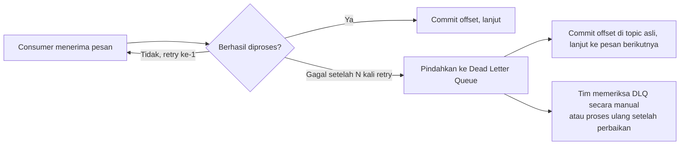

## TL;DR

**Dead letter queue (DLQ)** adalah tujuan terpisah tempat pesan yang gagal diproses berulang kali dipindahkan, alih-alih terus dicoba ulang selamanya atau — lebih buruk — dibuang diam-diam. Tanpa DLQ, consumer yang menemukan pesan cacat (payload rusak, data yang melanggar aturan bisnis, dependensi eksternal yang selalu gagal untuk pesan tertentu) hanya punya dua pilihan buruk: retry tanpa henti yang memblokir seluruh partition dari memproses pesan-pesan sehat di belakangnya, atau melewatkan pesan itu begitu saja dan kehilangannya tanpa jejak. DLQ memberi pilihan ketiga: pesan bermasalah dipindahkan ke tempat terpisah untuk diperiksa manusia atau diproses ulang setelah masalahnya diperbaiki, sementara pemrosesan pesan-pesan lain tetap berjalan normal.

## The Problem

Consumer di sistem legal-services memproses event "verifikasi dokumen" dari Kafka, memanggil layanan OCR eksternal untuk membaca isi dokumen. Suatu hari, satu dokumen yang di-upload pemohon ternyata file korup — bukan PDF yang valid meski ekstensinya `.pdf`. Layanan OCR selalu gagal memprosesnya, dan consumer, yang ditulis dengan asumsi "retry sampai berhasil" (pola at-least-once yang benar untuk kegagalan sementara), terus mencoba memproses ulang pesan yang sama tanpa henti karena kegagalan ini permanen, bukan sementara.

Karena consumer tidak commit offset untuk pesan yang gagal (perilaku yang benar untuk kegagalan sementara seperti timeout jaringan), pesan cacat ini tertahan di posisi offset yang sama selamanya — seluruh partition itu **berhenti maju**, karena Kafka memproses pesan di dalam satu partition secara berurutan, dan pesan setelahnya baru bisa diproses setelah pesan ini berhasil di-commit. Semua permohonan lain yang kebetulan tersebar ke partition yang sama ikut tertahan, meski dokumen mereka valid dan tidak ada masalah sama sekali — satu dokumen korup memblokir seluruh antrean di belakangnya.

## Intuition

Padanan terdekatnya di luar dunia software adalah **surat yang tidak bisa diantarkan** di kantor pos — alamat tidak ditemukan, penerima menolak menerima, atau amplopnya rusak sampai tidak terbaca. Kantor pos tidak terus mencoba mengantarkan surat yang sama berulang-ulang tanpa henti sampai menghalangi pengiriman surat lain, dan juga tidak membuang surat itu begitu saja tanpa jejak. Surat semacam itu dipisahkan ke bagian **surat tak terkirim (dead letter)** — istilah yang memang dipinjam langsung dari praktik kantor pos — untuk diperiksa secara manual, dikembalikan ke pengirim, atau diselidiki kenapa gagal terkirim.

Analogi ini tidak bocor secara berarti di sini — istilah "dead letter" di sistem pesan modern memang diambil langsung dari praktik ini, dan fungsinya nyaris identik: memisahkan yang bermasalah dari alur normal, tanpa menghentikan alur normal itu maupun menghilangkan jejak masalahnya.

## How It Works



Diagram ini menunjukkan poin krusial: begitu sebuah pesan dipindahkan ke DLQ, consumer tetap **commit offset** di topic asli dan melanjutkan ke pesan berikutnya — inilah yang membebaskan partition dari kebuntuan. DLQ biasanya berupa topic Kafka terpisah (`verifikasi-dokumen-dlq`) atau antrean RabbitMQ terpisah, membawa payload pesan asli plus metadata tambahan: alasan kegagalan, jumlah percobaan yang sudah dilakukan, dan timestamp kegagalan terakhir — informasi yang dibutuhkan untuk menyelidiki dan memperbaiki masalahnya nanti.

Keputusan "kapan sebuah pesan dianggap gagal permanen, bukan sekadar gagal sementara" biasanya berdasarkan **jumlah percobaan maksimum** (misalnya lima kali retry dengan backoff, dibahas di [[Retries with Exponential Backoff and Jitter]]) — kegagalan sementara seperti timeout jaringan biasanya sembuh sendiri dalam beberapa percobaan, sementara kegagalan permanen seperti file korup akan terus gagal berapa kali pun dicoba.

## In Go

```go
package main

import (
	"context"
	"fmt"

	"github.com/segmentio/kafka-go"
)

const maksimalPercobaan = 5

func prosesDenganDLQ(ctx context.Context, reader *kafka.Reader, dlqWriter *kafka.Writer) error {
	for {
		msg, err := reader.FetchMessage(ctx)
		if err != nil {
			return fmt.Errorf("gagal mengambil pesan: %w", err)
		}

		jumlahPercobaan := hitungPercobaanSebelumnya(msg)
		err = verifikasiDokumen(ctx, msg.Value)

		switch {
		case err == nil:
			if err := reader.CommitMessages(ctx, msg); err != nil {
				return fmt.Errorf("gagal commit offset: %w", err)
			}

		case jumlahPercobaan < maksimalPercobaan:
			// Kegagalan masih dalam batas wajar — jangan commit,
			// biarkan pesan ini dicoba ulang secara alami.
			continue

		default:
			// Sudah gagal berkali-kali — anggap gagal permanen,
			// pindahkan ke DLQ, lalu bebaskan partition ini.
			if pubErr := kirimKeDLQ(ctx, dlqWriter, msg, err); pubErr != nil {
				return fmt.Errorf("gagal mengirim ke DLQ: %w", pubErr)
			}
			if err := reader.CommitMessages(ctx, msg); err != nil {
				return fmt.Errorf("gagal commit offset setelah DLQ: %w", err)
			}
		}
	}
}

func kirimKeDLQ(ctx context.Context, writer *kafka.Writer, msg kafka.Message, penyebab error) error {
	pesanDLQ := kafka.Message{
		Key:   msg.Key,
		Value: msg.Value,
		Headers: []kafka.Header{
			{Key: "alasan-gagal", Value: []byte(penyebab.Error())},
		},
	}
	if err := writer.WriteMessages(ctx, pesanDLQ); err != nil {
		return fmt.Errorf("gagal publish ke DLQ: %w", err)
	}
	return nil
}
```

Penghitungan jumlah percobaan (`hitungPercobaanSebelumnya`) di dunia nyata biasanya butuh penyimpanan terpisah (Redis atau tabel database) karena Kafka sendiri tidak melacak "berapa kali pesan ini sudah dicoba" secara bawaan — detail implementasi yang disederhanakan di contoh ini untuk fokus pada alur DLQ itu sendiri.

## In His Stack

DLQ jadi krusial untuk integrasi dengan layanan eksternal yang tidak sepenuhnya bisa diandalkan — layanan OCR pihak ketiga, API instansi lain, gateway pembayaran — di mana kegagalan permanen (dokumen benar-benar rusak, data yang memang tidak valid) tidak bisa dibedakan dari kegagalan sementara (layanan sedang down) tanpa mencoba beberapa kali dulu. Tanpa DLQ di titik-titik integrasi seperti ini, satu partner yang bermasalah bisa membekukan seluruh alur pemrosesan sistem, persis skenario yang sudah dibahas dari sudut pandang berbeda di [[Handling an Unreliable Counterparty]].

## Trade-offs and When Not To Use It

DLQ menambah komponen operasional: topic atau antrean tambahan yang harus dipantau, dan proses (manual atau otomatis) untuk menangani pesan yang masuk ke sana — DLQ yang tidak pernah diperiksa sama buruknya dengan tidak punya DLQ sama sekali, hanya memindahkan masalah "pesan hilang diam-diam" menjadi "pesan menumpuk diam-diam di tempat lain". Untuk sistem dengan volume sangat rendah atau di mana kegagalan pemrosesan nyaris tidak pernah terjadi, DLQ mungkin terasa berlebihan pada tahap awal — tapi begitu sistem terhubung ke dependensi eksternal yang tidak sepenuhnya kamu kendalikan, DLQ berubah dari "nice to have" menjadi kebutuhan operasional dasar.

## Common Mistakes

> [!warning] Jebakan
> Tidak pernah memeriksa DLQ setelah dibuat, sehingga pesan yang gagal permanen menumpuk tanpa ada yang tahu — butuh alert atau dashboard yang memantau jumlah pesan di DLQ, bukan sekadar mempercayai keberadaannya sebagai jaring pengaman.

> [!warning] Jebakan
> Memindahkan pesan ke DLQ setelah percobaan pertama gagal, tanpa membedakan kegagalan sementara (layak dicoba ulang) dari kegagalan permanen — ini membuang kesempatan pemulihan otomatis untuk masalah yang sebenarnya akan sembuh sendiri dalam beberapa detik atau menit.

> [!warning] Jebakan
> Memproses ulang seluruh isi DLQ secara massal tanpa memperbaiki akar masalahnya terlebih dahulu — kalau penyebab kegagalan masih ada (bug di kode consumer, misalnya), memproses ulang hanya memindahkan pesan yang sama kembali ke DLQ, mengulang siklus tanpa kemajuan.

## Exercises

1. Jelaskan kenapa consumer yang terus retry pesan gagal tanpa batas bisa memblokir seluruh partition, bukan hanya pesan yang bermasalah.
2. Kenapa consumer tetap harus commit offset di topic asli setelah memindahkan pesan ke DLQ, bukan membiarkannya tidak ter-commit?
3. Rancang metadata minimal yang sebaiknya disertakan saat memindahkan pesan ke DLQ, supaya tim yang memeriksanya nanti bisa memahami kenapa pesan itu gagal tanpa harus menyelidiki dari nol.
4. **(Open-ended)** Sistem verifikasi dokumen di skenario Masalah di atas sekarang punya DLQ. Rancang proses operasional (bukan hanya kode) untuk menangani pesan yang masuk ke DLQ — siapa yang bertanggung jawab memeriksanya, seberapa sering, dan apa langkah yang diambil untuk kasus seperti "dokumen benar-benar korup" versus "layanan OCR eksternal down selama sejam".

> [!success]- Kunci jawaban
> Untuk soal 4: bedakan dua kelas penyebab kegagalan sejak di metadata DLQ — kalau `alasan-gagal` menunjukkan pola "layanan eksternal down" (banyak pesan gagal dengan alasan yang sama dalam rentang waktu singkat), itu sinyal insiden operasional yang butuh notifikasi segera ke on-call, dan setelah layanan pulih, seluruh isi DLQ untuk periode itu bisa diproses ulang secara otomatis lewat script batch. Kalau `alasan-gagal` unik per pesan (dokumen korup, data tidak valid), itu butuh penanganan manual per kasus — biasanya oleh tim yang menangani operasional harian, dengan SLA pemeriksaan (misalnya DLQ diperiksa setiap hari kerja), dan hasil pemeriksaan itu bisa berarti menghubungi pemohon untuk upload ulang dokumen, bukan sekadar memproses ulang pesan yang sama.

## Self-Check

- Apa yang terjadi pada sebuah partition kalau consumer terus retry pesan gagal tanpa batas dan tanpa DLQ?
- Kenapa DLQ yang tidak pernah diperiksa sama buruknya dengan tidak punya DLQ?
- Apa perbedaan penanganan yang tepat antara kegagalan sementara dan kegagalan permanen?

## Connected Notes

- [[Delivery Semantics]] — DLQ adalah mekanisme praktis untuk menangani pesan yang gagal diproses berulang di bawah jaminan at-least-once.
- [[Retries with Exponential Backoff and Jitter]] — jumlah dan strategi percobaan ulang sebelum sebuah pesan dianggap gagal permanen dan dipindahkan ke DLQ.
- [[Handling an Unreliable Counterparty]] — DLQ adalah salah satu pertahanan konkret terhadap dependensi eksternal yang tidak sepenuhnya bisa diandalkan, dibahas lebih umum di note itu.
- [[Consumer Groups and Rebalancing]] — DLQ bekerja bersama commit offset yang sudah dibahas di note itu untuk membebaskan partition dari pesan bermasalah.

## Further Reading

- Dokumentasi resmi RabbitMQ, bagian "Dead Letter Exchanges": rabbitmq.com

## Catatan Saya

*Tulis pertanyaanmu sendiri, contoh kode dari pekerjaanmu, atau bagian yang belum jelas di sini.*
