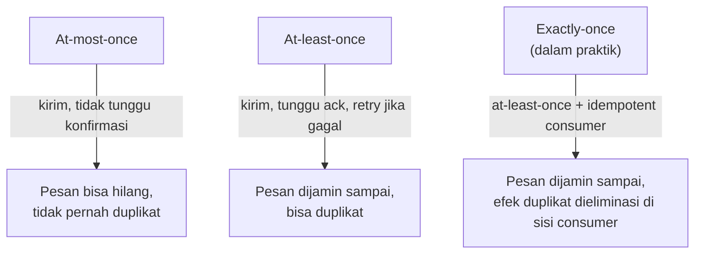

## TL;DR

Sistem pesan asinkron menjanjikan salah satu dari tiga jaminan pengiriman: **at-most-once** (pesan dikirim maksimal sekali, boleh hilang, tidak boleh duplikat), **at-least-once** (pesan dijamin sampai, tapi boleh terkirim lebih dari sekali), atau **exactly-once** (pesan sampai tepat sekali, tidak hilang, tidak duplikat). Kebanyakan sistem produksi berjalan di **at-least-once** karena itulah yang bisa dicapai secara jujur dengan biaya wajar — **exactly-once** yang sesungguhnya, ujung ke ujung melintasi jaringan yang bisa gagal kapan saja, adalah target yang secara teoritis nyaris mustahil dijamin sepenuhnya, dan yang biasa disebut "exactly-once" di dunia nyata sebenarnya adalah at-least-once yang dipasangkan dengan pemrosesan idempotent di sisi consumer.

## The Problem

Sebuah service pembayaran di sistem legal-services mengirim event "pembayaran berhasil" ke Kafka setiap kali transaksi selesai, dan consumer di sisi lain mencatat pembayaran itu ke buku besar (ledger) internal. Tim awalnya berasumsi Kafka menjamin "exactly-once" karena begitu yang mereka baca di beberapa artikel pengantar, dan menulis consumer yang langsung mencatat setiap pesan yang diterima tanpa pengecekan tambahan.

Suatu hari terjadi rebalancing di tengah pemrosesan (persis skenario di [[Consumer Groups and Rebalancing]]): consumer sempat mencatat pembayaran ke ledger, tapi belum sempat commit offset sebelum partition dialihkan ke consumer lain. Consumer baru membaca ulang pesan yang sama, dan mencatatnya **kedua kali** ke ledger — satu transaksi pembayaran tercatat dua kali, angka yang salah ini mengalir ke laporan keuangan. Asumsi "exactly-once itu bawaan Kafka" ternyata keliru: yang sebenarnya terjadi adalah at-least-once, dan tim tidak menyiapkan pertahanan terhadap kemungkinan pesan diterima lebih dari sekali.

## Intuition

Cara paling mudah memahaminya lewat tiga cara mengirim surat penting. **At-most-once** seperti mengirim surat tanpa tanda terima — kalau surat itu hilang di jalan, pengirim tidak pernah tahu, dan tidak ada usaha mengirim ulang. **At-least-once** seperti mengirim surat lewat kurir yang terus mencoba mengirim ulang sampai mendapat tanda terima — surat itu dijamin sampai, tapi kalau tanda terima hilang di jalan (bukan suratnya), kurir akan mengirim salinan surat yang sama sekali lagi, dan penerima menerima dua salinan surat yang identik. **Exactly-once** sungguhan berarti penerima dijamin menerima **tepat satu** salinan, tidak kurang tidak lebih — untuk mencapai ini di dunia surat-menyurat sungguhan, penerima sendiri harus mengenali "saya sudah pernah menerima surat ini" dan membuang salinan kedua yang datang, bukan kurirnya yang menjamin itu.

Analogi ini tidak benar-benar bocor di sini — justru inilah poin utamanya: exactly-once yang dipraktikkan sistem produksi hampir selalu adalah gabungan at-least-once (di level pengiriman) plus deteksi duplikat di sisi penerima, persis seperti penerima surat yang mengenali surat kedua sebagai salinan.

## How It Works



Diagram ini menekankan bahwa ketiga jaminan ini adalah trade-off antara kehilangan pesan dan duplikasi pesan — tidak ada jaminan yang menghindari keduanya sekaligus secara gratis di level infrastruktur murni. Sumber ketidakpastian intinya adalah **jaringan tidak bisa dipercaya sepenuhnya**: kalau consumer memproses pesan lalu mengirim acknowledgment, dan acknowledgment itu hilang di jaringan sebelum sampai ke broker, broker tidak tahu apakah consumer benar-benar sudah memproses atau belum — satu-satunya pilihan aman adalah mengirim ulang, yang berarti kemungkinan duplikasi selalu terbuka di setiap sistem yang memilih tidak kehilangan pesan.

**At-most-once** dicapai dengan commit offset **sebelum** memproses pesan — kalau pemrosesan gagal setelah commit, pesan itu tidak akan dicoba lagi, hilang secara permanen dari sudut pandang consumer itu. **At-least-once** dicapai dengan commit offset **setelah** memproses pesan berhasil — kalau consumer crash di antara pemrosesan dan commit, pesan itu diproses ulang oleh consumer berikutnya, pola yang sudah ditunjukkan di [[Consumer Groups and Rebalancing]].

## Under The Hood

Kafka menyediakan fitur bernama **exactly-once semantics (EOS)** lewat kombinasi idempotent producer (mencegah duplikasi akibat retry producer sendiri) dan transactional writes (memastikan menulis ke beberapa partition dan meng-commit offset terjadi sebagai satu operasi atomik). Ini menyelesaikan sebagian masalah — khususnya duplikasi yang berasal dari retry di sisi producer, dan konsistensi antara "pesan ditulis" dan "offset di-commit" dalam satu transaksi. Tapi EOS ini **berhenti di batas Kafka itu sendiri**: begitu consumer memproses pesan itu dan menghasilkan efek samping di luar Kafka (menulis ke database, memanggil API eksternal, mengirim email), jaminan exactly-once Kafka tidak lagi menjangkau efek samping itu — kegagalan setelah efek samping terjadi tapi sebelum commit offset tetap bisa menghasilkan efek samping ganda, persis problem di skenario ledger pembayaran di atas.

> [!question] Perlu diverifikasi
> Klaim: cakupan pasti fitur exactly-once semantics Kafka (idempotent producer + transactional API) dan versi Kafka minimum yang mendukungnya secara stabil.
> Kenapa ragu: detail konfigurasi (`enable.idempotence`, `transactional.id`) dan kematangan dukungan di client library non-Java (termasuk Go) bisa berbeda dan berubah antar versi.
> Cara verifikasi: dokumentasi resmi Kafka mengenai "Exactly Once Semantics" dan dokumentasi client library Go yang dipakai.

## In Go

```go
package main

import (
	"context"
	"fmt"
)

// prosesPembayaran mendemonstrasikan pola at-least-once yang aman:
// idempotency key (ID transaksi) dipakai untuk mendeteksi duplikat
// SEBELUM efek samping (mencatat ke ledger) dijalankan.
func prosesPembayaran(ctx context.Context, event EventPembayaran) error {
	sudahDiproses, err := ledgerRepo.SudahAdaTransaksi(ctx, event.TransaksiID)
	if err != nil {
		return fmt.Errorf("gagal memeriksa status transaksi %s: %w", event.TransaksiID, err)
	}
	if sudahDiproses {
		// Pesan ini duplikat (rebalancing, retry, atau apa pun
		// penyebabnya) — bukan error, cukup dilewati.
		return nil
	}

	if err := ledgerRepo.CatatTransaksi(ctx, event.TransaksiID, event.Jumlah); err != nil {
		return fmt.Errorf("gagal mencatat transaksi %s: %w", event.TransaksiID, err)
	}
	return nil
}
```

Pola ini — memeriksa apakah sebuah ID transaksi sudah pernah diproses sebelum menjalankan efek samping — adalah inti dari **idempotent consumer**, dibahas sebagai pola tersendiri di note berikutnya karena penerapannya lebih luas dari sekadar Kafka.

## In His Stack

Untuk sistem legal-services dengan kebutuhan akurasi tinggi (pencatatan status permohonan, pembayaran, audit trail), asumsikan setiap sistem pesan yang dipakai — Kafka, RabbitMQ, bahkan webhook HTTP dari partner eksternal — beroperasi di at-least-once, kecuali ada bukti eksplisit sebaliknya. Ini bukan pesimisme berlebihan; ini realita jaringan yang tidak bisa dipercaya sepenuhnya. Webhook dari partner yang dibahas di [[Webhooks and How to Secure Them]] punya masalah identik: partner yang timeout menunggu response akan mengirim ulang webhook yang sama, dan endpoint penerima harus menangani ini dengan cara yang sama persis seperti consumer Kafka menangani duplikasi dari rebalancing.

## Trade-offs and When Not To Use It

At-most-once masuk akal hanya untuk data yang benar-benar boleh hilang tanpa konsekuensi serius — metrik non-kritis, log debug volume tinggi di mana kehilangan sebagian kecil tidak masalah. Untuk hampir semua kasus di sistem legal-services (status permohonan, pembayaran, dokumen), kehilangan data jauh lebih berbahaya daripada memproses ulang — sehingga at-least-once plus idempotency di sisi consumer adalah default yang tepat, bukan pengecualian. Mengejar exactly-once murni di seluruh sistem (bukan hanya di dalam Kafka) hampir selalu berarti kompleksitas tambahan yang tidak sepadan dengan manfaatnya, dibanding cukup menerima at-least-once dan menangani duplikasi secara eksplisit di titik yang tepat.

## Common Mistakes

> [!warning] Jebakan
> Mempercayai istilah "exactly-once" dari dokumentasi vendor sistem pesan secara harfiah tanpa memeriksa batas cakupannya — hampir selalu jaminan itu berhenti di batas sistem pesan itu sendiri, tidak menjangkau efek samping di luar sistem itu (database, API eksternal).

> [!warning] Jebakan
> Menulis consumer yang menjalankan efek samping penting (mencatat transaksi, mengirim email) tanpa mekanisme deteksi duplikat, dengan asumsi "pesan hanya akan diterima sekali" — asumsi yang gagal tepat di momen rebalancing, retry, atau restart.

> [!warning] Jebakan
> Menganggap at-most-once "lebih aman" karena namanya terdengar konservatif — sebenarnya at-most-once adalah jaminan yang **membolehkan** kehilangan data, kebalikan dari aman untuk kebanyakan kasus penggunaan produksi.

## Exercises

1. Jelaskan kenapa "exactly-once" murni secara teoritis sulit dicapai ujung ke ujung melintasi jaringan yang tidak sepenuhnya bisa dipercaya.
2. Bandingkan urutan operasi (commit offset vs proses pesan) yang menghasilkan at-most-once dibanding at-least-once.
3. Sebuah tim mengklaim sistem mereka "exactly-once" karena memakai fitur exactly-once semantics Kafka. Jelaskan skenario konkret di mana klaim ini tetap bisa gagal kalau consumer menulis ke database eksternal.
4. **(Open-ended)** Sistem pencatatan pembayaran di skenario Masalah di atas sudah mengalami duplikasi akibat rebalancing. Rancang perbaikan lengkap: apa yang berubah di level desain database (ledger), di level kode consumer, dan bagaimana kamu memverifikasi perbaikan ini benar-benar mencegah duplikasi di masa depan, termasuk saat rebalancing terjadi lagi.

> [!success]- Kunci jawaban
> Untuk soal 4: di level database, tambahkan **unique constraint** pada kolom `transaksi_id` di tabel ledger — ini pertahanan terakhir yang mencegah duplikasi bahkan kalau logika aplikasi gagal mendeteksinya. Di level kode consumer, terapkan pola cek-sebelum-tulis seperti contoh Go di atas: periksa `SudahAdaTransaksi` sebelum `CatatTransaksi`, dan tangani error unique constraint violation dari database sebagai "duplikat terdeteksi, bukan error sungguhan" alih-alih membiarkan aplikasi crash. Untuk verifikasi, tulis test yang secara sengaja memproses pesan yang sama dua kali berturut-turut (mensimulasikan rebalancing) dan memastikan ledger tetap mencatat tepat satu entri untuk `transaksi_id` itu.

## Self-Check

- Sebutkan tiga jaminan pengiriman dan trade-off dasar masing-masing (kehilangan pesan vs duplikasi pesan).
- Kenapa "exactly-once" yang dipraktikkan sistem produksi biasanya sebenarnya at-least-once plus idempotency?
- Kenapa fitur exactly-once semantics Kafka tidak otomatis menjangkau efek samping di luar Kafka?

## Connected Notes

- [[Consumer Groups and Rebalancing]] — sumber konkret duplikasi pesan yang dibahas di note ini, terjadi tepat saat rebalancing memutus proses commit offset.
- [[Idempotent Consumers]] — kelanjutan langsung: pola penerapan yang membuat sistem aman terhadap duplikasi dari at-least-once delivery.
- [[Webhooks and How to Secure Them]] — masalah yang identik muncul di webhook HTTP dari partner eksternal, bukan hanya sistem pesan internal.
- [[The Transactional Outbox Pattern]] — pola yang memastikan penulisan database dan publish event terjadi atomik, mengurangi salah satu sumber inkonsistensi terkait delivery semantics.

## Further Reading

- Dokumentasi resmi Apache Kafka, bagian "Exactly Once Semantics": kafka.apache.org

## Catatan Saya

*Tulis pertanyaanmu sendiri, contoh kode dari pekerjaanmu, atau bagian yang belum jelas di sini.*
