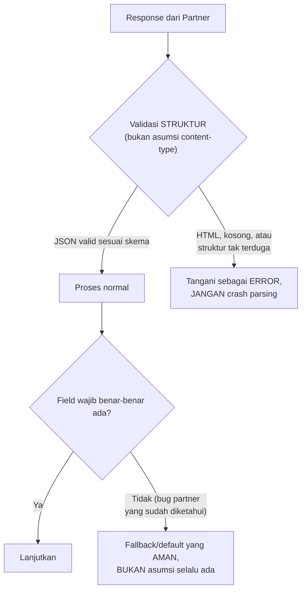

## TL;DR

Setiap prinsip desain API yang dibahas di note-note junior domain ini (REST, idempotency, versioning, error response konsisten) mengasumsikan **kamu** yang mendesain API dan mengontrol seluruh siklus hidupnya. Integrasi dengan partner eksternal — terutama instansi pemerintah atau enterprise dengan fleksibilitas teknis terbatas — membalik asumsi itu: kamu **tidak bisa** memaksa partner mengikuti standar terbaikmu, tidak bisa memaksa mereka upgrade, dan kadang tidak bisa memaksa mereka memperbaiki bug di sisi mereka sendiri. Desain integrasi yang baik dengan partner semacam ini bukan soal menerapkan praktik terbaik secara idealis, tapi soal **defensive design** — mengasumsikan hal-hal akan salah dari sisi yang tidak bisa kamu kontrol, dan merancang sistemmu supaya tetap benar meski begitu.

## The Problem

Sebuah tim merancang integrasi dengan sistem instansi lain dengan asumsi standar API modern (JSON, status code HTTP yang benar, response time yang konsisten) — realitanya, sistem partner mengembalikan `200 OK` untuk **semua** kondisi termasuk error (detail error ada di dalam body JSON, bukan status code), response time yang bervariasi liar (dari 200ms sampai 30 detik tanpa pola yang jelas), dan kadang mengembalikan HTML halaman error alih-alih JSON ketika sistem mereka mengalami gangguan internal. Kode yang ditulis dengan asumsi "partner akan berperilaku seperti API yang didesain dengan baik" gagal total menangani kenyataan ini — parsing JSON yang crash saat menerima HTML, logika yang menganggap `200 OK` selalu berarti sukses.

Masalah kedua yang lebih politis daripada teknis: sistem partner punya bug yang sudah diketahui (field tertentu kadang kosong padahal seharusnya selalu terisi), tapi permintaan perbaikan ke tim partner butuh waktu berbulan-bulan lewat proses birokrasi resmi (dan mungkin tidak pernah benar-benar diperbaiki karena sistem itu sendiri sudah legacy dan jarang disentuh). Tim yang berharap "nanti partner akan memperbaikinya" menunda solusi bertahun-tahun — solusi yang benar adalah menerima kenyataan itu sebagai **constraint permanen** dan merancang kode di sisi sendiri yang tangguh terhadap bug itu, bukan menunggu perbaikan yang mungkin tidak pernah datang.

## Intuition

Bayangkan merancang integrasi dengan partner yang tidak bisa dikontrol seperti **menerima tamu di rumahmu yang punya kebiasaan sendiri yang tidak bisa kamu ubah** — tamu itu mungkin datang di waktu yang tidak terduga (response time tidak konsisten), kadang membawa barang yang salah (data yang tidak sesuai skema yang dijanjikan), atau kadang tidak datang sama sekali tanpa pemberitahuan (downtime tanpa SLA yang jelas). Kamu tidak bisa mengubah kebiasaan tamu itu (tidak seperti anggota keluarga sendiri yang bisa diajak kompromi) — yang bisa kamu lakukan hanyalah menyiapkan rumahmu sendiri supaya tetap berfungsi baik apa pun yang tamu itu lakukan: kunci cadangan untuk kalau tamu lupa mengetuk pintu dengan benar, ruang tunggu untuk kalau tamu datang lebih awal dari jadwal.

Analogi ini bocor pada satu hal: tamu di rumah biasanya seorang individu yang bisa diajak bicara langsung untuk memahami kebiasaannya. Sistem partner sering adalah **institusi besar** dengan proses birokrasi sendiri — perubahan (bahkan yang sederhana) butuh waktu jauh lebih lama dan tidak bisa diselesaikan lewat percakapan informal, membuat "menunggu partner berubah" menjadi strategi yang hampir selalu lebih mahal dibanding merancang sistem sendiri yang defensif sejak awal.

## How It Works



**Prinsip defensive design konkret**:
- **Validasi struktur respons secara eksplisit**, jangan asumsikan format yang dijanjikan selalu benar-benar dikirim.
- **Jangan percaya status code HTTP secara membabi buta** kalau partner diketahui tidak mengikuti konvensi standar — periksa juga isi body untuk indikator error yang sesungguhnya.
- **Timeout dan retry yang generous tapi berbatas** (lihat [[Timeout Budgets]] dan [[Retries with Exponential Backoff and Jitter]]) — partner dengan response time tidak konsisten butuh toleransi lebih besar dibanding layanan internal, tapi tetap harus punya batas atas yang jelas.
- **Logging yang sangat detail** untuk setiap interaksi dengan partner (request dan response mentah) — karena bug partner sering hanya bisa dibuktikan lewat bukti konkret saat melapor ke mereka, bukan sekadar klaim "sistem kami menerima data yang salah".

## Under The Hood

**Anti-corruption layer** (istilah dari DDD, lihat [[../90 Architecture and Design/Lightweight DDD|Lightweight DDD]]) adalah pola arsitektural konkret untuk kasus ini — satu lapisan kode yang **secara eksklusif** menangani seluruh keanehan dan inkonsistensi partner (parsing yang toleran, normalisasi data yang bug, penanganan status code yang tidak standar), mengisolasi seluruh "kekotoran" itu di satu tempat, dan mengekspos data yang **bersih dan konsisten** ke logika bisnis inti — logika bisnis tidak pernah tahu atau peduli soal keanehan partner spesifik, hanya berurusan dengan model data yang sudah dibersihkan.

**Mendokumentasikan setiap keanehan yang ditemukan** (bukan sekadar menambal kode secara diam-diam) penting untuk keberlanjutan — developer lain (atau diri sendiri enam bulan kemudian) yang melihat kode penanganan kasus aneh tanpa komentar penjelasan akan bingung kenapa kode itu ada, dan berisiko menghapusnya saat refactoring karena terlihat seperti kode mati yang tidak perlu, padahal itu menangani bug nyata partner yang masih berlaku.

## In Go

```go
package partner

import (
	"context"
	"encoding/json"
	"fmt"
	"io"
	"net/http"
)

// KlienPartnerDefensif adalah ANTI-CORRUPTION LAYER — satu-satunya
// tempat yang tahu tentang keanehan sistem partner. Logika bisnis di
// luar package ini TIDAK PERNAH melihat response mentah partner.
type KlienPartnerDefensif struct {
	httpClient *http.Client
	baseURL    string
}

type DataPartnerBersih struct {
	NIK    string
	Status string
}

func (k *KlienPartnerDefensif) AmbilData(ctx context.Context, id string) (DataPartnerBersih, error) {
	req, err := http.NewRequestWithContext(ctx, http.MethodGet, k.baseURL+"/data/"+id, nil)
	if err != nil {
		return DataPartnerBersih{}, fmt.Errorf("buat request: %w", err)
	}

	resp, err := k.httpClient.Do(req)
	if err != nil {
		return DataPartnerBersih{}, fmt.Errorf("panggil partner: %w", err)
	}
	defer resp.Body.Close()

	body, err := io.ReadAll(resp.Body)
	if err != nil {
		return DataPartnerBersih{}, fmt.Errorf("baca body response: %w", err)
	}

	// JEBAKAN PARTNER #1: partner diketahui mengembalikan 200 OK bahkan
	// untuk error — periksa CONTENT-TYPE dan struktur, bukan hanya status code.
	if resp.Header.Get("Content-Type") != "application/json" {
		return DataPartnerBersih{}, fmt.Errorf("partner mengembalikan non-JSON (kemungkinan halaman error HTML), status=%d", resp.StatusCode)
	}

	var mentah struct {
		NIK      string `json:"nik"`
		Status   string `json:"status"`
		ErrorMsg string `json:"error_message"` // partner kadang isi field ini meski status 200
	}
	if err := json.Unmarshal(body, &mentah); err != nil {
		return DataPartnerBersih{}, fmt.Errorf("parse JSON partner gagal, body mentah: %s: %w", string(body), err)
	}

	// JEBAKAN PARTNER #2: error sesungguhnya ada di body, bukan status code.
	if mentah.ErrorMsg != "" {
		return DataPartnerBersih{}, fmt.Errorf("partner melaporkan error dalam body: %s", mentah.ErrorMsg)
	}

	// JEBAKAN PARTNER #3: field NIK kadang kosong karena bug yang SUDAH
	// DIKETAHUI di sisi partner (dilaporkan TIKET-PARTNER-55, belum
	// diperbaiki per 2026-07-29) — tangani secara eksplisit, JANGAN
	// asumsikan selalu terisi.
	if mentah.NIK == "" {
		return DataPartnerBersih{}, fmt.Errorf("partner mengembalikan NIK kosong (bug diketahui, lihat TIKET-PARTNER-55)")
	}

	return DataPartnerBersih{NIK: mentah.NIK, Status: mentah.Status}, nil
}
```

## In His Stack

Ini adalah salah satu bab paling relevan langsung dengan pekerjaan sehari-hari koordinator teknis lintas 13 aplikasi legal-services — integrasi dengan sistem instansi pemerintah lain sering mengharuskan bekerja dengan API yang tidak pernah didesain dengan standar modern (kadang API lama yang dibangun bertahun-tahun lalu, jarang di-maintain aktif). Membangun ekspektasi realistis di awal proyek (bukan berasumsi partner akan mengikuti praktik terbaik) dan mengalokasikan waktu ekstra untuk anti-corruption layer sejak perencanaan awal, bukan ditambal belakangan setelah insiden pertama terjadi, adalah investasi yang hampir selalu sepadan untuk integrasi jenis ini.

## Trade-offs and When Not To Use It

Membangun anti-corruption layer yang sangat defensif menambah kode dan waktu pengembangan yang signifikan — untuk integrasi dengan partner yang **benar-benar** mengikuti standar modern dan punya SLA yang jelas dan konsisten (API partner yang dikelola tim engineering profesional dengan dokumentasi baik), investasi defensive design seketat ini mungkin berlebihan. Tingkat "paranoia" desain harus proporsional dengan **track record nyata** partner tersebut — partner yang sudah terbukti punya banyak inkonsistensi masa lalu layak mendapat lapisan pertahanan yang lebih tebal dibanding partner baru yang belum ada riwayat masalah, meski tetap dengan kewaspadaan wajar karena riwayat baik tidak menjamin tidak akan pernah ada masalah di masa depan.

## Common Mistakes

> [!warning] Jebakan
> Mengasumsikan status code HTTP partner selalu mengikuti konvensi standar tanpa verifikasi — partner yang diketahui mengembalikan `200 OK` untuk error butuh pemeriksaan tambahan pada isi body, bukan hanya mempercayai status code.

> [!warning] Jebakan
> Menunggu partner memperbaiki bug yang sudah diketahui sebelum menambal kode di sisi sendiri — proses perbaikan di sisi partner (terutama institusi besar) sering butuh waktu jauh lebih lama dari yang diperkirakan, kadang tidak pernah benar-benar terjadi.

> [!warning] Jebakan
> Membiarkan keanehan penanganan partner tersebar di banyak tempat kode tanpa anti-corruption layer terpusat — menyulitkan pemeliharaan dan membuat logika bisnis inti tercemar detail spesifik satu partner yang seharusnya terisolasi.

## Exercises

1. Jelaskan apa itu anti-corruption layer, dan kenapa pola ini penting khususnya untuk integrasi dengan partner yang tidak bisa dikontrol.
2. Kenapa "menunggu partner memperbaiki bug mereka" sering menjadi strategi yang buruk untuk sistem legal-services pemerintah?
3. Kenapa mendokumentasikan keanehan partner yang ditemukan (bukan sekadar menambalnya diam-diam) penting untuk keberlanjutan kode?
4. Desain terbuka: kamu baru memulai integrasi dengan sistem instansi baru yang belum punya riwayat masalah apa pun (integrasi pertama kali). Rancang strategi defensive design yang proporsional untuk kasus ini — seberapa "paranoid" desainmu di awal, dan bagaimana kamu akan menyesuaikan tingkat pertahanan seiring waktu berdasarkan pengalaman nyata yang terkumpul.

> [!success]- Kunci jawaban
> **1.** Anti-corruption layer adalah satu lapisan kode terisolasi yang secara eksklusif menangani seluruh keanehan dan bug sistem partner, mengekspos data yang sudah dibersihkan dan konsisten ke logika bisnis inti. Ini penting untuk partner yang tidak bisa dikontrol karena keanehan mereka (bug, ketidakkonsistenan format) adalah **constraint permanen** yang harus ditangani terus-menerus, bukan masalah sementara yang akan hilang — mengisolasi penanganan ini di satu tempat mencegah "kekotoran" partner menyebar ke seluruh basis kode dan mencemari logika bisnis yang seharusnya murni.
> **4.** Untuk partner baru tanpa riwayat masalah, desain awal yang wajar: terapkan defensive design **level dasar** yang masuk akal untuk integrasi eksternal mana pun (validasi struktur respons, timeout yang jelas, logging detail request/response) tanpa perlu menduga-duga bug spesifik yang belum tentu ada. Seiring waktu, setiap kali ditemukan perilaku aneh atau bug nyata dari partner ini, dokumentasikan secara eksplisit (mirip komentar `TIKET-PARTNER-55` di contoh kode) dan tambahkan penanganan spesifik untuk kasus itu — anti-corruption layer yang berkembang **organik** berdasarkan pengalaman nyata, bukan dibangun penuh dengan asumsi masalah yang mungkin tidak pernah benar-benar terjadi untuk partner spesifik ini. Pendekatan ini menghindari over-engineering di awal sambil tetap memberi jalur jelas menambah pertahanan begitu masalah nyata mulai ditemukan.

## Self-Check

- Apa itu anti-corruption layer, dan kenapa relevan untuk integrasi dengan partner yang tidak bisa dikontrol?
- Kenapa mempercayai status code HTTP secara membabi buta berisiko untuk partner tertentu?
- Kenapa menunggu partner memperbaiki bug mereka sering bukan strategi yang baik?
- Bagaimana tingkat "paranoia" defensive design sebaiknya disesuaikan dengan track record partner?

## Connected Notes

- [[Consistent Error Responses]] — kontras langsung: API yang kamu desain sendiri bisa menegakkan format error konsisten, sementara API partner yang tidak bisa dikontrol sering tidak mengikuti konvensi itu sama sekali.
- [[Contract Negotiation and Versioning]] — kelanjutan langsung: bagaimana menyepakati kontrak dengan partner yang keterbatasannya sudah dipahami di note ini, dibahas di note berikutnya.
- [[../90 Architecture and Design/Lightweight DDD|Lightweight DDD]] — anti-corruption layer adalah istilah dan konsep yang berasal dari DDD, dijelaskan konteks lebih luasnya di note itu.
- [[Handling an Unreliable Counterparty]] — kelanjutan tema partner yang tidak bisa diandalkan, fokus pada pola menangani kegagalan dan kelambatan, dibahas di note lain domain ini.
- [[Timeout Budgets]] dan [[Retries with Exponential Backoff and Jitter]] — mekanisme konkret menangani response time partner yang tidak konsisten, dibahas mendalam di note lain domain ini.

## Further Reading

- Eric Evans, "Domain-Driven Design" — sumber konsep anti-corruption layer, dalam konteks integrasi antar bounded context yang tidak sepenuhnya bisa diselaraskan.

## Catatan Saya

*Tulis di sini keanehan paling mengganggu dari salah satu partner integrasi di kerjaanmu, dan bagaimana (atau apakah) itu sudah ditangani lewat anti-corruption layer yang jelas.*
