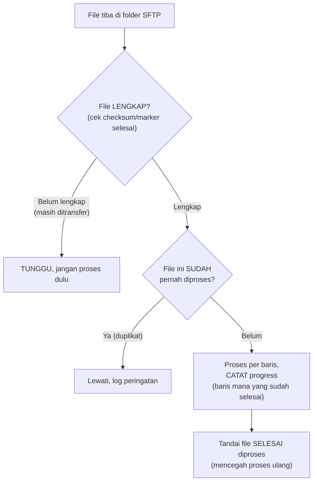

## TL;DR

Sebagian partner — terutama instansi pemerintah dengan sistem yang sudah berumur puluhan tahun — tidak punya API sama sekali, hanya pertukaran **file** (CSV, fixed-width text, atau bahkan Excel) lewat SFTP atau email terjadwal. Ini bukan "cara lama yang harus dihindari" secara mutlak — untuk beberapa konteks (laporan batch harian, rekonsiliasi data bulanan), file-based integration tetap menjadi metode yang **andal dan dipahami luas**, meski terasa kuno dibanding REST API modern. Tantangan sesungguhnya bukan menolak pendekatan ini, tapi membuatnya **reliable** — memastikan file benar-benar terkirim lengkap, terbaca dengan benar, dan setiap baris diproses tepat sekali meski proses bisa gagal di tengah jalan.

## The Problem

Sebuah instansi mengirim file CSV berisi data permohonan yang perlu diproses setiap hari lewat SFTP, tapi proses transfer file kadang terputus di tengah jalan (jaringan tidak stabil), menghasilkan file yang **terpotong** — sistem penerima yang langsung memproses file begitu terlihat di folder SFTP tanpa memverifikasi keutuhannya bisa memproses data yang tidak lengkap sebagai data valid, menghasilkan sebagian permohonan yang "hilang" dari pemrosesan tanpa ada kesalahan yang terlihat jelas (proses tetap "berhasil" menyelesaikan file yang sebenarnya terpotong).

Masalah kedua: sebuah proses pembacaan file yang crash di tengah pemrosesan baris ke-5000 dari 10000 baris tidak punya cara mengetahui baris mana saja yang sudah berhasil diproses sebelum crash — menjalankan ulang seluruh file dari awal berarti 5000 baris pertama diproses **dua kali** (kalau tidak idempotent, ini menciptakan duplikasi data), sementara melewati file itu sepenuhnya berarti kehilangan 5000 baris yang belum sempat diproses sama sekali.

## Intuition

Bayangkan file-based integration seperti **menerima kiriman paket fisik lewat kurir**, bukan menerima barang langsung dari tangan ke tangan (API real-time). Paket kiriman butuh verifikasi tambahan yang tidak diperlukan serah terima langsung: memeriksa segel paket masih utuh (verifikasi checksum/keutuhan file), memeriksa isi sesuai daftar yang tertera di label pengiriman (validasi jumlah baris sesuai yang diharapkan), dan mencatat "paket ini sudah diterima" supaya kurir yang sama tidak mengirim ulang paket yang **sama persis** di kemudian hari tanpa disadari (deteksi file duplikat).

Analogi ini bocor pada satu hal: paket fisik yang rusak di jalan biasanya jelas terlihat rusak secara visual. File yang terpotong atau korup di tengah transfer **tidak selalu terlihat jelas** — file itu mungkin tetap terbuka sebagai CSV valid secara sintaks (dibaca tanpa error), hanya isinya yang tidak lengkap dibanding yang seharusnya, sebuah kerusakan yang jauh lebih sulit dideteksi tanpa mekanisme verifikasi eksplisit (checksum, jumlah baris yang diharapkan) dibanding kerusakan fisik yang terlihat mata telanjang.

## How It Works



**Teknik verifikasi keutuhan file yang umum**: **file marker terpisah** (partner mengirim file `data.csv` **dan** file `data.csv.done` yang hanya muncul setelah transfer `data.csv` benar-benar selesai — sistem penerima hanya memproses file yang punya marker `.done`, bukan langsung memproses begitu `data.csv` terlihat); **checksum eksplisit** (partner menyertakan hash MD5/SHA di nama file atau file terpisah, dibandingkan dengan hash file yang benar-benar diterima); **jumlah baris di header/footer** (file menyertakan baris pertama/terakhir yang menyatakan "total 10000 baris", diverifikasi setelah membaca file lengkap).

## Under The Hood

**Memproses per baris dengan pencatatan progress** adalah kunci menangani kegagalan di tengah pemrosesan file besar — alih-alih memproses seluruh file dalam satu transaksi besar (yang kalau gagal harus diulang seluruhnya dari awal), sistem mencatat **nomor baris terakhir yang berhasil diproses** secara berkala, memungkinkan resume dari titik itu kalau proses terhenti karena crash. Kombinasi ini dengan idempotency di level baris (memeriksa apakah data baris itu sudah pernah disimpan sebelum benar-benar menyimpannya) memberi ketahanan ganda — bahkan kalau pencatatan progress sendiri sedikit meleset, pemrosesan ulang beberapa baris tidak menciptakan duplikasi karena baris itu sendiri terdeteksi sudah pernah diproses.

**Penamaan file dengan timestamp/sequence eksplisit** (`permohonan_20260729_001.csv`, bukan `permohonan.csv` yang ditimpa setiap hari) mencegah ambiguitas soal file mana yang sudah dan belum diproses, dan memudahkan audit trail — bisa ditelusuri file spesifik mana yang menghasilkan data tertentu, kebutuhan yang relevan untuk sistem yang butuh jejak audit yang jelas.

## In Go

```go
package fileintegration

import (
	"bufio"
	"context"
	"crypto/sha256"
	"encoding/hex"
	"fmt"
	"io"
	"os"
)

// VerifikasiChecksum memastikan file BENAR-BENAR lengkap sebelum
// diproses — mencegah pemrosesan file yang terpotong akibat transfer
// yang terputus di tengah jalan.
func VerifikasiChecksum(pathFile, checksumDiharapkan string) error {
	f, err := os.Open(pathFile)
	if err != nil {
		return fmt.Errorf("buka file: %w", err)
	}
	defer f.Close()

	h := sha256.New()
	if _, err := io.Copy(h, f); err != nil {
		return fmt.Errorf("hitung checksum: %w", err)
	}

	checksumSebenarnya := hex.EncodeToString(h.Sum(nil))
	if checksumSebenarnya != checksumDiharapkan {
		return fmt.Errorf("checksum tidak cocok: file mungkin terpotong atau korup (diharapkan %s, dapat %s)", checksumDiharapkan, checksumSebenarnya)
	}
	return nil
}

// ProsesFileDenganProgress memproses baris satu per satu, mencatat
// nomor baris terakhir yang berhasil — memungkinkan RESUME dari titik
// kegagalan, bukan mengulang seluruh file dari awal.
func ProsesFileDenganProgress(ctx context.Context, pathFile string, barisTerakhirDiproses int, prosesBaris func(baris string) error, simpanProgress func(nomorBaris int) error) error {
	f, err := os.Open(pathFile)
	if err != nil {
		return fmt.Errorf("buka file: %w", err)
	}
	defer f.Close()

	scanner := bufio.NewScanner(f)
	nomorBaris := 0

	for scanner.Scan() {
		nomorBaris++
		if nomorBaris <= barisTerakhirDiproses {
			continue // LEWATI baris yang sudah diproses sebelum crash
		}

		if err := prosesBaris(scanner.Text()); err != nil {
			return fmt.Errorf("proses baris %d: %w", nomorBaris, err)
		}

		if err := simpanProgress(nomorBaris); err != nil {
			return fmt.Errorf("simpan progress baris %d: %w", nomorBaris, err)
		}
	}
	return scanner.Err()
}
```

## In His Stack

File-based integration lewat SFTP tetap menjadi metode utama pertukaran data dengan banyak instansi pemerintah yang sistemnya belum modernisasi API — ini bukan kegagalan teknis yang harus "diperbaiki" secara sepihak, tapi realita operasional yang harus ditangani dengan reliabilitas yang sama seriusnya seperti integrasi API modern. Verifikasi checksum dan pencatatan progress yang dibahas di note ini seringkali menjadi selisih antara proses batch yang "kadang aneh datanya" dan yang benar-benar bisa diandalkan, terutama untuk data yang berdampak pada keputusan legal/administratif.

## Trade-offs and When Not To Use It

File-based integration secara inheren punya jeda yang lebih besar dibanding API real-time (file biasanya dikirim terjadwal — harian, mingguan — bukan seketika saat data berubah) dan butuh infrastruktur tambahan (server SFTP, proses monitoring folder) yang tidak dibutuhkan integrasi API langsung. Untuk kebutuhan yang benar-benar butuh data real-time, file-based integration adalah pilihan yang salah — tapi untuk kebutuhan rekonsiliasi batch, laporan periodik, atau partner yang memang hanya menyediakan opsi ini, memaksakan migrasi ke API (yang mungkin tidak pernah terwujud, lihat [[Designing an API for a Partner You Do Not Control]]) kurang produktif dibanding menerima kenyataan ini dan membangun reliabilitas di sekitarnya.

## Common Mistakes

> [!warning] Jebakan
> Memproses file segera setelah terlihat di folder SFTP tanpa verifikasi keutuhan — file yang masih dalam proses transfer (belum selesai sepenuhnya) bisa diproses sebagai data lengkap yang sebenarnya terpotong.

> [!warning] Jebakan
> Memproses seluruh file dalam satu transaksi besar tanpa pencatatan progress per baris — kegagalan di tengah proses memaksa mengulang dari awal, berisiko duplikasi data kalau prosesnya tidak sepenuhnya idempotent.

> [!warning] Jebakan
> Menimpa nama file yang sama setiap periode (`data.csv` yang selalu sama) alih-alih menyertakan timestamp/sequence eksplisit — menyulitkan audit trail dan deteksi file yang sudah/belum diproses.

## Exercises

1. Jelaskan kenapa file yang terpotong akibat transfer terputus bisa lebih sulit dideteksi dibanding kerusakan yang terlihat jelas.
2. Sebutkan dua teknik verifikasi keutuhan file sebelum diproses, dan jelaskan cara kerjanya masing-masing.
3. Kenapa mencatat progress per baris penting untuk file berukuran besar, dibanding memproses seluruh file dalam satu transaksi?
4. Desain terbuka: partner mengirim file CSV berisi 50.000 baris data permohonan setiap malam lewat SFTP, dan proses pemrosesan pernah crash di tengah jalan beberapa kali karena masalah infrastruktur yang tidak terduga. Rancang sistem pemrosesan file yang tangguh terhadap kegagalan ini, mencakup verifikasi keutuhan file, penanganan resume setelah crash, dan deteksi file duplikat.

> [!success]- Kunci jawaban
> **1.** File yang terpotong tetap bisa menjadi CSV yang **valid secara sintaks** — parser CSV tidak akan mengeluh sama sekali kalau file berhenti di tengah baris terakhir yang lengkap, ia hanya akan membaca lebih sedikit baris dari yang seharusnya ada. Tidak ada error yang terlihat jelas, hanya data yang secara diam-diam kurang lengkap — berbeda dari kerusakan fisik yang langsung terlihat rusak, kerusakan file logis semacam ini butuh verifikasi eksplisit (checksum, jumlah baris yang diharapkan) untuk terdeteksi sama sekali.
> **4.** Sistem yang tangguh: (1) partner (atau proses transfer) menghasilkan file `data_20260729.csv` **dan** file marker `data_20260729.csv.done` yang hanya dibuat setelah transfer selesai sepenuhnya — proses pemrosesan hanya memicu diri begitu melihat file `.done`, bukan langsung memproses `data_20260729.csv` yang terlihat; (2) sebelum memproses, verifikasi checksum file terhadap nilai yang disertakan (di file terpisah atau di nama file itu sendiri) untuk memastikan tidak ada korupsi data; (3) cek tabel/log "file yang sudah diproses" berdasarkan nama file unik (yang menyertakan tanggal) — kalau `data_20260729.csv` sudah tercatat selesai diproses sebelumnya, lewati (mencegah pemrosesan duplikat kalau file yang sama entah bagaimana muncul lagi); (4) proses baris satu per satu, catat nomor baris terakhir yang berhasil ke database secara berkala (misalnya setiap 100 baris, bukan setiap baris untuk mengurangi overhead) — kalau proses crash, restart membaca dari nomor baris terakhir yang tercatat, bukan dari awal; (5) setelah seluruh baris selesai diproses, tandai file ini sebagai selesai di tabel pelacakan, mencegah pemrosesan ulang di masa depan.

## Self-Check

- Kenapa file yang terpotong bisa lolos sebagai CSV yang valid secara sintaks?
- Sebutkan dua teknik verifikasi keutuhan file sebelum diproses.
- Kenapa pencatatan progress per baris penting untuk file besar?
- Kenapa penamaan file dengan timestamp eksplisit lebih baik dibanding nama tetap yang ditimpa setiap periode?

## Connected Notes

- [[Polling vs Push]] — file-based integration adalah bentuk lain integrasi yang tidak real-time, melengkapi spektrum polling-push yang dibahas di note sebelumnya.
- [[Batch vs Realtime Integration]] — file-based integration hampir selalu bersifat batch, berkaitan langsung dengan keputusan ritme integrasi yang dibahas di note berikutnya.
- [[Idempotency]] — pemrosesan baris yang idempotent adalah pertahanan kunci terhadap risiko duplikasi saat resume setelah crash.
- [[../40 Databases/Database Migrations|Database Migrations]] — konsep resume dari titik kegagalan (bukan mengulang dari awal) juga relevan untuk migrasi data besar, dibahas di note domain database.
- [[Handling an Unreliable Counterparty]] — file-based integration sering menjadi konteks konkret di mana partner tidak sepenuhnya andal, dibahas lebih luas di note lain domain ini.

## Further Reading

- Materi umum tentang pola transfer file yang andal (checksum, atomic file operations, marker file) — dipraktikkan luas di industri integrasi data lintas sistem sebagai konvensi umum, bukan satu standar tunggal.

## Catatan Saya

*Tulis di sini apakah ada integrasi file-based di kerjaanmu yang pernah bermasalah karena file terpotong atau proses yang crash di tengah jalan.*
