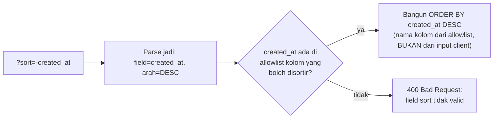

## TL;DR

Filtering (`?status=pending&created_after=2026-01-01`) dan sorting (`?sort=-created_at,status`) butuh **konvensi query parameter yang konsisten** lintas semua endpoint collection — bukan diciptakan ad hoc per endpoint. Yang jauh lebih kritis dari sekadar konsistensi: field yang boleh dipakai untuk filter dan sort **wajib** divalidasi lewat allowlist eksplisit di sisi server, karena parameter sort yang diteruskan mentah-mentah ke klausa `ORDER BY` adalah vektor SQL injection yang berbeda dari injection lewat *value* biasa — parameterized query yang biasa mengamankan *value* tidak otomatis mengamankan *nama kolom* atau *arah pengurutan*.

## The Problem

Bayangkan sebuah API punya satu endpoint yang menerima `?filterStatus=pending`, endpoint lain yang menerima `?state=pending`, dan endpoint ketiga yang menerima sorting lewat `?orderBy=field:asc` sementara yang lain lewat `?sort=-field`. Tim integrasi partner harus menulis logic parsing yang berbeda untuk setiap endpoint alih-alih satu klien generik yang bisa dipakai ulang — setiap integrasi baru berarti membaca dokumentasi detail per endpoint, meningkatkan biaya dan risiko kesalahan integrasi.

Masalah yang jauh lebih serius muncul kalau sebuah endpoint menerima parameter `?sort=nama_kolom` dan langsung menyisipkannya ke SQL sebagai `ORDER BY ` + nama_kolom mentah-mentah, dengan asumsi "kan cuma nama kolom untuk sorting, bukan value yang bisa disuntik". Ini asumsi yang keliru: karena nama kolom dan arah pengurutan (`ASC`/`DESC`) adalah bagian **struktural** dari query, bukan *value* yang bisa diikat lewat placeholder parameterized query biasa, seseorang yang mengirim `?sort=id; DROP TABLE permohonan;--` (tergantung driver dan cara string itu disusun ke query) berpotensi membuka celah SQL injection yang sepenuhnya berbeda dari yang biasa dicegah lewat prepared statement untuk *value* (lihat [[../80 Security/SQL Injection|SQL Injection]]).

## Intuition

Bayangkan konvensi filter dan sort seperti **formulir bea cukai standar yang sama di setiap pos perbatasan** — pedagang (client/partner) yang sudah belajar mengisi formulir itu sekali bisa memakainya di pos perbatasan mana pun, tanpa perlu belajar formulir baru setiap kali.

Analogi "formulir standar" ini bocor pada soal bagaimana ancaman itu bekerja. Formulir kertas yang diisi asal-asalan biasanya langsung terlihat mencurigakan oleh petugas manusia. Parameter `sort` yang diteruskan mentah-mentah ke SQL **tidak "terlihat" sebagai mencurigakan** oleh database — ia hanya dieksekusi sebagai bagian dari struktur query. Ini kenapa nasihat umum "pakai parameterized query, aman dari SQL injection" **tidak otomatis berlaku** untuk nama kolom atau arah sorting — keduanya perlu pengamanan berbeda: validasi lewat allowlist, bukan parameterisasi.

## How It Works

Konvensi yang umum dan konsisten:

- **Filter kesetaraan**: `?status=pending`
- **Filter rentang**: `?created_after=2026-01-01&created_before=2026-02-01`
- **Sort**: `?sort=-created_at,status` (`-` di depan berarti descending; koma memisahkan beberapa kunci sort)

Di sisi server, setiap field yang boleh dipakai untuk filter dan sort **wajib** dipetakan lewat allowlist eksplisit — bukan diterima mentah dari client:



## In Go

```go
// Allowlist eksplisit: hanya field di sini yang boleh dipakai untuk sort,
// dan nama kolom SQL sesungguhnya TIDAK PERNAH diambil langsung dari input client.
var sortableFields = map[string]string{
    "created_at": "created_at",
    "status":     "status",
    "nama":       "nama_pemohon",
}

func parseSortParam(raw string) (kolom string, desc bool, err error) {
    if raw == "" {
        return "created_at", false, nil // default
    }
    desc = strings.HasPrefix(raw, "-")
    field := strings.TrimPrefix(raw, "-")

    kolomSQL, ok := sortableFields[field]
    if !ok {
        return "", false, fmt.Errorf("field sort %q tidak diizinkan", field)
    }
    return kolomSQL, desc, nil
}

func listPermohonan(w http.ResponseWriter, r *http.Request) {
    kolom, desc, err := parseSortParam(r.URL.Query().Get("sort"))
    if err != nil {
        http.Error(w, err.Error(), http.StatusBadRequest)
        return
    }

    arah := "ASC"
    if desc {
        arah = "DESC"
    }
    // kolom dan arah berasal dari allowlist yang sudah divalidasi,
    // AMAN disisipkan langsung ke struktur query.
    query := fmt.Sprintf("SELECT id, created_at, status FROM permohonan ORDER BY %s %s LIMIT ?", kolom, arah)
    // ... eksekusi query ...
    _ = query
}
```

Karena `kolom` dan `arah` di titik ini **sudah dijamin** berasal dari allowlist yang divalidasi (bukan string mentah dari client), menyisipkannya langsung ke `fmt.Sprintf` untuk membangun klausa `ORDER BY` aman dilakukan — sesuatu yang **tidak pernah** boleh dilakukan untuk *value* filter biasa (yang tetap harus lewat placeholder parameterized).

## In His Stack

**Yii2** dengan class `\yii\data\Sort` sebenarnya sudah menerapkan pola allowlist ini secara bawaan — properti `$sort->attributes` membatasi field mana saja yang boleh dipakai untuk sorting, mencegah nama kolom mentah dari request langsung dipakai membangun query. Kebiasaan baik ini sering "gratis" didapat di Yii2 karena sudah jadi bagian framework — tapi begitu menulis handler Go dari nol tanpa framework yang menyediakan pola ini secara default, disiplin yang sama harus dibangun secara eksplisit, seperti dicontohkan di atas.

## Trade-offs and When Not To Use It

Filter dan sort yang kaya (banyak operator rentang, banyak kombinasi field) memberi fleksibilitas lebih besar bagi konsumen API, tapi menambah permukaan validasi dan risiko performa — kombinasi filter yang terlalu bebas pada kolom yang tidak di-index bisa memicu full table scan pada tabel besar (lihat [[../40 Databases/Index Basics|Index Basics]]), sebuah risiko resource exhaustion meski bukan celah keamanan. Untuk endpoint dengan traffic tinggi, batasi filter dan sort hanya pada kolom yang benar-benar sudah di-index, dan dokumentasikan batasan itu eksplisit ke konsumen API.

## Common Mistakes

> [!warning] Jebakan
> Menciptakan konvensi filter/sort yang berbeda-beda per endpoint tanpa standar tim yang jelas, meningkatkan biaya integrasi setiap klien baru yang harus mempelajari pola unik masing-masing endpoint.

> [!warning] Jebakan
> Menyisipkan nama kolom atau arah sorting dari input client langsung ke query SQL tanpa allowlist, dengan asumsi keliru bahwa ini "aman karena bukan value seperti SQL injection biasa". Ini adalah vektor SQL injection struktural yang tidak dicegah oleh parameterized query untuk value.

> [!warning] Jebakan
> Mengizinkan filter pada kolom yang tidak di-index tanpa batasan, membuka kemungkinan konsumen API (sengaja atau tidak) memicu query yang sangat lambat pada tabel besar.

## Exercises

1. Kenapa parameterized query yang mengamankan *value* tidak otomatis mengamankan nama kolom yang dipakai untuk `ORDER BY`?
2. Apa fungsi allowlist di sisi server untuk field filter/sort?
3. Kenapa konvensi filter/sort yang tidak konsisten antar endpoint meningkatkan biaya integrasi partner?
4. Desain terbuka: sebuah tim ingin memberi partner kemampuan memfilter daftar permohonan berdasarkan kombinasi field yang cukup fleksibel (status, rentang tanggal, jenis layanan) tanpa membuka risiko performa atau keamanan. Rancang desain allowlist dan validasi yang menyeimbangkan fleksibilitas untuk partner dengan keamanan dan performa sistem.

> [!success]- Kunci jawaban
> Definisikan allowlist eksplisit yang memetakan setiap parameter filter publik (misalnya `status`, `created_after`, `jenis_layanan`) ke ekspresi SQL yang aman dan sudah dipastikan memakai index yang sesuai — tolak (`400 Bad Request`) permintaan filter pada field yang tidak ada di allowlist ini, dengan pesan jelas menyebutkan field mana yang didukung. Untuk kombinasi filter yang berpotensi mahal (misalnya rentang tanggal yang sangat luas dikombinasikan dengan filter lain), pertimbangkan menambah batas wajar (misalnya rentang tanggal maksimal setahun) yang didokumentasikan eksplisit ke partner, bukan membiarkan kombinasi bebas tanpa batas. Dokumentasikan seluruh allowlist ini di [[OpenAPI]] supaya partner tahu persis field mana yang didukung tanpa perlu trial-and-error.

## Self-Check

- Kenapa parameter sort butuh allowlist, bukan sekadar parameterized query biasa?
- Apa risiko filter pada kolom yang tidak di-index?
- Kenapa konsistensi konvensi filter/sort penting untuk biaya integrasi partner?
- Bagaimana Yii2 secara bawaan sudah menerapkan pola allowlist untuk sorting?

## Connected Notes

- [[Resource Modelling]] dan [[Pagination - Offset vs Cursor]] — filter dan sort selalu bekerja berdampingan dengan pagination pada endpoint collection.
- [[../80 Security/SQL Injection|SQL Injection]] — pembahasan penuh kelas kerentanan yang disinggung di note ini, termasuk vektor struktural seperti nama kolom.
- [[../40 Databases/Index Basics|Index Basics]] — index yang menentukan apakah filter pada kolom tertentu aman secara performa.
- [[OpenAPI]] — dokumentasi allowlist filter/sort sebagai bagian dari kontrak API yang jelas ke konsumen.

## Further Reading

- Dokumentasi resmi package `database/sql` (pkg.go.dev/database/sql) soal parameterized query, dan mengapa itu tidak mencakup identifier seperti nama kolom.

## Catatan Saya

*Tulis di sini endpoint di kerjaanmu yang menerima parameter sort/filter, dan apakah field yang diizinkan sudah divalidasi lewat allowlist.*
