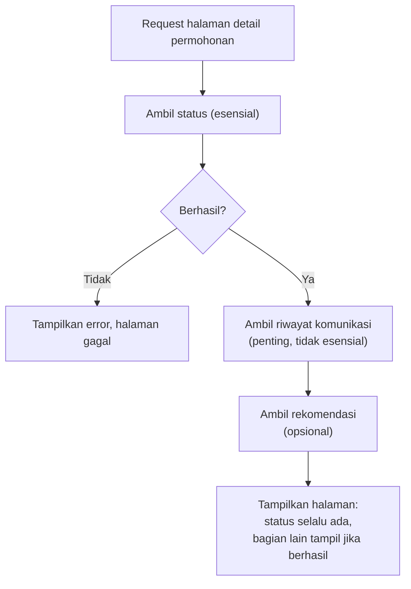

## TL;DR

**Graceful degradation** berarti merancang sistem yang tetap memberikan **sebagian** nilai kepada pengguna ketika sebuah komponen gagal, alih-alih semua-atau-tidak-sama-sekali — menampilkan data cache yang sedikit basi ketika database utama lambat, menyembunyikan fitur rekomendasi yang bergantung pada layanan yang sedang down sambil tetap menampilkan konten utama, atau menerima permohonan tanpa verifikasi instan ketika layanan verifikasi bermasalah, memprosesnya belakangan begitu layanan itu pulih. Ini adalah penutup alami dari seluruh pola resiliensi yang dibahas sebelumnya di domain ini — [[Circuit Breakers]], [[Bulkheads]], [[Load Shedding]] semuanya menjawab "bagaimana mendeteksi dan membatasi kegagalan", sementara graceful degradation menjawab pertanyaan berikutnya yang sama pentingnya: "apa yang ditampilkan ke pengguna setelah kegagalan itu terdeteksi?"

## The Problem

Halaman detail permohonan di sistem legal-services menampilkan tiga hal sekaligus dalam satu request: status permohonan (dari database utama), riwayat komunikasi dengan petugas (dari layanan pesan terpisah), dan rekomendasi dokumen tambahan yang mungkin dibutuhkan (dari layanan rekomendasi berbasis machine learning yang relatif baru dan belum sepenuhnya stabil). Kode awal menulis ketiganya sebagai satu alur sekuensial: gagal mengambil salah satu dari ketiganya, seluruh halaman gagal ditampilkan dengan pesan error generik.

Ketika layanan rekomendasi — fitur tambahan yang secara bisnis "nice to have", bukan esensial — mengalami downtime singkat, seluruh halaman detail permohonan ikut tidak bisa diakses, termasuk informasi status permohonan yang justru **paling penting** bagi pemohon dan sepenuhnya independen dari layanan rekomendasi yang bermasalah. Kegagalan komponen paling tidak kritis di halaman itu berhasil menghalangi akses ke informasi paling kritis, hanya karena keduanya digabung dalam satu alur yang gagal sepenuhnya kalau satu bagian saja gagal.

## Intuition

Cara paling mudah memahaminya lewat mobil modern yang kehilangan tenaga power steering. Mobil dengan power steering yang gagal tidak berhenti berfungsi sama sekali sebagai kendaraan — setirnya menjadi jauh lebih berat untuk diputar, tapi mobil **masih bisa dikemudikan** untuk sampai ke tujuan atau ke bengkel terdekat. Ini beda jauh dari mobil yang mati total begitu satu komponen non-esensial rusak. Graceful degradation di software mengikuti prinsip yang sama: identifikasi komponen mana yang benar-benar esensial (mesin, rem) dan mana yang memperkaya pengalaman tapi bukan penentu fungsi inti (power steering, AC), lalu rancang sistem supaya kegagalan komponen non-esensial tidak pernah menghalangi komponen esensial.

Analogi ini berhenti bekerja pada satu titik: mobil punya batas fisik yang jelas antara "komponen esensial" dan "komponen kenyamanan", ditentukan oleh hukum fisika mengemudi. Software tidak punya batas yang sejelas itu secara otomatis — menentukan mana yang esensial dan mana yang bisa dilepas saat degradasi adalah **keputusan desain sadar** yang harus dibuat tim, sering kali melibatkan diskusi produk, bukan sekadar keputusan teknis murni.

## How It Works



Diagram ini menunjukkan struktur inti graceful degradation: komponen diurutkan berdasarkan **esensialitas**, dan kegagalan komponen non-esensial tidak pernah menghentikan penyajian komponen esensial yang sudah berhasil diambil. Beberapa pola konkret yang mewujudkan ini:

**Stale-while-revalidate** — menampilkan data cache yang sedikit basi ketika sumber data utama lambat atau gagal, alih-alih menunggu atau menampilkan error. Trade-off antara kesegaran data dan ketersediaan, dibuat sadar berdasarkan seberapa penting kesegaran data itu untuk kasus penggunaannya.

**Feature flag darurat** — kemampuan mematikan fitur tertentu secara manual atau otomatis (dipicu oleh circuit breaker) ketika layanan pendukungnya bermasalah, tanpa perlu deployment baru untuk melakukannya.

**Fallback ke fungsi lebih sederhana** — pencarian dengan relevansi berbasis machine learning yang jatuh ke pencarian berbasis kata kunci sederhana ketika layanan ML bermasalah; hasil kurang relevan, tapi pencarian tetap berfungsi.

## In Go

```go
package main

import (
	"context"
	"fmt"
	"log"
)

type DetailPermohonan struct {
	Status              StatusPermohonan
	RiwayatKomunikasi   []Pesan
	RekomendasiDokumen  []string
}

func ambilDetailPermohonan(ctx context.Context, permohonanID string) (*DetailPermohonan, error) {
	// Status permohonan ESENSIAL — kegagalan di sini memang harus
	// menggagalkan seluruh request, tidak ada nilai ditampilkan
	// tanpa informasi paling dasar ini.
	status, err := ambilStatus(ctx, permohonanID)
	if err != nil {
		return nil, fmt.Errorf("gagal mengambil status permohonan: %w", err)
	}

	detail := &DetailPermohonan{Status: status}

	// Riwayat komunikasi PENTING tapi tidak esensial — kegagalan
	// dicatat untuk observability, tapi tidak menggagalkan seluruh
	// response.
	riwayat, err := ambilRiwayatKomunikasi(ctx, permohonanID)
	if err != nil {
		log.Printf("gagal mengambil riwayat komunikasi untuk %s, halaman tetap ditampilkan tanpa riwayat: %v", permohonanID, err)
	} else {
		detail.RiwayatKomunikasi = riwayat
	}

	// Rekomendasi dokumen OPSIONAL — kegagalan di sini bahkan tidak
	// perlu dicatat sebagai warning tinggi, cukup diabaikan.
	rekomendasi, err := ambilRekomendasi(ctx, permohonanID)
	if err == nil {
		detail.RekomendasiDokumen = rekomendasi
	}

	return detail, nil
}
```

Struktur kode ini secara eksplisit membedakan tiga tingkat esensialitas lewat cara masing-masing kegagalan ditangani: `return nil, err` untuk yang esensial (menggagalkan seluruhnya), log warning plus lanjut untuk yang penting, dan diam-diam diabaikan untuk yang opsional. Perbedaan penanganan ini **adalah** desain graceful degradation itu sendiri, bukan detail implementasi kecil.

## In His Stack

Untuk sistem legal-services, menentukan mana yang esensial butuh melibatkan pemahaman kebutuhan pemohon yang sesungguhnya, bukan hanya sudut pandang teknis — status permohonan dan kemampuan submit dokumen hampir selalu esensial (fungsi inti layanan hukum), sementara rekomendasi, statistik, atau fitur analitik tambahan yang ditambahkan belakangan biasanya tidak esensial meski terasa berguna. Prinsip ini juga relevan untuk integrasi dengan instansi lain: kalau sebuah fitur bergantung pada API instansi eksternal yang keandalannya di luar kendali (dibahas di [[Handling an Unreliable Counterparty]]), fitur itu hampir selalu sebaiknya dirancang sebagai peningkatan opsional atas fungsi inti, bukan prasyarat fungsi inti itu sendiri — desain yang membuat sistem tetap berguna meski partner eksternal itu sedang bermasalah.

## Trade-offs and When Not To Use It

Graceful degradation menambah kompleksitas kode — setiap komponen butuh keputusan eksplisit tentang bagaimana kegagalannya ditangani, dan kode yang menangani berbagai skenario kegagalan parsial lebih rumit dibanding kode yang hanya punya satu jalur sukses dan satu jalur gagal total. Untuk sistem dengan komponen yang benar-benar saling bergantung erat secara logis (menampilkan sebagian data tanpa bagian lain justru membingungkan atau menyesatkan pengguna, seperti menampilkan saldo rekening tanpa riwayat transaksi terkait yang menjelaskan angka itu), semua-atau-tidak-sama-sekali kadang memang pilihan yang lebih jujur dibanding menampilkan tampilan parsial yang membingungkan.

## Common Mistakes

> [!warning] Jebakan
> Menggabungkan pengambilan data esensial dan non-esensial dalam satu alur yang gagal total kalau salah satunya gagal, tanpa membedakan tingkat esensialitas masing-masing — persis skenario di bagian Masalah di atas.

> [!warning] Jebakan
> Menampilkan data yang terdegradasi (cache basi, hasil fallback yang lebih sederhana) tanpa memberi tahu pengguna bahwa data itu tidak sepenuhnya terkini atau lengkap — transparansi tentang keterbatasan data yang ditampilkan penting, terutama untuk sistem yang keputusannya berdampak legal.

> [!warning] Jebakan
> Menentukan tingkat esensialitas komponen secara sepihak dari sudut pandang teknis tanpa melibatkan pemahaman kebutuhan bisnis atau pengguna — fitur yang terlihat "kecil" secara teknis bisa jadi esensial dari sudut pandang pengguna, dan sebaliknya.

## Exercises

1. Jelaskan kenapa menggabungkan pengambilan data esensial dan opsional dalam satu alur yang gagal total kalau salah satunya gagal bertentangan dengan prinsip graceful degradation.
2. Rancang klasifikasi esensial/penting/opsional untuk tiga komponen di halaman beranda aplikasi mobile pengecekan status permohonan: daftar permohonan aktif milik pengguna, notifikasi belum dibaca, dan artikel bantuan/FAQ yang direkomendasikan.
3. Jelaskan kenapa menampilkan data cache basi tanpa indikasi apa pun ke pengguna bisa menjadi masalah, khususnya untuk sistem dengan implikasi legal.
4. **(Open-ended)** Timmu perlu merancang graceful degradation untuk keseluruhan halaman detail permohonan yang dibahas di skenario Masalah, melibatkan tiga komponen (status, riwayat komunikasi, rekomendasi) plus kemungkinan komponen keempat di masa depan (fitur chat langsung dengan petugas). Rancang struktur kode atau desain yang membuat penambahan komponen baru di masa depan otomatis mengikuti prinsip graceful degradation, tanpa developer baru harus mengingat pola ini secara manual setiap kali menambah fitur.

> [!success]- Kunci jawaban
> Untuk soal 4: definisikan interface eksplisit untuk "komponen halaman" yang mewajibkan setiap komponen baru menyatakan tingkat esensialitasnya (misalnya `TingkatEsensial() TingkatKomponen` dengan nilai `Esensial`, `Penting`, atau `Opsional`), lalu buat satu fungsi orkestrasi generik yang memanggil semua komponen terdaftar dan menerapkan aturan penanganan kegagalan berdasarkan tingkat itu secara konsisten (gagal total untuk esensial, log dan lanjut untuk penting, diam-diam lanjut untuk opsional) — alih-alih setiap developer menulis ulang logika if-else penanganan kegagalan secara manual di setiap handler baru. Ini memindahkan disiplin graceful degradation dari "sesuatu yang harus diingat setiap developer" menjadi "sesuatu yang dipaksakan struktur kode itu sendiri", mengurangi risiko developer baru lupa menerapkannya untuk fitur chat langsung yang ditambahkan nanti.

## Self-Check

- Apa pertanyaan yang dijawab graceful degradation, yang tidak dijawab circuit breaker atau load shedding?
- Kenapa menentukan tingkat esensialitas komponen adalah keputusan desain sadar, bukan otomatis dari sifat teknis komponen itu?
- Kenapa transparansi ke pengguna penting ketika sistem menampilkan data yang terdegradasi?

## Connected Notes

- [[Circuit Breakers]] — circuit breaker mendeteksi kegagalan dan mencegah panggilan sia-sia; graceful degradation menentukan apa yang ditampilkan ke pengguna setelah kegagalan itu terdeteksi.
- [[Load Shedding]] — pola terkait: load shedding menolak sebagian request sepenuhnya, graceful degradation melayani request itu dengan versi yang lebih sederhana alih-alih menolaknya total.
- [[Handling an Unreliable Counterparty]] — fitur yang bergantung pada partner eksternal sebaiknya dirancang sebagai peningkatan opsional, prinsip yang sama dengan graceful degradation diterapkan sejak desain awal.
- [[Cache-Aside, Write-Through, and Write-Behind]] — pola stale-while-revalidate yang dibahas di note ini berhubungan erat dengan strategi caching yang dibahas lebih dalam di note itu.

## Further Reading

- Tidak ada tambahan di luar konsep yang sudah dirujuk di note-note resiliensi domain ini.

## Catatan Saya

*Tulis pertanyaanmu sendiri, contoh kode dari pekerjaanmu, atau bagian yang belum jelas di sini.*
