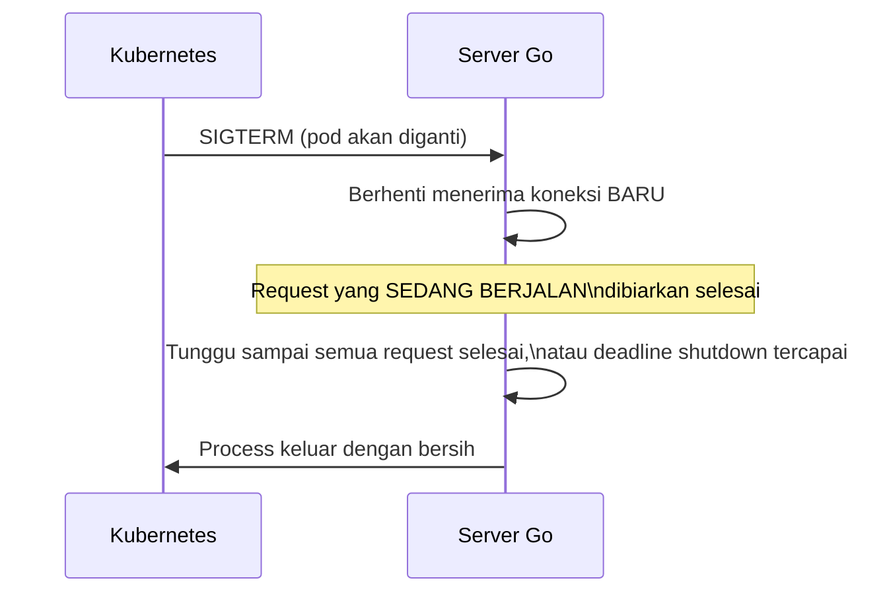

## TL;DR

Graceful shutdown berarti server berhenti dengan cara **berhenti menerima koneksi baru dulu, lalu menunggu request yang sedang berjalan selesai** sebelum process benar-benar keluar — bukan mematikan semua koneksi secara mendadak di tengah jalan. Di Go, `srv.Shutdown(ctx)` melakukan persis ini: menutup listener seketika (tidak menerima koneksi baru) sambil menunggu handler yang sedang aktif selesai, sampai batas waktu tertentu. Ini krusial untuk deployment — setiap kali Kubernetes melakukan rolling update dan mengirim sinyal berhenti ke pod lama, service yang tidak menangani ini dengan benar akan memutus semua request yang sedang diproses saat itu, betapapun deployment itu rutin dan "biasa saja" dari sudut pandang ops.

## The Problem

Bayangkan sebuah service Go berjalan di Kubernetes, dan setiap kali ada rolling update, Kubernetes mengirim sinyal `SIGTERM` ke pod lama sebelum menggantinya dengan versi baru. Kalau service ini tidak menangani sinyal ini sama sekali (proses langsung dimatikan paksa), setiap request yang **sedang** diproses tepat di momen sinyal itu tiba — termasuk mungkin permohonan yang baru saja diajukan seorang pemohon — langsung terputus tanpa response yang jelas.

Dari sisi pemohon, ini terasa sebagai kegagalan acak: kadang submit berhasil, kadang gagal dengan connection reset, tanpa pola yang jelas — padahal sebenarnya sepenuhnya berkorelasi dengan jadwal deployment tim, yang mereka sama sekali tidak sadari. Lebih buruk lagi, karena request itu mungkin sudah **sebagian** diproses di server sebelum terputus (misalnya data sudah tersimpan tapi response belum sempat dikirim), pemohon yang mencoba lagi bisa menghasilkan duplikasi — persis skenario yang seharusnya dicegah [[Idempotency]], tapi dipicu oleh masalah deployment, bukan oleh desain API itu sendiri.

## Intuition

Bayangkan graceful shutdown seperti **manajer toko di jam tutup** — ia tidak langsung mematikan lampu dan mengunci semua orang di dalam tengah bertransaksi. Ia berhenti mengizinkan pelanggan **baru** masuk lewat pintu (berhenti menerima koneksi baru), sambil membiarkan pelanggan yang sudah ada di kasir menyelesaikan transaksinya (membiarkan request yang sedang berjalan selesai), baru benar-benar menutup toko setelah semua orang di dalam selesai atau setelah jangka waktu wajar berlalu.

Analogi ini bocor pada satu hal: manajer toko sungguhan bisa mengambil keputusan situasional untuk memperpanjang waktu tunggu kalau ada pelanggan yang hampir selesai. `Shutdown(ctx)` di Go punya deadline context yang, begitu tercapai, **memaksa** menutup koneksi yang masih aktif apa pun kondisinya, tanpa pengecualian — jangka waktu "wajar" itu harus ditentukan sengaja di kode sebelumnya, tidak ada keleluasaan lagi setelah timeout itu ditetapkan.

## How It Works



## In Go

```go
func main() {
    srv := &http.Server{
        Addr:         ":8080",
        Handler:      buildHandler(),
        ReadTimeout:  15 * time.Second,
        WriteTimeout: 15 * time.Second,
    }

    // Jalankan server di goroutine terpisah supaya main goroutine
    // bebas menunggu sinyal shutdown.
    serverErr := make(chan error, 1)
    go func() {
        if err := srv.ListenAndServe(); err != nil {
            serverErr <- err
        }
    }()

    // Tangkap SIGTERM (dikirim Kubernetes) dan SIGINT (Ctrl+C manual).
    sigCh := make(chan os.Signal, 1)
    signal.Notify(sigCh, syscall.SIGTERM, syscall.SIGINT)

    select {
    case err := <-serverErr:
        log.Fatalf("server gagal berjalan: %v", err)
    case sig := <-sigCh:
        log.Printf("menerima sinyal %v, mulai graceful shutdown", sig)

        // Beri waktu wajar untuk request yang sedang berjalan selesai —
        // HARUS lebih pendek dari terminationGracePeriodSeconds Kubernetes,
        // supaya Shutdown sempat selesai sebelum Kubernetes mengirim SIGKILL paksa.
        ctx, cancel := context.WithTimeout(context.Background(), 20*time.Second)
        defer cancel()

        if err := srv.Shutdown(ctx); err != nil {
            log.Printf("shutdown tidak sepenuhnya bersih: %v", err)
        } else {
            log.Println("graceful shutdown selesai")
        }
    }
}
```

Catatan penting: `srv.ListenAndServe()` **selalu** mengembalikan error setelah server berhenti — tapi kalau berhentinya karena `Shutdown` dipanggil dengan sengaja (bukan kegagalan tak terduga), error yang dikembalikan adalah `http.ErrServerClosed`, yang **diharapkan**, bukan kondisi gagal yang perlu dianggap fatal. Kode di atas menghindari menganggap ini error dengan tidak memeriksa `err` dari goroutine `ListenAndServe` sebagai fatal setelah shutdown sengaja dipicu (logic penanganan `http.ErrServerClosed` secara eksplisit sebaiknya ditambahkan di produksi nyata untuk membedakan dari kegagalan startup yang sesungguhnya).

## In His Stack

**Kubernetes** mengirim `SIGTERM` lalu menunggu `terminationGracePeriodSeconds` (dikonfigurasi per pod) sebelum akhirnya mengirim `SIGKILL` paksa kalau process belum juga keluar. Timeout shutdown di level aplikasi (`20 * time.Second` di contoh di atas) **harus** diset lebih pendek dari `terminationGracePeriodSeconds` Kubernetes — kalau lebih panjang atau sama, Kubernetes akan mengirim `SIGKILL` sebelum `Shutdown` sempat selesai dengan bersih, membuat seluruh mekanisme graceful shutdown ini sia-sia karena tetap dipotong paksa di akhir.

## Trade-offs and When Not To Use It

Graceful shutdown menambah sedikit boilerplate (signal handling, koordinasi goroutine) — tapi alternatifnya (request yang terputus di setiap deployment, betapapun rutin) adalah biaya keandalan nyata yang berulang setiap kali deployment terjadi, bukan insiden langka. Panjang timeout shutdown adalah trade-off antara memberi cukup waktu request selesai (timeout lebih panjang) versus seberapa cepat deployment/rollout bisa berjalan (timeout lebih pendek) — nilai ini harus diselaraskan dengan `terminationGracePeriodSeconds` di level orchestrator, bukan dipilih sendiri tanpa koordinasi.

## Common Mistakes

> [!warning] Jebakan
> Tidak menangani sinyal terminasi sama sekali (atau menanganinya dengan `os.Exit()` langsung), memutus semua request yang sedang berjalan secara mendadak di setiap deployment.

> [!warning] Jebakan
> Menyetel timeout shutdown aplikasi lebih panjang (atau sama) dari `terminationGracePeriodSeconds` Kubernetes, membuat Kubernetes mengirim `SIGKILL` paksa sebelum graceful shutdown sempat selesai — meniadakan seluruh manfaatnya.

> [!warning] Jebakan
> Memperlakukan `http.ErrServerClosed` sebagai error tak terduga (misalnya mencatatnya sebagai fatal atau mencoba restart otomatis), padahal ini adalah return value yang **diharapkan** setelah `Shutdown` dipanggil dengan sengaja — menyebabkan noise log yang membingungkan di setiap deployment normal.

## Exercises

1. Apa perbedaan graceful shutdown dengan mematikan process secara langsung?
2. Kenapa timeout shutdown aplikasi harus lebih pendek dari `terminationGracePeriodSeconds` Kubernetes?
3. Kenapa `http.ErrServerClosed` tidak boleh diperlakukan sebagai error tak terduga?
4. Desain terbuka: sebuah tim menemukan bahwa setiap deployment rutin (beberapa kali seminggu) selalu disertai laporan kecil dari user soal "request gagal sesaat", dan menduga ini terkait proses deployment, bukan bug aplikasi biasa. Rancang investigasi untuk mengonfirmasi dugaan ini, dan perbaikan lengkap yang perlu diterapkan.

> [!success]- Kunci jawaban
> Investigasi: korelasikan waktu laporan kegagalan user dengan timestamp deployment dari sistem CI/CD — kalau polanya konsisten berbarengan dengan momen rolling update, ini konfirmasi kuat penyebabnya adalah shutdown yang tidak graceful. Periksa kode server: apakah ada penanganan sinyal `SIGTERM` sama sekali, dan apakah `srv.Shutdown(ctx)` dipanggil dengan timeout yang wajar. Periksa juga konfigurasi Kubernetes: apakah `terminationGracePeriodSeconds` sudah diset cukup panjang dan lebih besar dari timeout shutdown aplikasi. Perbaikan lengkap: implementasikan signal handling dan `Shutdown` seperti contoh kode di atas, selaraskan kedua nilai timeout (aplikasi harus lebih pendek dari Kubernetes), dan pertimbangkan juga menambahkan **readiness probe** yang segera menandai pod sebagai "tidak siap" begitu sinyal shutdown diterima — supaya load balancer/Service Kubernetes berhenti mengirim trafik baru ke pod itu bahkan sebelum listener aplikasi sendiri benar-benar berhenti menerima koneksi, memberi jeda tambahan yang lebih aman.

## Self-Check

- Apa yang membedakan graceful shutdown dari mematikan process langsung?
- Kenapa timeout shutdown aplikasi harus lebih pendek dari grace period Kubernetes?
- Kenapa `http.ErrServerClosed` adalah return value yang diharapkan, bukan error sesungguhnya?
- Apa hubungan antara graceful shutdown dan risiko duplikasi yang dibahas di Idempotency?

## Connected Notes

- [[Timeouts in HTTP Servers]] — prasyarat: konfigurasi `http.Server` yang sama menjadi dasar teknis graceful shutdown.
- [[Idempotency]] — risiko duplikasi yang bisa dipicu shutdown yang tidak graceful, terhubung langsung ke pembahasan di note itu.
- [[../70 Infrastructure and Delivery/Kubernetes Config, Secrets, Probes, and Autoscaling|Kubernetes Config, Secrets, Probes, and Autoscaling]] — `terminationGracePeriodSeconds` dan readiness probe yang harus diselaraskan dengan graceful shutdown aplikasi.
- [[../70 Infrastructure and Delivery/Blue-Green and Canary Releases|Blue-Green and Canary Releases]] — strategi deployment yang bergantung pada graceful shutdown untuk transisi tanpa gangguan.

## Further Reading

- Dokumentasi resmi package `net/http`, method `Server.Shutdown` (pkg.go.dev/net/http) — perilaku detail dan garansi yang diberikan.

## Catatan Saya

*Tulis di sini apakah service Go-mu sudah menangani graceful shutdown, dan apakah timeout-nya sudah diselaraskan dengan grace period Kubernetes.*
