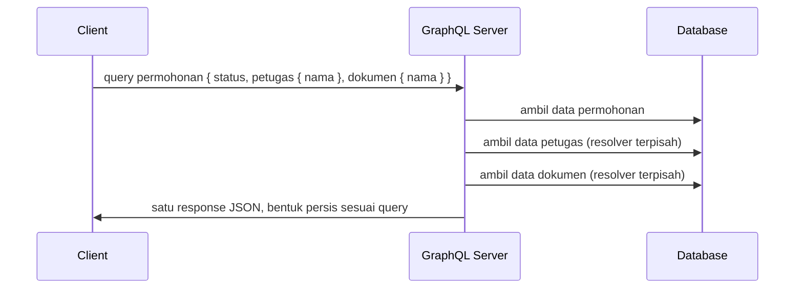

## TL;DR

**GraphQL** adalah bahasa query untuk API yang membalik siapa yang menentukan bentuk response: bukan server yang memutuskan field apa saja dikembalikan lewat endpoint tetap, tapi client yang meminta persis field yang ia butuhkan dalam satu request, walau data itu berasal dari beberapa relasi berbeda. Ini menyelesaikan dua masalah nyata REST — **over-fetching** (response membawa field yang tidak dipakai client) dan **under-fetching** (client harus memanggil beberapa endpoint berurutan untuk merakit satu tampilan) — dengan harga: kompleksitas pindah ke sisi server, yang sekarang harus menangani resolusi field secara dinamis, membatasi kedalaman query, dan menghadapi risiko N+1 yang jauh lebih halus dari REST karena tersembunyi di balik satu query yang terlihat sederhana.

## The Problem

Aplikasi mobile untuk warga yang mengecek status permohonan legal-services perlu menampilkan ringkasan: nama pemohon, status permohonan, dan tiga dokumen terakhir yang di-upload — tapi tidak butuh riwayat lengkap, catatan internal petugas, atau metadata audit yang ada di response REST `/permohonan/{id}` yang sudah ada. Endpoint itu, yang juga dipakai dashboard petugas internal, mengembalikan lebih dari dua puluh field. Di jaringan seluler yang lambat milik sebagian pemohon, payload yang membawa data tidak terpakai ini terasa nyata sebagai lambat memuat.

Masalah sebaliknya muncul di halaman detail permohonan: untuk menampilkan nama petugas yang menangani, riwayat status, dan daftar dokumen sekaligus, client harus memanggil tiga endpoint REST berurutan — `/permohonan/{id}`, lalu `/petugas/{id}` memakai ID dari response pertama, lalu `/dokumen?permohonan_id={id}`. Setiap panggilan tambahan berarti satu round-trip jaringan lagi, dan di jaringan seluler, latency round-trip itu jauh lebih mahal dari waktu pemrosesan di server.

Kedua masalah ini punya akar yang sama: REST mengikat bentuk response ke endpoint, bukan ke kebutuhan client yang memanggilnya, dan kebutuhan setiap client (mobile ringkas vs dashboard lengkap) sering berbeda jauh.

## Intuition

Pikirkan REST sebagai restoran dengan menu paket — setiap paket punya isi tetap, dan kalau kamu hanya ingin nasi tanpa lauk tertentu, kamu tetap membayar dan menerima seluruh paket. GraphQL seperti restoran prasmanan dengan satu permintaan tertulis: kamu menuliskan persis apa yang ingin diambil dari meja yang tersedia — sedikit nasi, tanpa sayur, tambah dua lauk — dan dapur menyiapkan persis piring itu, tidak lebih tidak kurang.

Analogi ini berhenti bekerja pada satu titik: di restoran prasmanan, semua bahan sudah disiapkan sebelumnya sehingga melayani permintaan campuran itu murah. Di GraphQL, server sering harus **menyusun** data itu secara dinamis dari berbagai sumber (tabel database berbeda, service berbeda) tepat saat query datang — pekerjaan menyusun itulah yang menjadi beban baru di sisi server, dibahas di bagian N+1 di bawah.

## How It Works



Diagram ini menunjukkan struktur inti GraphQL: satu query dari client bisa memicu beberapa operasi terpisah di server, satu per field bersarang yang diminta, dan semuanya dirangkai jadi satu response tunggal. Setiap field di dalam sebuah tipe punya fungsi yang disebut **resolver** — kode yang tahu cara mengambil nilai field itu, entah dari database, cache, atau memanggil service lain.

Skema GraphQL mendefinisikan tipe dan relasi lebih dulu, mirip semangat file `.proto` di [[gRPC and Protobuf]] tapi berorientasi query, bukan RPC:

```graphql
type Permohonan {
  id: ID!
  status: String!
  petugas: Petugas
  dokumen: [Dokumen!]!
}

type Petugas {
  id: ID!
  nama: String!
}

type Query {
  permohonan(id: ID!): Permohonan
}
```

Client kemudian menulis query yang memilih persis field yang dibutuhkan:

```graphql
query {
  permohonan(id: "123") {
    status
    petugas {
      nama
    }
    dokumen {
      nama
    }
  }
}
```

## Under The Hood

Masalah N+1 yang sudah dibahas untuk ORM di [[The N+1 Query Problem]] muncul kembali di GraphQL dalam bentuk yang lebih tersembunyi. Kalau query di atas dijalankan untuk **daftar** seratus permohonan sekaligus, dan resolver `petugas` naif menjalankan satu query database per permohonan, hasilnya seratus query database terpisah untuk memenuhi satu query GraphQL yang di permukaan terlihat sederhana. Klien yang menulis query itu tidak melihat tanda bahaya sama sekali — bentuknya rapi, satu blok query — sementara REST yang setara biasanya memaksa developer memanggil endpoint list berkali-kali secara eksplisit, yang lebih mudah terlihat sebagai pola yang mencurigakan saat code review.

Solusi standarnya adalah **DataLoader**: pola batching yang mengumpulkan semua permintaan `petugas` dalam satu tick event loop (atau satu request), lalu menjalankan satu query `WHERE id IN (...)` untuk semuanya sekaligus, bukan satu query per permohonan.

Masalah kedua yang unik untuk GraphQL adalah **query yang terlalu dalam atau terlalu luas** — client (atau penyerang) bisa menulis query yang meminta relasi bersarang berkali-kali (`permohonan { petugas { permohonanLain { petugas { ... } } } }`), yang bisa membebani server jauh melebihi request REST biasa yang bentuknya tetap. Server produksi harus membatasi kedalaman query (query depth limiting) dan menghitung "biaya" query sebelum mengeksekusinya (query cost analysis), pertahanan yang tidak dibutuhkan REST karena bentuk response REST sudah ditentukan server, bukan client.

## In Go

```go
package main

import (
	"context"
	"fmt"

	"github.com/graphql-go/graphql"
)

// resolverPetugas dipanggil setiap kali field "petugas" diminta.
// Tanpa batching, resolver ini akan dipanggil sekali per permohonan
// dalam sebuah daftar — sumber N+1 yang dibahas di atas.
func resolverPetugas(p graphql.ResolveParams) (interface{}, error) {
	permohonan, ok := p.Source.(Permohonan)
	if !ok {
		return nil, fmt.Errorf("source bukan tipe Permohonan")
	}

	petugas, err := ambilPetugasByID(p.Context, permohonan.PetugasID)
	if err != nil {
		return nil, fmt.Errorf("gagal mengambil data petugas: %w", err)
	}
	return petugas, nil
}

func ambilPetugasByID(ctx context.Context, id string) (Petugas, error) {
	// Pada implementasi produksi, panggilan ini seharusnya lewat
	// DataLoader yang menggabungkan banyak ID dalam satu query batch,
	// bukan satu query database per pemanggilan seperti di sini.
	return repositoriPetugas.CariByID(ctx, id)
}
```

Contoh di atas sengaja menunjukkan versi naif untuk menyorot masalahnya — implementasi produksi menggantikan `ambilPetugasByID` dengan pemanggilan lewat DataLoader (misalnya `github.com/graph-gophers/dataloader`) yang mengumpulkan ID dulu, baru mengeksekusi satu query batch setelah semua resolver di level yang sama selesai mendaftarkan permintaannya.

## In His Stack

Ekosistem Yii2 tidak punya dukungan GraphQL bawaan sekuat framework yang lebih baru; menambahkannya butuh library pihak ketiga dan biasanya hanya sepadan untuk endpoint yang benar-benar menderita masalah over-fetching/under-fetching parah — bukan pengganti REST di seluruh aplikasi. Untuk API yang dipakai satu jenis client dengan kebutuhan data yang stabil (misalnya endpoint internal antar service Go), REST atau gRPC tetap lebih sederhana untuk dioperasikan. GraphQL paling masuk akal ketika satu backend melayani beberapa client yang sangat berbeda kebutuhan datanya — skenario yang lebih umum di aplikasi consumer-facing (mobile plus web plus partner API) dibanding di ekosistem integrasi antar-instansi yang jadi fokus pekerjaan sehari-hari.

## Trade-offs and When Not To Use It

GraphQL unggul ketika banyak client heterogen mengambil data dari graph relasi yang sama tapi butuh potongan berbeda-beda, dan ketika under-fetching REST sungguh menjadi masalah nyata di jaringan lambat. Ia kalah untuk API sederhana dengan satu jenis konsumen yang kebutuhan datanya stabil — kompleksitas resolver, DataLoader, dan pembatasan query depth adalah biaya operasional nyata yang tidak sepadan kalau REST biasa sudah cukup. GraphQL juga mempersulit caching HTTP standar: response REST bisa di-cache di level URL lewat CDN atau reverse proxy dengan mudah, sementara GraphQL biasanya memakai satu endpoint POST untuk semua query, sehingga caching berbasis URL tidak berfungsi dan butuh strategi caching terpisah di level aplikasi.

## Common Mistakes

> [!warning] Jebakan
> Menulis resolver naif yang menjalankan satu query database per item dalam daftar, mengulangi persis masalah N+1 yang REST/ORM sudah lama diketahui rentan terhadapnya, hanya kali ini tersembunyi di balik satu query GraphQL yang terlihat rapi.

> [!warning] Jebakan
> Tidak membatasi kedalaman atau kompleksitas query yang boleh dikirim client, sehingga satu query jahat atau ceroboh bisa memaksa server melakukan ratusan operasi resolusi bersarang dari satu request saja.

> [!warning] Jebakan
> Mengasumsikan GraphQL otomatis lebih cepat dari REST. Untuk kasus penggunaan sederhana dengan satu bentuk response tetap, overhead parsing query dan resolusi dinamis GraphQL justru bisa lebih lambat dari endpoint REST yang sudah dioptimalkan untuk bentuk itu.

## Exercises

1. Jelaskan perbedaan over-fetching dan under-fetching dengan contoh dari skenario aplikasi permohonan legal-services di atas.
2. Sebuah resolver `dokumen` dipanggil untuk daftar lima puluh permohonan sekaligus, masing-masing menjalankan query database sendiri. Jelaskan bagaimana DataLoader mengubah pola ini, dan pada tahap apa persisnya batching itu terjadi.
3. Rancang aturan pembatasan kedalaman query (query depth limit) yang masuk akal untuk API permohonan legal-services, dan jelaskan alasannya.
4. **(Open-ended)** Timmu punya satu backend Go yang saat ini melayani REST untuk dashboard petugas internal (butuh data lengkap) dan sedang membangun aplikasi mobile baru untuk warga (butuh data ringkas, jaringan lambat). Evaluasi apakah pindah seluruh API ke GraphQL adalah keputusan yang tepat, atau apakah ada opsi lain yang lebih murah untuk mengatasi over-fetching dan under-fetching tanpa mengganti seluruh arsitektur API.

> [!success]- Kunci jawaban
> Untuk soal 4: mengganti seluruh API ke GraphQL adalah opsi textbook tapi mahal — ia menuntut menulis ulang seluruh layer resolver dan menambah kompleksitas operasional (DataLoader, depth limiting) untuk masalah yang sebenarnya hanya muncul di satu client (mobile). Opsi yang lebih murah: buat endpoint REST khusus yang dirancang untuk kebutuhan mobile (`/permohonan/{id}/ringkasan`), memilih field secukupnya di level query database itu sendiri, sambil dashboard internal tetap memakai endpoint lengkap yang sudah ada. GraphQL baru sepadan kalau jumlah variasi kebutuhan client terus bertambah sampai membuat pola "satu endpoint per kombinasi kebutuhan" sendiri menjadi tidak terkelola.

## Self-Check

- Apa perbedaan over-fetching dan under-fetching, dan bagaimana GraphQL mengatasi keduanya?
- Kenapa masalah N+1 di GraphQL lebih sulit terlihat dibanding di REST?
- Apa fungsi DataLoader, dan pada tahap mana ia melakukan batching?
- Kenapa caching HTTP standar berbasis URL tidak bekerja baik untuk GraphQL?

## Connected Notes

- [[REST Principles]] — GraphQL adalah alternatif langsung terhadap gaya REST, dengan trade-off fleksibilitas query versus kesederhanaan caching dan operasional.
- [[The N+1 Query Problem]] — masalah yang sama muncul kembali di resolver GraphQL, dalam bentuk yang lebih tersembunyi karena dibungkus satu query.
- [[gRPC and Protobuf]] — pembanding gaya API lain: gRPC mengoptimalkan efisiensi komunikasi service-to-service, GraphQL mengoptimalkan fleksibilitas kebutuhan data client.
- [[Pagination - Offset vs Cursor]] — daftar hasil GraphQL tetap butuh strategi pagination yang sama seperti REST ketika jumlah item besar.

## Further Reading

- Dokumentasi resmi GraphQL: graphql.org
- Dokumentasi library `graphql-go`: github.com/graphql-go/graphql

## Catatan Saya

*Tulis pertanyaanmu sendiri, contoh kode dari pekerjaanmu, atau bagian yang belum jelas di sini.*
