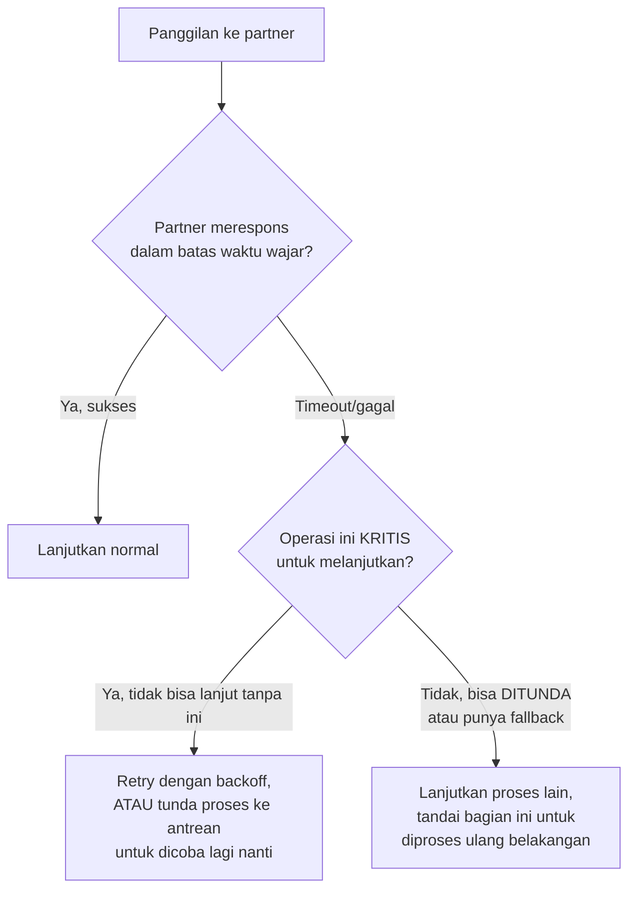

## TL;DR

Setiap pola yang dibahas sejauh ini di domain integrasi (defensive design, kontrak formal, webhook, file, ritme batch/realtime) mengasumsikan partner **berfungsi**, meski dengan keanehan. Note ini menghadapi kenyataan yang lebih keras: partner **tidak selalu tersedia**. Downtime tanpa pemberitahuan, response time yang melonjak tak terduga, atau kegagalan total selama berjam-jam adalah kejadian yang harus **direncanakan**, bukan dianggap sebagai kejadian langka yang bisa diabaikan risikonya. Sistem yang tangguh terhadap counterparty tidak andal bukan sistem yang berharap partner selalu online — ia sistem yang tetap berfungsi (secara penuh atau sebagian) meski partner sedang tidak bisa diandalkan.

## The Problem

Sebuah sistem verifikasi NIK memanggil API instansi kependudukan setiap kali ada permohonan baru — API itu mengalami downtime selama enam jam karena maintenance yang tidak diumumkan sebelumnya. Selama enam jam itu, **seluruh** proses pengajuan permohonan di sistemmu ikut berhenti total, karena verifikasi NIK dianggap langkah wajib yang harus berhasil sebelum melanjutkan — ribuan warga yang seharusnya bisa mengajukan permohonan (bagian yang sebenarnya tidak bergantung sama sekali pada verifikasi NIK real-time) ikut terhalang karena satu dependency yang sedang down.

Masalah kedua: sebuah job batch memproses ribuan permohonan yang menunggu verifikasi dari partner, dan ketika partner mulai merespons lambat (bukan down total, hanya sangat lambat), job ini terus menunggu setiap panggilan sampai selesai secara sekuensial — total waktu pemrosesan batch yang biasanya selesai dalam 30 menit meregang menjadi berjam-jam, mengganggu jadwal operasional lain yang bergantung pada batch ini selesai tepat waktu, tanpa ada mekanisme yang mendeteksi situasi ini dan mengambil tindakan (misalnya menghentikan sementara dan mencoba lagi nanti, atau memproses yang lain dulu).

## Intuition

Bayangkan menangani counterparty tidak andal seperti **merencanakan perjalanan yang melibatkan transportasi umum yang kadang terlambat atau batal**. Perencana perjalanan yang baik tidak berasumsi setiap kereta akan tepat waktu — ia menyiapkan **rencana cadangan** (rute alternatif kalau kereta utama batal), **buffer waktu** (tidak menjadwalkan janji tepat setelah kedatangan kereta, memberi margin kalau terlambat), dan **kriteria jelas kapan menyerah** (kalau sudah menunggu lebih dari waktu tertentu, beralih ke rencana B alih-alih terus menunggu tanpa batas).

Analogi ini bocor pada satu hal: perjalanan pribadi hanya memengaruhi satu orang. Kegagalan menangani counterparty tidak andal dalam sistem bisa **menyebar** ke bagian sistem lain yang sebenarnya tidak terkait — inilah kenapa **isolasi kegagalan** (memastikan masalah satu dependency tidak menular ke bagian sistem yang independen) menjadi prinsip tambahan yang tidak ada analoginya langsung di perencanaan perjalanan personal, tapi sangat penting dalam desain sistem (lihat [[Bulkheads]] dan [[Circuit Breakers]]).

## How It Works



**Strategi konkret menangani counterparty tidak andal**:
- **Pisahkan operasi kritis dari opsional** — hanya bagian yang benar-benar butuh partner tersedia yang seharusnya terhambat; bagian lain harus tetap berjalan.
- **Antrean sebagai buffer** — alih-alih memanggil partner langsung dalam alur sinkron, masukkan permintaan ke antrean yang diproses oleh worker terpisah; kalau partner down, antrean menumpuk (bukan menghambat pengguna) dan diproses begitu partner pulih.
- **Sirkuit breaker** (dibahas mendalam di note lain domain ini) — deteksi otomatis "partner sedang bermasalah" dan berhenti memanggil sementara, mencegah membuang waktu menunggu timeout berulang-ulang untuk partner yang jelas sedang down.
- **Degradasi terkendali** — beri pengguna informasi jelas ("verifikasi sedang tertunda, akan diproses begitu sistem terkait tersedia kembali") alih-alih membiarkan mereka menunggu tanpa penjelasan atau menerima error generik yang membingungkan.

## Under The Hood

**SLA yang tidak pernah didokumentasikan bukan berarti partner "boleh" tidak andal** — tapi realistisnya, banyak partner (terutama instansi pemerintah) tidak punya SLA formal yang bisa dijadikan pegangan, dan bahkan kalau ada, penegakannya seringkali lemah. Strategi yang realistis bukan menuntut SLA yang lebih baik (meski itu tetap layak diupayakan lewat [[Contract Negotiation and Versioning]]), tapi merancang sistem sendiri yang **tidak bergantung** pada asumsi ketersediaan partner yang tidak pernah benar-benar dijamin.

**Mengukur pola downtime/kelambatan historis partner** (bukan sekadar bereaksi setelah kejadian) membantu merancang timeout dan retry yang tepat — partner yang secara historis punya lonjakan lambat setiap awal bulan (mungkin karena beban batch internal mereka sendiri) bisa diantisipasi dengan menyesuaikan jadwal batch-mu sendiri untuk menghindari periode itu, alih-alih menghadapi masalah yang sama berulang setiap bulan tanpa pernah dipelajari polanya.

## In Go

```go
package integrasi

import (
	"context"
	"fmt"
	"time"
)

// PermohonanDenganVerifikasiOpsional memisahkan proses inti (SELALU
// bisa jalan) dari verifikasi eksternal (BISA TERTUNDA tanpa
// menghalangi proses inti).
func AjukanPermohonan(ctx context.Context, data DataPermohonan, antreanVerifikasi chan<- int64) (int64, error) {
	// LANGKAH KRITIS: simpan permohonan — TIDAK bergantung pada partner
	// eksternal sama sekali, SELALU bisa berhasil terlepas kondisi partner.
	id, err := simpanPermohonan(ctx, data)
	if err != nil {
		return 0, fmt.Errorf("simpan permohonan: %w", err)
	}

	// LANGKAH OPSIONAL: verifikasi NIK dimasukkan ke ANTREAN, BUKAN
	// dipanggil langsung — kalau partner sedang down, permohonan TETAP
	// tersimpan dengan status "menunggu verifikasi", tidak menghalangi
	// warga mengajukan permohonan sama sekali.
	select {
	case antreanVerifikasi <- id:
	default:
		// antrean penuh, log untuk investigasi — TAPI permohonan
		// tetap sudah tersimpan, tidak hilang.
	}

	return id, nil
}

// WorkerVerifikasi berjalan TERPISAH, memproses antrean secara
// independen — kalau partner down, worker ini menunggu/retry TANPA
// memengaruhi alur AjukanPermohonan sama sekali.
func WorkerVerifikasi(ctx context.Context, antrean <-chan int64, verifikasiNIK func(ctx context.Context, id int64) error) {
	for {
		select {
		case <-ctx.Done():
			return
		case id := <-antrean:
			const percobaanMaks = 5
			for percobaan := 1; percobaan <= percobaanMaks; percobaan++ {
				if err := verifikasiNIK(ctx, id); err == nil {
					break
				}
				time.Sleep(time.Duration(percobaan) * 30 * time.Second)
			}
		}
	}
}

type DataPermohonan struct{}

func simpanPermohonan(ctx context.Context, data DataPermohonan) (int64, error) { return 1, nil }
```

## In His Stack

Untuk sistem yang bergantung pada verifikasi lewat instansi lain (data kependudukan, status pajak, dll.), memisahkan **proses inti** (yang harus selalu berjalan lancar untuk warga) dari **verifikasi eksternal** (yang bisa tertunda tanpa menghalangi proses inti) adalah keputusan arsitektural yang sangat relevan — desain "permohonan tersimpan dengan status menunggu verifikasi" jauh lebih baik dibanding "seluruh sistem berhenti karena satu instansi sedang maintenance", terutama mengingat downtime instansi pemerintah lain seringkali di luar kendali dan tidak selalu diumumkan tepat waktu.

## Trade-offs and When Not To Use It

Memisahkan operasi kritis dari opsional dan menambah antrean sebagai buffer menambah kompleksitas arsitektural nyata — untuk operasi yang **memang** harus sinkron dan tidak bisa ditunda (verifikasi yang menentukan apakah transaksi keuangan boleh dilanjutkan seketika), pemisahan ini tidak relevan; operasi itu memang harus menunggu partner, dan yang bisa dilakukan hanyalah menetapkan timeout yang jelas dan pesan error yang informatif kalau gagal. Trade-off degradasi terkendali (melanjutkan proses tanpa verifikasi lengkap) juga harus dipertimbangkan hati-hati dari sisi kebutuhan bisnis — untuk beberapa kasus, melanjutkan tanpa verifikasi lengkap bisa menciptakan risiko yang lebih besar (misalnya, proses hukum berjalan berdasarkan data yang belum terverifikasi) dibanding menunggu, dan keputusan ini butuh masukan pemilik bisnis, bukan murni keputusan teknis.

## Common Mistakes

> [!warning] Jebakan
> Menjadikan seluruh alur pengguna bergantung pada satu dependency eksternal tanpa memisahkan mana yang benar-benar kritis dan mana yang bisa ditunda — satu partner yang down menghentikan seluruh sistem, termasuk bagian yang sebenarnya tidak terkait.

> [!warning] Jebakan
> Memanggil partner secara sinkron dalam proses batch tanpa mekanisme deteksi kelambatan — partner yang melambat (bukan down total) memperlambat seluruh proses batch tanpa batas, mengganggu jadwal operasional lain.

> [!warning] Jebakan
> Melanjutkan proses tanpa verifikasi lengkap (degradasi terkendali) untuk kasus yang sebenarnya berisiko tinggi kalau dilanjutkan tanpa verifikasi — keputusan ini butuh pertimbangan bisnis eksplisit, bukan asumsi teknis "yang penting sistem tetap jalan".

## Exercises

1. Jelaskan kenapa memisahkan operasi kritis dari opsional penting saat berintegrasi dengan partner yang tidak selalu andal.
2. Bagaimana antrean berfungsi sebagai "buffer" yang melindungi proses inti dari downtime partner?
3. Kenapa mengukur pola downtime/kelambatan historis partner membantu merancang sistem yang lebih tangguh?
4. Desain terbuka: sistemmu memproses pengajuan izin usaha yang butuh verifikasi dari tiga instansi berbeda (pajak, kependudukan, dan zonasi wilayah), masing-masing dengan riwayat keandalan berbeda (pajak sangat andal, kependudukan kadang lambat, zonasi sering down berjam-jam). Rancang arsitektur yang memungkinkan pengajuan tetap diterima dan diproses semaksimal mungkin meski salah satu atau lebih instansi sedang bermasalah, dengan mempertimbangkan bahwa izin usaha tidak bisa benar-benar disetujui sampai ketiga verifikasi berhasil.

> [!success]- Kunci jawaban
> **1.** Kalau seluruh alur bergantung pada satu dependency yang diperlakukan sebagai "wajib berhasil sebelum apa pun bisa lanjut", downtime dependency itu menghentikan **seluruh** alur, termasuk bagian yang secara logis tidak benar-benar butuh dependency itu di titik itu. Memisahkan yang benar-benar kritis (harus berhasil sebelum lanjut) dari yang opsional/bisa ditunda memungkinkan bagian yang tidak terpengaruh tetap berjalan normal, mengisolasi dampak downtime hanya ke bagian yang memang bergantung padanya — jauh lebih baik daripada satu titik kegagalan menjatuhkan segalanya.
> **4.** Arsitektur: pengajuan **selalu** diterima dan tersimpan segera (proses inti, tidak bergantung ketiga instansi). Ketiga verifikasi (pajak, kependudukan, zonasi) masing-masing dijalankan sebagai proses **independen** (masuk antrean terpisah atau dijalankan paralel lewat [[../50 Concurrency and Performance/errgroup|errgroup]] dengan penanganan kegagalan per-verifikasi, bukan all-or-nothing) — status pengajuan menampilkan progres granular ("pajak: terverifikasi, kependudukan: menunggu, zonasi: tertunda karena gangguan sistem"). Karena zonasi diketahui sering down berjam-jam, terapkan retry dengan backoff yang lebih panjang khusus untuk verifikasi zonasi (mengurangi beban percobaan sia-sia saat sedang jelas down, mungkin dikombinasikan dengan circuit breaker), sementara verifikasi pajak dan kependudukan yang lebih andal bisa punya retry yang lebih agresif. Izin usaha baru benar-benar disetujui setelah ketiga verifikasi berhasil, tapi pengguna tetap bisa melihat progres granular dan tahu bagian mana yang sedang tertunda serta kenapa, alih-alih menunggu tanpa informasi sama sekali sampai ketiganya kebetulan selesai bersamaan.

## Self-Check

- Kenapa memisahkan operasi kritis dari opsional penting untuk menangani partner tidak andal?
- Bagaimana antrean melindungi proses inti dari downtime partner?
- Kenapa mengukur pola downtime historis partner membantu perancangan sistem?
- Kapan degradasi terkendali (melanjutkan tanpa verifikasi lengkap) berisiko dan butuh keputusan bisnis eksplisit?

## Connected Notes

- [[Designing an API for a Partner You Do Not Control]] — prinsip defensive design yang menjadi dasar strategi menangani ketidakandalan yang dibahas di note ini.
- [[Circuit Breakers]] — mekanisme konkret mendeteksi partner bermasalah dan berhenti memanggil sementara, dibahas mendalam di note lain domain ini.
- [[Bulkheads]] — pola isolasi kegagalan yang mencegah masalah satu dependency menular ke bagian sistem lain, dibahas di note lain domain ini.
- [[Retries with Exponential Backoff and Jitter]] — strategi retry yang tepat untuk partner yang gagal sesaat, dibahas mendalam di note lain domain ini.
- [[Graceful Degradation]] — prinsip melanjutkan fungsi sebagian saat komponen pendukung bermasalah, dibahas mendalam di note penutup domain ini.

## Further Reading

- Michael Nygard, "Release It!" — buku yang membahas pola stabilitas sistem termasuk penanganan dependency yang tidak andal secara mendalam.

## Catatan Saya

*Tulis di sini partner integrasi paling tidak andal di kerjaanmu — bagaimana sistemmu saat ini menangani downtime mereka, dan apakah itu memengaruhi bagian sistem yang seharusnya independen.*
