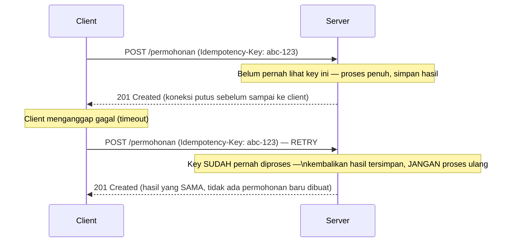

## TL;DR

Sebuah operasi bersifat **idempotent** kalau memanggilnya berkali-kali menghasilkan efek yang sama seperti memanggilnya sekali. `GET`, `PUT` (replace penuh), dan `DELETE` idempotent secara definisi HTTP — tapi implementasinya tetap harus benar-benar menghormati sifat itu. `POST` untuk membuat resource baru **tidak** idempotent secara default — memanggilnya dua kali berarti dua resource dibuat. Ini bukan detail akademis: kalau client tidak yakin apakah request pertamanya benar-benar berhasil (koneksi putus sebelum response diterima, misalnya) dan mencoba lagi, keamanan retry itu **seluruhnya** bergantung pada apakah operasinya idempotent. Untuk operasi yang secara alami tidak idempotent (submit permohonan, proses pembayaran), keamanan retry harus dibangun sengaja lewat mekanisme **idempotency key**.

## The Problem

Bayangkan sebuah endpoint `POST /permohonan` untuk mengajukan permohonan dokumen legal. Sistem partner (aplikasi milik instansi lain) mengirim request ini, server-mu berhasil memprosesnya sepenuhnya dan menyimpan permohonan baru ke database — tapi tepat sebelum response berhasil dikirim balik, koneksi jaringan terputus sesaat. Dari sisi client, request ini terlihat gagal (timeout, tidak ada response) — padahal sebenarnya sudah berhasil diproses penuh di sisi server.

Client, mengikuti kebiasaan wajar "retry kalau gagal", mengirim ulang request yang **sama persis**. Tanpa mekanisme apa pun untuk mendeteksi bahwa ini adalah "percobaan ulang dari permintaan yang sama", server memprosesnya sebagai permohonan **baru** — menghasilkan dua record permohonan identik untuk satu maksud pemohon yang sama. Ini bukan sekadar data ganda yang kosmetik: kalau proses ini memicu efek samping (mengirim notifikasi WhatsApp, memicu proses verifikasi, menagih biaya), efek itu **terjadi dua kali** — persis skenario yang dibahas di [[../94 Case Studies/Case - The Partner Who Calls Twice|Case - The Partner Who Calls Twice]].

## Intuition

Bayangkan operasi idempotent seperti **saklar lampu** — menekannya sekali menyalakan lampu; menekannya lagi (kalau lampu memang sudah menyala) tidak mengubah apa pun, hasil akhirnya tetap sama. Operasi yang tidak idempotent lebih seperti **tombol "tambah satu item ke keranjang"** — menekannya dua kali menghasilkan dua item, bukan satu.

Analogi ini bocor pada satu hal penting untuk `POST`: tujuan kita bukan membuat `POST` "secara ajaib" berperilaku seperti saklar lampu begitu saja. Keamanan retry untuk operasi jenis "membuat sesuatu" harus **dibangun secara sengaja** lewat mekanisme idempotency key yang memungkinkan server mengenali "ini percobaan ulang dari maksud yang sama", bukan properti fisik bawaan seperti saklar lampu. Tanpa membangun mekanisme itu secara eksplisit, `POST` akan selalu berperilaku seperti tombol tambah-item — setiap panggilan menciptakan efek baru.

## How It Works

Pola idempotency key: client membuat sebuah **key unik** (biasanya UUID) untuk **satu maksud logis**, mengirimkannya di header (`Idempotency-Key: <uuid>`) bersama request. Server, sebelum memproses, memeriksa apakah key ini sudah pernah diproses sebelumnya:



Server perlu menyimpan pasangan `(idempotency key, hasil response)` untuk jangka waktu tertentu (biasanya beberapa jam sampai beberapa hari, tergantung kebutuhan bisnis) — cukup lama untuk menampung retry yang wajar, tapi tidak selamanya (butuh eviction, lihat [[../50 Concurrency and Performance/TTL and Jitter|TTL and Jitter]]).

## In Go

```go
type IdempotencyStore interface {
    // Reservasi atomik: mengembalikan (hasil tersimpan, status code tersimpan,
    // true) kalau key sudah ada, atau (nil, 0, false) dan MEREGISTRASI key ini
    // kalau baru — SEKALIGUS dalam satu operasi atomik untuk menghindari race
    // condition.
    ReservasiAtauAmbil(ctx context.Context, key string) (hasil []byte, statusCode int, sudahAda bool, err error)
    Simpan(ctx context.Context, key string, statusCode int, hasil []byte) error
}

func handleSubmitPermohonan(store IdempotencyStore) http.HandlerFunc {
    return func(w http.ResponseWriter, r *http.Request) {
        key := r.Header.Get("Idempotency-Key")
        if key == "" {
            http.Error(w, "Idempotency-Key wajib disertakan", http.StatusBadRequest)
            return
        }

        hasilTersimpan, statusTersimpan, sudahAda, err := store.ReservasiAtauAmbil(r.Context(), key)
        if err != nil {
            http.Error(w, "kesalahan internal", http.StatusInternalServerError)
            return
        }
        if sudahAda {
            // Percobaan ulang terdeteksi — kembalikan response yang SAMA
            // persis (status code dan body), JANGAN proses permohonan baru.
            w.Header().Set("Content-Type", "application/json")
            w.WriteHeader(statusTersimpan)
            w.Write(hasilTersimpan)
            return
        }

        permohonan, err := prosesPermohonanBaru(r.Context(), r.Body)
        if err != nil {
            http.Error(w, "gagal memproses permohonan", http.StatusInternalServerError)
            return
        }

        hasil, err := json.Marshal(permohonan)
        if err != nil {
            http.Error(w, "kesalahan internal", http.StatusInternalServerError)
            return
        }

        // Kalau penyimpanan key gagal, request ini TIDAK boleh dilaporkan sukses:
        // retry berikutnya akan diproses sebagai request baru dan menghasilkan
        // duplikasi — persis yang seharusnya dicegah mekanisme ini.
        if err := store.Simpan(r.Context(), key, http.StatusCreated, hasil); err != nil {
            http.Error(w, "kesalahan internal", http.StatusInternalServerError)
            return
        }

        w.Header().Set("Content-Type", "application/json")
        w.WriteHeader(http.StatusCreated)
        w.Write(hasil)
    }
}
```

Perhatikan `ReservasiAtauAmbil` dirancang sebagai **satu operasi atomik**, bukan "periksa dulu, baru proses, baru simpan" secara terpisah — kalau dipisah, dua request dengan key yang sama yang datang **hampir bersamaan** (bukan sekadar retry berurutan) bisa sama-sama lolos pemeriksaan "belum ada" sebelum salah satunya sempat menyimpan, menghasilkan duplikasi tepat yang seharusnya dicegah mekanisme ini.

## In His Stack

Saat menegosiasikan kontrak integrasi dengan partner instansi, penting memastikan apakah client library mereka punya perilaku retry otomatis bawaan (banyak HTTP client umum punya opsi ini) — kalau ya, dan endpoint yang mereka panggil tidak idempotent secara alami, retry otomatis mereka bisa diam-diam menciptakan duplikasi tanpa disadari kedua pihak. Ini kenapa dukungan `Idempotency-Key` sebaiknya jadi bagian eksplisit dari kontrak API yang didokumentasikan ke partner, bukan detail implementasi yang tersembunyi.

## Trade-offs and When Not To Use It

Membangun dukungan idempotency key menambah kompleksitas nyata: butuh storage tambahan, kebijakan expiry yang tepat (tidak boleh terlalu pendek sampai retry yang wajar dianggap request baru, tidak boleh selamanya sampai storage terus bertumbuh), dan penanganan race condition seperti dijelaskan di atas. Investasi ini layak untuk endpoint dengan efek samping yang mahal kalau terduplikasi (pembayaran, pembuatan dokumen resmi, pengiriman notifikasi). Untuk operasi yang secara alami sudah idempotent (`GET`, `PUT` replace penuh, `DELETE`) atau yang efek duplikasinya benar-benar tidak berbahaya, mekanisme tambahan ini tidak diperlukan.

## Common Mistakes

> [!warning] Jebakan
> Berasumsi `POST` otomatis aman diretry tanpa mekanisme idempotency key eksplisit. Setiap retry `POST` tanpa mekanisme ini berarti resource baru diciptakan, bukan diperlakukan sebagai percobaan ulang dari maksud yang sama.

> [!warning] Jebakan
> Menyimpan idempotency key tanpa kebijakan expiry sama sekali, membuat storage bertumbuh tanpa batas — atau sebaliknya, expiry yang terlalu agresif sehingga retry yang wajar (setelah beberapa jam, misalnya karena partner melakukan investigasi manual dulu) dianggap sebagai request baru.

> [!warning] Jebakan
> Mengimplementasikan pengecekan idempotency key sebagai "periksa dulu, lalu proses, lalu simpan" secara terpisah (bukan satu operasi atomik), membuka celah race condition saat dua request dengan key yang sama datang nyaris bersamaan.

## Exercises

1. Kenapa `GET` dan `DELETE` idempotent secara definisi, tapi `POST` untuk membuat resource baru tidak?
2. Apa fungsi header `Idempotency-Key`, dan siapa yang bertanggung jawab membuatnya — client atau server?
3. Kenapa pengecekan "apakah key sudah ada" dan penyimpanan key baru harus jadi satu operasi atomik?
4. Desain terbuka: sebuah partner instansi mengintegrasikan endpoint pengajuan permohonan dokumen legal-mu, dan client library mereka secara otomatis melakukan retry hingga 3 kali kalau tidak menerima response dalam 5 detik. Rancang mekanisme idempotency key lengkap untuk endpoint ini — termasuk siapa yang menghasilkan key, berapa lama disimpan, dan bagaimana menangani kasus di mana permohonan pertama masih diproses (belum selesai) saat retry kedua tiba.

> [!success]- Kunci jawaban
> Client (sistem partner) menghasilkan `Idempotency-Key` unik (UUID) sekali per maksud pengajuan, dan menyertakannya identik di setiap retry untuk permohonan logis yang sama — ini harus didokumentasikan eksplisit sebagai bagian dari kontrak API. Server menyimpan key ini selama durasi yang cukup menampung skenario retry terburuk yang wajar (misalnya 24 jam) sebelum di-evict. Untuk kasus permohonan pertama yang masih diproses (belum selesai) saat retry kedua tiba: `ReservasiAtauAmbil` harus mampu membedakan tiga keadaan — "key belum pernah dilihat" (proses baru), "key sudah selesai diproses" (kembalikan hasil tersimpan), dan "key sedang diproses request lain saat ini" (kembalikan response yang menandakan "sedang diproses, coba lagi sebentar lagi", misalnya `409 Conflict` dengan pesan jelas, alih-alih memproses ulang secara paralel atau menunggu tanpa batas).

## Self-Check

- Method HTTP apa saja yang idempotent secara definisi?
- Kenapa `POST` untuk membuat resource baru tidak idempotent secara default?
- Siapa yang bertanggung jawab membuat `Idempotency-Key` — client atau server?
- Kenapa pengecekan dan penyimpanan idempotency key harus atomik?

## Connected Notes

- [[Choosing Status Codes]] — prasyarat: idempotency sering menentukan status code yang tepat (`409` untuk konflik key yang sedang diproses).
- [[../60 Distributed Systems/Idempotency Keys|Idempotency Keys]] — pembahasan lebih dalam di level distributed systems, termasuk penerapannya lintas service dan message queue.
- [[Retries with Exponential Backoff and Jitter]] — retry di sisi klien hanya aman kalau operasinya idempotent, seperti dijelaskan di note ini.
- [[../94 Case Studies/Case - The Partner Who Calls Twice|Case - The Partner Who Calls Twice]] — studi kasus penuh dari skenario "The Problem" di note ini.
- [[The Transactional Outbox Pattern]] — pola terkait yang juga bergantung pada penanganan pesan/efek samping ganda.

## Further Reading

- RFC draft *"The Idempotency-Key HTTP Header Field"* (IETF) — proposal standardisasi pola header ini, meski adopsinya bervariasi antar API.

## Catatan Saya

*Tulis di sini endpoint di kerjaanmu yang paling berisiko kalau diretry tanpa mekanisme idempotency, dan apakah sudah ada perlindungannya saat ini.*
