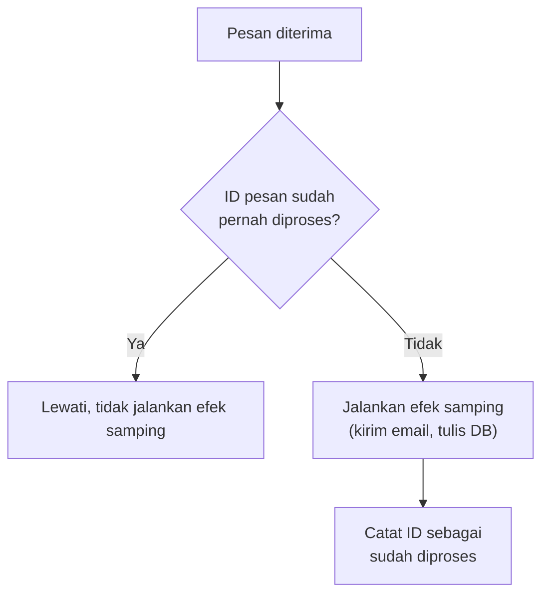

## TL;DR

**Idempotent consumer** adalah consumer pesan yang dirancang aman diproses berkali-kali untuk pesan yang sama, tanpa menghasilkan efek samping ganda — penerapan langsung dari konsep [[Idempotency]] pada konteks spesifik pemrosesan pesan asinkron. Karena hampir semua sistem pesan produksi beroperasi di at-least-once delivery (dibahas di [[Delivery Semantics]]), duplikasi pesan bukan kemungkinan langka, melainkan kepastian yang akan terjadi cepat atau lambat — rebalancing, retry jaringan, restart consumer, semuanya bisa menghasilkan pesan yang sama diterima lebih dari sekali. Pola dasarnya sederhana: setiap pesan punya identitas unik, dan consumer memeriksa apakah identitas itu sudah pernah diproses sebelum menjalankan efek samping apa pun.

## The Problem

Sistem legal-services mengirim event Kafka "kirim email notifikasi" setiap kali status permohonan berubah. Consumer yang menerima event ini langsung memanggil layanan pengiriman email tanpa pengecekan tambahan. Ketika rebalancing terjadi tepat setelah consumer mengirim email tapi sebelum commit offset berhasil (skenario yang sama dengan [[Delivery Semantics]]), consumer pengganti membaca ulang event yang sama dan mengirim email **kedua kali** ke pemohon yang sama.

Ini terlihat sepele — pemohon menerima dua email yang isinya sama — tapi di skala seratus ribu permohonan per bulan, kejadian ini terjadi berulang kali, menimbulkan keluhan warga yang bingung menerima notifikasi ganda dan mempertanyakan apakah permohonan mereka diproses dua kali sungguhan. Masalah yang sama, kalau efek sampingnya adalah mencatat transaksi keuangan alih-alih mengirim email, berubah dari sekadar mengganggu menjadi kesalahan data yang serius.

## Intuition

Cara paling mudah memahaminya: idempotent consumer seperti resepsionis yang mencatat setiap tamu yang check-in ke buku tamu bernomor unik sebelum memberi kunci kamar. Kalau tamu yang sama datang lagi mengaku belum check-in (karena kertas konfirmasinya hilang, analog dengan pesan yang diproses ulang), resepsionis memeriksa buku tamu lebih dulu, melihat nomor itu sudah tercatat, dan tidak memberi kunci kamar kedua — cukup mengonfirmasi bahwa tamu itu memang sudah check-in.

Analogi ini berhenti bekerja pada satu titik: resepsionis manusia bisa mengenali wajah tamu yang sama meski kertas konfirmasinya berbeda. Consumer software tidak punya kemampuan itu — ia **hanya** bisa mendeteksi duplikasi kalau pesan itu sendiri membawa identitas unik yang konsisten (idempotency key), dan pesan yang sama yang dikirim ulang tanpa identitas yang bisa dikenali akan selalu terlihat seperti pesan baru.

## How It Works



Diagram ini menunjukkan struktur inti idempotent consumer: pengecekan **sebelum** efek samping, bukan sesudahnya. Ada dua strategi umum untuk pengecekan ini:

**Idempotency key eksplisit** — pesan membawa ID unik (bisa ID transaksi bisnis seperti `permohonan_id` plus jenis event, atau UUID yang di-generate producer), dan consumer menyimpan daftar ID yang sudah diproses (di tabel database terpisah, atau di tabel yang sama dengan kolom unique constraint).

**Natural idempotency lewat operasi itu sendiri** — beberapa operasi secara alami idempotent tanpa perlu pengecekan eksplisit: `UPDATE status = 'disetujui' WHERE id = 123` menghasilkan hasil akhir yang sama persis dijalankan sekali atau seratus kali. Ini berbeda dari `INSERT` baris baru atau `saldo = saldo + 1000` (menambahkan, bukan menetapkan), yang **tidak** natural idempotent — dijalankan dua kali menghasilkan dua baris atau saldo yang salah.

## Under The Hood

Menyimpan daftar ID yang sudah diproses sendiri butuh tempat penyimpanan yang tahan terhadap kegagalan yang sama dengan yang dilindunginya — kalau daftar itu disimpan hanya di memori consumer, restart consumer menghapus riwayat itu, dan pesan lama yang sebenarnya sudah diproses akan terlihat "baru" lagi setelah restart. Solusi yang tahan lama adalah menyimpan ID yang sudah diproses di tempat yang sama dengan efek samping itu sendiri — idealnya dalam **satu transaksi database** yang sama, supaya "efek samping berhasil" dan "ID tercatat sebagai diproses" adalah satu operasi atomik yang tidak bisa terpisah:

```sql
BEGIN;
INSERT INTO log_pesan_diproses (event_id) VALUES ($1);
UPDATE permohonan SET status = 'disetujui' WHERE id = $2;
COMMIT;
```

Kalau `event_id` sudah ada (melanggar unique constraint), transaksi ini gagal secara alami, dan aplikasi cukup menangkap error itu sebagai sinyal "sudah diproses, lewati" — bukan mengandalkan pengecekan `SELECT` terpisah yang punya celah race condition di antara pengecekan dan penulisan (dua consumer yang memproses pesan duplikat hampir bersamaan bisa sama-sama lolos dari `SELECT` sebelum salah satunya sempat menulis).

## In Go

```go
package main

import (
	"context"
	"database/sql"
	"errors"
	"fmt"

	"github.com/lib/pq"
)

func prosesEventPermohonan(ctx context.Context, db *sql.DB, eventID string, permohonanID string, statusBaru string) error {
	tx, err := db.BeginTx(ctx, nil)
	if err != nil {
		return fmt.Errorf("gagal memulai transaksi: %w", err)
	}
	defer tx.Rollback()

	_, err = tx.ExecContext(ctx,
		"INSERT INTO log_pesan_diproses (event_id) VALUES ($1)", eventID)
	if err != nil {
		var pqErr *pq.Error
		if errors.As(err, &pqErr) && pqErr.Code == "23505" { // unique_violation
			// Event ini sudah pernah diproses — bukan error,
			// cukup anggap selesai tanpa mengulang efek samping.
			return nil
		}
		return fmt.Errorf("gagal mencatat event %s: %w", eventID, err)
	}

	_, err = tx.ExecContext(ctx,
		"UPDATE permohonan SET status = $1 WHERE id = $2", statusBaru, permohonanID)
	if err != nil {
		return fmt.Errorf("gagal memperbarui status permohonan %s: %w", permohonanID, err)
	}

	if err := tx.Commit(); err != nil {
		return fmt.Errorf("gagal commit transaksi: %w", err)
	}
	return nil
}
```

`INSERT` ke `log_pesan_diproses` dan `UPDATE` status permohonan terjadi dalam satu transaksi — kalau salah satu gagal, `defer tx.Rollback()` membatalkan keduanya, menjaga konsistensi antara "pesan tercatat diproses" dan "efek samping benar-benar terjadi".

## In His Stack

Prinsip yang sama berlaku persis untuk webhook yang diterima dari partner eksternal, dibahas di [[Webhooks and How to Secure Them]] — partner yang mengirim ulang webhook karena timeout adalah bentuk lain dari "pesan diterima dua kali" yang butuh pertahanan identik. Untuk sistem legal-services yang sering menjadi penerima webhook dari sistem pemerintah lain (notifikasi pembayaran, update status dari instansi terkait), menerapkan idempotent consumer di titik penerimaan webhook sama pentingnya dengan menerapkannya di consumer Kafka internal — keduanya sama-sama menerima pesan lewat jaringan yang tidak sepenuhnya bisa dipercaya.

## Trade-offs and When Not To Use It

Idempotent consumer menambah satu tabel dan satu operasi database ekstra untuk setiap pesan yang diproses — biaya yang nyaris selalu sepadan untuk efek samping yang punya konsekuensi nyata (uang, status legal, notifikasi ke warga). Untuk efek samping yang secara alami sudah idempotent (seperti `UPDATE status = X` di atas) dan tidak punya konsekuensi berarti kalau dijalankan dua kali, pengecekan eksplisit tambahan ini kadang bisa dilewati — tapi keputusan ini harus dibuat sadar per kasus, bukan diasumsikan default, karena operasi yang terlihat idempotent hari ini bisa berubah tidak idempotent begitu logika di dalamnya berkembang (menambahkan efek samping baru seperti mengirim email di dalam handler yang sama).

## Common Mistakes

> [!warning] Jebakan
> Memeriksa duplikasi lewat `SELECT` terpisah sebelum `INSERT`, alih-alih mengandalkan unique constraint database — celah race condition antara pengecekan dan penulisan tetap membuka kemungkinan dua eksekusi paralel sama-sama lolos dari pengecekan.

> [!warning] Jebakan
> Menyimpan ID pesan yang sudah diproses hanya di memori consumer (map atau cache lokal), yang hilang begitu consumer restart — kehilangan seluruh riwayat deteksi duplikasi tepat pada momen yang paling membutuhkannya (setelah crash atau redeploy).

> [!warning] Jebakan
> Mengasumsikan operasi yang terlihat idempotent (seperti `UPDATE status`) akan **tetap** idempotent selamanya, tanpa menyadari bahwa developer lain di masa depan bisa menambahkan efek samping baru (kirim email, panggil API eksternal) ke dalam handler yang sama tanpa menyadari asumsi idempotency itu ikut rusak.

## Exercises

1. Jelaskan perbedaan antara operasi yang "natural idempotent" dan operasi yang butuh idempotency key eksplisit, dengan contoh masing-masing.
2. Kenapa mengandalkan `SELECT` untuk memeriksa duplikasi sebelum `INSERT` punya celah race condition, sementara unique constraint di database tidak?
3. Sebuah consumer menyimpan daftar ID pesan yang sudah diproses hanya di variabel map dalam memori Go. Jelaskan apa yang terjadi terhadap deteksi duplikasi setelah consumer itu di-restart, dan bagaimana memperbaikinya.
4. **(Open-ended)** Sistem notifikasi email di skenario Masalah di atas sekarang perlu diperbaiki. Rancang skema tabel `log_pesan_diproses` yang sesuai, termasuk kolom apa saja yang perlu disimpan (bukan hanya ID pesan) untuk memudahkan debugging kalau suatu saat tim perlu menyelidiki kenapa sebuah pesan diproses berkali-kali.

> [!success]- Kunci jawaban
> Untuk soal 4: skema minimal butuh `event_id` (unique, primary key) dan `diproses_pada` (timestamp). Untuk memudahkan debugging, tambahkan `jenis_event` (misalnya "kirim_notifikasi_email"), `payload_ringkas` (potongan data pesan untuk konteks tanpa menyimpan seluruh payload sensitif), dan `consumer_instance_id` (mengidentifikasi pod atau instance mana yang memprosesnya) — kolom terakhir ini sangat membantu ketika menyelidiki pola rebalancing yang sering menyebabkan duplikasi, karena tim bisa melihat apakah event yang sama diproses oleh instance consumer yang berbeda-beda dalam waktu berdekatan, tanda kuat bahwa rebalancing adalah penyebabnya.

## Self-Check

- Apa perbedaan idempotent consumer dan idempotency yang dibahas di note [[Idempotency]] secara umum?
- Kenapa unique constraint database lebih aman untuk deteksi duplikasi dibanding `SELECT` terpisah sebelum `INSERT`?
- Berikan satu contoh operasi yang natural idempotent dan satu yang tidak.

## Connected Notes

- [[Idempotency]] — konsep dasar yang diterapkan secara spesifik ke konteks pemrosesan pesan asinkron di note ini.
- [[Delivery Semantics]] — alasan kenapa idempotent consumer dibutuhkan: at-least-once delivery membuat duplikasi pesan hampir pasti terjadi.
- [[Webhooks and How to Secure Them]] — masalah dan solusi yang identik berlaku untuk webhook dari partner eksternal, bukan hanya sistem pesan internal.
- [[Consumer Groups and Rebalancing]] — rebalancing adalah salah satu penyebab paling umum duplikasi pesan yang dipertahankan idempotent consumer.

## Further Reading

- Tidak ada tambahan di luar dokumentasi resmi sistem pesan yang dipakai (lihat Further Reading di [[Delivery Semantics]]).

## Catatan Saya

*Tulis pertanyaanmu sendiri, contoh kode dari pekerjaanmu, atau bagian yang belum jelas di sini.*
